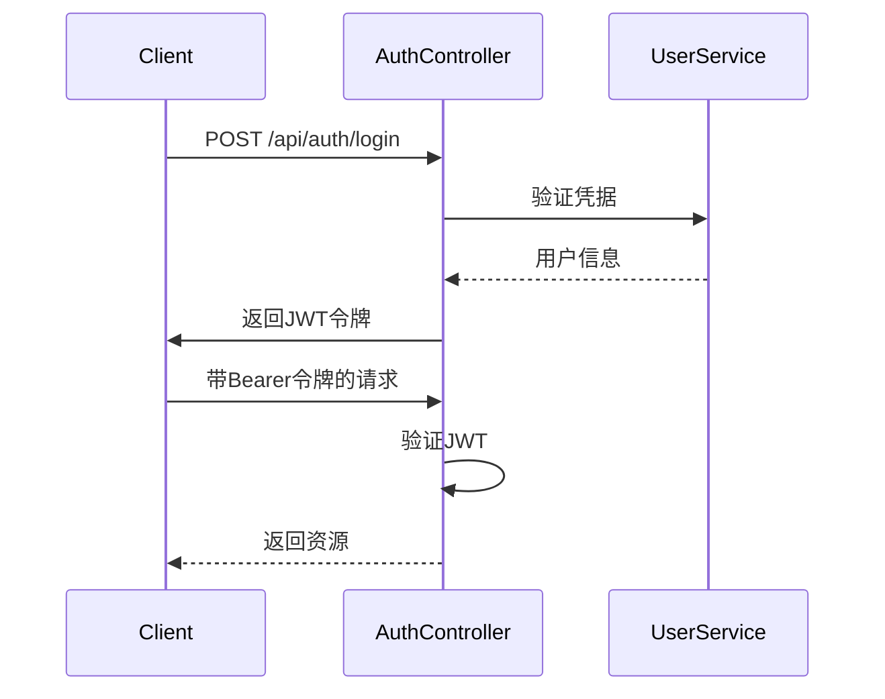
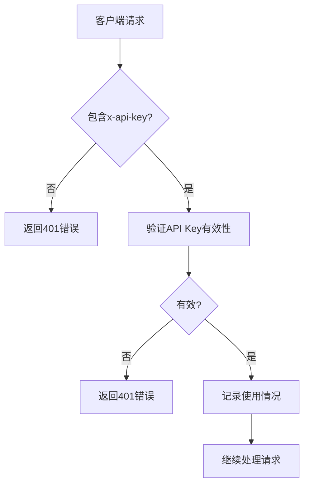
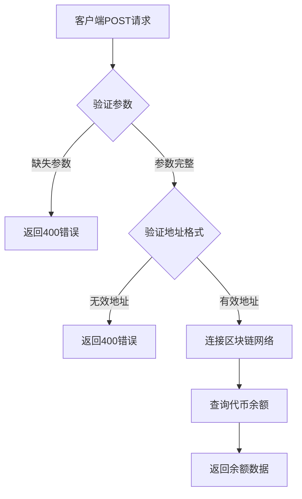
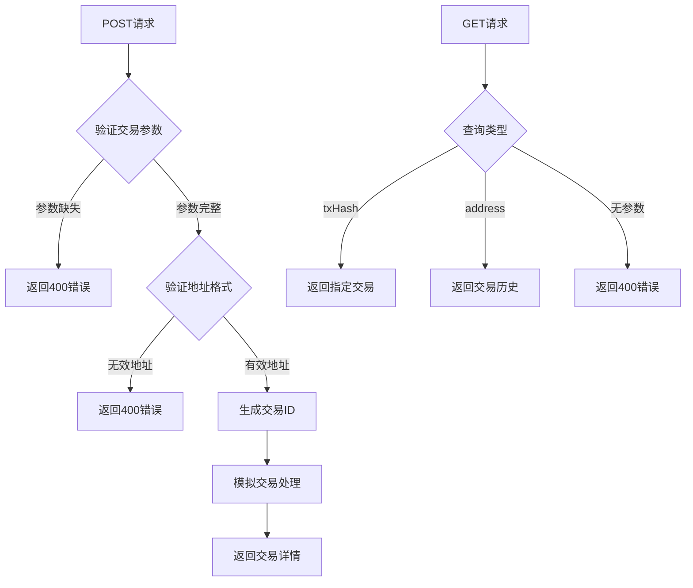
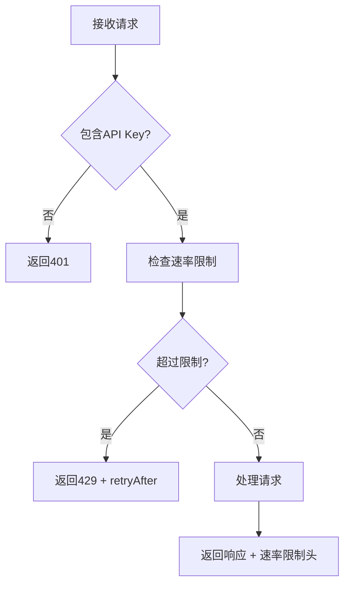

# API参考

<cite>
**本文档中引用的文件**  
- [apiKey.ts](file://backend/src/middleware/apiKey.ts)
- [auth.ts](file://backend/src/middleware/auth.ts)
- [user.ts](file://backend/src/routes/user.ts)
- [transaction.ts](file://backend/src/routes/transaction.ts)
- [blockchain.ts](file://backend/src/routes/blockchain.ts)
- [compliance.ts](file://backend/src/routes/compliance.ts)
- [otc.ts](file://backend/src/routes/otc.ts)
- [route.ts](file://src/app/api/wallet/balances/route.ts)
- [route.ts](file://src/app/api/wallet/transaction/route.ts)
</cite>

## 目录
1. [简介](#简介)
2. [认证机制](#认证机制)
3. [用户API](#用户api)
4. [交易API](#交易api)
5. [区块链API](#区块链api)
6. [合规API](#合规api)
7. [OTC API](#otc-api)
8. [钱包API](#钱包api)
9. [API版本控制与速率限制](#api版本控制与速率限制)
10. [OpenAPI/Swagger规范建议](#openapi-swagger规范建议)

## 简介
本API参考文档为Tribridge Crossroads平台提供完整的RESTful端点说明，涵盖用户管理、交易处理、区块链交互、合规检查、场外交易（OTC）及钱包服务等核心功能。所有端点均采用JWT + API Key双重认证机制，确保安全性。文档详细说明每个端点的HTTP方法、URL路径、请求头、请求体结构、响应格式及可能的错误代码，并提供调用示例。

## 认证机制
平台采用JWT（JSON Web Token）与API Key相结合的双重认证机制，确保接口访问的安全性与灵活性。

### JWT认证
用户通过登录获取JWT令牌，后续请求需在`Authorization`头中携带`Bearer <token>`格式的令牌。



**Diagram sources**
- [auth.ts](file://backend/src/middleware/auth.ts#L10-L58)

### API Key认证
所有请求必须在请求头中包含`x-api-key`字段，用于标识调用方身份并实施速率限制。



**Diagram sources**
- [apiKey.ts](file://backend/src/middleware/apiKey.ts#L3-L23)

### 认证中间件
系统提供多种认证中间件以适应不同场景：
- `authMiddleware`：强制身份验证，未认证返回401
- `optionalAuthMiddleware`：可选身份验证，无令牌时继续执行
- `validateApiKey`：验证API Key有效性
- `apiKeyRateLimit`：基于API Key的速率限制

**Section sources**
- [auth.ts](file://backend/src/middleware/auth.ts#L10-L97)
- [apiKey.ts](file://backend/src/middleware/apiKey.ts#L3-L136)

## 用户API
管理用户资料、钱包及个人设置。

### 获取用户资料
获取当前登录用户的详细信息。

**端点**: `GET /api/user/profile`  
**认证**: JWT + API Key  
**成功响应**:
```json
{
  "success": true,
  "data": {
    "id": "string",
    "email": "string",
    "fullName": "string",
    "phone": "string",
    "kycStatus": "verified|pending|rejected",
    "walletAddress": "string",
    "preferences": {
      "language": "string",
      "currency": "string"
    }
  }
}
```

**curl示例**:
```bash
curl -X GET https://api.tribridge.com/api/user/profile \
  -H "Authorization: Bearer <your-jwt-token>" \
  -H "x-api-key: <your-api-key>"
```

**JavaScript示例**:
```javascript
fetch('/api/user/profile', {
  method: 'GET',
  headers: {
    'Authorization': 'Bearer ' + token,
    'x-api-key': apiKey
  }
})
```

**Section sources**
- [user.ts](file://backend/src/routes/user.ts#L10-L44)

### 更新用户资料
修改用户个人信息及偏好设置。

**端点**: `PUT /api/user/profile`  
**认证**: JWT + API Key  
**请求体**:
```json
{
  "fullName": "string",
  "phone": "string",
  "preferences": {
    "language": "zh-CN|en-US|ru-RU",
    "currency": "CNY|USD|EUR"
  }
}
```

**Section sources**
- [user.ts](file://backend/src/routes/user.ts#L46-L84)

### 管理用户钱包
支持添加、删除和查询用户关联的钱包地址。

**端点**: `GET /api/user/wallets`  
**端点**: `POST /api/user/wallets`  
**端点**: `DELETE /api/user/wallets/:walletId`

**Section sources**
- [user.ts](file://backend/src/routes/user.ts#L86-L197)

## 交易API
处理跨链及同链交易的创建、执行与查询。

### 创建交易
发起新的跨链或同链交易。

**端点**: `POST /api/transaction`  
**认证**: JWT + API Key  
**请求体**:
```json
{
  "fromChain": "ethereum|tron|bsc",
  "toChain": "ethereum|tron|bsc",
  "fromToken": "string",
  "toToken": "string",
  "amount": "string",
  "fromAddress": "string",
  "toAddress": "string"
}
```

**Section sources**
- [transaction.ts](file://backend/src/routes/transaction.ts#L15-L57)

### 执行交易
使用私钥签名并执行已创建的交易。

**端点**: `POST /api/transaction/:transactionId/execute`  
**认证**: JWT + API Key  
**请求体**:
```json
{
  "privateKey": "string",
  "signature": "string"
}
```

**Section sources**
- [transaction.ts](file://backend/src/routes/transaction.ts#L59-L100)

### 查询交易记录
获取用户的交易历史列表。

**端点**: `GET /api/transaction`  
**认证**: JWT + API Key  
**查询参数**:
- `page`: 页码
- `limit`: 每页数量
- `status`: 状态过滤
- `type`: 类型过滤

**Section sources**
- [transaction.ts](file://backend/src/routes/transaction.ts#L102-L177)

## 区块链API
提供区块链网络状态、余额查询及地址验证等基础服务。

### 获取支持的区块链
列出系统支持的所有区块链网络。

**端点**: `GET /api/blockchain/chains`  
**认证**: API Key

**Section sources**
- [blockchain.ts](file://backend/src/routes/blockchain.ts#L10-L24)

### 查询钱包余额
获取指定地址在特定链上的代币余额。

**端点**: `GET /api/blockchain/balance/:chainName/:address`  
**认证**: API Key  
**查询参数**: `token` (代币符号)

**Section sources**
- [blockchain.ts](file://backend/src/routes/blockchain.ts#L50-L74)

### 批量余额查询
一次性查询多个地址和代币的余额。

**端点**: `POST /api/blockchain/balance/multi`  
**认证**: API Key  
**请求体**:
```json
{
  "addresses": [
    {
      "chain": "string",
      "address": "string",
      "tokens": ["string"]
    }
  ]
}
```

**Section sources**
- [blockchain.ts](file://backend/src/routes/blockchain.ts#L76-L138)

### 地址格式验证
验证区块链地址的格式是否正确。

**端点**: `POST /api/blockchain/validate-address`  
**认证**: API Key  
**请求体**:
```json
{
  "chain": "ethereum|tron|bsc",
  "address": "string"
}
```

**Section sources**
- [blockchain.ts](file://backend/src/routes/blockchain.ts#L140-L184)

## 合规API
实现KYC/AML合规检查与风险评估。

### 执行合规检查
对用户或交易进行合规性审查。

**端点**: `POST /api/compliance/check`  
**认证**: JWT + API Key  
**请求体**:
```json
{
  "userId": "string",
  "transactionId": "string",
  "checkData": {}
}
```

**Section sources**
- [compliance.ts](file://backend/src/routes/compliance.ts#L14-L38)

### 交易前预检查
在交易执行前进行快速风险评估。

**端点**: `POST /api/compliance/pre-check`  
**认证**: API Key  
**请求体**:
```json
{
  "userCountry": "string",
  "destinationCountry": "string",
  "amount": "number",
  "currency": "string"
}
```

**Section sources**
- [compliance.ts](file://backend/src/routes/compliance.ts#L154-L204)

## OTC API
支持场外交易订单创建、交易执行及争议处理。

### 创建OTC订单
发布新的买卖订单。

**端点**: `POST /api/otc/orders`  
**认证**: JWT + API Key  
**请求体**:
```json
{
  "type": "buy|sell",
  "fiatCurrency": "CNY|USD|EUR",
  "cryptoCurrency": "USDT|USDC|DAI",
  "fiatAmount": "number",
  "cryptoAmount": "number",
  "price": "number",
  "paymentMethods": ["string"]
}
```

**Section sources**
- [otc.ts](file://backend/src/routes/otc.ts#L38-L98)

### 创建P2P交易
基于订单创建点对点交易。

**端点**: `POST /api/otc/transactions`  
**认证**: JWT + API Key

**Section sources**
- [otc.ts](file://backend/src/routes/otc.ts#L138-L167)

### 交易流程管理
支持付款确认、加密货币释放及争议发起。

**端点**: `PUT /api/otc/transactions/:transactionId/confirm-payment`  
**端点**: `PUT /api/otc/transactions/:transactionId/release`  
**端点**: `PUT /api/otc/transactions/:transactionId/dispute`

**Section sources**
- [otc.ts](file://backend/src/routes/otc.ts#L256-L375)

## 钱包API
通过Next.js路由处理器实现钱包余额与交易查询。

### 余额查询处理器
实现钱包余额查询的API路由。



**Diagram sources**
- [route.ts](file://src/app/api/wallet/balances/route.ts#L1-L49)

### 交易处理处理器
处理交易创建与查询请求。



**Diagram sources**
- [route.ts](file://src/app/api/wallet/transaction/route.ts#L1-L143)

**Section sources**
- [route.ts](file://src/app/api/wallet/balances/route.ts#L1-L49)
- [route.ts](file://src/app/api/wallet/transaction/route.ts#L1-L143)

## API版本控制与速率限制
### 版本控制策略
API采用URL路径版本控制，所有端点以`/api/v1/`为前缀，确保向后兼容性。

### 速率限制规则
基于API Key实施速率限制：
- 普通API Key：60次/分钟
- 管理员API Key：300次/分钟
- 超限返回429状态码及`retryAfter`字段



**Section sources**
- [apiKey.ts](file://backend/src/middleware/apiKey.ts#L80-L136)

## OpenAPI/Swagger规范建议
为便于开发者集成，建议生成OpenAPI 3.0规范：

1. 使用`swagger-jsdoc`从代码注释自动生成文档
2. 为每个路由文件添加JSDoc注释
3. 定义统一的请求/响应模型
4. 配置Swagger UI提供交互式文档
5. 实现自动化文档部署，与API版本同步更新

此规范将显著降低开发者集成成本，提高API可用性。