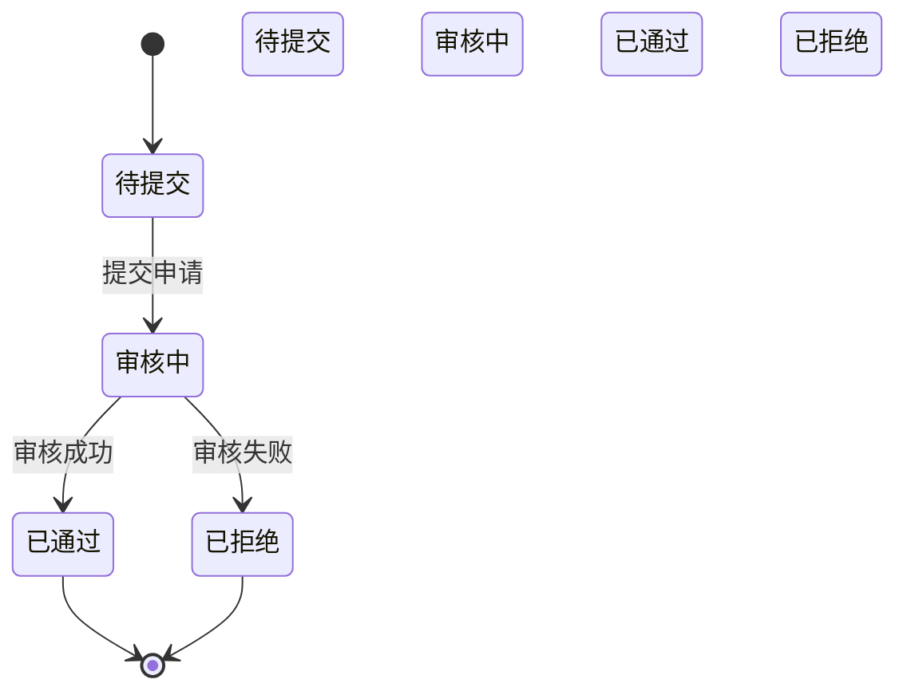
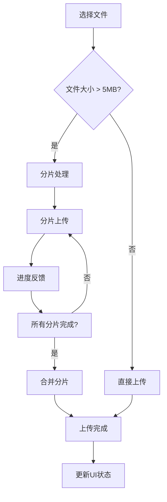
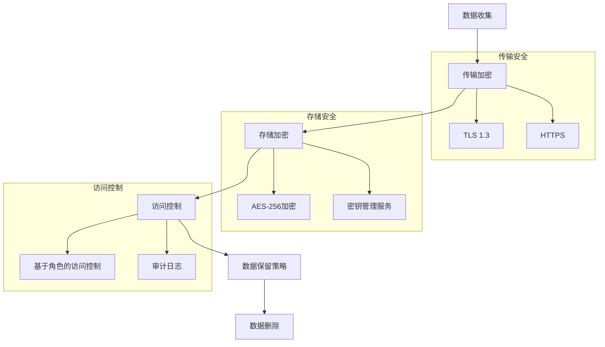
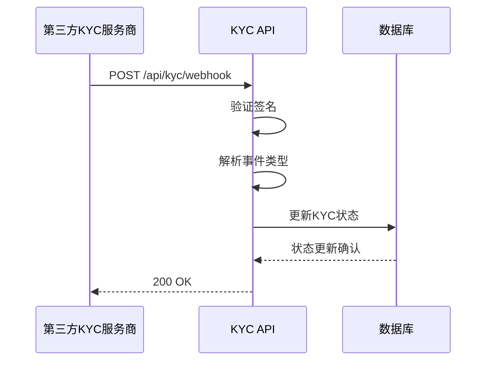

# KYC合规API

<cite>
**本文档中引用的文件**  
- [kyc.ts](file://backend/src/routes/kyc.ts)
- [kycService.ts](file://backend/src/services/kycService.ts)
- [KYCVerification.tsx](file://src/components/Compliance/KYCVerification.tsx)
</cite>

## 目录
1. [简介](#简介)
2. [核心API端点](#核心api端点)
3. [KYC状态机](#kyc状态机)
4. [前端组件集成](#前端组件集成)
5. [测试数据示例](#测试数据示例)
6. [隐私与GDPR合规](#隐私与gdpr合规)
7. [错误处理](#错误处理)
8. [Webhook通知](#webhook通知)

## 简介
KYC合规API为用户提供身份验证服务，支持多种第三方合规提供商（Sumsub、Onfido和国内服务商）。该API处理身份验证提交、状态查询和审核结果通知等关键功能，确保符合反洗钱（AML）和了解您的客户（KYC）法规要求。

**Section sources**
- [kycService.ts](file://backend/src/services/kycService.ts#L1-L50)

## 核心API端点

### POST /api/kyc/submit - 提交KYC申请
此端点用于提交用户的KYC验证申请，包含个人信息、身份证明文件和面部识别数据。

#### 请求体结构
```json
{
  "personalInfo": {
    "firstName": "string",
    "lastName": "string",
    "dateOfBirth": "string (ISO 8601)",
    "nationality": "string",
    "address": {
      "country": "string",
      "state": "string",
      "city": "string",
      "street": "string",
      "postalCode": "string"
    },
    "phoneNumber": "string",
    "email": "string"
  },
  "documents": [
    {
      "type": "passport | id_card | driving_license | utility_bill | bank_statement | selfie",
      "file": "Buffer",
      "fileName": "string",
      "mimeType": "string"
    }
  ],
  "provider": "sumsub | onfido | domestic"
}
```

#### 验证规则
- `personalInfo` 和 `documents` 为必填字段
- `firstName` 和 `lastName` 必须为非空字符串
- `dateOfBirth` 必须符合ISO 8601格式
- `documents` 数组至少包含一个文件
- 每个文档必须指定有效的 `type`
- 支持的文档类型包括护照、身份证、驾驶证、水电账单、银行对账单和自拍照

#### 成功响应
```json
{
  "success": true,
  "data": {
    "applicationId": "string",
    "status": "pending | in_review | approved | rejected",
    "riskLevel": "low | medium | high | critical",
    "confidence": "number",
    "documents": [
      {
        "type": "string",
        "status": "approved | rejected | pending",
        "confidence": "number"
      }
    ],
    "provider": "sumsub | onfido | domestic",
    "timestamp": "string (ISO 8601)"
  },
  "message": "KYC申请提交成功"
}
```

**Section sources**
- [kyc.ts](file://backend/src/routes/kyc.ts#L0-L63)
- [kycService.ts](file://backend/src/services/kycService.ts#L113-L156)

### GET /api/kyc/status - 查询KYC状态
获取用户的KYC验证状态。

#### 成功响应
```json
{
  "success": true,
  "data": {
    "userId": "string",
    "status": "pending | under_review | verified | rejected",
    "level": "basic | full",
    "submittedAt": "string (ISO 8601)",
    "verifiedAt": "string (ISO 8601)",
    "documents": [
      {
        "type": "string",
        "status": "verified | pending",
        "uploadedAt": "string (ISO 8601)"
      }
    ],
    "provider": "sumsub",
    "limits": {
      "daily": "number",
      "monthly": "number",
      "annual": "number"
    }
  }
}
```

**Section sources**
- [kyc.ts](file://backend/src/routes/kyc.ts#L58-L116)

### POST /api/kyc/documents - 上传KYC文档
用于上传KYC验证所需的文档文件。

#### 请求参数
- `documentType`: 文档类型（passport, id_card, driving_license, utility_bill, bank_statement, selfie）
- `file`: 文件内容

#### 成功响应
```json
{
  "success": true,
  "data": {
    "documentId": "string",
    "type": "string",
    "status": "uploaded",
    "uploadedAt": "string (ISO 8601)"
  },
  "message": "文档上传成功"
}
```

**Section sources**
- [kyc.ts](file://backend/src/routes/kyc.ts#L118-L180)

## KYC状态机
KYC验证过程包含四个主要状态，这些状态在 `GET /api/kyc/status` 端点中表示：



**Diagram sources**
- [kycService.ts](file://backend/src/services/kycService.ts#L48-L49)
- [kyc.ts](file://backend/src/routes/kyc.ts#L58-L116)

**Section sources**
- [kycService.ts](file://backend/src/services/kycService.ts#L48-L49)
- [kyc.ts](file://backend/src/routes/kyc.ts#L58-L116)

## 前端组件集成

### KYCVerification组件
前端 `KYCVerification` 组件提供用户友好的KYC验证界面，包含四个步骤：个人信息、身份验证文件、商业信息和审核确认。

#### 文件上传分片处理
组件实现了文件上传的分片处理机制，确保大文件能够稳定上传：



**Diagram sources**
- [KYCVerification.tsx](file://src/components/Compliance/KYCVerification.tsx#L448-L481)

#### 进度反馈机制
组件提供实时进度反馈，包括：
- 步骤导航指示器
- 整体完成进度条
- 每个步骤的完成状态
- 文件上传状态反馈

**Section sources**
- [KYCVerification.tsx](file://src/components/Compliance/KYCVerification.tsx#L0-L519)

## 测试数据示例

### 模拟审核流程
以下示例展示了完整的KYC审核流程：

```json
{
  "personalInfo": {
    "firstName": "张",
    "lastName": "伟",
    "dateOfBirth": "1990-01-01",
    "nationality": "CN",
    "address": {
      "country": "CN",
      "state": "北京市",
      "city": "北京市",
      "street": "朝阳区建国路88号",
      "postalCode": "100022"
    },
    "phoneNumber": "+86 138 0000 0000",
    "email": "zhang.wei@example.com"
  },
  "documents": [
    {
      "type": "id_card",
      "fileName": "id_card.jpg",
      "mimeType": "image/jpeg"
    },
    {
      "type": "utility_bill",
      "fileName": "utility_bill.pdf",
      "mimeType": "application/pdf"
    },
    {
      "type": "selfie",
      "fileName": "selfie.jpg",
      "mimeType": "image/jpeg"
    }
  ]
}
```

**Section sources**
- [kycService.ts](file://backend/src/services/kycService.ts#L0-L46)
- [KYCVerification.tsx](file://src/components/Compliance/KYCVerification.tsx#L0-L519)

## 隐私与GDPR合规

### 敏感数据保护措施
系统实施了多层次的数据保护机制：



**Diagram sources**
- [kycService.ts](file://backend/src/services/kycService.ts#L113-L156)
- [kyc.ts](file://backend/src/routes/kyc.ts#L0-L63)

### GDPR合规特性
- **数据最小化**: 仅收集必要的KYC信息
- **用户权利**: 支持数据访问、更正和删除请求
- **数据保留**: 敏感数据在验证完成后保留7年
- **跨境传输**: 使用标准合同条款确保数据跨境传输合规
- **数据处理协议**: 与第三方提供商签订DPA协议

**Section sources**
- [kycService.ts](file://backend/src/services/kycService.ts#L48-L111)

## 错误处理

### 常见错误码
| HTTP状态码 | 错误代码 | 描述 |
|-----------|---------|------|
| 400 | BAD_REQUEST | 请求参数缺失或格式错误 |
| 401 | UNAUTHORIZED | 未授权访问 |
| 403 | FORBIDDEN | 权限不足 |
| 422 | UNPROCESSABLE_ENTITY | 验证失败 |
| 500 | INTERNAL_ERROR | 服务器内部错误 |

**Section sources**
- [kyc.ts](file://backend/src/routes/kyc.ts#L0-L209)

## Webhook通知
系统通过Webhook接收第三方KYC服务的状态更新：



**Diagram sources**
- [kyc.ts](file://backend/src/routes/kyc.ts#L182-L209)

**Section sources**
- [kyc.ts](file://backend/src/routes/kyc.ts#L182-L209)