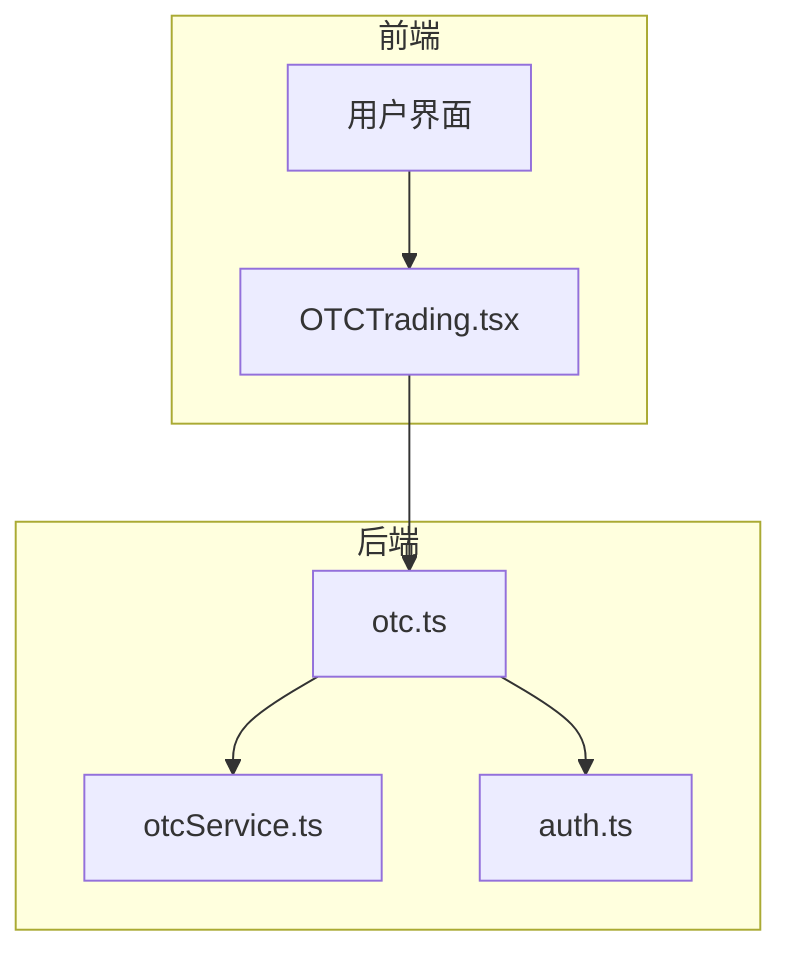
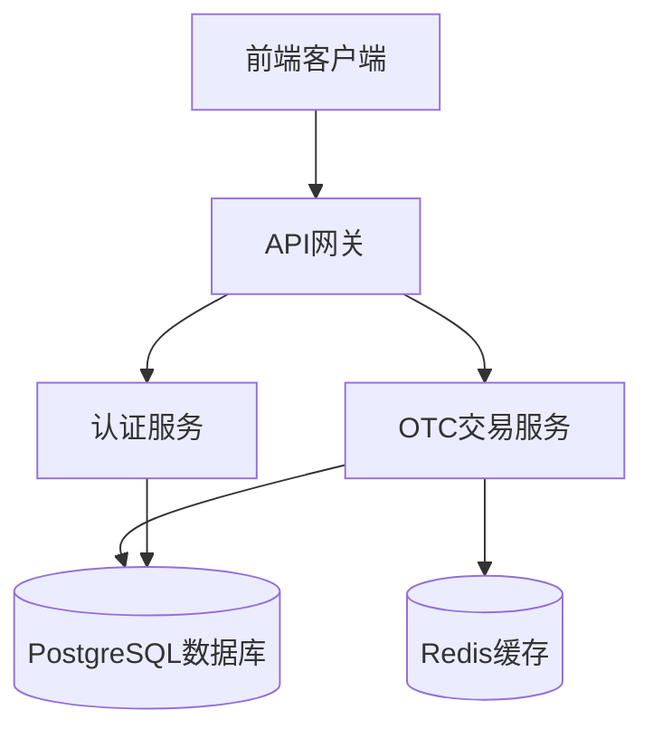
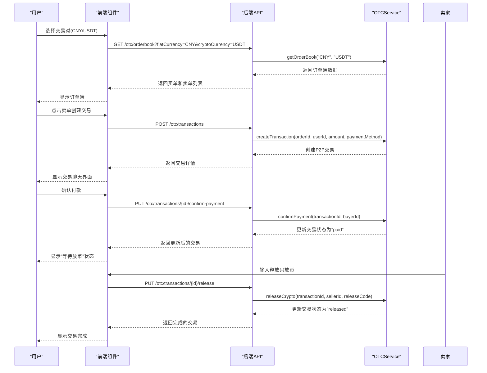
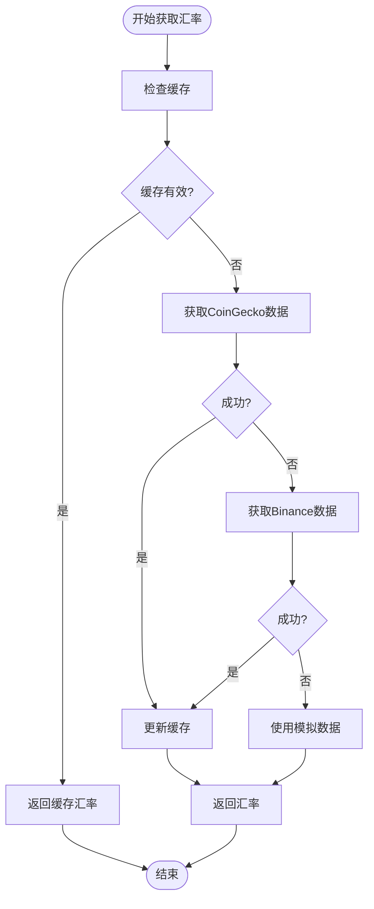
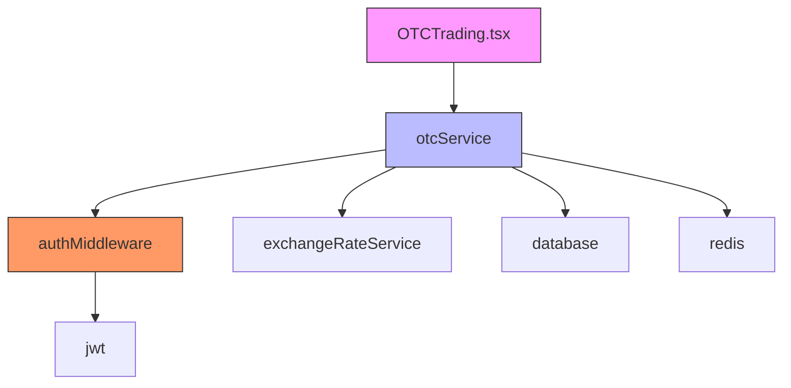
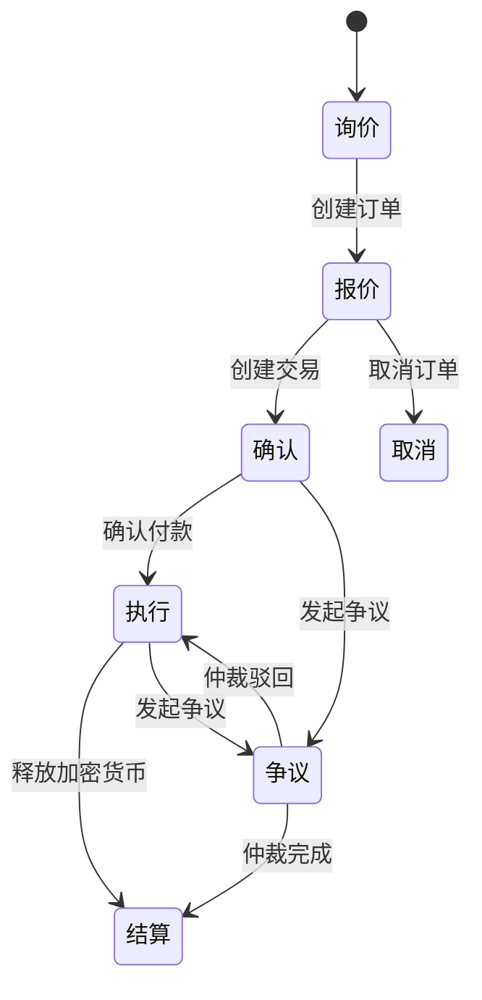

# OTC交易API

<cite>
**本文档引用的文件**
- [otc.ts](file://backend/src/routes/otc.ts)
- [otcService.ts](file://backend/src/services/otcService.ts)
- [OTCTrading.tsx](file://src/components/OTC/OTCTrading.tsx)
- [exchangeRateService.ts](file://src/services/exchangeRateService.ts)
</cite>

## 目录
1. [简介](#简介)
2. [项目结构](#项目结构)
3. [核心组件](#核心组件)
4. [架构概述](#架构概述)
5. [详细组件分析](#详细组件分析)
6. [依赖分析](#依赖分析)
7. [性能考虑](#性能考虑)
8. [故障排除指南](#故障排除指南)
9. [结论](#结论)
10. [附录](#附录)（如有必要）

## 简介
OTC交易API是TriBridge跨境支付平台的核心功能之一，提供安全便捷的点对点加密货币交易服务。该API支持人民币(CNY)、俄罗斯卢布(RUB)和美元(USD)等法币与USDT、USDC等稳定币的场外交易。系统采用资金托管机制确保交易安全，通过信用评级和信任级别评估交易对手风险，并提供实时聊天功能便于买卖双方沟通。API设计遵循RESTful原则，包含报价请求、订单创建、交易执行和结算等完整交易流程，支持多支付方式如支付宝、微信支付、Sberbank等。

## 项目结构
项目采用前后端分离架构，前端使用React + Vite + TypeScript构建，后端使用Express.js + TypeScript提供API服务。OTC交易功能主要分布在后端的`/backend/src/routes/otc.ts`路由文件和`/backend/src/services/otcService.ts`服务文件中，前端组件位于`/src/components/OTC/OTCTrading.tsx`。系统通过JWT进行身份验证，使用Redis缓存订单簿数据，确保交易的高效性和安全性。



**图表来源**
- [otc.ts](file://backend/src/routes/otc.ts#L1-L428)
- [otcService.ts](file://backend/src/services/otcService.ts#L1-L454)
- [OTCTrading.tsx](file://src/components/OTC/OTCTrading.tsx#L1-L671)

**章节来源**
- [otc.ts](file://backend/src/routes/otc.ts#L1-L428)
- [otcService.ts](file://backend/src/services/otcService.ts#L1-L454)

## 核心组件
OTC交易系统的核心组件包括订单簿管理、交易流程控制、资金托管和信用评级系统。`OTCService`类负责处理所有业务逻辑，维护订单和交易的状态，通过EventEmitter模式实现组件间的解耦。系统实现了完整的交易状态机，从询价、报价到确认、执行和结算，确保每个交易步骤的安全性和可追溯性。价格发现算法结合实时汇率数据和市场供需关系，为用户提供公平的交易价格。

**章节来源**
- [otcService.ts](file://backend/src/services/otcService.ts#L84-L450)

## 架构概述
系统采用分层架构设计，前端组件通过API与后端服务交互，后端服务处理业务逻辑并与数据库和缓存系统通信。OTC交易流程涉及多个微服务协同工作，包括用户认证、订单管理、交易执行和结算服务。系统通过WebSocket实现实时通信，确保交易状态的即时更新。安全机制包括JWT身份验证、输入验证、速率限制和资金托管，有效防范各种交易风险。



**图表来源**
- [otc.ts](file://backend/src/routes/otc.ts#L1-L428)
- [otcService.ts](file://backend/src/services/otcService.ts#L1-L454)

## 详细组件分析

### OTC服务分析
`OTCService`是OTC交易系统的核心，负责管理订单、交易和用户信用。它维护一个内存中的订单簿，根据价格和时间优先级排序，确保交易的公平性。服务实现了完整的交易生命周期管理，从订单创建到交易完成，每个状态转换都有严格的验证和错误处理机制。

#### 对象关系图
```mermaid
classDiagram
class OTCService {
+Map~string, OTCOrder~ orders
+Map~string, P2PTransaction~ transactions
+Map~string, UserCreditScore~ userCredits
+Map~string, OTCOrder[]~ orderBook
+createOrder(orderData) OTCOrder
+getOrderBook(fiat, crypto) {buy, sell}
+createTransaction(orderId, buyerId, amount, paymentMethod) P2PTransaction
+confirmPayment(transactionId, buyerId) P2PTransaction
+releaseCrypto(transactionId, sellerId, releaseCode) P2PTransaction
+raiseDispute(transactionId, userId, reason) P2PTransaction
+getUserCreditScore(userId) UserCreditScore
}
class OTCOrder {
+string id
+string userId
+'buy'|'sell' type
+string fiatCurrency
+string cryptoCurrency
+number fiatAmount
+number cryptoAmount
+number price
+number minAmount
+number maxAmount
+string[] paymentMethods
+number timeLimit
+'active'|'trading'|'completed'|'cancelled'|'disputed' status
+number merchantRating
+number completedOrders
+Date createdAt
+Date updatedAt
+string remarks
+string autoReply
+boolean escrowEnabled
+'verified'|'premium'|'standard' trustLevel
}
class P2PTransaction {
+string id
+string orderId
+string buyerId
+string sellerId
+number fiatAmount
+number cryptoAmount
+number price
+string paymentMethod
+'pending'|'paid'|'released'|'disputed'|'cancelled'|'completed' status
+ChatMessage[] chatMessages
+string disputeReason
+string escrowTxId
+string releaseCode
+Date startTime
+Date paymentTime
+Date releaseTime
+Date completedTime
+Date expiryTime
}
class ChatMessage {
+string id
+string senderId
+string message
+Date timestamp
+'text'|'image'|'payment_proof'|'system' type
+string[] attachments
}
class UserCreditScore {
+string userId
+number rating
+number totalOrders
+number completedOrders
+number disputeCount
+number averageReleaseTime
+'verified'|'premium'|'standard'|'new' trustLevel
+boolean kycVerified
+boolean phoneVerified
+boolean emailVerified
+Date lastActiveTime
}
OTCService --> OTCOrder : "管理"
OTCService --> P2PTransaction : "管理"
OTCService --> ChatMessage : "管理"
OTCService --> UserCreditScore : "管理"
P2PTransaction --> ChatMessage : "包含"
```

**图表来源**
- [otcService.ts](file://backend/src/services/otcService.ts#L84-L450)

#### 交易流程序列图


**图表来源**
- [otc.ts](file://backend/src/routes/otc.ts#L168-L168)
- [otcService.ts](file://backend/src/services/otcService.ts#L200-L230)

**章节来源**
- [otc.ts](file://backend/src/routes/otc.ts#L168-L168)
- [otcService.ts](file://backend/src/services/otcService.ts#L200-L230)

### 价格发现与汇率锁定机制
系统通过`exchangeRateService`提供实时汇率数据，结合订单簿的供需关系确定交易价格。价格发现算法优先使用CoinGecko和Binance的实时数据，失败时回退到模拟数据。汇率在交易创建时锁定，确保交易过程中价格不变，保护买卖双方免受市场波动影响。

#### 价格发现流程图


**图表来源**
- [exchangeRateService.ts](file://src/services/exchangeRateService.ts#L1-L286)

**章节来源**
- [exchangeRateService.ts](file://src/services/exchangeRateService.ts#L1-L286)

## 依赖分析
OTC交易系统依赖多个核心模块，包括用户认证、订单管理、交易执行和信用评级。系统通过Express路由处理HTTP请求，调用OTCService中的业务逻辑方法。前端组件依赖React Query进行状态管理和数据获取，确保UI与后端数据同步。服务间通过清晰的接口契约通信，降低了模块间的耦合度。



**图表来源**
- [otc.ts](file://backend/src/routes/otc.ts#L1-L428)
- [otcService.ts](file://backend/src/services/otcService.ts#L1-L454)
- [OTCTrading.tsx](file://src/components/OTC/OTCTrading.tsx#L1-L671)

**章节来源**
- [otc.ts](file://backend/src/routes/otc.ts#L1-L428)
- [otcService.ts](file://backend/src/services/otcService.ts#L1-L454)

## 性能考虑
系统通过多种机制优化性能，包括Redis缓存订单簿数据、批量获取汇率信息和WebSocket实时通信。订单簿数据在内存中维护，确保快速访问和低延迟。交易状态更新通过事件驱动模式处理，避免阻塞主线程。系统还实现了请求验证和速率限制，防止恶意请求影响服务性能。

## 故障排除指南
常见问题包括订单创建失败、交易状态不更新和支付确认无响应。排查时应首先检查JWT令牌是否有效，然后验证请求参数是否符合格式要求。对于交易状态问题，可检查OTCService中的状态转换逻辑和数据库记录。系统日志记录了所有关键操作，便于追踪问题根源。

**章节来源**
- [otc.ts](file://backend/src/routes/otc.ts#L77-L77)
- [otcService.ts](file://backend/src/services/otcService.ts#L150-L180)

## 结论
OTC交易API提供了一套完整的场外交易解决方案，涵盖从报价请求到结算的全流程。系统通过资金托管和信用评级机制确保交易安全，支持多法币和多支付方式，满足跨境支付的多样化需求。API设计遵循RESTful原则，文档完整，易于集成和扩展。未来可增加更多风险控制机制和交易品种，进一步提升平台的竞争力。

## 附录

### OTC交易API端点
| 端点 | 方法 | 描述 | 认证 |
|------|------|------|------|
| `/otc/orderbook` | GET | 获取指定交易对的订单簿 | 否 |
| `/otc/orders` | POST | 创建OTC订单 | 是 |
| `/otc/orders/user` | GET | 获取用户订单 | 是 |
| `/otc/orders/:orderId/cancel` | PUT | 取消订单 | 是 |
| `/otc/transactions` | POST | 创建P2P交易 | 是 |
| `/otc/transactions/:transactionId` | GET | 获取交易详情 | 是 |
| `/otc/transactions/user/all` | GET | 获取用户所有交易 | 是 |
| `/otc/transactions/:transactionId/messages` | POST | 发送聊天消息 | 是 |
| `/otc/transactions/:transactionId/confirm-payment` | PUT | 确认付款 | 是 |
| `/otc/transactions/:transactionId/release` | PUT | 释放加密货币 | 是 |
| `/otc/transactions/:transactionId/dispute` | PUT | 发起争议 | 是 |
| `/otc/users/:userId/credit` | GET | 获取用户信用评级 | 否 |

**章节来源**
- [otc.ts](file://backend/src/routes/otc.ts#L28-L405)

### 交易状态转换


**图表来源**
- [otcService.ts](file://backend/src/services/otcService.ts#L200-L300)