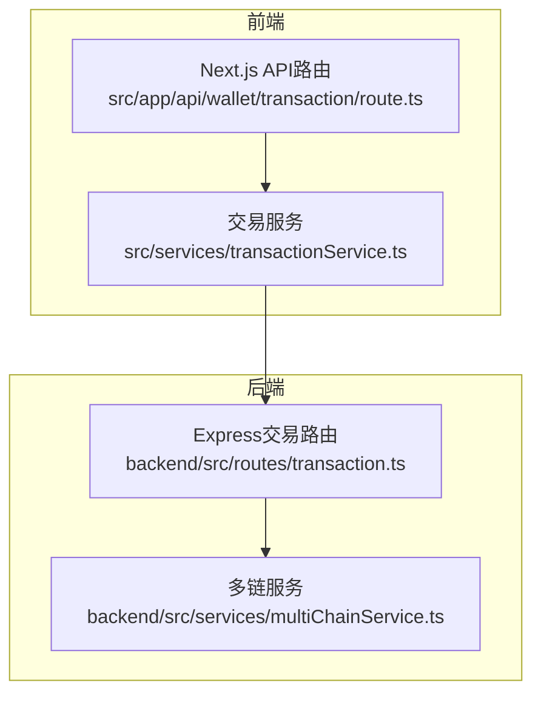
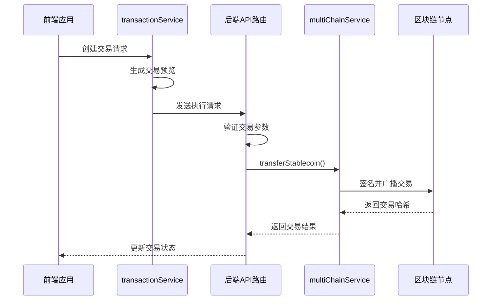
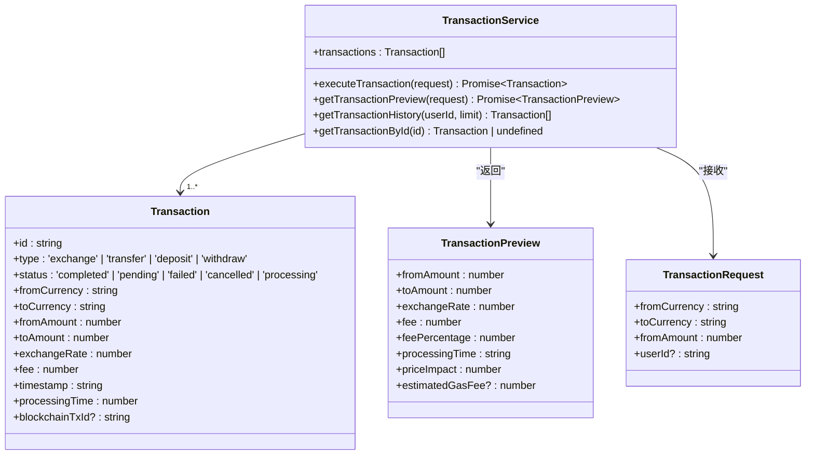
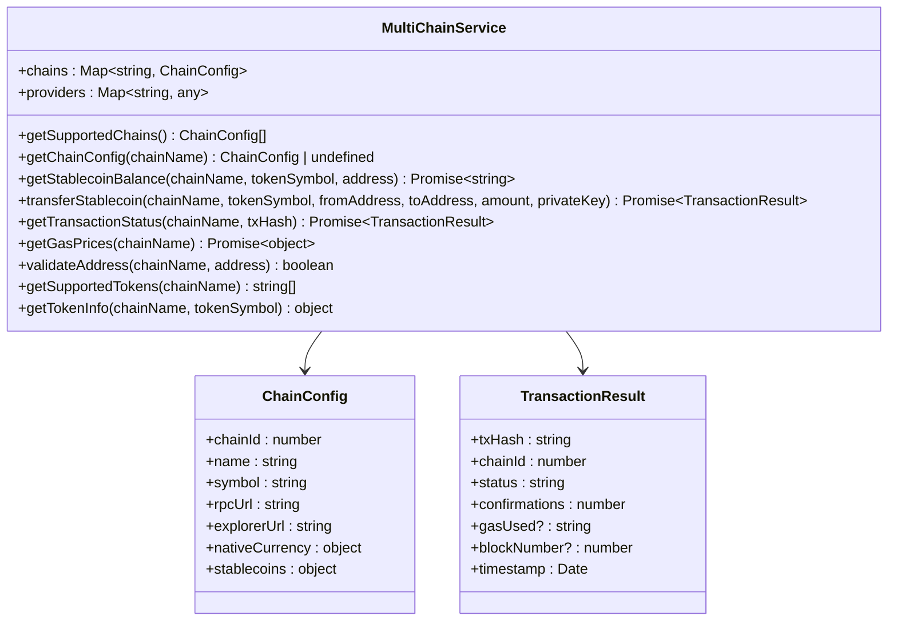
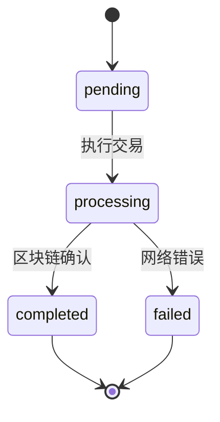
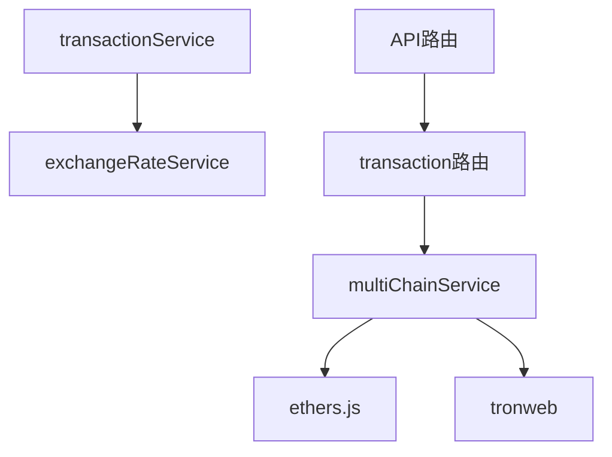

# 交易API

<cite>
**Referenced Files in This Document**  
- [transactionService.ts](file://src/services/transactionService.ts)
- [multiChainService.ts](file://backend/src/services/multiChainService.ts)
- [transaction.ts](file://backend/src/routes/transaction.ts)
- [route.ts](file://src/app/api/wallet/transaction/route.ts)
</cite>

## 目录
1. [简介](#简介)
2. [项目结构](#项目结构)
3. [核心组件](#核心组件)
4. [架构概述](#架构概述)
5. [详细组件分析](#详细组件分析)
6. [依赖分析](#依赖分析)
7. [性能考虑](#性能考虑)
8. [故障排除指南](#故障排除指南)
9. [结论](#结论)

## 简介
本文档全面介绍了交易API的技术实现，涵盖交易创建、查询、状态更新等核心功能。系统通过前端Next.js应用与后端Express服务协同工作，实现了跨链稳定币转账功能。核心服务包括前端`transactionService`和后端`multiChainService`，分别负责交易流程管理与区块链交互。交易状态机设计确保了交易生命周期的完整跟踪，从创建、处理到完成或失败。系统支持Ethereum、TRON和BSC三条主要区块链网络，通过统一的接口简化了多链操作的复杂性。

## 项目结构
交易功能分布在前后端两个主要部分。前端位于`src/app/api/wallet/transaction/route.ts`，作为Next.js API路由处理客户端请求。后端交易逻辑位于`backend/src/routes/transaction.ts`，通过Express路由暴露API端点。核心业务逻辑由`src/services/transactionService.ts`（前端）和`backend/src/services/multiChainService.ts`（后端）实现。这种分离架构使得前端可以处理用户界面和交易预览，而后端专注于安全的区块链交互和状态管理。

**Diagram sources**
- [route.ts](file://src/app/api/wallet/transaction/route.ts)
- [transactionService.ts](file://src/services/transactionService.ts)
- [transaction.ts](file://backend/src/routes/transaction.ts)
- [multiChainService.ts](file://backend/src/services/multiChainService.ts)

**Section sources**
- [route.ts](file://src/app/api/wallet/transaction/route.ts)
- [transaction.ts](file://backend/src/routes/transaction.ts)

## 核心组件
系统的核心组件包括前端`transactionService`和后端`multiChainService`。`transactionService`负责管理交易的生命周期，提供交易预览、执行和历史查询功能。它维护一个交易列表，并通过异步方法模拟交易处理过程。`multiChainService`是跨链操作的核心，封装了与Ethereum、TRON和BSC区块链的交互逻辑。该服务提供统一的接口用于稳定币转账、余额查询和交易状态监控，内部根据链类型选择相应的实现。两个服务通过API调用协同工作，确保交易从创建到区块链确认的完整流程。

**Section sources**
- [transactionService.ts](file://src/services/transactionService.ts#L52-L388)
- [multiChainService.ts](file://backend/src/services/multiChainService.ts#L48-L505)

## 架构概述
系统采用前后端分离架构，前端Next.js应用通过API与后端Express服务通信。交易流程始于前端创建交易请求，经由`transactionService`生成预览，然后通过API发送到后端。后端`transaction`路由接收请求，验证参数后调用`multiChainService`执行实际的区块链操作。`multiChainService`根据目标链类型（EVM兼容链或TRON）选择相应的实现，使用`ethers.js`或`tronweb`库与区块链节点交互。交易状态通过轮询机制监控，确保用户能及时获取最新状态。

**Diagram sources**
- [transactionService.ts](file://src/services/transactionService.ts#L153-L196)
- [transaction.ts](file://backend/src/routes/transaction.ts)
- [multiChainService.ts](file://backend/src/services/multiChainService.ts#L267-L297)

## 详细组件分析

### 交易服务分析
`transactionService`是前端交易处理的核心，负责交易的创建、预览和状态管理。该服务维护一个本地交易列表，并通过异步方法模拟交易处理过程。当用户发起交易时，服务首先生成交易预览，计算汇率、手续费和预计处理时间。然后创建交易记录并启动异步处理流程，逐步更新交易状态。

**Diagram sources**
- [transactionService.ts](file://src/services/transactionService.ts#L52-L388)

**Section sources**
- [transactionService.ts](file://src/services/transactionService.ts#L52-L388)

### 多链服务分析
`multiChainService`是跨链操作的核心协调者，统一管理Ethereum、TRON和BSC三条区块链的交互。其构造函数通过`initializeChains`和`initializeProviders`方法配置各链的RPC端点和Web3提供者。该服务提供`getStablecoinBalance`和`transferStablecoin`等方法，封装了不同区块链（EVM兼容链与TRON）在余额查询和转账实现上的差异。

**Diagram sources**
- [multiChainService.ts](file://backend/src/services/multiChainService.ts#L48-L505)

**Section sources**
- [multiChainService.ts](file://backend/src/services/multiChainService.ts#L48-L505)

### 交易状态机设计
系统实现了完整的交易状态机，确保交易生命周期的可追踪性。交易状态包括"待处理(pending)"、"处理中(processing)"、"已完成(completed)"和"失败(failed)"。状态转换通过异步处理流程实现：创建交易时状态为"待处理"，执行时变为"处理中"，最终根据区块链确认结果转为"已完成"或"失败"。

**Diagram sources**
- [transactionService.ts](file://src/services/transactionService.ts#L5-L5)
- [transactionService.ts](file://src/services/transactionService.ts#L198-L235)

**Section sources**
- [transactionService.ts](file://src/services/transactionService.ts#L5-L5)

## 依赖分析
系统依赖关系清晰，前端`transactionService`依赖`exchangeRateService`获取汇率数据，后端`multiChainService`依赖`ethers.js`和`tronweb`库与区块链交互。API路由层依赖服务层实现业务逻辑，形成清晰的分层架构。这种依赖结构确保了各组件的职责分离，提高了代码的可维护性和可测试性。

**Diagram sources**
- [transactionService.ts](file://src/services/transactionService.ts)
- [multiChainService.ts](file://backend/src/services/multiChainService.ts)

**Section sources**
- [transactionService.ts](file://src/services/transactionService.ts)
- [multiChainService.ts](file://backend/src/services/multiChainService.ts)

## 性能考虑
系统在性能方面进行了多项优化。前端`transactionService`通过本地缓存交易数据减少API调用，后端`multiChainService`复用Provider实例避免重复连接开销。交易处理采用异步模式，确保API响应快速。对于大额交易，系统实现了价格影响计算，提供更准确的预估。Gas费用估算功能帮助用户了解交易成本。监控系统跟踪交易处理时间，为性能优化提供数据支持。

## 故障排除指南
常见问题包括交易创建失败、状态更新延迟和区块链交互错误。对于交易创建失败，应检查请求参数是否完整，特别是链名称、代币符号和地址格式。状态更新延迟通常由区块链网络拥堵引起，建议增加轮询间隔。区块链交互错误可能源于无效的私钥或不支持的链/代币组合，需验证输入参数。系统日志记录了详细的错误信息，有助于快速定位问题根源。

**Section sources**
- [transactionService.ts](file://src/services/transactionService.ts)
- [multiChainService.ts](file://backend/src/services/multiChainService.ts)

## 结论
本文档详细介绍了交易API的完整技术实现。系统通过前后端协同工作，实现了安全可靠的跨链交易功能。`transactionService`和`multiChainService`两个核心组件分工明确，前者管理交易流程，后者处理区块链交互。清晰的状态机设计确保了交易生命周期的完整跟踪。系统支持多条主流区块链，为用户提供灵活的跨链转账能力。未来可扩展支持更多区块链网络和代币类型，进一步提升系统的适用性和竞争力。