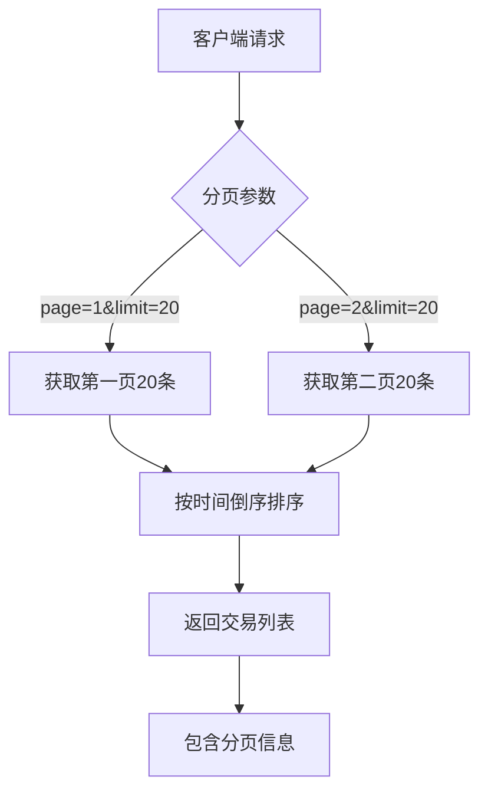
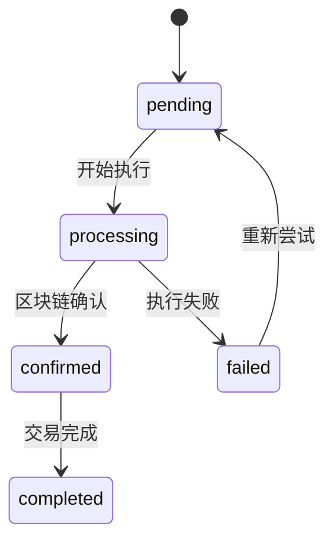
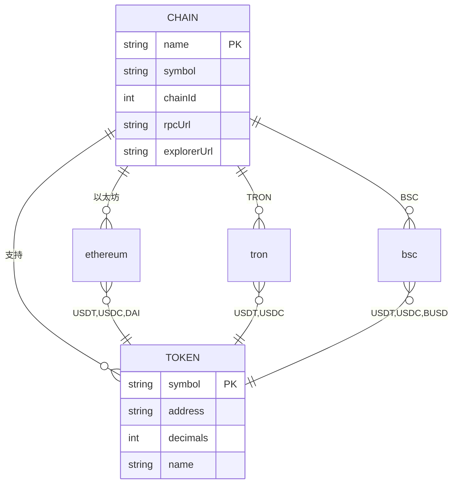
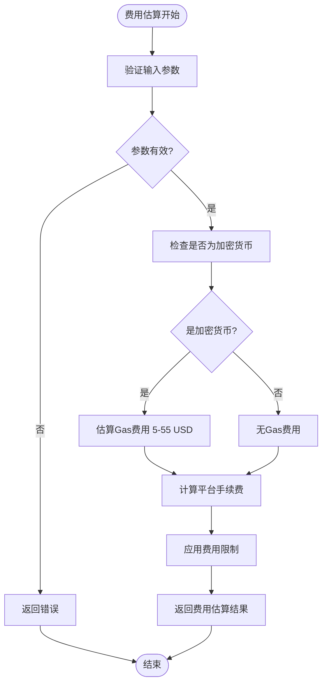
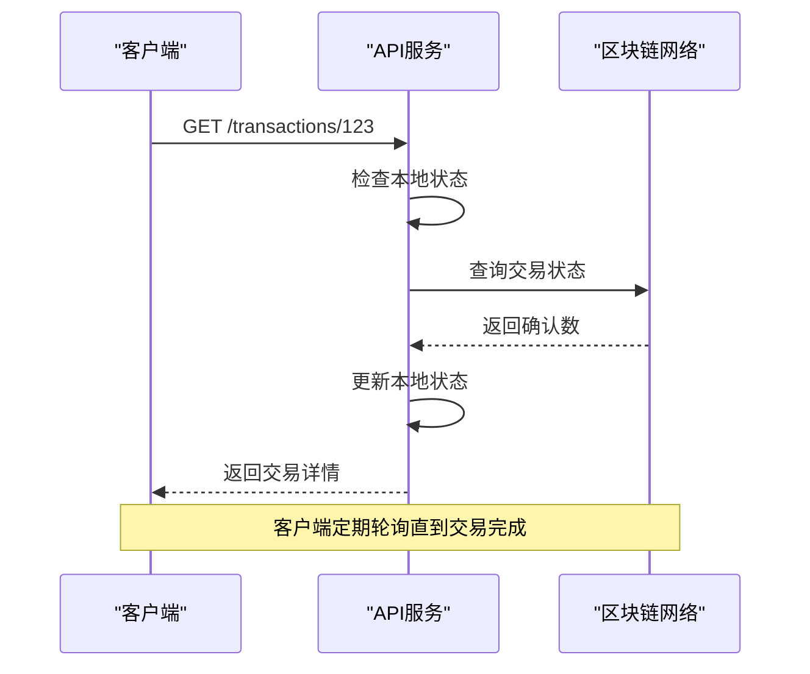
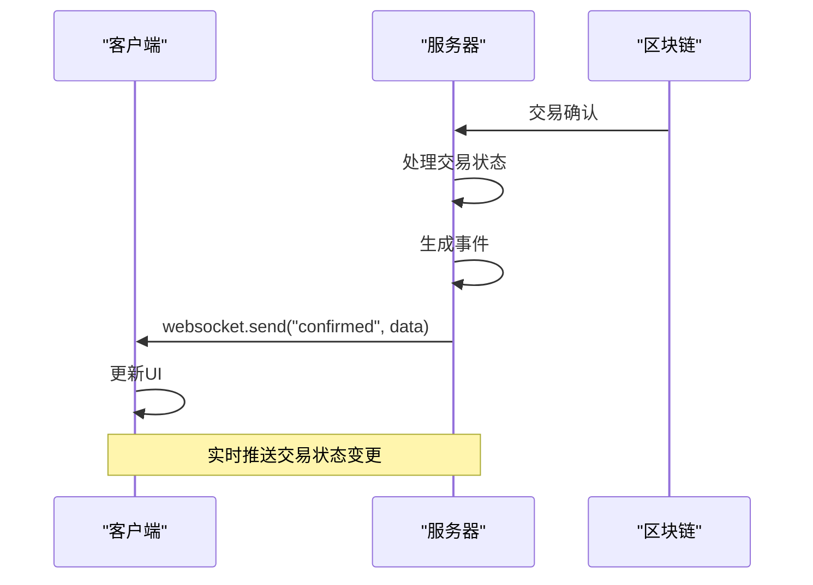
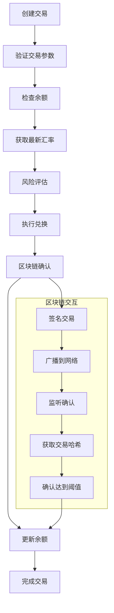

# 交易API

<cite>
**本文档引用文件**  
- [transaction.ts](file://backend/src/routes/transaction.ts)
- [transactionService.ts](file://src/services/transactionService.ts)
- [route.ts](file://src/app/api/wallet/transaction/route.ts)
- [multiChainService.ts](file://backend/src/services/multiChainService.ts)
</cite>

## 目录
1. [简介](#简介)
2. [核心端点](#核心端点)
3. [交易创建](#交易创建)
4. [交易查询](#交易查询)
5. [批量处理](#批量处理)
6. [状态回调与事件推送](#状态回调与事件推送)
7. [跨链交易](#跨链交易)
8. [费用估算](#费用估算)
9. [交易状态轮询机制](#交易状态轮询机制)
10. [WebSocket事件推送](#websocket事件推送)
11. [交易服务流程](#交易服务流程)
12. [使用示例](#使用示例)

## 简介
本API文档详细描述了交易系统的核心功能，涵盖转账创建、交易查询、批量处理和状态回调等关键端点。系统支持多链稳定币转账，包括以太坊、TRON和BSC网络，提供完整的交易生命周期管理。

## 核心端点
系统提供以下主要API端点：

| 端点 | 方法 | 描述 |
|------|------|------|
| `/api/transactions` | POST | 创建新交易 |
| `/api/transactions/:id` | GET | 获取交易详情 |
| `/api/transactions` | GET | 获取交易列表 |
| `/api/transactions/:id/execute` | POST | 执行交易 |
| `/api/transactions/:id/cancel` | POST | 取消交易 |
| `/api/wallet/transaction` | POST/GET | 钱包交易操作 |

**Section sources**
- [transaction.ts](file://backend/src/routes/transaction.ts#L1-L313)

## 交易创建
### POST /api/transactions

创建新的跨链或同链交易。

### 请求参数
```json
{
  "fromChain": "ethereum",
  "toChain": "tron",
  "fromToken": "USDT",
  "toToken": "USDT",
  "amount": "100",
  "fromAddress": "0x...",
  "toAddress": "T...",
  "slippage": 0.5
}
```

| 参数 | 类型 | 必需 | 描述 |
|------|------|------|------|
| `fromChain` | string | 是 | 源链名称（ethereum、tron、bsc） |
| `toChain` | string | 是 | 目标链名称 |
| `fromToken` | string | 是 | 源代币符号（USDT、USDC、DAI等） |
| `toToken` | string | 是 | 目标代币符号 |
| `amount` | string | 是 | 交易金额（字符串格式） |
| `fromAddress` | string | 是 | 发送方地址 |
| `toAddress` | string | 是 | 接收方地址 |
| `slippage` | number | 否 | 滑点容忍度（百分比，默认0.5） |

### 响应示例
```json
{
  "success": true,
  "data": {
    "id": "1",
    "status": "pending",
    "fromChain": "ethereum",
    "toChain": "tron",
    "fromToken": "USDT",
    "toToken": "USDT",
    "amount": "100",
    "estimatedFee": "0.001",
    "exchangeRate": "1.0",
    "estimatedTime": "5-10 minutes",
    "createdAt": "2024-01-01T00:00:00.000Z"
  },
  "message": "交易创建成功"
}
```

**Section sources**
- [transaction.ts](file://backend/src/routes/transaction.ts#L8-L72)

## 交易查询
### GET /api/transactions

获取用户交易列表，支持分页和过滤。

### 查询参数
| 参数 | 类型 | 描述 |
|------|------|------|
| `page` | number | 页码（默认1） |
| `limit` | number | 每页数量（默认20） |
| `status` | string | 状态过滤（pending、completed、failed） |
| `type` | string | 类型过滤（cross_chain_transfer、same_chain_transfer） |

### 响应结构
```json
{
  "success": true,
  "data": {
    "transactions": [
      {
        "id": "1",
        "type": "cross_chain_transfer",
        "status": "completed",
        "fromChain": "ethereum",
        "toChain": "tron",
        "fromToken": "USDT",
        "toToken": "USDT",
        "amount": "100",
        "txHash": "0x1234567890abcdef",
        "fee": "0.001",
        "createdAt": "2024-01-01T00:00:00.000Z",
        "completedAt": "2024-01-01T00:05:00.000Z"
      }
    ],
    "pagination": {
      "page": 1,
      "limit": 20,
      "total": 1,
      "totalPages": 1
    }
  }
}
```

### GET /api/transactions/:transactionId
获取特定交易的详细信息，包括交易时间线和确认状态。

**Section sources**
- [transaction.ts](file://backend/src/routes/transaction.ts#L155-L240)

## 批量处理
系统支持批量交易操作，通过以下方式实现：

1. **批量查询**：通过GET /api/transactions接口，使用分页参数获取大量交易记录
2. **批量执行**：客户端可并行调用多个交易执行端点
3. **批量状态更新**：系统定期轮询区块链状态，批量更新交易确认信息

交易历史获取支持分页查询，最大每页20条记录，按创建时间倒序排列。



**Diagram sources**
- [transaction.ts](file://backend/src/routes/transaction.ts#L155-L240)

## 状态回调与事件推送
### 交易状态轮询机制

客户端可通过以下方式监控交易状态：

1. **轮询API**：定期调用GET /api/transactions/:id获取最新状态
2. **WebSocket事件**：订阅交易状态变更事件

交易状态包括：
- `pending`：待处理
- `processing`：处理中
- `confirmed`：已确认
- `completed`：已完成
- `failed`：失败

### 状态转换流程


**Diagram sources**
- [transactionService.ts](file://src/services/transactionService.ts#L52-L388)

## WebSocket事件推送
系统通过WebSocket推送交易状态变更事件：

### 事件类型
| 事件 | 数据 | 描述 |
|------|------|------|
| `transaction.pending` | transactionId, timestamp | 交易创建待处理 |
| `transaction.processing` | transactionId, step, timestamp | 交易处理中 |
| `transaction.confirmed` | transactionId, txHash, blockNumber | 交易已确认 |
| `transaction.completed` | transactionId, finalAmount, timestamp | 交易完成 |
| `transaction.failed` | transactionId, error, timestamp | 交易失败 |

### 连接示例
```javascript
const ws = new WebSocket('wss://api.example.com/ws/transactions');
ws.onmessage = (event) => {
  const data = JSON.parse(event.data);
  console.log(`交易状态更新: ${data.event}`, data.payload);
};
```

**Section sources**
- [transactionService.ts](file://src/services/transactionService.ts#L52-L388)

## 跨链交易
### 特殊参数说明

跨链交易需要额外考虑以下因素：

| 参数 | 说明 |
|------|------|
| `slippage` | 价格滑点容忍度，防止跨链过程中汇率大幅波动 |
| `bridgeFee` | 桥接费用，由目标链网络决定 |
| `minConfirmations` | 源链最小确认数，确保交易安全 |
| `timeoutBlocks` | 超时区块数，防止交易无限期等待 |

### 支持的链和代币


**Diagram sources**
- [multiChainService.ts](file://backend/src/services/multiChainService.ts#L27-L507)

## 费用估算
### 费用结构
交易费用由以下部分组成：

1. **手续费**：平台服务费，0.2%（最低1，最高100）
2. **Gas费**：区块链网络费用
3. **桥接费**：跨链操作费用

### 费用估算API


**Diagram sources**
- [transactionService.ts](file://src/services/transactionService.ts#L248-L264)

## 交易状态轮询机制
### 轮询策略
客户端应采用指数退避策略进行状态轮询：

1. 初始间隔：2秒
2. 最大间隔：30秒
3. 超时时间：10分钟

### 状态检查流程


**Diagram sources**
- [transactionService.ts](file://src/services/transactionService.ts#L52-L388)
- [multiChainService.ts](file://backend/src/services/multiChainService.ts#L420-L470)

## WebSocket事件推送
### 事件生命周期


**Diagram sources**
- [transactionService.ts](file://src/services/transactionService.ts#L52-L388)

## 交易服务流程
### 交易签名、广播和确认监听


**Diagram sources**
- [transactionService.ts](file://src/services/transactionService.ts#L52-L388)
- [multiChainService.ts](file://backend/src/services/multiChainService.ts#L27-L507)

## 使用示例
### 交易哈希查询
```javascript
// 通过交易哈希查询
fetch('/api/wallet/transaction?hash=0x123...')
  .then(response => response.json())
  .then(data => console.log(data.transaction));
```

### 历史记录分页获取
```javascript
// 获取用户交易历史
fetch('/api/transactions?page=1&limit=20&status=completed')
  .then(response => response.json())
  .then(data => console.log(data.data.transactions));
```

### 创建跨链交易
```javascript
fetch('/api/transactions', {
  method: 'POST',
  headers: { 'Content-Type': 'application/json' },
  body: JSON.stringify({
    fromChain: 'ethereum',
    toChain: 'tron',
    fromToken: 'USDT',
    toToken: 'USDT',
    amount: '100',
    fromAddress: '0x...',
    toAddress: 'T...',
    slippage: 0.5
  })
})
```

**Section sources**
- [route.ts](file://src/app/api/wallet/transaction/route.ts#L3-L143)
- [transactionService.ts](file://src/services/transactionService.ts#L293-L303)