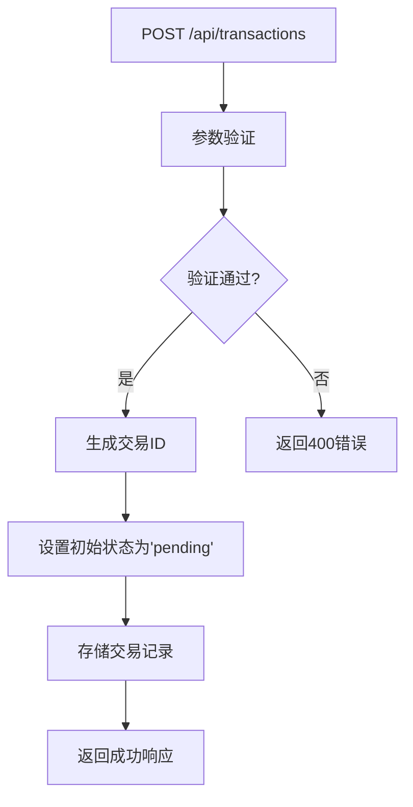
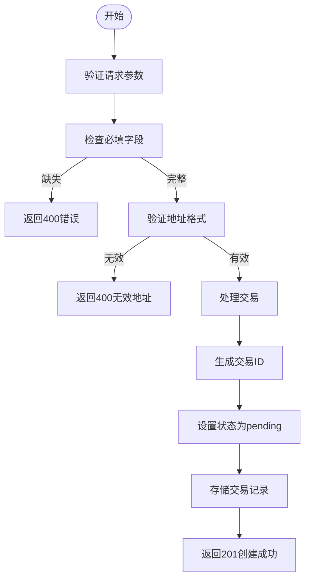
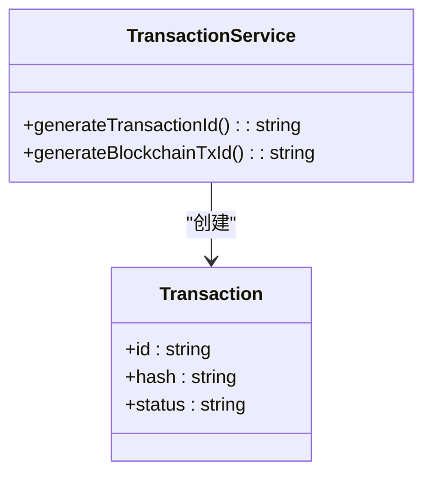
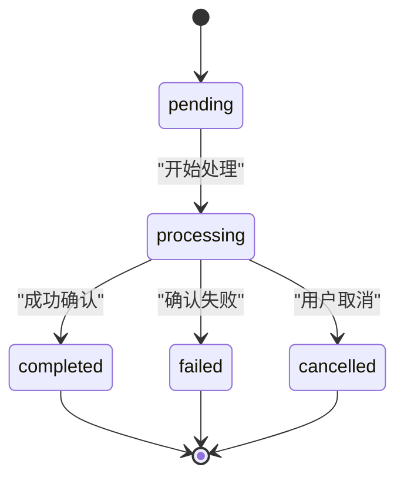
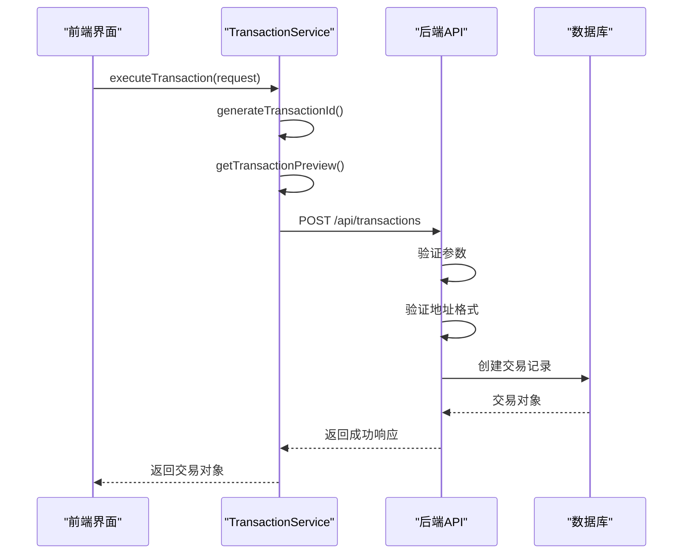
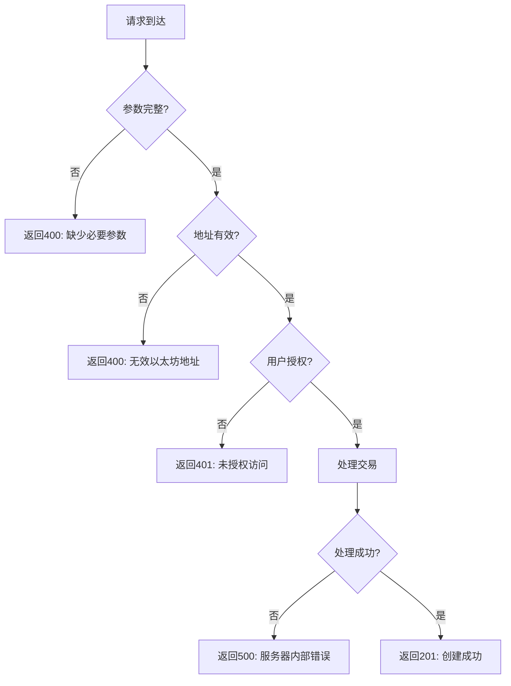
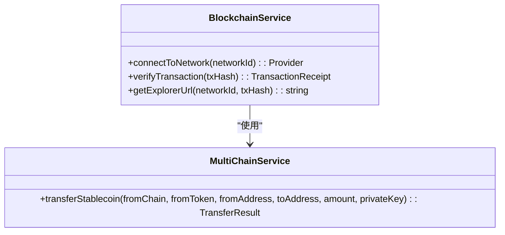
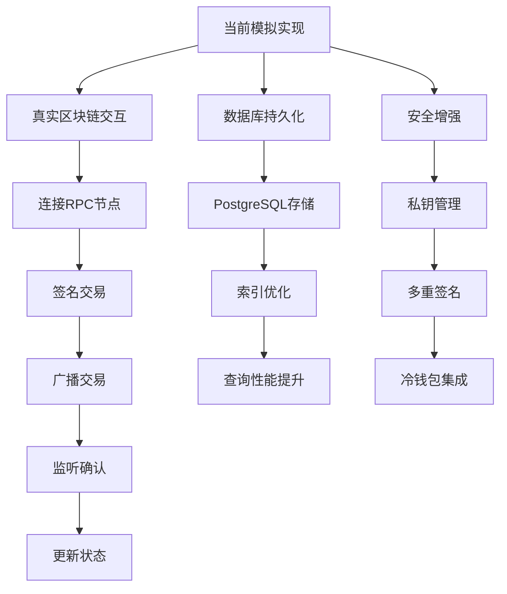

# 交易创建

<cite>
**本文档中引用的文件**
- [transaction.ts](file://backend/src/routes/transaction.ts)
- [transactionService.ts](file://src/services/transactionService.ts)
- [route.ts](file://src/app/api/wallet/transaction/route.ts)
</cite>

## 目录
1. [简介](#简介)
2. [API端点说明](#api端点说明)
3. [请求参数详细说明](#请求参数详细说明)
4. [交易ID生成机制](#交易id生成机制)
5. [交易状态管理](#交易状态管理)
6. [前端执行流程](#前端执行流程)
7. [成功响应示例](#成功响应示例)
8. [错误情况处理](#错误情况处理)
9. [区块链交互模拟](#区块链交互模拟)
10. [未来扩展点](#未来扩展点)

## 简介
本文档详细描述了交易创建功能的API设计与实现，重点介绍`POST /api/transactions`端点的工作机制。文档涵盖了从用户请求到交易记录创建的完整流程，包括参数验证、交易ID生成、状态管理以及与区块链网络的交互模拟。系统通过前后端协同工作，确保交易过程的安全性、可靠性和可追溯性。

## API端点说明
交易创建功能通过RESTful API端点实现，主要包含以下接口：



**Diagram sources**
- [transaction.ts](file://backend/src/routes/transaction.ts#L10-L313)
- [route.ts](file://src/app/api/wallet/transaction/route.ts#L0-L143)

**Section sources**
- [transaction.ts](file://backend/src/routes/transaction.ts#L10-L313)
- [route.ts](file://src/app/api/wallet/transaction/route.ts#L0-L143)

## 请求参数详细说明
交易创建请求需要提供以下必要参数，系统将进行严格的格式验证：

| 参数名 | 类型 | 必需 | 格式要求 | 验证规则 |
|-------|------|------|---------|---------|
| from | 字符串 | 是 | 有效的以太坊地址 | 使用ethers.js进行地址格式验证 |
| to | 字符串 | 是 | 有效的以太坊地址 | 使用ethers.js进行地址格式验证 |
| amount | 数字 | 是 | 正数，最多6位小数 | 必须大于0 |
| token | 字符串 | 是 | 有效的代币符号 | 支持ETH、USDT、USDC等 |
| networkId | 数字 | 是 | 有效的区块链网络ID | 1(以太坊主网)、11155111(测试网)等 |



**Diagram sources**
- [route.ts](file://src/app/api/wallet/transaction/route.ts#L5-L49)
- [transaction.ts](file://backend/src/routes/transaction.ts#L10-L313)

**Section sources**
- [route.ts](file://src/app/api/wallet/transaction/route.ts#L5-L49)
- [transaction.ts](file://backend/src/routes/transaction.ts#L10-L313)

## 交易ID生成机制
系统采用时间戳与随机字符串结合的方式生成唯一交易ID，确保全局唯一性和可追溯性。



**Diagram sources**
- [transactionService.ts](file://src/services/transactionService.ts#L275-L282)
- [route.ts](file://src/app/api/wallet/transaction/route.ts#L45-L46)

**Section sources**
- [transactionService.ts](file://src/services/transactionService.ts#L275-L282)
- [route.ts](file://src/app/api/wallet/transaction/route.ts#L45-L46)

交易ID生成算法：
1. 获取当前时间戳（毫秒级）
2. 生成6位随机大写字母和数字组合
3. 拼接前缀"TX"与时间戳后8位和随机字符串
4. 最终格式：`TX{timestamp}{random}`

例如：`TX1704067200123ABC456`

## 交易状态管理
交易系统采用状态机模式管理交易生命周期，初始状态为'pending'，后续根据处理结果更新状态。



**Diagram sources**
- [transactionService.ts](file://src/services/transactionService.ts#L198-L235)
- [transaction.ts](file://backend/src/routes/transaction.ts#L25-L35)

**Section sources**
- [transactionService.ts](file://src/services/transactionService.ts#L198-L235)
- [transaction.ts](file://backend/src/routes/transaction.ts#L25-L35)

状态转换规则：
- **pending**：交易已创建，等待处理
- **processing**：正在处理交易
- **completed**：交易成功完成
- **failed**：交易处理失败
- **cancelled**：交易被用户取消

## 前端执行流程
前端通过TransactionService的executeTransaction方法实现从用户请求到交易记录创建的完整流程。



**Diagram sources**
- [transactionService.ts](file://src/services/transactionService.ts#L152-L196)
- [route.ts](file://src/app/api/wallet/transaction/route.ts#L0-L49)

**Section sources**
- [transactionService.ts](file://src/services/transactionService.ts#L152-L196)
- [route.ts](file://src/app/api/wallet/transaction/route.ts#L0-L49)

执行步骤：
1. 前端调用executeTransaction方法
2. 生成唯一交易ID
3. 获取交易预览信息
4. 发送POST请求到后端API
5. 后端验证所有参数
6. 创建交易记录并设置初始状态
7. 返回成功响应给前端

## 成功响应示例
当交易创建成功时，系统返回201状态码和交易详情。

```json
{
  "success": true,
  "transaction": {
    "id": "tx_1704067200_abc123def",
    "hash": "0x1234567890abcdef1234567890abcdef1234567890abcdef1234567890abcdef",
    "from": "0x742d35Cc6648C8532C2B41F398999930894B6Af8",
    "to": "0x8ba1f109551bD432803012645Hac136c",
    "amount": "100.0",
    "token": "USDT",
    "networkId": 1,
    "status": "pending",
    "timestamp": "2024-01-01T00:00:00.000Z",
    "confirmations": 0,
    "gasUsed": "21000",
    "gasFee": "0.001",
    "blockNumber": null,
    "explorerUrl": "https://etherscan.io/tx/0x1234567890abcdef..."
  }
}
```

**Section sources**
- [route.ts](file://src/app/api/wallet/transaction/route.ts#L51-L58)

## 错误情况处理
系统对各种错误情况进行详细处理，返回相应的错误码和消息。



**Diagram sources**
- [route.ts](file://src/app/api/wallet/transaction/route.ts#L10-L49)
- [transaction.ts](file://backend/src/routes/transaction.ts#L10-L313)

**Section sources**
- [route.ts](file://src/app/api/wallet/transaction/route.ts#L10-L49)
- [transaction.ts](file://backend/src/routes/transaction.ts#L10-L313)

常见错误响应：
- **400 Bad Request**: 缺少必要参数或地址格式无效
- **401 Unauthorized**: 用户未授权访问
- **500 Internal Server Error**: 服务器内部错误

## 区块链交互模拟
系统当前实现为模拟模式，为未来真实区块链交互提供扩展基础。



**Diagram sources**
- [blockchain.ts](file://backend/src/services/blockchain.ts#L52-L97)
- [transaction.ts](file://backend/src/routes/transaction.ts#L70-L104)

**Section sources**
- [blockchain.ts](file://backend/src/services/blockchain.ts#L52-L97)
- [transaction.ts](file://backend/src/routes/transaction.ts#L70-L104)

模拟实现特点：
- 使用随机生成的交易哈希
- 模拟确认数和区块高度
- 提供区块链浏览器链接
- 记录Gas使用量和费用

## 未来扩展点
系统设计考虑了未来的真实实现扩展，主要扩展点包括：



**Diagram sources**
- [database.ts](file://backend/src/services/database.ts#L145-L188)
- [transaction.ts](file://backend/src/routes/transaction.ts#L25-L35)

**Section sources**
- [database.ts](file://backend/src/services/database.ts#L145-L188)
- [transaction.ts](file://backend/src/routes/transaction.ts#L25-L35)

关键扩展方向：
1. **真实区块链交互**：连接实际的区块链节点，发送真实交易
2. **数据库持久化**：将交易记录存储到PostgreSQL数据库
3. **安全增强**：实现安全的私钥管理和多重签名机制
4. **性能优化**：优化查询性能和交易处理速度
5. **监控告警**：添加交易监控和异常告警功能