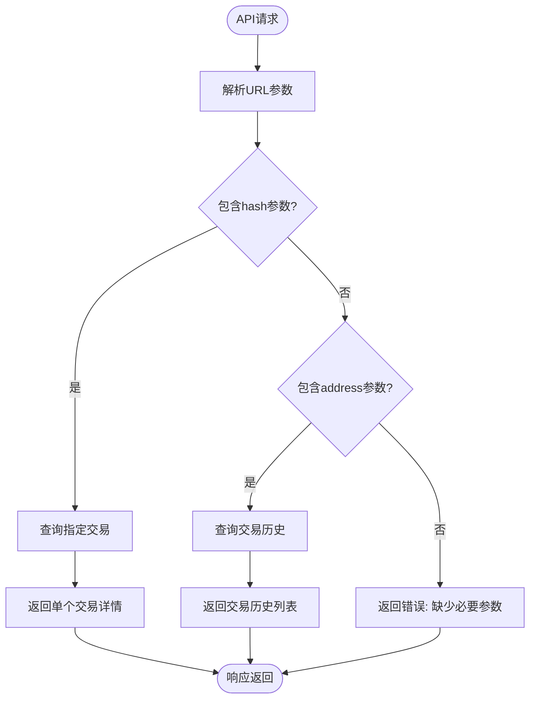
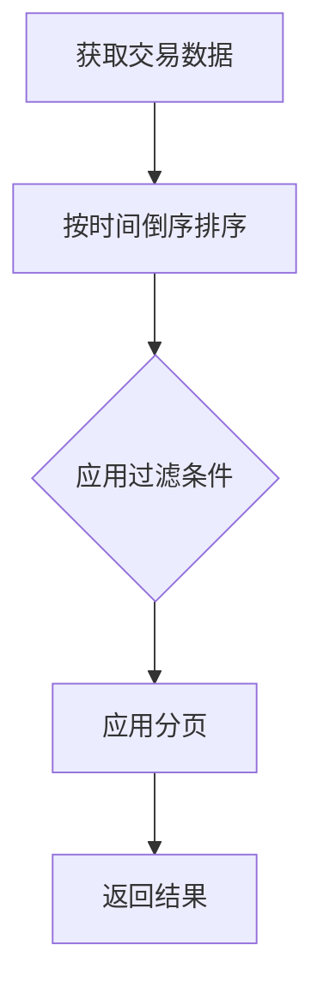
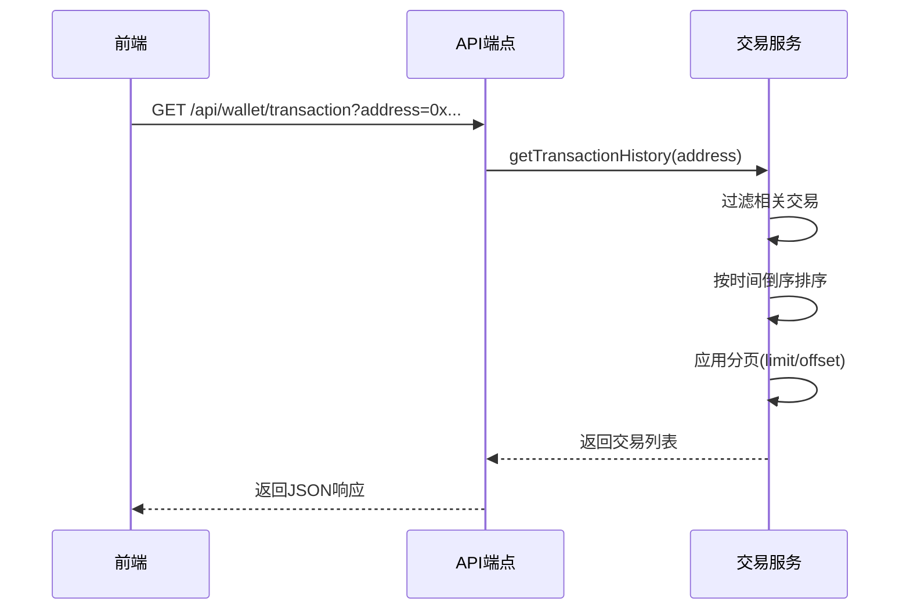
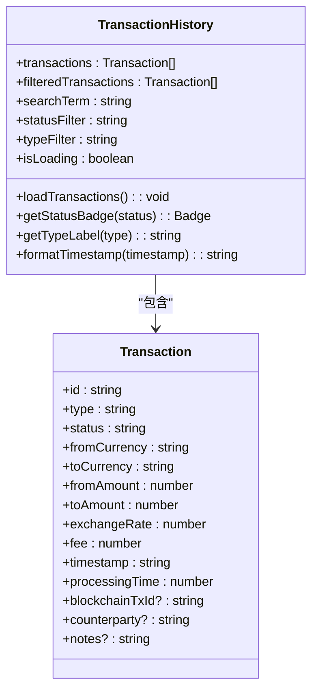

# 交易历史查询

<cite>
**本文档引用的文件**
- [route.ts](file://src/app/api/wallet/transaction/route.ts)
- [transactionService.ts](file://src/services/transactionService.ts)
- [TransactionHistory.tsx](file://src/components/Transactions/TransactionHistory.tsx)
</cite>

## 目录
1. [简介](#简介)
2. [API端点说明](#api端点说明)
3. [请求参数](#请求参数)
4. [分页机制](#分页机制)
5. [响应格式](#响应格式)
6. [交易历史数据处理逻辑](#交易历史数据处理逻辑)
7. [前端实现](#前端实现)
8. [常见问题与解决方案](#常见问题与解决方案)
9. [性能优化建议](#性能优化建议)

## 简介
本文档详细描述了通过钱包地址查询用户交易历史的API实现。重点介绍GET /api/wallet/transaction?address={address}端点的功能，包括请求参数、分页机制和响应格式。结合后端服务和前端组件，全面解析交易历史查询的完整流程。

**Section sources**
- [route.ts](file://src/app/api/wallet/transaction/route.ts#L67-L132)
- [transactionService.ts](file://src/services/transactionService.ts#L293-L303)

## API端点说明
交易历史查询API提供两种查询方式：通过交易哈希查询单个交易详情，或通过钱包地址查询交易历史记录。

### 端点信息
- **URL**: `/api/wallet/transaction`
- **方法**: GET
- **功能**: 查询交易详情或交易历史

### 查询模式
1. **交易哈希查询**: 当提供`hash`参数时，返回指定交易的详细信息
2. **地址查询**: 当提供`address`参数时，返回该地址相关的交易历史记录



**Diagram sources**
- [route.ts](file://src/app/api/wallet/transaction/route.ts#L67-L132)

**Section sources**
- [route.ts](file://src/app/api/wallet/transaction/route.ts#L67-L132)

## 请求参数
交易历史查询API支持以下查询参数：

| 参数 | 类型 | 必需 | 描述 |
|------|------|------|------|
| address | string | 否 | 钱包地址，用于查询该地址的交易历史 |
| hash | string | 否 | 交易哈希，用于查询特定交易详情 |
| limit | number | 否 | 返回结果的最大数量，默认20 |
| offset | number | 否 | 分页偏移量，默认0 |

**Section sources**
- [route.ts](file://src/app/api/wallet/transaction/route.ts#L67-L132)

## 分页机制
API实现了基于limit-offset的分页机制，用于控制返回的交易记录数量。

### 分页参数
- **limit**: 每页返回的交易数量
- **offset**: 从第几条记录开始返回

### 实现逻辑
1. 从URL参数中获取limit和offset值
2. 对交易历史数据进行排序（按时间倒序）
3. 使用slice方法截取指定范围的数据
4. 返回分页后的结果



**Diagram sources**
- [transactionService.ts](file://src/services/transactionService.ts#L293-L303)

**Section sources**
- [transactionService.ts](file://src/services/transactionService.ts#L293-L303)

## 响应格式
API返回的响应数据包含交易列表及相关信息。

### 成功响应
```json
{
  "transactions": [
    {
      "id": "tx_1",
      "hash": "0x1234...1234",
      "from": "0x742d...D2F",
      "to": "0x1234...5678",
      "amount": "100.0",
      "token": "DAI",
      "status": "confirmed",
      "timestamp": "2023-12-01T10:00:00.000Z",
      "confirmations": 24
    }
  ]
}
```

### 错误响应
```json
{
  "error": "Transaction hash or address required"
}
```

### 响应字段说明
| 字段 | 类型 | 描述 |
|------|------|------|
| transactions | array | 交易记录数组 |
| id | string | 交易唯一标识 |
| hash | string | 交易哈希值 |
| from | string | 发送方地址 |
| to | string | 接收方地址 |
| amount | string | 交易金额 |
| token | string | 交易代币类型 |
| status | string | 交易状态 |
| timestamp | string | 交易时间戳 |
| confirmations | number | 确认数 |

**Section sources**
- [route.ts](file://src/app/api/wallet/transaction/route.ts#L67-L132)

## 交易历史数据处理逻辑
交易历史数据的处理涉及过滤、排序和分页三个核心步骤。

### 数据处理流程
1. **数据获取**: 从数据库或区块链获取原始交易数据
2. **过滤**: 根据查询条件筛选相关交易
3. **排序**: 按时间倒序排列交易记录
4. **分页**: 应用limit-offset机制返回指定范围数据

### 排序逻辑
交易记录按时间戳倒序排列，确保最新的交易显示在最前面。



**Diagram sources**
- [transactionService.ts](file://src/services/transactionService.ts#L293-L303)
- [route.ts](file://src/app/api/wallet/transaction/route.ts#L67-L132)

**Section sources**
- [transactionService.ts](file://src/services/transactionService.ts#L293-L303)

## 前端实现
前端通过API端点查询交易历史，并在用户界面中展示。

### 组件结构
- **TransactionHistory**: 交易历史主组件
- **TransactionList**: 交易列表展示
- **TransactionFilters**: 交易过滤器

### 数据流
1. 用户在钱包页面触发交易历史查询
2. 前端调用API端点获取数据
3. 数据在TransactionHistory组件中渲染展示



**Diagram sources**
- [TransactionHistory.tsx](file://src/components/Transactions/TransactionHistory.tsx#L39-L495)

**Section sources**
- [TransactionHistory.tsx](file://src/components/Transactions/TransactionHistory.tsx#L39-L495)

## 常见问题与解决方案
### 地址格式验证
**问题**: 用户输入的地址格式不正确
**解决方案**: 
- 使用ethers.js的isAddress方法验证地址格式
- 返回400错误状态码和错误信息

### 空结果处理
**问题**: 查询地址没有相关交易记录
**解决方案**:
- 返回空数组而非错误
- 前端显示"暂无交易记录"提示

### 参数缺失处理
**问题**: 必需参数缺失
**解决方案**:
- 验证必需参数是否存在
- 返回400错误状态码和详细错误信息

**Section sources**
- [route.ts](file://src/app/api/wallet/transaction/route.ts#L67-L132)

## 性能优化建议
### 索引优化
- 在数据库中为钱包地址字段创建索引
- 为时间戳字段创建索引以加速排序操作

### 分页大小限制
- 设置合理的分页大小上限（如100条）
- 避免一次性返回过多数据导致性能问题

### 缓存策略
- 对频繁查询的地址交易历史进行缓存
- 设置合理的缓存过期时间

### 数据库查询优化
- 使用数据库原生的分页功能而非内存分页
- 只查询必要的字段而非完整交易数据

**Section sources**
- [transactionService.ts](file://src/services/transactionService.ts#L293-L303)
- [route.ts](file://src/app/api/wallet/transaction/route.ts#L67-L132)