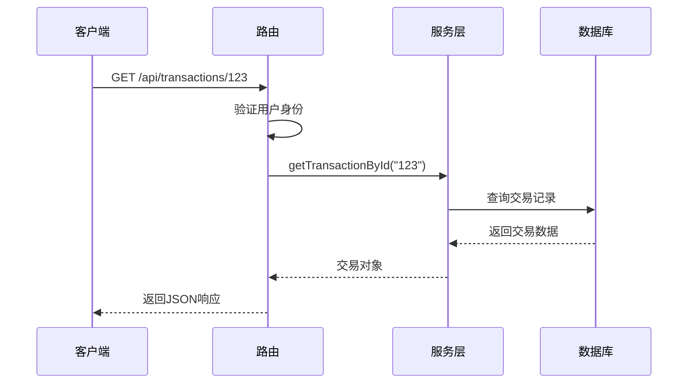
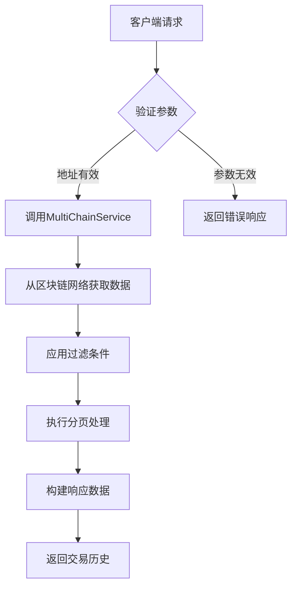
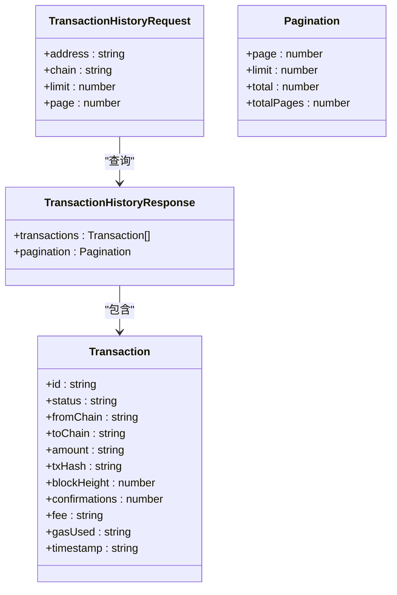
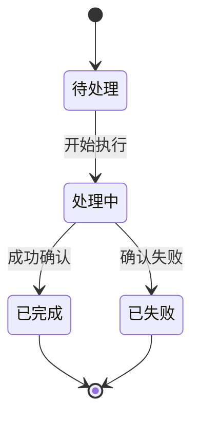
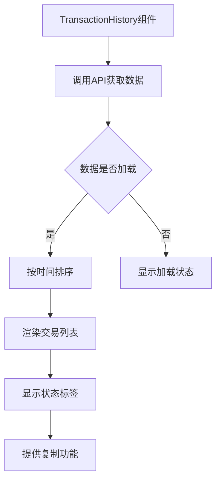

# 交易查询

<cite>
**本文档引用的文件**  
- [transaction.ts](file://backend/src/routes/transaction.ts)
- [transactionService.ts](file://src/services/transactionService.ts)
- [blockchain.ts](file://backend/src/routes/blockchain.ts)
- [TransactionHistory.tsx](file://src/components/Transactions/TransactionHistory.tsx)
</cite>

## 目录
1. [简介](#简介)
2. [API端点概览](#api端点概览)
3. [交易详情查询](#交易详情查询)
4. [交易历史查询](#交易历史查询)
5. [响应数据结构](#响应数据结构)
6. [分页与性能优化](#分页与性能优化)
7. [交易时间线与状态流转](#交易时间线与状态流转)
8. [前端集成示例](#前端集成示例)

## 简介
本文档详细说明了交易查询功能的API设计与实现，涵盖通过交易哈希（txHash）查询单个交易和通过钱包地址（address）查询交易历史的两种核心使用场景。文档深入解析了交易数据的结构、状态流转机制、分页逻辑以及性能优化策略，为开发者提供完整的集成指导。

## API端点概览
系统提供了两个主要的交易查询API端点：

- `GET /api/transactions/:transactionId` - 查询单个交易的详细信息
- `GET /api/blockchain/transactions/:address` - 查询指定地址的交易历史

这些端点分别由后端路由文件 `transaction.ts` 和 `blockchain.ts` 实现，并通过 `transactionService` 提供核心业务逻辑。

**Section sources**
- [transaction.ts](file://backend/src/routes/transaction.ts#L1-L313)
- [blockchain.ts](file://backend/src/routes/blockchain.ts#L251-L293)

## 交易详情查询
`GET /api/transactions/:transactionId` 端点用于查询单个交易的完整详情。该接口需要用户身份验证，并返回包含交易状态、区块链信息、费用和时间线等关键字段的详细数据。



**Diagram sources**
- [transaction.ts](file://backend/src/routes/transaction.ts#L219-L269)
- [transactionService.ts](file://src/services/transactionService.ts#L305-L307)

## 交易历史查询
`GET /api/blockchain/transactions/:address` 端点用于查询指定区块链地址的交易历史。该功能支持通过链名（chain）、分页参数（limit、page）进行过滤和分页。



**Diagram sources**
- [blockchain.ts](file://backend/src/routes/blockchain.ts#L251-L293)
- [transactionService.ts](file://src/services/transactionService.ts#L293-L303)

## 响应数据结构
### 单个交易响应
```json
{
  "success": true,
  "data": {
    "id": "string",
    "status": "completed|pending|failed|cancelled|processing",
    "fromChain": "string",
    "toChain": "string",
    "fromToken": "string",
    "toToken": "string",
    "amount": "string",
    "txHash": "string",
    "blockHeight": "number",
    "confirmations": "number",
    "fee": "string",
    "gasUsed": "string",
    "exchangeRate": "string",
    "timeline": [
      {
        "status": "string",
        "timestamp": "string",
        "description": "string"
      }
    ],
    "createdAt": "string",
    "completedAt": "string"
  }
}
```

### 交易历史响应
```json
{
  "success": true,
  "data": {
    "transactions": [
      {
        "hash": "string",
        "chain": "string",
        "from": "string",
        "to": "string",
        "value": "string",
        "token": "string",
        "fee": "string",
        "status": "confirmed|pending|failed",
        "blockNumber": "number",
        "timestamp": "string"
      }
    ],
    "pagination": {
      "page": "number",
      "limit": "number",
      "total": "number",
      "totalPages": "number"
    }
  }
}
```

**Section sources**
- [transaction.ts](file://backend/src/routes/transaction.ts#L219-L269)
- [blockchain.ts](file://backend/src/routes/blockchain.ts#L251-L293)

## 分页与性能优化
### 分页参数
| 参数 | 类型 | 必需 | 默认值 | 描述 |
|------|------|------|--------|------|
| limit | number | 否 | 20 | 每页返回的交易数量 |
| page | number | 否 | 1 | 请求的页码 |
| chain | string | 否 | 所有链 | 过滤特定区块链的交易 |

### 使用示例
```
GET /api/blockchain/transactions/0x742d...6Af8?chain=ethereum&limit=10&page=2
```

### 性能优化建议
1. **合理设置分页大小**：避免一次性请求过多数据，建议limit值保持在10-50之间
2. **使用缓存机制**：频繁查询的地址交易历史应缓存结果
3. **按需查询**：通过chain参数过滤，减少不必要的数据传输
4. **索引优化**：在数据库中为address和timestamp字段建立索引



**Diagram sources**
- [blockchain.ts](file://backend/src/routes/blockchain.ts#L251-L293)
- [transactionService.ts](file://src/services/transactionService.ts#L293-L303)

## 交易时间线与状态流转
### 状态流转图


### 交易时间线
交易时间线（timeline）字段记录了交易处理过程中的关键步骤：

1. **created**：交易创建时间
2. **broadcasting**：交易广播到区块链网络
3. **confirmed**：区块链网络确认交易
4. **completed**：交易完成，资金到账

每个时间线条目包含状态、时间戳和描述信息，帮助用户追踪交易处理进度。

**Section sources**
- [transaction.ts](file://backend/src/routes/transaction.ts#L219-L269)
- [transactionService.ts](file://src/services/transactionService.ts#L198-L235)

## 前端集成示例
前端组件 `TransactionHistory.tsx` 集成了交易查询功能，通过以下步骤实现：

1. 调用API获取交易数据
2. 对交易按时间戳排序
3. 渲染交易列表和详细信息
4. 提供复制交易ID和区块链交易ID的功能



**Diagram sources**
- [TransactionHistory.tsx](file://src/components/Transactions/TransactionHistory.tsx#L395-L497)
- [transactionService.ts](file://src/services/transactionService.ts#L293-L303)