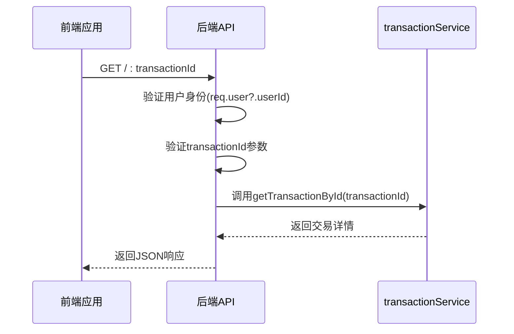
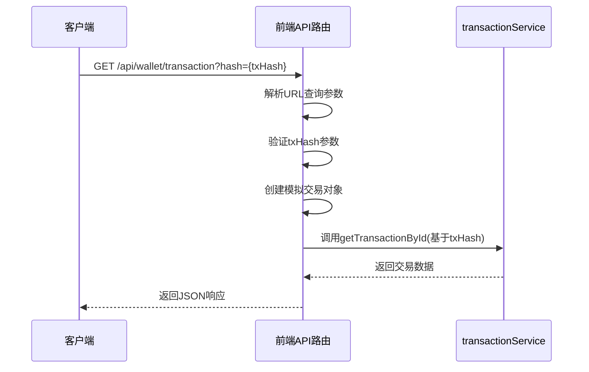
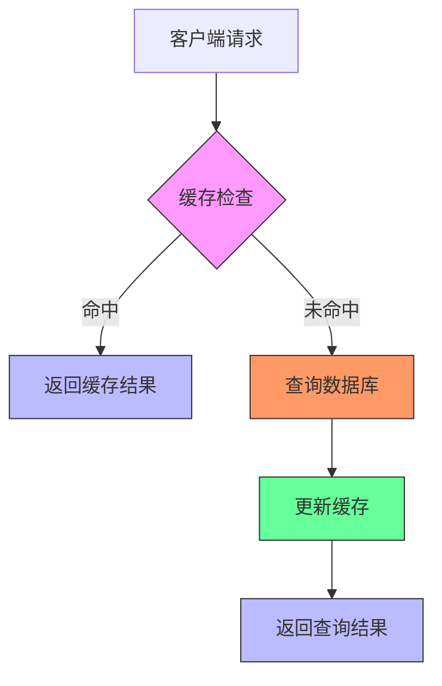

# 单个交易查询

<cite>
**本文档引用的文件**   
- [transaction.ts](file://backend/src/routes/transaction.ts)
- [route.ts](file://src/app/api/wallet/transaction/route.ts)
- [transactionService.ts](file://src/services/transactionService.ts)
</cite>

## 目录
1. [简介](#简介)
2. [API端点说明](#api端点说明)
3. [请求参数](#请求参数)
4. [响应结构](#响应结构)
5. [错误处理机制](#错误处理机制)
6. [后端实现分析](#后端实现分析)
7. [前端实现分析](#前端实现分析)
8. [关键响应字段详解](#关键响应字段详解)
9. [常见问题与解决方案](#常见问题与解决方案)
10. [性能优化建议](#性能优化建议)

## 简介
本文档详细描述了通过交易哈希（txHash）查询特定交易的API实现。该功能允许用户通过GET /api/wallet/transaction?hash={txHash}端点查询区块链交易的详细信息。文档涵盖了API的请求参数、响应结构、错误处理机制，以及前后端的实现细节。

## API端点说明
单个交易查询功能通过以下API端点实现：

- **前端API**: `GET /api/wallet/transaction?hash={txHash}`
- **后端路由**: `GET /:transactionId` in `backend/src/routes/transaction.ts`

该功能允许用户通过交易哈希查询特定交易的详细信息，包括交易状态、确认数、区块高度、Gas费用等关键数据。

**Section sources**
- [route.ts](file://src/app/api/wallet/transaction/route.ts#L67-L132)
- [transaction.ts](file://backend/src/routes/transaction.ts#L144-L187)

## 请求参数
单个交易查询API接受以下请求参数：

| 参数名 | 类型 | 必需 | 描述 |
|-------|------|------|------|
| hash | 字符串 | 是 | 交易哈希值，用于唯一标识区块链交易 |

请求通过URL查询参数传递，示例：
```
GET /api/wallet/transaction?hash=0x1234567890abcdef
```

**Section sources**
- [route.ts](file://src/app/api/wallet/transaction/route.ts#L68-L69)

## 响应结构
API返回标准化的JSON响应结构：

```json
{
  "transaction": {
    "id": "string",
    "hash": "string",
    "status": "string",
    "confirmations": "number",
    "blockNumber": "number",
    "timestamp": "string",
    "gasUsed": "string",
    "gasFee": "string"
  }
}
```

成功响应状态码为200，错误响应包含相应的错误信息和状态码。

**Section sources**
- [route.ts](file://src/app/api/wallet/transaction/route.ts#L74-L85)

## 错误处理机制
API实现了完善的错误处理机制：

- **400 Bad Request**: 当请求缺少必要参数时返回
- **500 Internal Server Error**: 当服务器内部发生错误时返回
- **统一错误格式**: 所有错误响应都包含error字段和相应的HTTP状态码

错误处理确保了API的健壮性和用户体验。

**Section sources**
- [route.ts](file://src/app/api/wallet/transaction/route.ts#L120-L132)

## 后端实现分析
后端通过Express路由处理交易查询请求，具体实现位于`backend/src/routes/transaction.ts`文件中。



**Diagram sources**
- [transaction.ts](file://backend/src/routes/transaction.ts#L144-L187)

**Section sources**
- [transaction.ts](file://backend/src/routes/transaction.ts#L144-L187)

## 前端实现分析
前端实现位于`src/app/api/wallet/transaction/route.ts`文件中，使用Next.js API路由处理请求。



**Diagram sources**
- [route.ts](file://src/app/api/wallet/transaction/route.ts#L67-L132)

**Section sources**
- [route.ts](file://src/app/api/wallet/transaction/route.ts#L67-L132)

## 关键响应字段详解
查询响应包含以下关键字段：

| 字段名 | 类型 | 描述 |
|-------|------|------|
| id | 字符串 | 交易唯一标识符 |
| hash | 字符串 | 区块链交易哈希 |
| status | 字符串 | 交易状态（如confirmed） |
| confirmations | 数字 | 交易确认数 |
| blockNumber | 数字 | 交易所在的区块高度 |
| timestamp | 字符串 | 交易时间戳 |
| gasUsed | 字符串 | 使用的Gas数量 |
| gasFee | 字符串 | Gas费用 |

这些字段提供了交易的完整状态信息，帮助用户了解交易的执行情况。

**Section sources**
- [route.ts](file://src/app/api/wallet/transaction/route.ts#L75-L84)

## 常见问题与解决方案
### 交易未找到
**问题**: 查询不存在的交易哈希
**解决方案**: 
- 前端应验证交易哈希格式
- 提供友好的错误提示
- 实现交易哈希格式验证（使用ethers.isAddress等工具）

### 网络错误
**问题**: 区块链网络连接问题
**解决方案**:
- 实现请求重试机制
- 提供网络状态指示
- 设置合理的超时时间

### 性能问题
**问题**: 大量并发查询导致性能下降
**解决方案**:
- 实现缓存策略
- 限制请求频率
- 优化数据库查询

**Section sources**
- [route.ts](file://src/app/api/wallet/transaction/route.ts#L120-L132)
- [transaction.ts](file://backend/src/routes/transaction.ts#L144-L187)

## 性能优化建议
### 缓存策略
实现多级缓存来提高查询性能：



**Diagram sources**
- [transactionService.ts](file://src/services/transactionService.ts#L340-L348)

**Section sources**
- [transactionService.ts](file://src/services/transactionService.ts#L340-L348)

### 其他优化建议
1. **数据库索引**: 为交易哈希字段创建索引
2. **请求节流**: 限制单个用户的请求频率
3. **批量查询**: 支持批量交易查询以减少网络开销
4. **数据压缩**: 对响应数据进行Gzip压缩
5. **CDN缓存**: 对静态交易数据使用CDN缓存

这些优化措施可以显著提高API的响应速度和系统整体性能。

**Section sources**
- [transactionService.ts](file://src/services/transactionService.ts#L340-L348)
- [transaction.ts](file://backend/src/routes/transaction.ts#L144-L187)