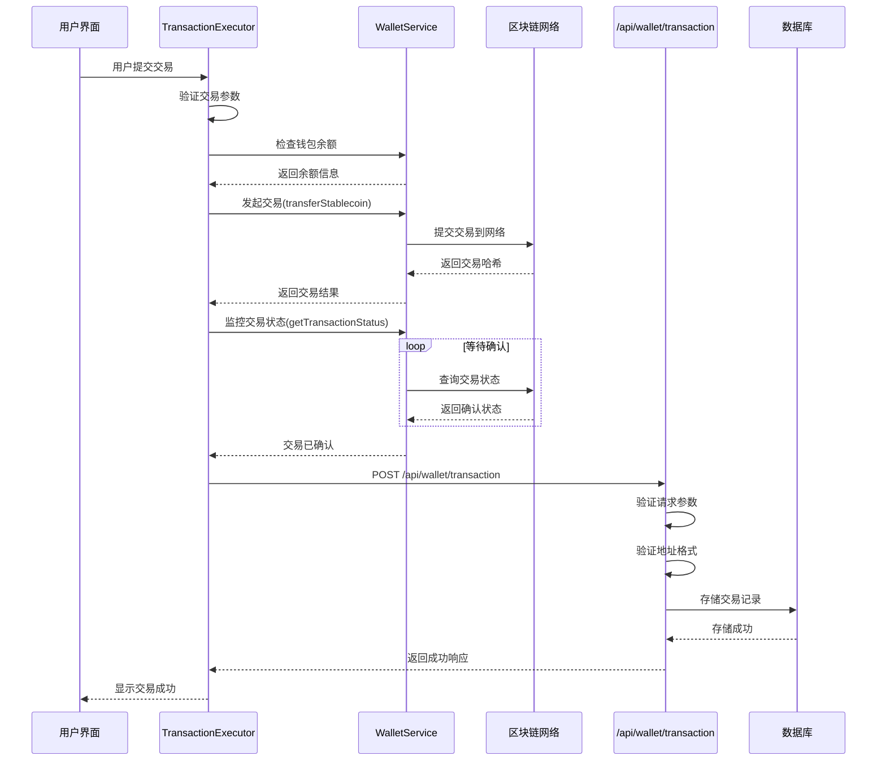

<cite>
**本文档引用的文件**
- [route.ts](file://src/app/api/wallet/transaction/route.ts)
- [TransactionExecutor.tsx](file://src/components/Blockchain/TransactionExecutor.tsx)
- [walletService.ts](file://src/services/walletService.ts)
- [transactionService.ts](file://src/services/transactionService.ts)
</cite>

## 目录
1. [交易状态事件推送](#交易状态事件推送)
2. [API路由设计](#api路由设计)
3. [前端交易执行流程](#前端交易执行流程)
4. [数据结构定义](#数据结构定义)
5. [错误处理与验证](#错误处理与验证)
6. [序列图：交易状态推送流程](#序列图交易状态推送流程)

## 交易状态事件推送

本系统实现了完整的交易状态事件推送机制，通过前后端协同工作，确保交易状态的实时更新和持久化存储。前端组件在交易完成后主动调用后端API，将交易哈希、网络ID等关键信息推送至服务器，实现交易记录的统一管理。

该机制的核心在于`TransactionExecutor`组件与`/api/wallet/transaction` API端点的集成。当用户在前端执行交易后，系统会自动调用此API，将区块链交易信息存储在后端，便于后续查询和管理。

**Section sources**
- [route.ts](file://src/app/api/wallet/transaction/route.ts)
- [TransactionExecutor.tsx](file://src/components/Blockchain/TransactionExecutor.tsx)

## API路由设计

系统提供了RESTful API接口用于交易记录的创建和查询，位于`src/app/api/wallet/transaction/route.ts`。这些接口遵循标准的HTTP方法约定，支持交易数据的增删改查操作。

### POST /api/wallet/transaction
此端点用于创建新的交易记录。前端在交易完成后调用此接口，将交易详情存储在系统中。

**请求参数**
- `from`: 发送方钱包地址
- `to`: 接收方钱包地址
- `amount`: 交易金额
- `token`: 交易代币类型
- `networkId`: 网络ID
- `txHash`: 交易哈希

**响应结构**
```json
{
  "success": true,
  "transaction": {
    "id": "交易ID",
    "hash": "交易哈希",
    "from": "发送方地址",
    "to": "接收方地址",
    "amount": "交易金额",
    "token": "代币类型",
    "networkId": "网络ID",
    "status": "交易状态",
    "timestamp": "时间戳",
    "confirmations": "确认数",
    "gasUsed": "Gas使用量",
    "gasFee": "Gas费用",
    "blockNumber": "区块高度",
    "explorerUrl": "区块浏览器链接"
  }
}
```

### GET /api/wallet/transaction
此端点用于查询交易记录，支持通过交易哈希或钱包地址进行查询。

**查询参数**
- `hash`: 交易哈希（精确查询）
- `address`: 钱包地址（查询该地址相关的所有交易）

**响应结构**
```json
{
  "transaction": { /* 单个交易详情 */ }
}
```
或
```json
{
  "transactions": [ /* 交易历史列表 */ ]
}
```

**Section sources**
- [route.ts](file://src/app/api/wallet/transaction/route.ts)

## 前端交易执行流程

`TransactionExecutor`组件实现了完整的交易执行流程，从用户界面交互到区块链交易，再到后端记录存储的完整闭环。

### 执行流程步骤
1. **参数验证**：验证接收地址和转账金额的有效性
2. **余额检查**：通过`walletService`检查钱包余额是否充足
3. **Gas费用计算**：估算交易所需的网络费用
4. **交易发起**：调用`walletService.transferStablecoin`发起区块链交易
5. **状态监控**：使用`walletService.getTransactionStatus`监控交易确认状态
6. **结果记录**：交易确认后，调用`/api/wallet/transaction` API记录交易信息

关键代码路径：
- 交易执行逻辑：[TransactionExecutor.tsx](file://src/components/Blockchain/TransactionExecutor.tsx#L100-L250)
- 钱包服务调用：[walletService.ts](file://src/services/walletService.ts#L100-L200)
- 交易状态监控：[walletService.ts](file://src/services/walletService.ts#L200-L250)

**Section sources**
- [TransactionExecutor.tsx](file://src/components/Blockchain/TransactionExecutor.tsx)
- [walletService.ts](file://src/services/walletService.ts)

## 数据结构定义

系统定义了清晰的数据结构来表示交易信息，确保前后端数据的一致性。

### 交易对象结构
| 字段 | 类型 | 描述 |
|------|------|------|
| id | string | 系统生成的交易ID |
| hash | string | 区块链交易哈希 |
| from | string | 发送方钱包地址 |
| to | string | 接收方钱包地址 |
| amount | string | 交易金额 |
| token | string | 交易代币类型 |
| networkId | number | 网络ID |
| status | string | 交易状态 (pending, confirmed, failed) |
| timestamp | string | 交易时间戳 |
| confirmations | number | 确认数 |
| gasUsed | string | Gas使用量 |
| gasFee | string | Gas费用 |
| blockNumber | number/null | 区块高度 |
| explorerUrl | string | 区块浏览器链接 |

### 交易状态枚举
- `pending`: 交易已提交，等待确认
- `confirmed`: 交易已确认，成功完成
- `failed`: 交易失败

**Section sources**
- [route.ts](file://src/app/api/wallet/transaction/route.ts)
- [TransactionExecutor.tsx](file://src/components/Blockchain/TransactionExecutor.tsx)

## 错误处理与验证

系统实现了多层次的错误处理和数据验证机制，确保交易的安全性和可靠性。

### 数据验证
1. **参数完整性检查**：确保所有必需参数都已提供
2. **地址格式验证**：使用`ethers.isAddress()`验证以太坊地址格式
3. **余额检查**：确保发送方有足够的代币余额
4. **金额有效性**：验证交易金额为正数且格式正确

### 错误处理
- **客户端错误 (400)**：参数缺失或格式错误
- **未授权访问 (401)**：用户未登录或认证失败
- **服务器错误 (500)**：内部服务器错误或区块链交互失败

关键验证代码路径：
- 地址验证：[route.ts](file://src/app/api/wallet/transaction/route.ts#L10-L15)
- 参数完整性：[route.ts](file://src/app/api/wallet/transaction/route.ts#L6-L10)
- 余额检查：[TransactionExecutor.tsx](file://src/components/Blockchain/TransactionExecutor.tsx#L150-L160)

**Section sources**
- [route.ts](file://src/app/api/wallet/transaction/route.ts)
- [TransactionExecutor.tsx](file://src/components/Blockchain/TransactionExecutor.tsx)

## 序列图：交易状态推送流程



**Diagram sources**
- [TransactionExecutor.tsx](file://src/components/Blockchain/TransactionExecutor.tsx#L100-L300)
- [walletService.ts](file://src/services/walletService.ts#L100-L250)
- [route.ts](file://src/app/api/wallet/transaction/route.ts#L1-L50)