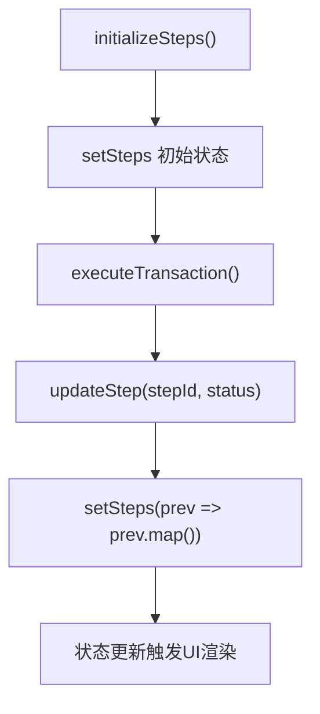
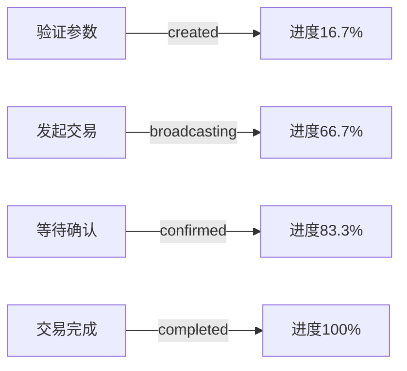

# 交易状态同步机制

<cite>
**本文档引用的文件**  
- [TransactionExecutor.tsx](file://src/components/Blockchain/TransactionExecutor.tsx)
- [transaction.ts](file://backend/src/routes/transaction.ts)
- [transactionService.ts](file://src/services/transactionService.ts)
</cite>

## 目录
1. [简介](#简介)
2. [六步交易流程与状态同步](#六步交易流程与状态同步)
3. [前端状态管理机制](#前端状态管理机制)
4. [后端交易状态接口](#后端交易状态接口)
5. [前端进度条与后端状态映射](#前端进度条与后端状态映射)
6. [确认数对状态显示的影响](#确认数对状态显示的影响)

## 简介
本文详细说明交易状态同步机制的实现，重点分析 `TransactionExecutor` 组件中的六步交易流程（验证参数、检查余额、计算Gas、发起交易、等待确认、完成）如何与后端交易状态进行同步。同时解释 `useState` 和 `useCallback` 如何管理交易步骤状态和更新函数，以及后端 `/api/transactions/:transactionId` 接口如何返回交易时间线信息。

## 六步交易流程与状态同步
`TransactionExecutor` 组件实现了完整的六步链上交易流程，每一步都通过状态更新机制与用户界面同步：

1. **验证交易参数**：检查接收地址和转账金额的有效性
2. **检查余额**：调用 `walletService.getStablecoinBalances()` 确认钱包余额
3. **计算Gas费用**：估算交易所需的网络费用
4. **发起交易**：通过 `walletService.transferStablecoin()` 提交交易
5. **等待确认**：轮询 `walletService.getTransactionStatus()` 获取交易状态
6. **交易完成**：确认成功后记录交易并更新状态

该流程通过 `executeTransaction` 函数串行执行，每一步完成后调用 `updateStep` 更新对应步骤的状态，并在最后通过 POST 请求将交易记录提交至后端。

**Section sources**
- [TransactionExecutor.tsx](file://src/components/Blockchain/TransactionExecutor.tsx#L22-L388)

## 前端状态管理机制
组件使用 React 的 `useState` 和 `useCallback` 钩子实现高效的状态管理：

- `useState` 用于管理核心状态：
  - `steps`：存储六步交易流程的状态数组
  - `currentStep`：跟踪当前执行的步骤索引
  - `transaction`：保存交易结果对象

- `useCallback` 优化关键函数：
  - `initializeSteps`：初始化所有步骤为 "pending" 状态
  - `updateStep`：更新指定步骤的状态（pending/processing/completed/failed）

`updateStep` 函数通过函数式更新确保状态一致性，避免闭包问题。当某步骤状态变为 "processing" 时，`currentStep` 会相应更新，驱动进度条前进。



**Diagram sources**
- [TransactionExecutor.tsx](file://src/components/Blockchain/TransactionExecutor.tsx#L22-L388)

**Section sources**
- [TransactionExecutor.tsx](file://src/components/Blockchain/TransactionExecutor.tsx#L22-L388)

## 后端交易状态接口
后端通过 `GET /api/transactions/:transactionId` 接口提供详细的交易状态信息，返回数据包含 `timeline` 字段，记录交易生命周期的关键时间点：

```json
{
  "timeline": [
    {
      "status": "created",
      "timestamp": "2024-01-01T00:00:00.000Z",
      "description": "交易创建"
    },
    {
      "status": "broadcasting",
      "timestamp": "2024-01-01T00:01:00.000Z",
      "description": "广播到区块链网络"
    },
    {
      "status": "confirmed",
      "timestamp": "2024-01-01T00:03:00.000Z",
      "description": "区块链确认"
    },
    {
      "status": "completed",
      "timestamp": "2024-01-01T00:05:00.000Z",
      "description": "交易完成"
    }
  ]
}
```

此接口由 `backend/src/routes/transaction.ts` 中的路由处理器实现，返回包含完整时间线的交易详情对象，为前端提供精确的状态同步依据。

**Section sources**
- [transaction.ts](file://backend/src/routes/transaction.ts#L150-L250)

## 前端进度条与后端状态映射
前端进度条通过 `currentStep` 和 `steps.length` 计算完成度，与后端状态建立映射关系：

| 前端步骤 | 后端状态 | 进度百分比 |
|--------|--------|---------|
| 验证参数 | created | 16.7% |
| 检查余额 | created | 33.3% |
| 计算Gas | created | 50.0% |
| 发起交易 | broadcasting | 66.7% |
| 等待确认 | confirmed | 83.3% |
| 交易完成 | completed | 100.0% |

进度条组件 `<Progress value={(currentStep / steps.length) * 100} />` 实时反映交易进展。每个步骤的状态变化（通过 `getStepIcon` 函数）直观显示为图标：待处理（时钟）、处理中（旋转）、完成（勾选）、失败（警告）。



**Diagram sources**
- [TransactionExecutor.tsx](file://src/components/Blockchain/TransactionExecutor.tsx#L22-L388)
- [transaction.ts](file://backend/src/routes/transaction.ts#L150-L250)

**Section sources**
- [TransactionExecutor.tsx](file://src/components/Blockchain/TransactionExecutor.tsx#L22-L388)
- [transaction.ts](file://backend/src/routes/transaction.ts#L150-L250)

## 确认数对状态显示的影响
交易确认数直接影响状态显示和用户体验：

- **确认数 ≥ 6**：显示为"已确认"，绿色状态标识
- **1 ≤ 确认数 < 6**：显示为"处理中"，黄色状态标识
- **确认数 = 0**：显示为"等待确认"，蓝色旋转图标

在 `TransactionExecutor` 组件中，当交易状态为 "confirmed" 时，会显示确认数信息：
```tsx
<div className="flex items-center gap-2">
  <DollarSign className="h-3 w-3" />
  <span>确认数: {transaction.confirmations}</span>
</div>
```

后端通过 `multiChainService` 获取实际确认数，并在 `timeline` 中记录 "confirmed" 状态的时间戳。前端根据确认数决定是否显示"交易成功完成"的绿色提示框，确保用户能准确判断交易安全性。

**Section sources**
- [TransactionExecutor.tsx](file://src/components/Blockchain/TransactionExecutor.tsx#L22-L388)
- [transaction.ts](file://backend/src/routes/transaction.ts#L150-L250)