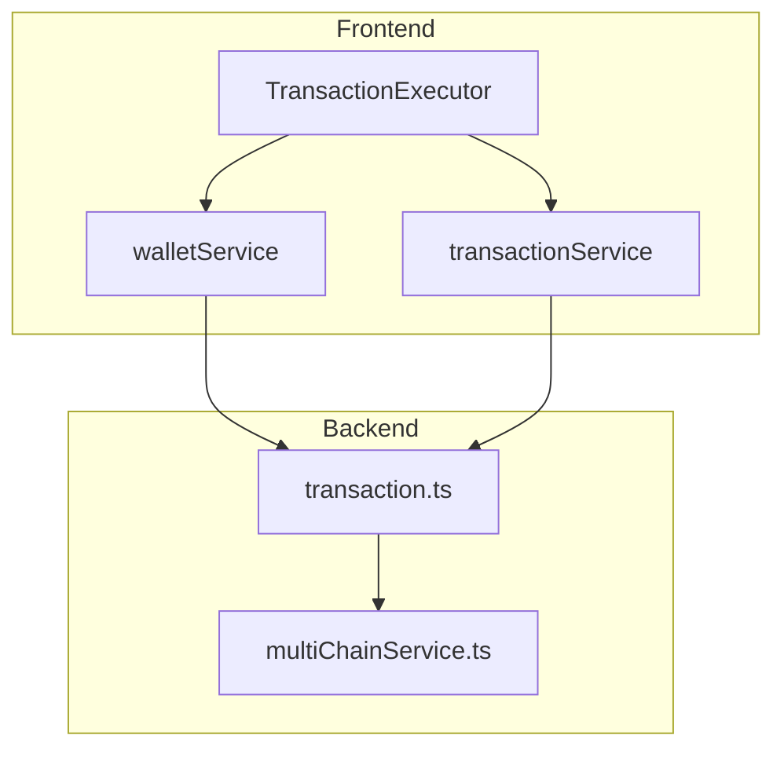
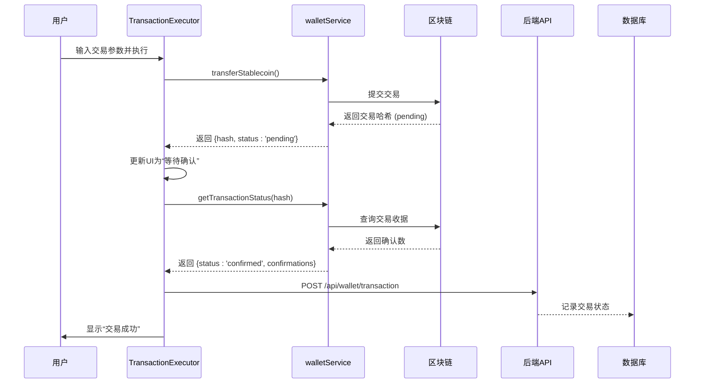
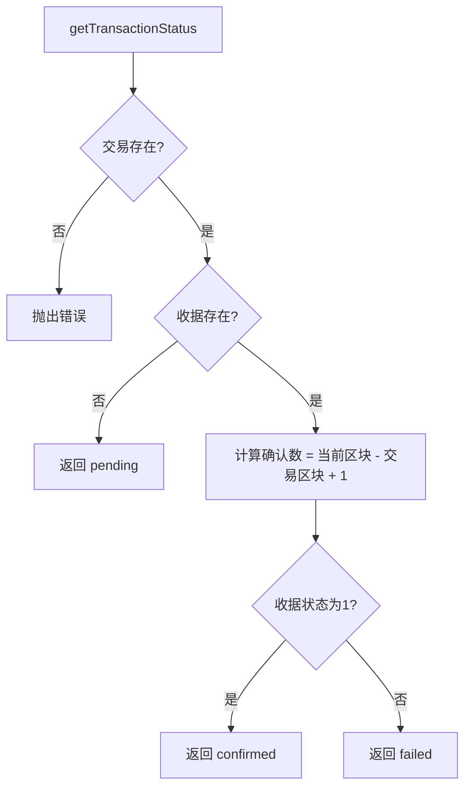
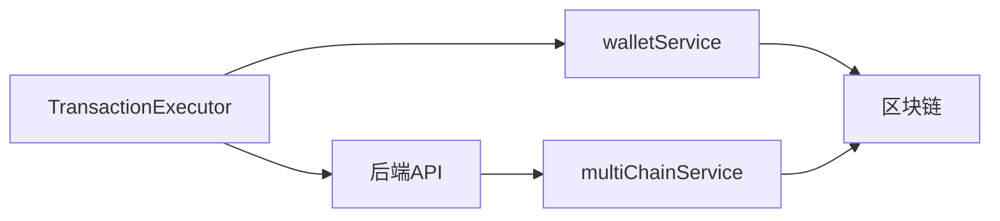

# 交易状态回调

<cite>
**本文档引用的文件**  
- [TransactionExecutor.tsx](file://src/components/Blockchain/TransactionExecutor.tsx)
- [transactionService.ts](file://src/services/transactionService.ts)
- [walletService.ts](file://src/services/walletService.ts)
- [transaction.ts](file://backend/src/routes/transaction.ts)
</cite>

## 目录
1. [简介](#简介)
2. [项目结构](#项目结构)
3. [核心组件](#核心组件)
4. [架构概览](#架构概览)
5. [详细组件分析](#详细组件分析)
6. [依赖分析](#依赖分析)
7. [性能考虑](#性能考虑)
8. [故障排除指南](#故障排除指南)
9. [结论](#结论)

## 简介
本文档详细描述了交易状态回调机制的实现，重点阐述在交易状态变更（如 pending、confirmed、failed）时的事件处理流程。文档涵盖前端与后端之间的状态同步机制，包括通过 Webhook 或消息队列进行通知、WebSocket 事件推送、错误重试策略以及区块链交易确认监听器的实现。此外，还提供了前端实时更新交易进度条的代码示例和用户体验最佳实践。

## 项目结构
项目采用前后端分离架构，前端位于 `src/` 目录，后端位于 `backend/src/` 目录。前端使用 React 和 Next.js 构建用户界面，关键交易逻辑由 `TransactionExecutor` 组件处理。后端使用 Express 提供 REST API 接口，交易状态管理由 `transactionService` 和 `walletService` 协同完成。



**图示来源**  
- [TransactionExecutor.tsx](file://src/components/Blockchain/TransactionExecutor.tsx#L1-L388)
- [walletService.ts](file://src/services/walletService.ts#L1-L200)
- [transactionService.ts](file://src/services/transactionService.ts#L1-L392)
- [transaction.ts](file://backend/src/routes/transaction.ts#L1-L313)

**本节来源**  
- [src/components/Blockchain/TransactionExecutor.tsx](file://src/components/Blockchain/TransactionExecutor.tsx)
- [src/services/walletService.ts](file://src/services/walletService.ts)
- [backend/src/routes/transaction.ts](file://backend/src/routes/transaction.ts)

## 核心组件
系统的核心组件包括 `TransactionExecutor`（前端交易执行器）、`walletService`（钱包服务）、`transactionService`（交易服务）和后端 `transaction` 路由。这些组件共同协作，实现从用户发起交易到区块链确认的完整生命周期管理。

**本节来源**  
- [TransactionExecutor.tsx](file://src/components/Blockchain/TransactionExecutor.tsx#L22-L388)
- [walletService.ts](file://src/services/walletService.ts#L116-L186)
- [transactionService.ts](file://src/services/transactionService.ts#L26-L32)

## 架构概览
整个交易状态回调机制基于事件驱动架构。前端通过 `TransactionExecutor` 发起交易，调用 `walletService` 与区块链交互，获取交易哈希后进入 `pending` 状态。后端通过轮询或事件监听机制监控交易确认数，并通过 WebSocket 或轮询方式将状态更新推送给前端，最终实现 `confirmed` 或 `failed` 状态的同步。



**图示来源**  
- [TransactionExecutor.tsx](file://src/components/Blockchain/TransactionExecutor.tsx#L22-L388)
- [walletService.ts](file://src/services/walletService.ts#L116-L186)
- [transaction.ts](file://backend/src/routes/transaction.ts#L1-L313)

## 详细组件分析

### TransactionExecutor 分析
`TransactionExecutor` 是用户交互的核心组件，实现了多步骤交易执行流程。它通过 `TransactionStep` 接口定义了六个标准步骤：验证参数、检查余额、计算Gas、发起交易、等待确认和完成交易。每个步骤的状态（pending、processing、completed、failed）被实时更新并反映在UI进度条上。

```mermaid
classDiagram
class TransactionStep {
+id : number
+title : string
+status : 'pending' | 'processing' | 'completed' | 'failed'
+description : string
+txHash? : string
}
class TransactionExecutor {
-isExecuting : boolean
-transaction : TransactionResult | null
-steps : TransactionStep[]
-currentStep : number
-formData : {to, amount, token}
+executeTransaction() : Promise~void~
+updateStep(stepId, status, txHash) : void
+resetTransaction() : void
}
TransactionExecutor --> TransactionStep : 包含多个
```

**图示来源**  
- [TransactionExecutor.tsx](file://src/components/Blockchain/TransactionExecutor.tsx#L14-L20)
- [TransactionExecutor.tsx](file://src/components/Blockchain/TransactionExecutor.tsx#L22-L388)

### 钱包服务分析
`walletService` 负责与区块链网络直接交互。`transferStablecoin` 方法用于发起交易，返回包含交易哈希的 `TransactionResult` 对象，初始状态为 `pending`。`getTransactionStatus` 方法通过查询交易收据来确定交易状态，若收据存在且 `status === 1`，则状态为 `confirmed`，否则为 `failed`。



**图示来源**  
- [walletService.ts](file://src/services/walletService.ts#L151-L186)

**本节来源**  
- [walletService.ts](file://src/services/walletService.ts#L116-L186)

### 后端交易路由分析
后端 `transaction.ts` 路由处理交易的创建、执行、查询和取消。`POST /:transactionId/execute` 接口调用 `multiChainService` 执行跨链交易，并根据执行结果更新交易状态为 `completed` 或 `failed`，同时记录交易哈希、Gas使用量等信息。

**本节来源**  
- [transaction.ts](file://backend/src/routes/transaction.ts#L1-L313)

## 依赖分析
系统各组件之间存在明确的依赖关系。前端 `TransactionExecutor` 依赖 `walletService` 进行区块链交互，并通过 HTTP 请求与后端 `transaction` 路由通信。后端 `transaction` 路由依赖 `multiChainService` 执行实际的链上操作。这种分层设计确保了职责分离和可维护性。



**图示来源**  
- [TransactionExecutor.tsx](file://src/components/Blockchain/TransactionExecutor.tsx#L22-L388)
- [transaction.ts](file://backend/src/routes/transaction.ts#L1-L313)

**本节来源**  
- [TransactionExecutor.tsx](file://src/components/Blockchain/TransactionExecutor.tsx#L22-L388)
- [transaction.ts](file://backend/src/routes/transaction.ts#L1-L313)

## 性能考虑
- **前端性能**：`TransactionExecutor` 使用 `useCallback` 优化函数引用，避免不必要的重新渲染。
- **网络延迟**：交易状态轮询间隔需合理设置，避免过于频繁的请求。
- **区块链确认**：`getTransactionStatus` 的调用频率应根据网络拥堵情况动态调整。
- **错误重试**：在 `executeTransaction` 中，捕获错误后更新当前步骤状态为 `failed`，但未实现自动重试机制，建议在生产环境中添加指数退避重试策略。

## 故障排除指南
- **交易参数无效**：检查 `formData` 是否包含 `to` 地址和 `amount`。
- **余额不足**：调用 `getStablecoinBalances` 确认钱包余额。
- **交易未找到**：确保 `getTransactionStatus` 使用正确的交易哈希。
- **状态未更新**：检查后端 `/api/wallet/transaction` 接口是否成功接收并处理了交易记录请求。
- **WebSocket 连接失败**：确保后端已实现 WebSocket 服务并正确配置了 CORS。

**本节来源**  
- [TransactionExecutor.tsx](file://src/components/Blockchain/TransactionExecutor.tsx#L22-L388)
- [walletService.ts](file://src/services/walletService.ts#L151-L186)

## 结论
本文档全面解析了交易状态回调机制的实现细节。通过 `TransactionExecutor` 组件的多步骤状态管理、`walletService` 的区块链状态查询以及后端 API 的持久化记录，系统实现了从用户操作到链上确认的完整闭环。未来可进一步优化错误重试机制和 WebSocket 实时推送，以提升用户体验和系统可靠性。