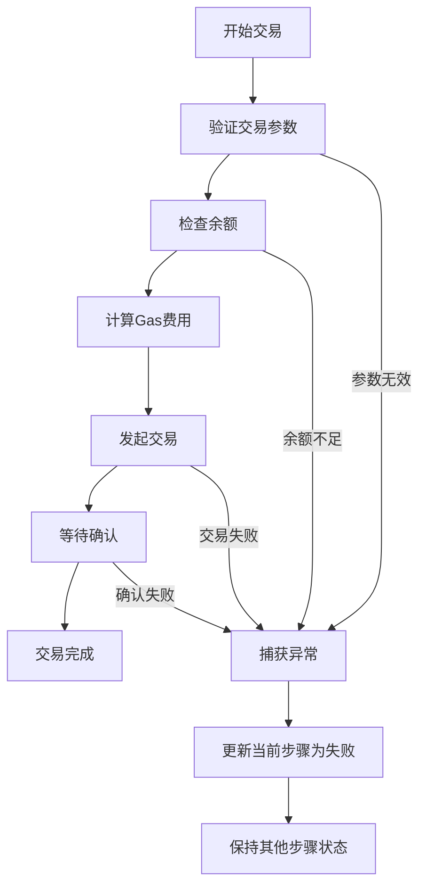
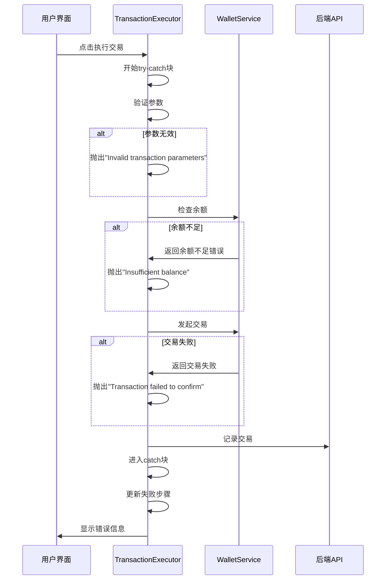
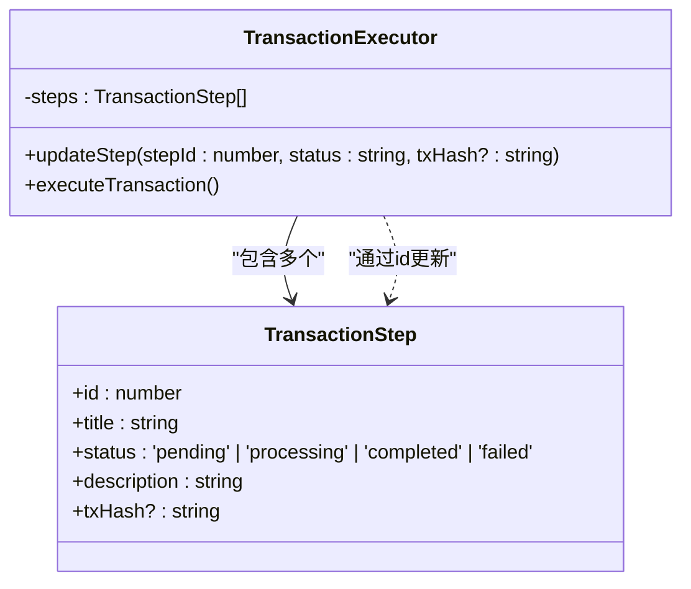
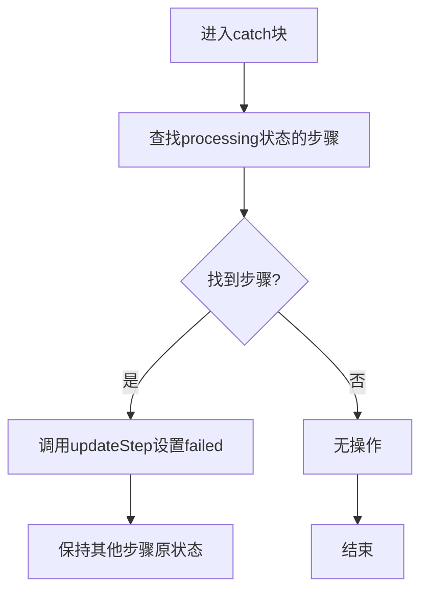
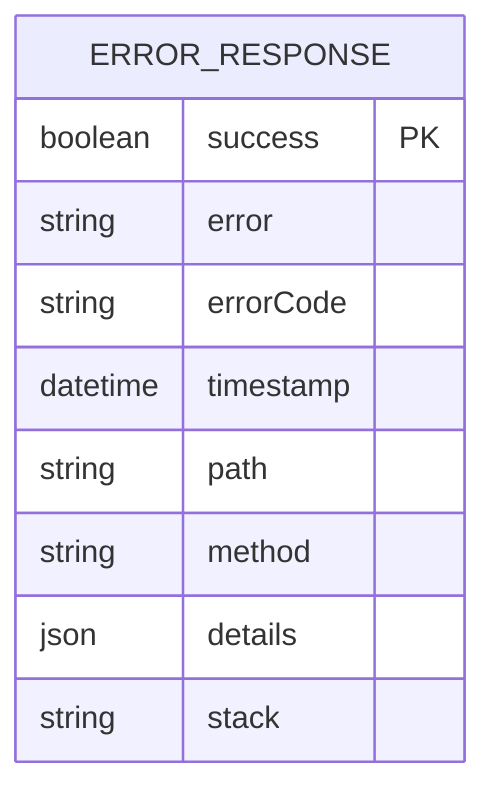
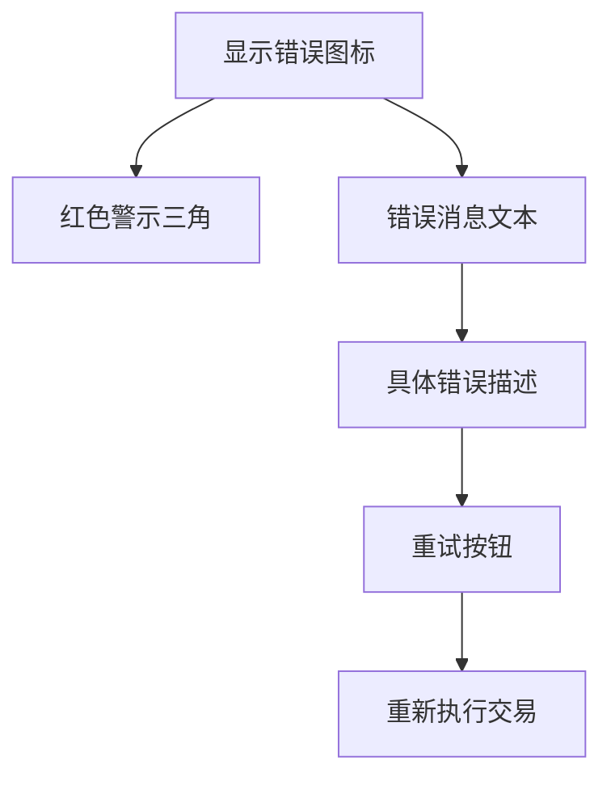
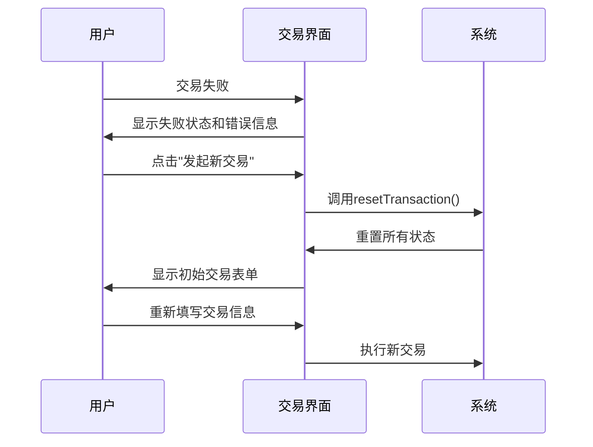

# 错误处理与重试策略

<cite>
**本文档引用的文件**   
- [TransactionExecutor.tsx](file://src/components/Blockchain/TransactionExecutor.tsx)
- [errorHandler.ts](file://backend/src/middleware/errorHandler.ts)
- [transaction.ts](file://backend/src/routes/transaction.ts)
- [transactionService.ts](file://src/services/transactionService.ts)
- [multiChainService.ts](file://backend/src/services/multiChainService.ts)
</cite>

## 目录
1. [简介](#简介)
2. [核心组件分析](#核心组件分析)
3. [交易执行中的错误处理机制](#交易执行中的错误处理机制)
4. [步骤状态管理](#步骤状态管理)
5. [后端API错误响应格式](#后端api错误响应格式)
6. [前端错误提示最佳实践](#前端错误提示最佳实践)
7. [重试策略实现](#重试策略实现)
8. [结论](#结论)

## 简介
本文档详细说明了交易回调机制中的错误处理与重试策略，重点分析了TransactionExecutor组件如何捕获交易执行过程中的异常情况（如无效参数、余额不足等），并描述了在交易失败时如何通过updateStep函数更新当前步骤状态为'failed'，同时保持其他步骤状态不变。此外，文档还涵盖了后端在创建、执行和查询交易时的标准化错误响应格式，以及前端用户友好的错误提示和重试按钮的最佳实践。

## 核心组件分析

### TransactionExecutor组件结构
TransactionExecutor组件是交易执行的核心UI组件，负责管理交易流程的各个步骤、状态更新和用户交互。



**Diagram sources**
- [TransactionExecutor.tsx](file://src/components/Blockchain/TransactionExecutor.tsx#L22-L388)

**Section sources**
- [TransactionExecutor.tsx](file://src/components/Blockchain/TransactionExecutor.tsx#L22-L388)

## 交易执行中的错误处理机制

### try-catch异常捕获
TransactionExecutor组件使用try-catch块来捕获交易执行过程中的所有异常，确保程序不会因未处理的错误而崩溃。



**Diagram sources**
- [TransactionExecutor.tsx](file://src/components/Blockchain/TransactionExecutor.tsx#L22-L388)
- [walletService.ts](file://src/services/walletService.ts#L1-L100)

**Section sources**
- [TransactionExecutor.tsx](file://src/components/Blockchain/TransactionExecutor.tsx#L22-L388)

### 异常类型分析
系统定义了多种特定的异常类型来区分不同的错误场景：

| 异常类型 | 触发条件 | 错误消息 |
|---------|--------|--------|
| Invalid transaction parameters | 缺少接收地址或转账金额 | "Invalid transaction parameters" |
| Insufficient balance | 钱包余额不足 | "Insufficient balance" |
| Transaction failed to confirm | 交易未获得区块链确认 | "Transaction failed to confirm" |

**Section sources**
- [TransactionExecutor.tsx](file://src/components/Blockchain/TransactionExecutor.tsx#L22-L388)

## 步骤状态管理

### updateStep函数实现
updateStep函数用于更新特定步骤的状态，确保在交易失败时只将当前处理的步骤标记为'failed'，而其他已完成的步骤保持'completed'状态。



**Diagram sources**
- [TransactionExecutor.tsx](file://src/components/Blockchain/TransactionExecutor.tsx#L22-L388)

**Section sources**
- [TransactionExecutor.tsx](file://src/components/Blockchain/TransactionExecutor.tsx#L22-L388)

### 状态更新逻辑
当捕获到异常时，系统会查找当前正在处理的步骤并将其状态更新为'failed'：



**Section sources**
- [TransactionExecutor.tsx](file://src/components/Blockchain/TransactionExecutor.tsx#L22-L388)

## 后端API错误响应格式

### 标准化错误响应结构
后端采用统一的错误响应格式，包含成功标志、错误消息、错误代码、时间戳和请求路径等信息。



**Diagram sources**
- [errorHandler.ts](file://backend/src/middleware/errorHandler.ts#L1-L175)

**Section sources**
- [errorHandler.ts](file://backend/src/middleware/errorHandler.ts#L1-L175)

### HTTP状态码映射
后端根据不同的错误类型返回相应的HTTP状态码：

| HTTP状态码 | 错误类型 | 场景示例 |
|-----------|--------|--------|
| 400 | 参数缺失或验证失败 | 创建交易时缺少必要参数 |
| 401 | 未授权访问 | 用户未登录或token失效 |
| 403 | 权限不足 | 用户尝试访问他人交易记录 |
| 404 | 资源未找到 | 查询不存在的交易ID |
| 409 | 资源冲突 | 重复提交同一交易 |
| 429 | 请求频率超限 | 短时间内发送过多请求 |
| 500 | 服务器内部错误 | 后端处理异常 |

**Section sources**
- [errorHandler.ts](file://backend/src/middleware/errorHandler.ts#L1-L175)
- [transaction.ts](file://backend/src/routes/transaction.ts#L1-L313)

### 具体API错误示例
#### 创建交易错误响应
```json
{
  "success": false,
  "error": "缺少必要的交易参数",
  "errorCode": "VALIDATION_ERROR",
  "timestamp": "2024-01-01T00:00:00.000Z",
  "path": "/api/transactions",
  "method": "POST"
}
```

#### 未授权访问错误响应
```json
{
  "success": false,
  "error": "未授权访问",
  "errorCode": "UNAUTHORIZED",
  "timestamp": "2024-01-01T00:00:00.000Z",
  "path": "/api/transactions",
  "method": "GET"
}
```

#### 服务器内部错误响应
```json
{
  "success": false,
  "error": "服务器内部错误",
  "errorCode": "INTERNAL_SERVER_ERROR",
  "timestamp": "2024-01-01T00:00:00.000Z",
  "path": "/api/transactions/123",
  "method": "POST"
}
```

**Section sources**
- [transaction.ts](file://backend/src/routes/transaction.ts#L1-L313)

## 前端错误提示最佳实践

### 用户友好的错误消息
前端应将技术性错误消息转换为用户易于理解的语言：

| 技术错误 | 用户友好消息 |
|--------|------------|
| "Invalid transaction parameters" | "请填写完整的交易信息，包括接收地址和转账金额" |
| "Insufficient balance" | "您的钱包余额不足，请检查DAI或USDC余额" |
| "Transaction failed to confirm" | "交易确认失败，请检查网络状态后重试" |

**Section sources**
- [TransactionExecutor.tsx](file://src/components/Blockchain/TransactionExecutor.tsx#L22-L388)

### 错误提示UI设计


**Section sources**
- [TransactionExecutor.tsx](file://src/components/Blockchain/TransactionExecutor.tsx#L22-L388)

## 重试策略实现

### 重试按钮功能
TransactionExecutor组件提供"发起新交易"按钮，允许用户在交易失败后重新开始交易流程。



**Diagram sources**
- [TransactionExecutor.tsx](file://src/components/Blockchain/TransactionExecutor.tsx#L22-L388)

**Section sources**
- [TransactionExecutor.tsx](file://src/components/Blockchain/TransactionExecutor.tsx#L22-L388)

### 状态重置逻辑
resetTransaction函数负责将所有交易相关状态重置为初始值：

```typescript
const resetTransaction = () => {
  setTransaction(null)
  setSteps([])
  setCurrentStep(0)
  setFormData({ to: '', amount: '', token: 'DAI' })
}
```

**Section sources**
- [TransactionExecutor.tsx](file://src/components/Blockchain/TransactionExecutor.tsx#L22-L388)

## 结论
本文档全面分析了交易回调机制中的错误处理与重试策略。TransactionExecutor组件通过try-catch块有效捕获交易执行过程中的各种异常，包括参数验证失败和余额不足等情况。当交易失败时，系统通过updateStep函数精确地将当前步骤状态设置为'failed'，同时保持其他已完成步骤的状态不变，确保了交易进度的准确反映。后端API采用标准化的错误响应格式，针对不同场景返回相应的HTTP状态码和用户友好的错误消息。前端实现了最佳的错误提示实践，将技术性错误转换为用户易于理解的语言，并提供清晰的重试按钮，使用户能够轻松地重新发起交易。这一完整的错误处理与重试机制确保了系统的健壮性和用户体验的流畅性。