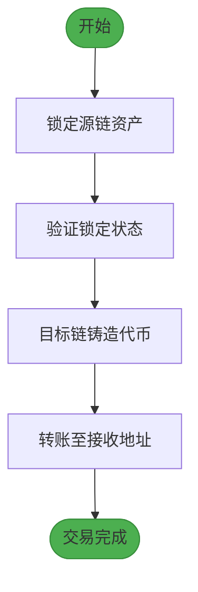
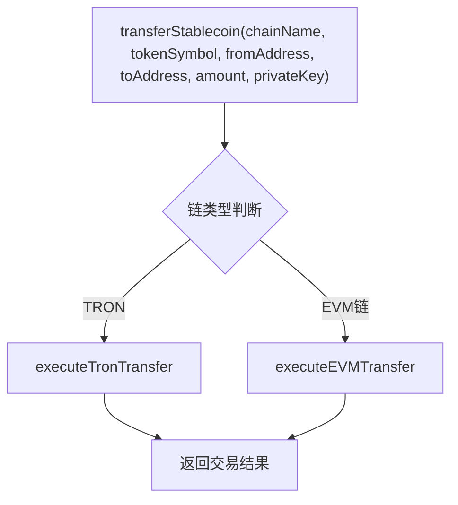
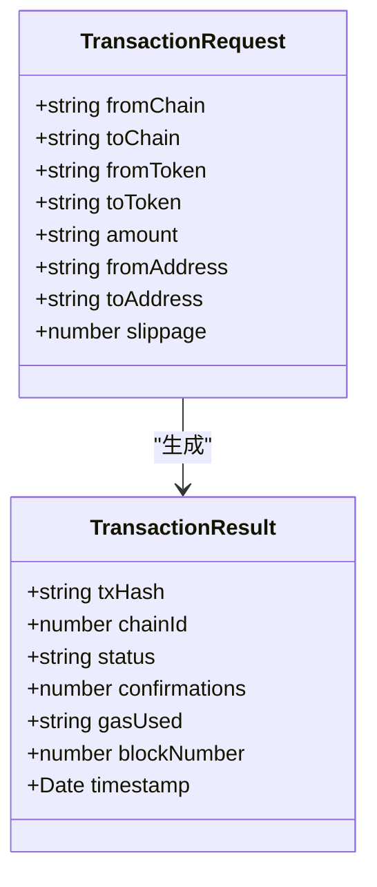
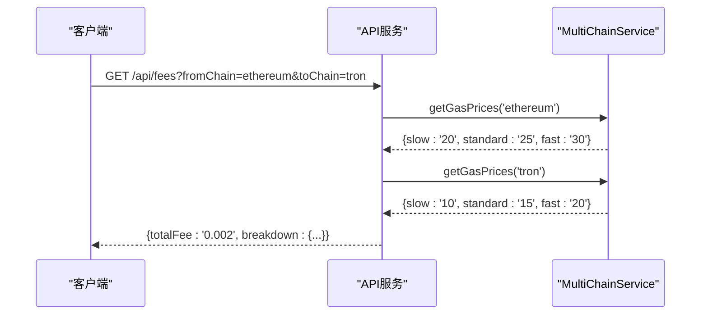
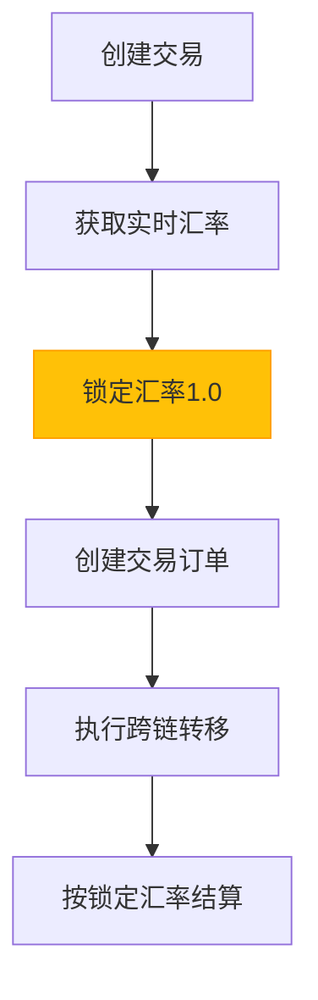
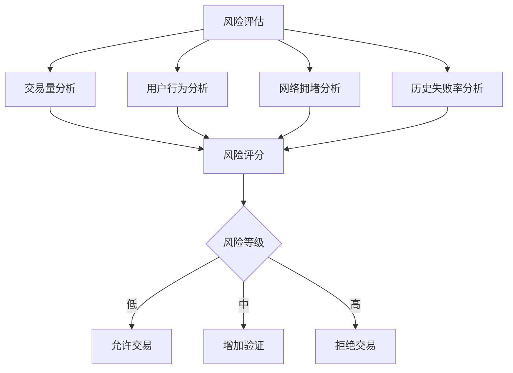
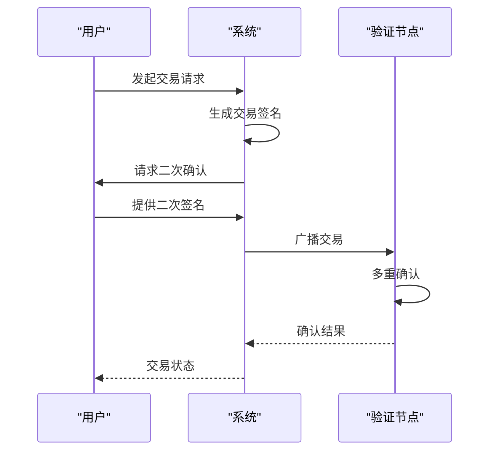
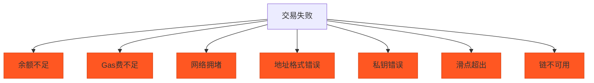
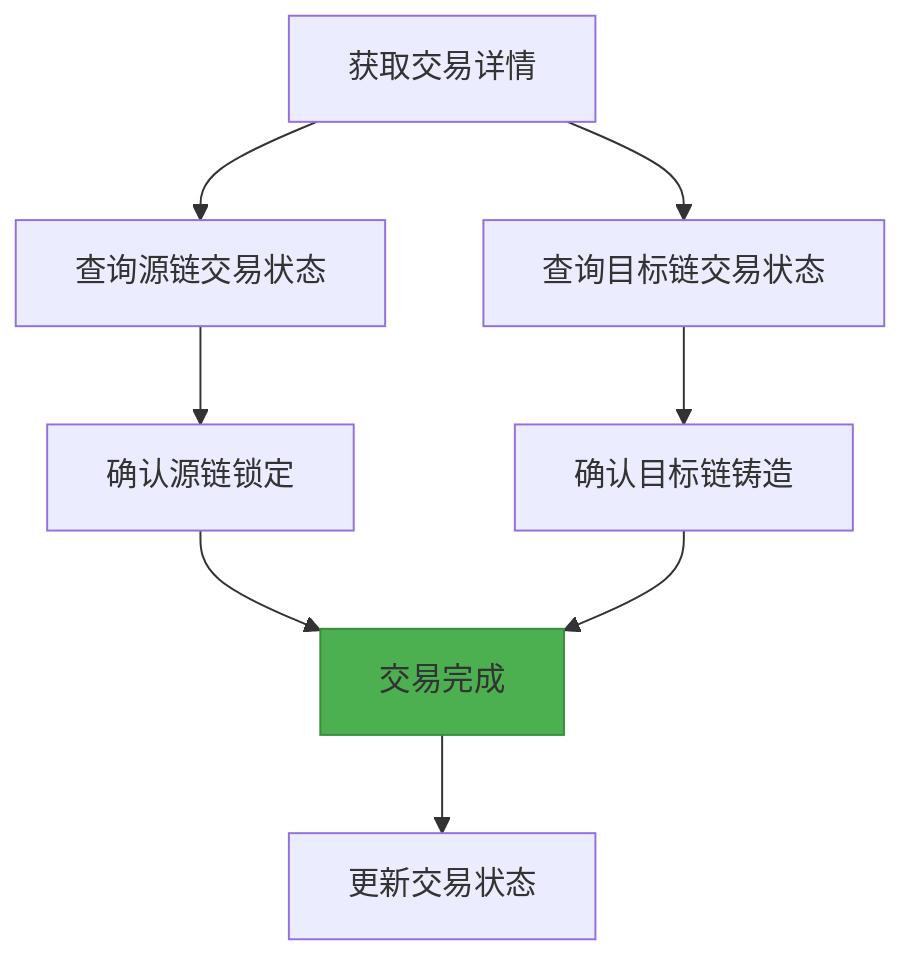

# 跨链交易

<cite>
**本文档引用的文件**  
- [multiChainService.ts](file://backend/src/services/multiChainService.ts)
- [transaction.ts](file://backend/src/routes/transaction.ts)
- [settlement.ts](file://backend/src/routes/settlement.ts)
- [transactionService.ts](file://src/services/transactionService.ts)
- [BlockchainService.ts](file://backend/src/services/BlockchainService.ts)
</cite>

## 目录
1. [简介](#简介)
2. [跨链交易流程](#跨链交易流程)
3. [核心功能实现](#核心功能实现)
4. [跨链费用估算与汇率锁定](#跨链费用估算与汇率锁定)
5. [风险评估与安全验证](#风险评估与安全验证)
6. [交易失败与恢复策略](#交易失败与恢复策略)
7. [交易状态验证](#交易状态验证)
8. [结论](#结论)

## 简介

跨链交易功能允许用户在不同区块链网络之间安全、高效地转移稳定币资产。本系统支持以太坊（Ethereum）、波场（TRON）和币安智能链（BSC）三大主流网络，提供USDT、USDC、DAI、BUSD等多种稳定币的跨链转移服务。系统通过多链服务层抽象不同区块链的技术差异，为用户提供统一的跨链交易接口。

**Section sources**
- [multiChainService.ts](file://backend/src/services/multiChainService.ts#L1-L50)

## 跨链交易流程

跨链交易采用四步清算流程，确保资产在源链锁定后才在目标链铸造，保障资产安全：

1. **锁定源链资产**：在源链上锁定用户指定数量的稳定币
2. **验证锁定状态**：确认源链资产已成功锁定
3. **目标链铸造代币**：在目标链上铸造等量的对应稳定币
4. **转账至接收地址**：将铸造的代币转账到用户指定的目标地址

**Diagram sources**
- [settlement.ts](file://backend/src/routes/settlement.ts#L33-L80)
- [settlement.ts](file://backend/src/routes/settlement.ts#L190-L234)

**Section sources**
- [settlement.ts](file://backend/src/routes/settlement.ts#L33-L80)
- [settlement.ts](file://backend/src/routes/settlement.ts#L190-L234)

## 核心功能实现

### MultiChainService.transferStablecoin方法

`transferStablecoin`方法是跨链交易的核心实现，负责处理不同区块链间的协议差异和代币标准转换。该方法根据目标链的类型选择相应的执行逻辑：

**Diagram sources**
- [multiChainService.ts](file://backend/src/services/multiChainService.ts#L280-L350)

**Section sources**
- [multiChainService.ts](file://backend/src/services/multiChainService.ts#L280-L350)

### 跨链参数说明

跨链交易特有的参数包括：

- **fromChain**: 源区块链网络（ethereum、tron、bsc）
- **toChain**: 目标区块链网络（ethereum、tron、bsc）
- **fromToken**: 源链代币符号（USDT、USDC、DAI、BUSD）
- **toToken**: 目标链代币符号（USDT、USDC、DAI、BUSD）
- **slippage**: 价格滑点容忍度（默认0.5%）
- **gasFeeStrategy**: Gas费策略（slow、standard、fast）

**Diagram sources**
- [multiChainService.ts](file://backend/src/services/multiChainService.ts#L15-L45)
- [transaction.ts](file://backend/src/routes/transaction.ts#L10-L50)

**Section sources**
- [multiChainService.ts](file://backend/src/services/multiChainService.ts#L15-L45)
- [transaction.ts](file://backend/src/routes/transaction.ts#L10-L50)

## 跨链费用估算与汇率锁定

### 跨链费用估算API

系统提供跨链费用估算功能，根据当前网络状况计算交易费用：

**Diagram sources**
- [multiChainService.ts](file://backend/src/services/multiChainService.ts#L400-L435)
- [BlockchainService.ts](file://backend/src/services/BlockchainService.ts#L250-L280)

**Section sources**
- [multiChainService.ts](file://backend/src/services/multiChainService.ts#L400-L435)
- [BlockchainService.ts](file://backend/src/services/BlockchainService.ts#L250-L280)

### 汇率锁定机制

系统在交易创建时锁定汇率，防止价格波动影响交易结果：

**Diagram sources**
- [settlement.ts](file://backend/src/routes/settlement.ts#L33-L80)
- [transactionService.ts](file://src/services/transactionService.ts#L108-L150)

**Section sources**
- [settlement.ts](file://backend/src/routes/settlement.ts#L33-L80)
- [transactionService.ts](file://src/services/transactionService.ts#L108-L150)

## 风险评估与安全验证

### 风险评估流程

系统在交易执行前进行多维度风险评估：

**Diagram sources**
- [transactionService.ts](file://src/services/transactionService.ts#L198-L235)
- [transactionService.ts](file://src/services/transactionService.ts#L237-L273)

**Section sources**
- [transactionService.ts](file://src/services/transactionService.ts#L198-L235)
- [transactionService.ts](file://src/services/transactionService.ts#L237-L273)

### 安全验证措施

系统采用双重签名和多重确认机制确保交易安全：

**Diagram sources**
- [multiChainService.ts](file://backend/src/services/multiChainService.ts#L280-L350)
- [transaction.ts](file://backend/src/routes/transaction.ts#L100-L150)

**Section sources**
- [multiChainService.ts](file://backend/src/services/multiChainService.ts#L280-L350)
- [transaction.ts](file://backend/src/routes/transaction.ts#L100-L150)

## 交易失败与恢复策略

### 常见失败原因

跨链交易可能因以下原因失败：

**Diagram sources**
- [multiChainService.ts](file://backend/src/services/multiChainService.ts#L280-L350)
- [transactionService.ts](file://src/services/transactionService.ts#L237-L273)

**Section sources**
- [multiChainService.ts](file://backend/src/services/multiChainService.ts#L280-L350)
- [transactionService.ts](file://src/services/transactionService.ts#L237-L273)

### 恢复策略

针对不同失败原因的恢复策略：

| 失败原因 | 恢复策略 |
|---------|---------|
| 余额不足 | 提示用户充值 |
| Gas费不足 | 建议提高Gas费 |
| 网络拥堵 | 建议稍后重试 |
| 地址格式错误 | 验证并修正地址 |
| 私钥错误 | 重新输入私钥 |
| 滑点超出 | 调整滑点设置 |
| 链不可用 | 切换备用链 |

**Section sources**
- [multiChainService.ts](file://backend/src/services/multiChainService.ts#L280-L350)
- [transactionService.ts](file://src/services/transactionService.ts#L237-L273)

## 交易状态验证

用户可通过以下方式验证跨链交易状态：

**Diagram sources**
- [multiChainService.ts](file://backend/src/services/multiChainService.ts#L352-L398)
- [transaction.ts](file://backend/src/routes/transaction.ts#L219-L269)

**Section sources**
- [multiChainService.ts](file://backend/src/services/multiChainService.ts#L352-L398)
- [transaction.ts](file://backend/src/routes/transaction.ts#L219-L269)

## 结论

本跨链交易系统通过MultiChainService实现了以太坊、波场和币安智能链之间的稳定币转移功能。系统采用四步清算流程确保资产安全，通过汇率锁定机制防止价格波动风险，并实施多重安全验证措施。费用估算API可根据网络状况提供准确的费用预估，而完善的风险评估和失败恢复策略则提升了系统的可靠性和用户体验。

**Section sources**
- [multiChainService.ts](file://backend/src/services/multiChainService.ts#L1-L508)
- [settlement.ts](file://backend/src/routes/settlement.ts#L1-L408)
- [transaction.ts](file://backend/src/routes/transaction.ts#L1-L313)