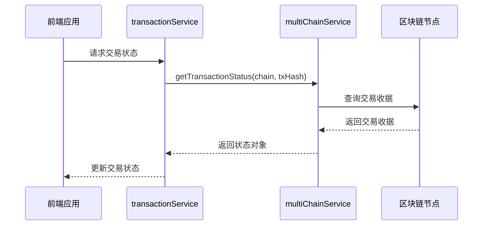
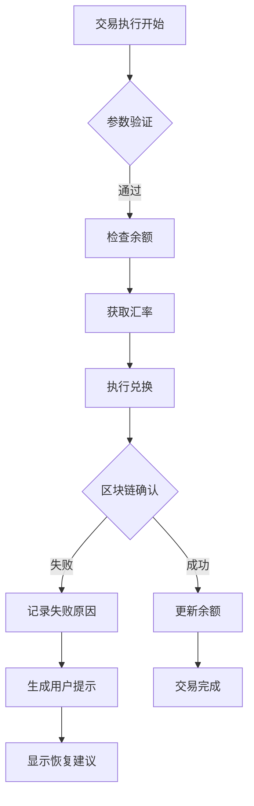
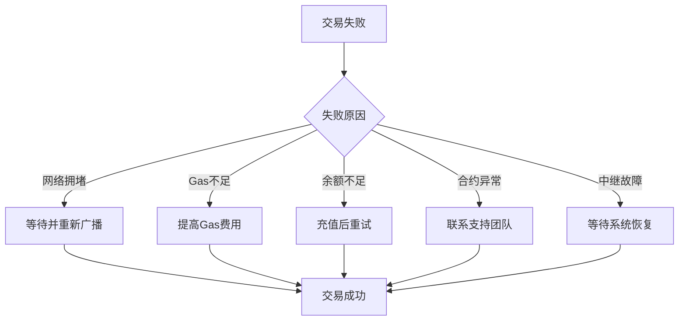

# 跨链交易失败处理与恢复

<cite>
**本文档引用文件**  
- [multiChainService.ts](file://backend/src/services/multiChainService.ts)
- [transactionService.ts](file://src/services/transactionService.ts)
- [blockchain.ts](file://backend/src/routes/blockchain.ts)
- [transaction.ts](file://backend/src/routes/transaction.ts)
- [route.ts](file://src/app/api/wallet/transaction/route.ts)
</cite>

## 目录
1. [引言](#引言)
2. [跨链交易失败原因分析](#跨链交易失败原因分析)
3. [交易状态轮询机制](#交易状态轮询机制)
4. [前端异常处理与用户提示](#前端异常处理与用户提示)
5. [交易恢复策略](#交易恢复策略)
6. [链上追溯与验证](#链上追溯与验证)
7. [结论](#结论)

## 引言
跨链交易作为现代区块链基础设施的核心功能，面临着多种潜在的失败风险。本文件系统性地分析了跨链交易可能失败的原因，包括网络拥堵、Gas不足、余额不足、合约异常和跨链中继故障等。文档详细说明了`multiChainService.getTransactionStatus`如何轮询交易确认状态并识别失败交易，解释了前端`transactionService`如何捕获异常并提供用户友好的错误提示。同时提供了交易恢复策略，并指导开发者如何通过区块链浏览器进行链上追溯。

## 跨链交易失败原因分析

跨链交易可能因多种原因失败，主要包括：

- **网络拥堵**：当目标区块链网络交易量过大时，交易可能长时间无法被打包确认
- **Gas不足**：交易发起方提供的Gas费用不足以覆盖交易执行成本
- **余额不足**：发送地址的原生代币余额不足以支付交易手续费
- **合约异常**：跨链合约执行过程中发生逻辑错误或验证失败
- **跨链中继故障**：负责跨链消息传递的中继节点出现故障或延迟

这些失败原因在`multiChainService`的交易执行和状态检查逻辑中都有相应的处理机制。

**Section sources**
- [multiChainService.ts](file://backend/src/services/multiChainService.ts#L1-L508)

## 交易状态轮询机制

### multiChainService.getTransactionStatus实现

`multiChainService.getTransactionStatus`方法负责轮询交易在目标链上的确认状态。该方法支持EVM兼容链（如以太坊、BSC）和TRON链，通过不同的API接口获取交易状态。

**Diagram sources**
- [multiChainService.ts](file://backend/src/services/multiChainService.ts#L300-L380)

### 状态轮询逻辑

`getTransactionStatus`方法根据链类型调用相应的状态检查函数：
- 对于EVM链，通过`getTransactionReceipt`获取交易收据
- 对于TRON链，通过`getTransactionInfo`获取交易信息

交易状态包括：
- `pending`：交易已广播但未确认
- `confirmed`：交易已成功确认
- `failed`：交易执行失败

系统通过定期轮询这些状态来跟踪交易进展，并在检测到失败状态时触发相应的恢复流程。

**Section sources**
- [multiChainService.ts](file://backend/src/services/multiChainService.ts#L300-L380)

## 前端异常处理与用户提示

### transactionService异常捕获

前端`transactionService`负责捕获交易过程中的各种异常，并将其转换为用户友好的错误提示。当交易执行失败时，系统会记录详细的错误信息并提供相应的恢复建议。

**Diagram sources**
- [transactionService.ts](file://src/services/transactionService.ts#L52-L388)

### 用户友好的错误提示

当交易失败时，系统不会直接显示技术性错误信息，而是提供清晰、可操作的用户提示。例如：
- "交易失败：网络拥堵，请稍后重试"
- "余额不足，请充值后重试"
- "Gas费用不足，请调整后重新提交"

这些提示信息通过`transactionService`的错误处理机制生成，确保用户能够理解问题并采取相应措施。

**Section sources**
- [transactionService.ts](file://src/services/transactionService.ts#L52-L388)

## 交易恢复策略

### 重新广播交易
对于因网络拥堵导致的交易失败，可以采用重新广播策略。系统会保留原始交易数据，并在适当的时机重新提交到网络。

### 调整Gas费用
当交易因Gas不足而卡住时，可以通过提高Gas费用来加速交易确认。系统可以提供Gas价格建议，帮助用户选择合适的费用等级。

### 联系支持团队
对于复杂的跨链问题或合约异常，系统会建议用户联系支持团队进行人工干预。支持团队可以查看详细的交易日志和链上数据，提供专业的解决方案。

**Diagram sources**
- [transactionService.ts](file://src/services/transactionService.ts#L52-L388)
- [multiChainService.ts](file://backend/src/services/multiChainService.ts#L1-L508)

**Section sources**
- [transactionService.ts](file://src/services/transactionService.ts#L52-L388)
- [multiChainService.ts](file://backend/src/services/multiChainService.ts#L1-L508)

## 链上追溯与验证

### 区块链浏览器验证

开发者可以通过主流区块链浏览器验证交易状态：
- **Etherscan**：用于以太坊和BSC网络的交易验证
- **Tronscan**：用于TRON网络的交易验证

系统在交易记录中提供了区块链浏览器的链接，方便用户直接跳转查看详细信息。

### 链上数据追溯

通过交易哈希，开发者可以追溯以下信息：
- 交易执行时间
- 确认区块高度
- Gas使用情况
- 交易状态（成功/失败）
- 事件日志

这些信息对于诊断交易失败原因至关重要，可以帮助确定是网络问题、合约问题还是用户操作问题。

**Section sources**
- [route.ts](file://src/app/api/wallet/transaction/route.ts#L1-L144)
- [blockchain.ts](file://backend/src/routes/blockchain.ts#L1-L294)

## 结论
跨链交易失败是一个复杂的问题，需要从网络层、合约层和应用层多个维度进行分析和处理。通过`multiChainService`的状态轮询机制和`transactionService`的异常处理，系统能够有效识别交易失败并提供相应的恢复策略。开发者应充分利用区块链浏览器进行链上追溯，确保交易的透明性和可验证性。未来可以通过引入更智能的Gas价格预测和自动重试机制，进一步提升跨链交易的成功率。