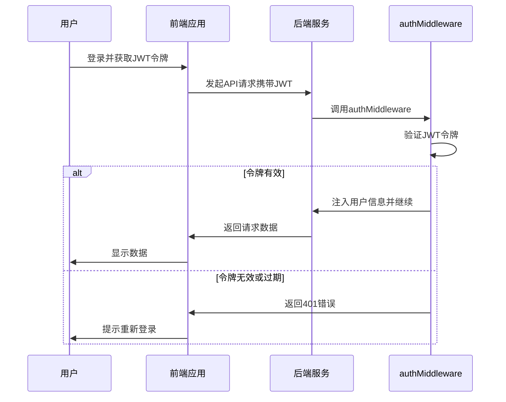
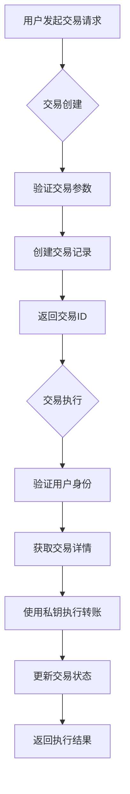
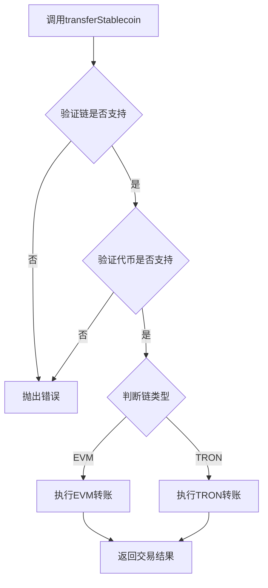
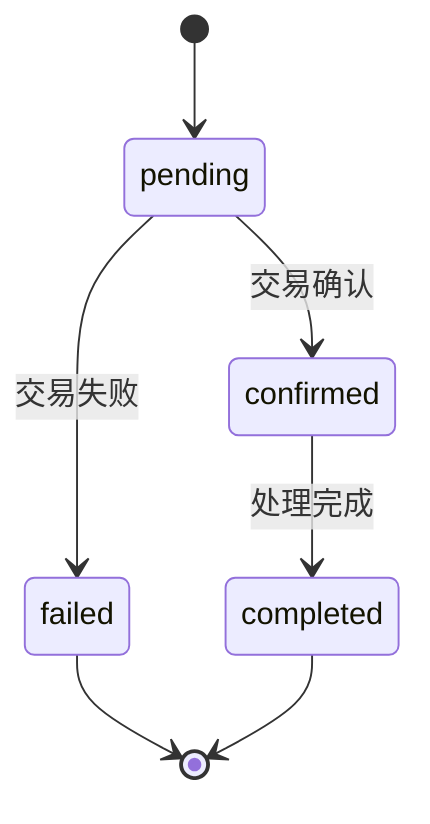

# 跨链交易安全验证

<cite>
**本文档引用的文件**  
- [auth.ts](file://backend/src/middleware/auth.ts)
- [multiChainService.ts](file://backend/src/services/multiChainService.ts)
- [transaction.ts](file://backend/src/routes/transaction.ts)
- [blockchain.ts](file://backend/src/routes/blockchain.ts)
- [database.ts](file://backend/src/services/database.ts)
</cite>

## 目录
1. [引言](#引言)
2. [用户身份认证与授权机制](#用户身份认证与授权机制)
3. [交易创建与执行分离设计](#交易创建与执行分离设计)
4. [multiChainService链与代币合法性校验流程](#multichainservice链与代币合法性校验流程)
5. [交易状态机设计与防重放攻击](#交易状态机设计与防重放攻击)
6. [安全最佳实践建议](#安全最佳实践建议)
7. [结论](#结论)

## 引言
本文档全面阐述了跨链交易平台在交易安全方面的核心保障机制。系统通过JWT身份认证、HTTPS加密传输、双重确认机制等手段确保用户操作的安全性。后端采用auth中间件对所有敏感接口进行访问控制，确保只有经过身份验证的用户才能发起交易。同时，系统采用交易创建与执行分离的设计模式，有效降低私钥暴露风险。multiChainService服务在执行稳定币转账前会对目标链和代币进行合法性校验，确保交易的合规性。此外，系统通过交易状态机设计防止重放攻击和重复执行。本文将详细分析这些安全机制的实现原理，并提供私钥本地签名、交易限额设置、异常行为监控等安全最佳实践建议。

## 用户身份认证与授权机制

系统采用基于JWT（JSON Web Token）的身份认证机制，通过`authMiddleware`中间件实现对API接口的访问控制。当用户发起请求时，中间件会检查请求头中的Authorization字段，验证JWT令牌的有效性。若令牌缺失或格式无效，系统将返回401未授权错误。验证通过后，解码的用户信息（包括userId和email）会被注入到请求对象中，供后续业务逻辑使用。该机制确保了只有经过身份验证的用户才能访问受保护的API端点。

**Diagram sources**
- [auth.ts](file://backend/src/middleware/auth.ts#L10-L58)

**本节来源**
- [auth.ts](file://backend/src/middleware/auth.ts#L10-L58)

## 交易创建与执行分离设计

系统采用交易创建与执行分离的设计模式，以降低私钥暴露风险。在`transaction.ts`路由中，创建交易（POST /）和执行交易（POST /:transactionId/execute）被设计为两个独立的API端点。创建交易时，用户只需提供交易参数，系统会生成交易记录并返回交易ID。执行交易时，用户需要提供交易ID和私钥，系统才会调用`multiChainService.transferStablecoin`执行实际的链上转账。这种分离设计确保私钥仅在执行阶段传输，且不会与交易创建过程耦合，有效防止了私钥的意外泄露。

**Diagram sources**
- [transaction.ts](file://backend/src/routes/transaction.ts#L4-L313)

**本节来源**
- [transaction.ts](file://backend/src/routes/transaction.ts#L4-L313)

## multiChainService链与代币合法性校验流程

`multiChainService`在执行`transferStablecoin`前会进行严格的链和代币合法性校验。首先，服务会通过`chains`映射检查目标链是否受支持。若链不存在，将抛出错误。接着，服务会检查该链上是否支持指定的代币符号。校验通过后，根据链类型（EVM或TRON）调用相应的转账方法。整个流程确保了只有在预定义的合法链和代币组合上才能执行转账，防止了向不支持的网络或代币发送资金的风险。

**Diagram sources**
- [multiChainService.ts](file://backend/src/services/multiChainService.ts#L267-L297)

**本节来源**
- [multiChainService.ts](file://backend/src/services/multiChainService.ts#L267-L297)

## 交易状态机设计与防重放攻击

系统通过交易状态机设计防止重放攻击和重复执行。每个交易都有明确的状态（如pending、confirmed、failed），且状态转换是单向的。在`transaction.ts`中，执行交易前会检查交易状态，只有处于pending状态的交易才能被执行。执行后，状态会更新为completed或failed，防止重复执行。同时，`multiChainService`通过`getTransactionStatus`方法监控交易确认数，确保交易在区块链上得到充分确认，防止双花攻击。

**Diagram sources**
- [transaction.ts](file://backend/src/routes/transaction.ts#L4-L313)
- [multiChainService.ts](file://backend/src/services/multiChainService.ts#L363-L381)

**本节来源**
- [transaction.ts](file://backend/src/routes/transaction.ts#L4-L313)
- [multiChainService.ts](file://backend/src/services/multiChainService.ts#L363-L381)

## 安全最佳实践建议

为确保跨链交易的安全性，建议遵循以下最佳实践：1) 私钥应在用户本地设备签名，避免通过网络传输明文私钥；2) 设置交易限额，对大额交易进行额外验证；3) 实施异常行为监控，如短时间内频繁交易、异常地址转账等，及时发现可疑活动；4) 使用HTTPS加密传输所有敏感数据；5) 定期更新依赖库，修复已知安全漏洞；6) 对数据库中的敏感信息进行加密存储；7) 实施API速率限制，防止暴力破解和DDoS攻击。

**本节来源**
- [auth.ts](file://backend/src/middleware/auth.ts#L10-L58)
- [multiChainService.ts](file://backend/src/services/multiChainService.ts#L267-L297)
- [database.ts](file://backend/src/services/database.ts#L6-L6)

## 结论
本文档详细分析了跨链交易平台的安全保障体系。通过JWT身份认证、交易创建与执行分离、严格的链与代币校验、交易状态机等多重机制，系统构建了纵深防御的安全架构。这些措施有效降低了私钥暴露风险，防止了重放攻击和非法交易。结合私钥本地签名、交易限额、异常监控等最佳实践，平台能够为用户提供安全可靠的跨链交易服务。未来可进一步增强安全措施，如引入多重签名、硬件钱包集成等，持续提升系统的安全防护能力。