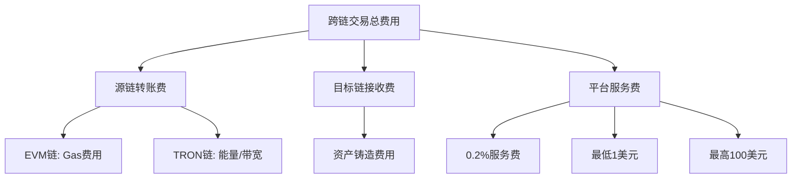
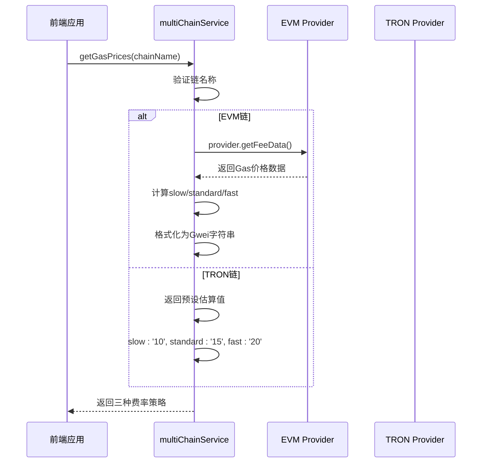
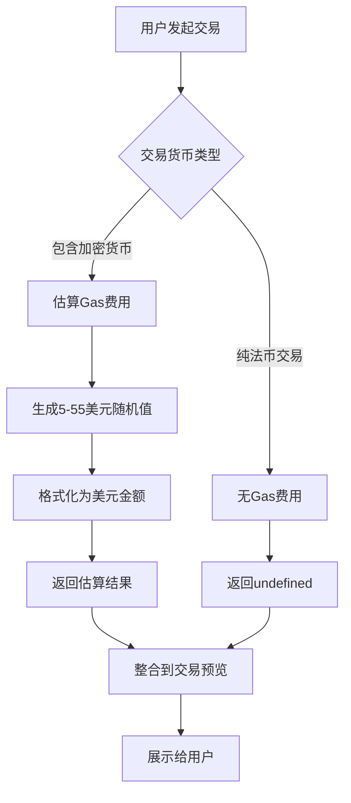
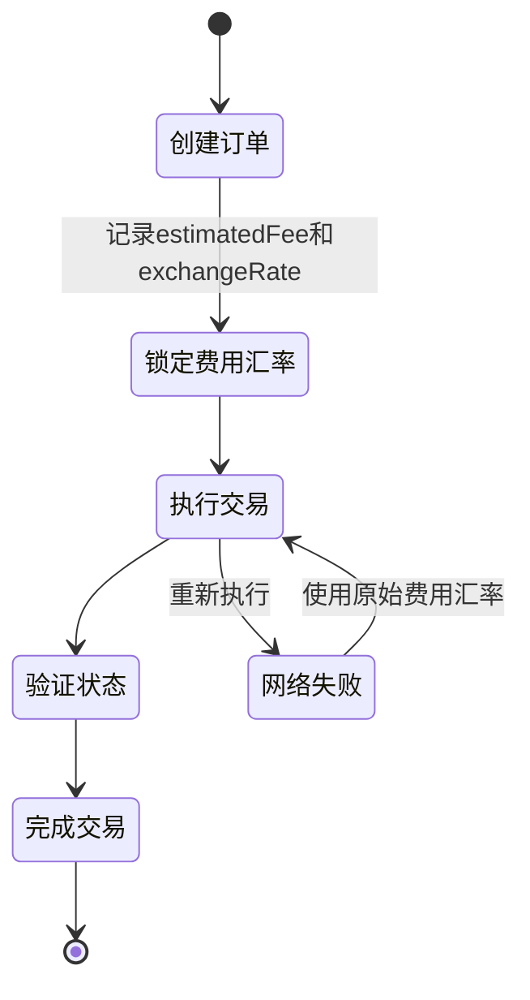
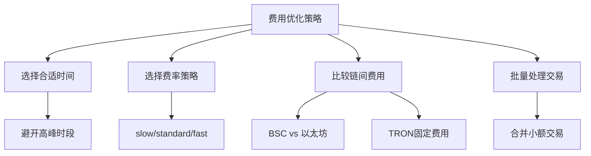

# 跨链交易费用估算

<cite>
**本文档引用的文件**
- [multiChainService.ts](file://backend/src/services/multiChainService.ts)
- [transactionService.ts](file://src/services/transactionService.ts)
- [settlement.ts](file://backend/src/routes/settlement.ts)
- [transaction.ts](file://backend/src/routes/transaction.ts)
</cite>

## 目录
1. [引言](#引言)
2. [跨链交易费用构成](#跨链交易费用构成)
3. [Gas价格获取机制](#gas价格获取机制)
4. [前端费用估算流程](#前端费用估算流程)
5. [费用锁定与汇率保护](#费用锁定与汇率保护)
6. [费用优化建议](#费用优化建议)
7. [结论](#结论)

## 引言
跨链交易费用估算是区块链应用中的核心功能，直接影响用户体验和交易成功率。本文档深入分析跨链桥接系统中的费用计算机制，包括源链转账费、目标链接收费以及平台服务费的构成。重点解析multiChainService.getGasPrices方法如何获取EVM链和TRON链的实时Gas价格，并返回slow、standard、fast三种费率策略。同时说明前端transactionService.estimateGasFee如何根据交易货币类型估算区块链费用，描述费用锁定机制和汇率保护策略，防止交易执行期间价格波动。

## 跨链交易费用构成
跨链交易的总费用由三部分组成：源链转账费、目标链接收费和平台服务费。

源链转账费是指在源区块链上执行交易所需的Gas费用，这取决于网络拥堵程度和交易复杂度。对于EVM兼容链（如以太坊、BSC），Gas费用以Gwei为单位计算；对于TRON链，则以能量和带宽成本估算。

目标链接收费是在目标链上完成资产铸造或转移所需的费用。在跨链结算过程中，当资产从源链锁定后，需要在目标链上铸造等值资产，这一过程也会产生相应的链上费用。

平台服务费是跨链桥接平台收取的运营费用，用于维护系统稳定性和安全性。根据代码分析，平台服务费率为0.2%，设有最低1美元和最高100美元的限制。

**Diagram sources**
- [multiChainService.ts](file://backend/src/services/multiChainService.ts#L450-L507)
- [transactionService.ts](file://src/services/transactionService.ts#L52-L388)

**Section sources**
- [multiChainService.ts](file://backend/src/services/multiChainService.ts#L450-L507)
- [transactionService.ts](file://src/services/transactionService.ts#L52-L388)

## Gas价格获取机制
multiChainService.getGasPrices方法负责获取不同区块链的实时Gas价格，支持EVM链和TRON链两种类型。

对于EVM兼容链（如以太坊、BSC），该方法通过ethers.js库的getFeeData()接口获取基础Gas价格，然后计算三种费率策略：
- slow：基础Gas价格
- standard：基础价格的1.1倍
- fast：基础价格的1.2倍

对于TRON链，由于其采用不同的资源模型（能量和带宽），系统返回预设的估算成本：
- slow：10 TRX
- standard：15 TRX
- fast：20 TRX

该方法首先检查链名称的有效性，然后根据链类型调用相应的Gas价格获取逻辑。如果链不支持或获取失败，会抛出相应错误。返回的Gas价格统一格式化为字符串类型，便于前端展示和计算。

**Diagram sources**
- [multiChainService.ts](file://backend/src/services/multiChainService.ts#L450-L507)

**Section sources**
- [multiChainService.ts](file://backend/src/services/multiChainService.ts#L450-L507)

## 前端费用估算流程
前端通过transactionService.estimateGasFee方法根据交易货币类型估算区块链费用。该方法首先定义加密货币列表，包括ETH、USDT、USDC和BTC等主流数字货币。

当交易涉及这些加密货币时（无论是作为源货币还是目标货币），系统会估算5-55美元范围内的Gas费用。具体计算采用Math.random() * 50 + 5的公式，确保最低5美元的估算值。对于法币之间的交易（如USD到CNY），则不产生区块链Gas费用，返回undefined。

该估算方法在交易预览阶段被调用，作为transactionService.getTransactionPreview流程的一部分。用户在输入交易金额后，系统立即调用此方法提供费用估算，帮助用户决策。估算结果包含在交易预览对象中，与其他信息（如汇率、处理时间）一同展示给用户。

**Diagram sources**
- [transactionService.ts](file://src/services/transactionService.ts#L52-L388)

**Section sources**
- [transactionService.ts](file://src/services/transactionService.ts#L52-L388)

## 费用锁定与汇率保护
系统采用费用锁定机制和汇率保护策略来防止交易执行期间的价格波动。当用户创建交易时，系统立即锁定各项费用和汇率，确保执行时不会发生变化。

在settlement.ts路由中，创建清算订单时会记录estimatedFee（预估费用）和exchangeRate（汇率）。这些值在订单生命周期内保持不变，即使市场条件发生变化。订单还包含expiresAt字段，设置30分钟过期时间，确保在合理时间内完成交易。

跨链结算流程分为四个步骤：锁定源链代币、验证锁定状态、在目标链铸造代币、转账到目标地址。每个步骤的状态变化都会被记录，但费用和汇率保持不变。如果交易因网络问题需要重新执行，系统仍使用原始锁定的费用和汇率，保护用户免受市场波动影响。

**Diagram sources**
- [settlement.ts](file://backend/src/routes/settlement.ts#L33-L80)
- [transaction.ts](file://backend/src/routes/transaction.ts#L0-L53)

**Section sources**
- [settlement.ts](file://backend/src/routes/settlement.ts#L33-L80)
- [transaction.ts](file://backend/src/routes/transaction.ts#L0-L53)

## 费用优化建议
为了优化跨链交易费用，建议用户采取以下策略：

选择合适的时间窗口发起交易。区块链网络的Gas价格随时间波动，通常在工作日的亚洲时段（UTC+8）网络较为空闲，Gas价格较低。避免在欧美工作时间或重大加密货币事件期间进行交易。

根据交易紧急程度选择费率策略。对于非紧急交易，可选择"slow"策略以节省费用；对于需要快速确认的交易，选择"fast"策略。系统提供的三种费率策略为用户提供了灵活的选择空间。

监控不同链的费用差异。BSC链通常比以太坊链费用更低，TRON链的固定费用模式在某些情况下更具可预测性。用户可根据当前网络状况选择最优的跨链路径。

批量处理小额交易。由于平台服务费有最低1美元的限制，单笔小额交易的费率占比会较高。建议将多笔小额交易合并为单笔大额交易，以降低总体费率。

**Diagram sources**
- [multiChainService.ts](file://backend/src/services/multiChainService.ts#L450-L507)
- [transactionService.ts](file://src/services/transactionService.ts#L52-L388)

**Section sources**
- [multiChainService.ts](file://backend/src/services/multiChainService.ts#L450-L507)
- [transactionService.ts](file://src/services/transactionService.ts#L52-L388)

## 结论
跨链交易费用估算系统通过multiChainService和transactionService协同工作，实现了精确的费用计算和用户友好的体验。系统不仅考虑了不同区块链的技术特性，还通过费用锁定和汇率保护机制确保了交易的可预测性。用户可以通过选择合适的时间窗口、费率策略和跨链路径来优化交易成本。未来可进一步引入历史数据分析和机器学习模型，提供更智能的费用预测和优化建议。