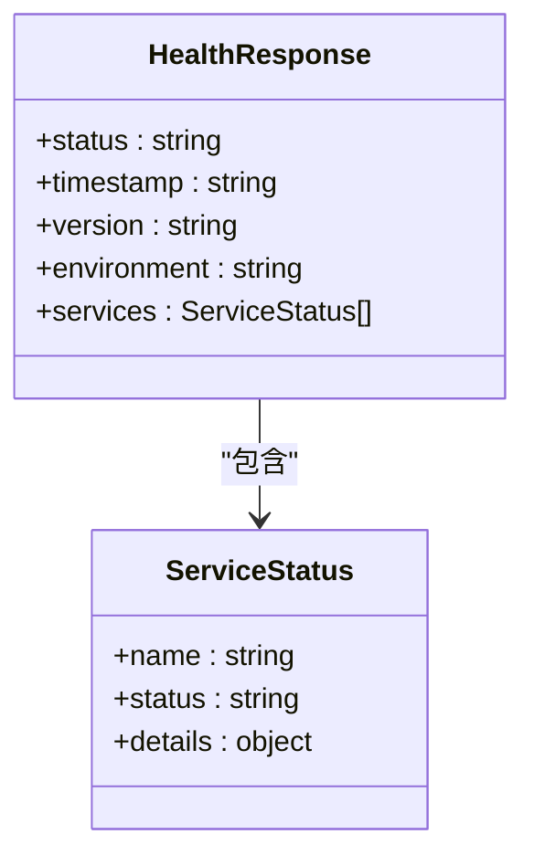
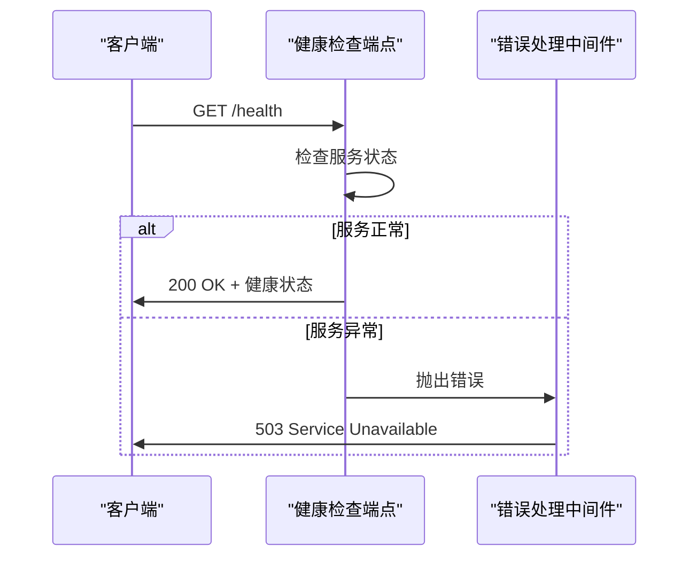
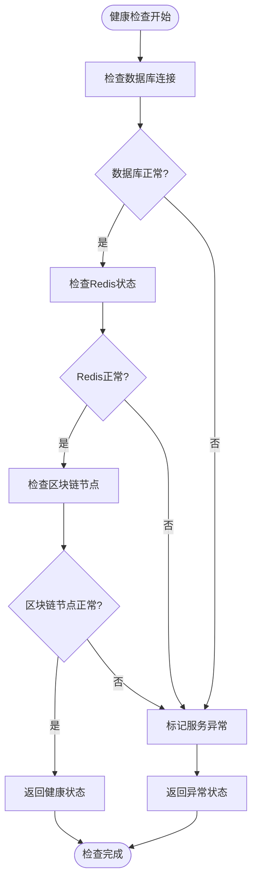
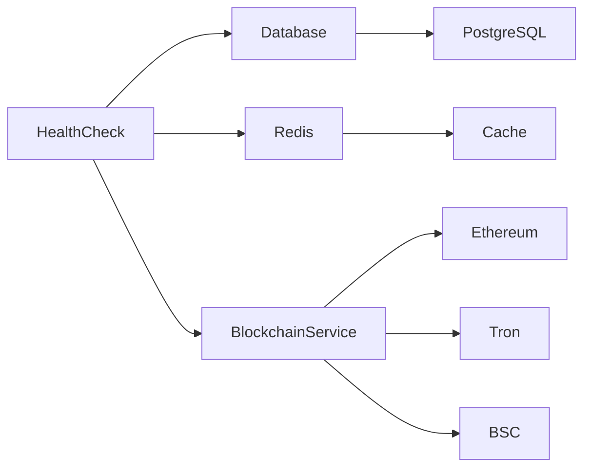

# 健康检查API

<cite>
**本文档中引用的文件**  
- [health.ts](file://pages/api/health.ts)
- [index.ts](file://backend/src/index.ts)
- [errorHandler.ts](file://backend/src/middleware/errorHandler.ts)
- [database.ts](file://backend/src/services/database.ts)
- [redis.ts](file://backend/src/services/redis.ts)
- [BlockchainService.ts](file://backend/src/services/BlockchainService.ts)
</cite>

## 目录
1. [简介](#简介)
2. [项目结构](#项目结构)
3. [核心组件](#核心组件)
4. [架构概述](#架构概述)
5. [详细组件分析](#详细组件分析)
6. [依赖分析](#依赖分析)
7. [性能考虑](#性能考虑)
8. [故障排除指南](#故障排除指南)
9. [结论](#结论)

## 简介
本文件详细说明了TriBridge系统的健康检查API设计与实现。该API用于检测系统可用性，支持负载均衡器和Kubernetes探针集成。文档涵盖GET /api/health端点的响应结构、服务依赖检查、错误处理机制、超时设置、降级策略以及自定义健康指标扩展开发指南。

## 项目结构
系统采用前后端分离架构，健康检查API位于前端和后端两个位置。前端健康检查端点用于Next.js应用状态检测，后端健康检查端点用于Node.js服务状态监控。

```mermaid
graph TD
A[前端] --> B[/api/health]
C[后端] --> D[/health]
B --> E[返回基本健康状态]
D --> F[返回详细服务状态]
```

**Diagram sources**
- [health.ts](file://pages/api/health.ts)
- [index.ts](file://backend/src/index.ts)

**Section sources**
- [health.ts](file://pages/api/health.ts)
- [index.ts](file://backend/src/index.ts)

## 核心组件
健康检查系统由多个核心组件构成，包括前端健康检查端点、后端健康检查路由、数据库服务、Redis缓存服务和区块链服务。这些组件共同协作，提供全面的系统健康状态检测。

**Section sources**
- [index.ts](file://backend/src/index.ts)
- [database.ts](file://backend/src/services/database.ts)
- [redis.ts](file://backend/src/services/redis.ts)
- [BlockchainService.ts](file://backend/src/services/BlockchainService.ts)

## 架构概述
健康检查API采用分层架构设计，从前端到后端形成完整的健康状态检测链路。系统通过定期检查关键依赖服务的状态，确保故障能够被及时暴露。

```mermaid
graph TB
subgraph "前端"
A[/api/health] --> B[返回应用状态]
end
subgraph "后端"
C[/health] --> D[数据库检查]
C --> E[Redis检查]
C --> F[区块链服务检查]
D --> G[PostgreSQL]
E --> H[Redis]
F --> I[多链节点]
end
A --> C
```

**Diagram sources**
- [index.ts](file://backend/src/index.ts)
- [database.ts](file://backend/src/services/database.ts)
- [redis.ts](file://backend/src/services/redis.ts)
- [BlockchainService.ts](file://backend/src/services/BlockchainService.ts)

## 详细组件分析

### 健康检查端点分析
健康检查端点是系统可用性检测的核心，提供标准化的健康状态响应，支持外部监控系统集成。

#### 响应结构分析


**Diagram sources**
- [index.ts](file://backend/src/index.ts)
- [health.ts](file://pages/api/health.ts)

#### 错误处理中间件分析


**Diagram sources**
- [index.ts](file://backend/src/index.ts)
- [errorHandler.ts](file://backend/src/middleware/errorHandler.ts)

#### 服务依赖检查分析


**Diagram sources**
- [database.ts](file://backend/src/services/database.ts)
- [redis.ts](file://backend/src/services/redis.ts)
- [BlockchainService.ts](file://backend/src/services/BlockchainService.ts)

**Section sources**
- [database.ts](file://backend/src/services/database.ts#L1-L247)
- [redis.ts](file://backend/src/services/redis.ts#L1-L337)
- [BlockchainService.ts](file://backend/src/services/BlockchainService.ts#L1-L307)

## 依赖分析
健康检查系统依赖多个关键服务，这些依赖关系需要被正确管理和监控，以确保健康检查结果的准确性。



**Diagram sources**
- [index.ts](file://backend/src/index.ts)
- [database.ts](file://backend/src/services/database.ts)
- [redis.ts](file://backend/src/services/redis.ts)
- [BlockchainService.ts](file://backend/src/services/BlockchainService.ts)

**Section sources**
- [index.ts](file://backend/src/index.ts#L1-L258)
- [database.ts](file://backend/src/services/database.ts#L1-L247)
- [redis.ts](file://backend/src/services/redis.ts#L1-L337)

## 性能考虑
健康检查API设计时考虑了性能因素，包括超时设置和降级策略，以确保在高负载情况下仍能提供可靠的健康状态检测。

- **超时设置**：每个服务检查都有独立的超时机制，防止健康检查请求长时间挂起
- **降级策略**：当非关键服务不可用时，系统可以降级运行，仅报告关键服务状态
- **缓存机制**：健康状态结果可以缓存，减少对后端服务的频繁检查
- **并发检查**：多个服务检查可以并行执行，提高检查效率

## 故障排除指南
当健康检查API返回异常状态时，可以按照以下步骤进行故障排除：

1. 检查数据库连接状态
2. 验证Redis服务是否正常运行
3. 确认区块链节点是否在线
4. 查看服务日志中的错误信息
5. 检查网络连接和防火墙设置

**Section sources**
- [errorHandler.ts](file://backend/src/middleware/errorHandler.ts#L1-L175)
- [database.ts](file://backend/src/services/database.ts#L1-L247)
- [redis.ts](file://backend/src/services/redis.ts#L1-L337)

## 结论
健康检查API是TriBridge系统可靠性的重要保障。通过全面的服务状态检测和合理的错误处理机制，系统能够及时暴露故障，支持负载均衡器和Kubernetes探针的集成。未来可以进一步扩展自定义健康指标，集成第三方监控系统，提高系统的可观测性。