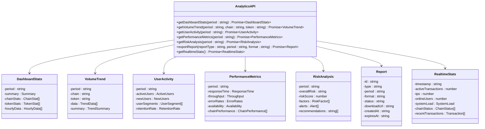

# 分析API

<cite>
**本文档引用的文件**
- [analytics.ts](file://backend/src/routes/analytics.ts)
- [Analytics.tsx](file://src/components/Analytics/Analytics.tsx)
- [Analytics.tsx](file://src/pages/Analytics.tsx)
- [database.ts](file://backend/src/services/database.ts)
- [redis.ts](file://backend/src/services/redis.ts)
- [transactionService.ts](file://src/services/transactionService.ts)
- [exchangeRateService.ts](file://src/services/exchangeRateService.ts)
</cite>

## 目录
1. [简介](#简介)
2. [项目结构](#项目结构)
3. [核心组件](#核心组件)
4. [架构概述](#架构概述)
5. [详细组件分析](#详细组件分析)
6. [依赖分析](#依赖分析)
7. [性能考虑](#性能考虑)
8. [故障排除指南](#故障排除指南)
9. [结论](#结论)
10. [附录](#附录)（如有必要）

## 简介
本文档全面介绍了分析API的设计与实现，涵盖交易量统计、用户行为分析、收入报表、风险指标等端点。文档详细说明了数据聚合策略和时间序列查询参数，解释了实时分析与批处理分析的差异和适用场景。同时描述了分析数据的缓存机制和性能优化策略，提供了不同维度（时间、地域、资产类型）的过滤和分组功能说明。文档还包含前端Analytics组件调用分析API的可视化集成示例，展示数据刷新和交互式查询功能。

## 项目结构
本项目采用前后端分离的架构设计，后端分析API位于`backend/src/routes/analytics.ts`，前端可视化组件位于`src/components/Analytics/Analytics.tsx`。系统通过Express框架提供RESTful API接口，前端使用React和Recharts库实现数据可视化。

**图表来源**
- [analytics.ts](file://backend/src/routes/analytics.ts#L1-L423)
- [Analytics.tsx](file://src/components/Analytics/Analytics.tsx#L1-L405)

**章节来源**
- [analytics.ts](file://backend/src/routes/analytics.ts#L1-L423)
- [Analytics.tsx](file://src/components/Analytics/Analytics.tsx#L1-L405)

## 核心组件
分析API的核心组件包括交易量统计、用户行为分析、性能指标和风险分析等端点。这些组件通过统一的RESTful接口提供数据服务，支持多种时间范围和过滤条件。前端Analytics组件负责数据可视化，提供交互式图表和实时数据刷新功能。

**章节来源**
- [analytics.ts](file://backend/src/routes/analytics.ts#L1-L423)
- [Analytics.tsx](file://src/components/Analytics/Analytics.tsx#L1-L405)

## 架构概述
系统采用分层架构设计，前端通过API调用获取分析数据，后端服务负责数据聚合和处理。数据源包括数据库和实时数据流，通过Redis缓存提高查询性能。系统支持实时分析和批处理分析两种模式，满足不同场景的需求。

**图表来源**
- [analytics.ts](file://backend/src/routes/analytics.ts#L1-L423)
- [redis.ts](file://backend/src/services/redis.ts#L1-L337)

## 详细组件分析
### 分析API端点分析
分析API提供多个端点，支持不同的分析需求。每个端点都支持时间范围参数，允许用户查询特定时间段的数据。

#### API端点类图

**图表来源**
- [analytics.ts](file://backend/src/routes/analytics.ts#L1-L423)

**章节来源**
- [analytics.ts](file://backend/src/routes/analytics.ts#L1-L423)

### 前端可视化组件分析
前端Analytics组件负责数据可视化，提供多种图表类型展示分析结果。组件支持时间范围选择和数据导出功能，提供良好的用户体验。

#### 前端组件序列图

**图表来源**
- [Analytics.tsx](file://src/components/Analytics/Analytics.tsx#L1-L405)
- [analytics.ts](file://backend/src/routes/analytics.ts#L1-L423)

**章节来源**
- [Analytics.tsx](file://src/components/Analytics/Analytics.tsx#L1-L405)

### 数据聚合策略分析
系统采用多种数据聚合策略，根据查询需求选择合适的聚合方式。对于实时数据，使用Redis缓存预计算结果；对于历史数据，直接查询数据库进行聚合。

#### 数据聚合流程图

**图表来源**
- [analytics.ts](file://backend/src/routes/analytics.ts#L1-L423)
- [redis.ts](file://backend/src/services/redis.ts#L1-L337)

**章节来源**
- [analytics.ts](file://backend/src/routes/analytics.ts#L1-L423)

## 依赖分析
系统依赖多个核心服务，包括数据库、Redis缓存和外部API服务。这些服务通过依赖注入的方式集成到分析API中，确保系统的可维护性和可扩展性。

**图表来源**
- [analytics.ts](file://backend/src/routes/analytics.ts#L1-L423)
- [database.ts](file://backend/src/services/database.ts#L1-L247)
- [redis.ts](file://backend/src/services/redis.ts#L1-L337)

**章节来源**
- [analytics.ts](file://backend/src/routes/analytics.ts#L1-L423)
- [database.ts](file://backend/src/services/database.ts#L1-L247)
- [redis.ts](file://backend/src/services/redis.ts#L1-L337)

## 性能考虑
系统在性能方面进行了多项优化，包括数据缓存、查询优化和异步处理。对于高频访问的数据，使用Redis缓存减少数据库压力；对于复杂查询，优化SQL语句和索引设计；对于耗时操作，采用异步处理避免阻塞主线程。

**章节来源**
- [redis.ts](file://backend/src/services/redis.ts#L1-L337)
- [database.ts](file://backend/src/services/database.ts#L1-L247)

## 故障排除指南
当分析API出现问题时，可以按照以下步骤进行排查：
1. 检查API端点是否正常响应
2. 验证数据库连接状态
3. 检查Redis缓存服务是否正常运行
4. 查看日志文件中的错误信息
5. 验证外部API服务的可用性

**章节来源**
- [analytics.ts](file://backend/src/routes/analytics.ts#L1-L423)
- [database.ts](file://backend/src/services/database.ts#L1-L247)
- [redis.ts](file://backend/src/services/redis.ts#L1-L337)

## 结论
分析API为系统提供了全面的数据分析能力，支持多种分析场景和可视化需求。通过合理的架构设计和性能优化，系统能够高效处理大量数据，为用户提供实时、准确的分析结果。未来可以进一步扩展分析维度，增加更多高级分析功能。

## 附录
### API端点列表
| 端点 | 方法 | 描述 | 参数 |
|------|------|------|------|
| /dashboard | GET | 获取仪表板统计数据 | period |
| /volume-trend | GET | 获取交易量趋势 | period, chain, token |
| /user-activity | GET | 获取用户活跃度分析 | period |
| /performance | GET | 获取性能指标 | period |
| /risk-analysis | GET | 获取风险分析 | period |
| /export | POST | 导出分析报告 | reportType, period, format |
| /realtime | GET | 获取实时统计 | 无 |

**章节来源**
- [analytics.ts](file://backend/src/routes/analytics.ts#L1-L423)