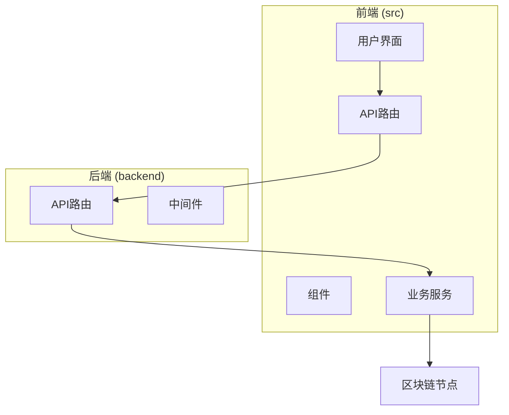
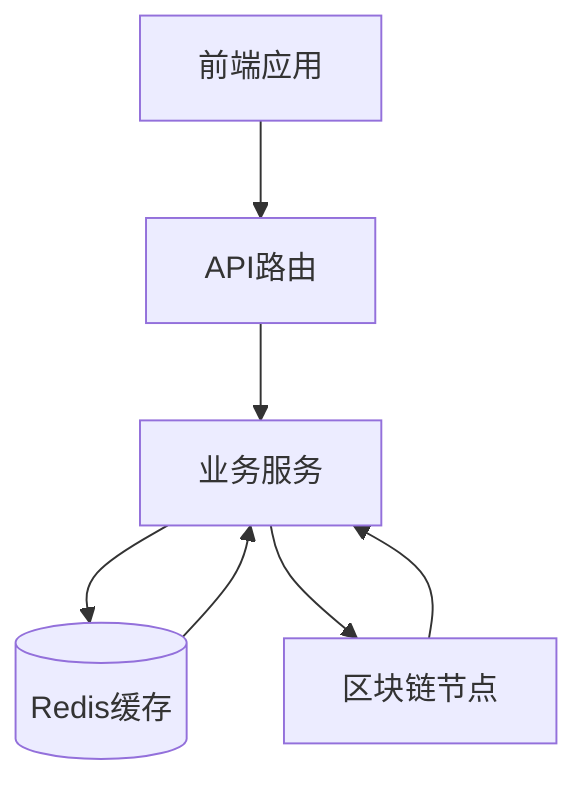
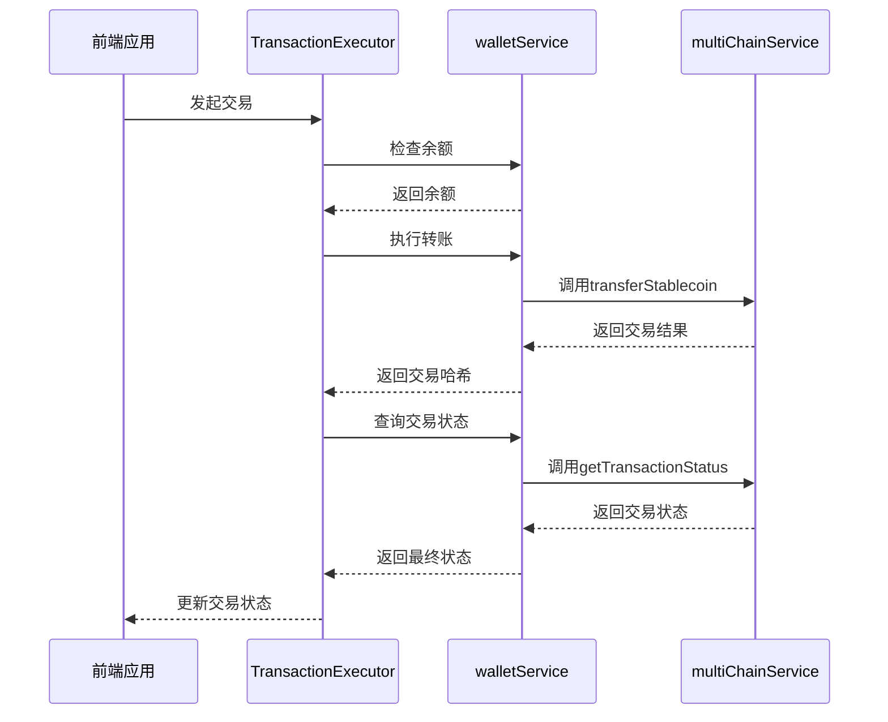
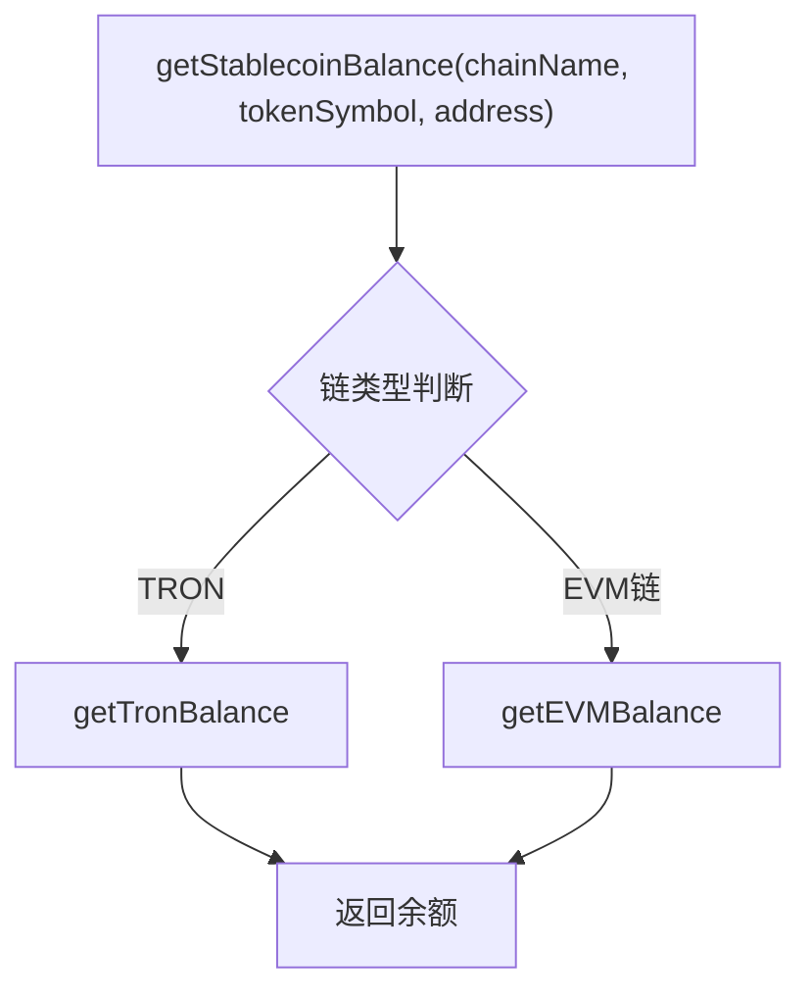
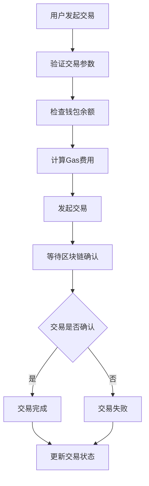
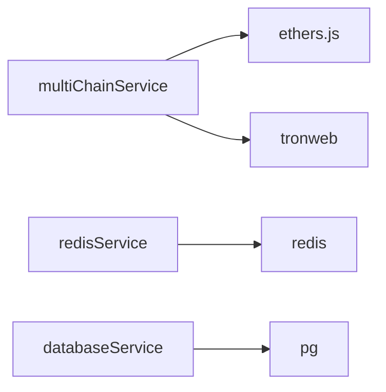

<cite>
**本文档引用的文件**  
- [multiChainService.ts](file://backend/src/services/multiChainService.ts)
- [blockchain.ts](file://backend/src/routes/blockchain.ts)
- [TransactionExecutor.tsx](file://src/components/Blockchain/TransactionExecutor.tsx)
- [walletService.ts](file://src/services/walletService.ts)
- [redis.ts](file://backend/src/services/redis.ts)
- [database.ts](file://backend/src/services/database.ts)
- [errorHandler.ts](file://backend/src/middleware/errorHandler.ts)
- [route.ts](file://src/app/api/wallet/balances/route.ts)
- [route.ts](file://src/app/api/wallet/transaction/route.ts)
</cite>

# 区块链API

## 目录
1. [简介](#简介)
2. [项目结构](#项目结构)
3. [核心组件](#核心组件)
4. [架构概述](#架构概述)
5. [详细组件分析](#详细组件分析)
6. [依赖分析](#依赖分析)
7. [性能考虑](#性能考虑)
8. [故障排除指南](#故障排除指南)
9. [结论](#结论)

## 简介
本文档全面介绍了区块链API的实现，涵盖多链支持、钱包地址生成、交易查询、链上状态获取等核心功能。重点阐述了`multiChainService`如何抽象化Ethereum、TRON和BSC等不同区块链的差异，实现了统一的区块链交互接口。文档详细描述了区块链网络状态监控机制、故障转移策略、钱包余额查询接口的缓存策略与实时性保证，以及WebSocket集成方案。同时，文档还涵盖了区块链服务的错误处理模式、重试机制，以及与前端`TransactionExecutor`组件的交互示例。

## 项目结构
项目采用前后端分离的架构，后端服务位于`backend`目录，前端应用位于`src`目录。后端使用Node.js和Express框架，通过`multiChainService`统一管理多链交互。前端使用React和Next.js构建，通过API路由与后端通信。



**Diagram sources**
- [multiChainService.ts](file://backend/src/services/multiChainService.ts#L48-L505)
- [blockchain.ts](file://backend/src/routes/blockchain.ts#L1-L293)

**Section sources**
- [multiChainService.ts](file://backend/src/services/multiChainService.ts#L1-L507)
- [blockchain.ts](file://backend/src/routes/blockchain.ts#L1-L293)

## 核心组件
核心组件包括`multiChainService`、`TransactionExecutor`、`walletService`和`redisService`。`multiChainService`是多链操作的核心，封装了与Ethereum、TRON和BSC的交互逻辑。`TransactionExecutor`是前端交易执行组件，提供用户友好的交易流程。`walletService`处理前端钱包交互，`redisService`提供缓存支持。

**Section sources**
- [multiChainService.ts](file://backend/src/services/multiChainService.ts#L48-L505)
- [TransactionExecutor.tsx](file://src/components/Blockchain/TransactionExecutor.tsx#L22-L388)
- [walletService.ts](file://src/services/walletService.ts#L1-L270)
- [redis.ts](file://backend/src/services/redis.ts#L1-L336)

## 架构概述
系统架构采用分层设计，前端通过API路由调用后端服务，后端服务通过`multiChainService`与区块链网络交互。Redis用于缓存高频访问的数据，如钱包余额和交易状态，以减轻区块链节点的查询压力。



**Diagram sources**
- [multiChainService.ts](file://backend/src/services/multiChainService.ts#L48-L505)
- [redis.ts](file://backend/src/services/redis.ts#L1-L336)

## 详细组件分析

### multiChainService分析
`multiChainService`是多链操作的核心服务，通过`initializeChains`和`initializeProviders`方法配置Ethereum、TRON和BSC的链参数和Web3提供者。该服务提供统一的接口，如`getStablecoinBalance`和`transferStablecoin`，内部根据链类型（EVM或TRON）调用不同的实现。

```mermaid
classDiagram
class MultiChainService {
+getSupportedChains() ChainConfig[]
+getStablecoinBalance(chainName, tokenSymbol, address) Promise~string~
+transferStablecoin(chainName, tokenSymbol, fromAddress, toAddress, amount, privateKey) Promise~TransactionResult~
+getTransactionStatus(chainName, txHash) Promise~TransactionResult~
+getGasPrices(chainName) Promise~{slow, standard, fast}~
+validateAddress(chainName, address) boolean
+getSupportedTokens(chainName) string[]
+getTokenInfo(chainName, tokenSymbol) object
}
class ChainConfig {
+chainId : number
+name : string
+symbol : string
+rpcUrl : string
+explorerUrl : string
+nativeCurrency : object
+stablecoins : object
}
class TransactionResult {
+txHash : string
+chainId : number
+status : string
+confirmations : number
+gasUsed? : string
+blockNumber? : number
+timestamp : Date
}
MultiChainService --> ChainConfig
MultiChainService --> TransactionResult
```

**Diagram sources**
- [multiChainService.ts](file://backend/src/services/multiChainService.ts#L48-L505)

**Section sources**
- [multiChainService.ts](file://backend/src/services/multiChainService.ts#L48-L505)

### TransactionExecutor分析
`TransactionExecutor`是前端交易执行组件，提供用户友好的交易流程。它通过`walletService`与钱包交互，执行交易并监控状态。



**Diagram sources**
- [TransactionExecutor.tsx](file://src/components/Blockchain/TransactionExecutor.tsx#L22-L388)
- [walletService.ts](file://src/services/walletService.ts#L1-L270)
- [multiChainService.ts](file://backend/src/services/multiChainService.ts#L280-L350)

**Section sources**
- [TransactionExecutor.tsx](file://src/components/Blockchain/TransactionExecutor.tsx#L22-L388)

### 钱包余额查询接口
钱包余额查询接口通过`getStablecoinBalance`方法实现，支持EVM和TRON链的余额查询。对于EVM链，使用`ethers.js`库查询ERC-20代币余额；对于TRON链，使用`tronweb`库查询TRC-20代币余额。



**Diagram sources**
- [multiChainService.ts](file://backend/src/services/multiChainService.ts#L180-L220)

**Section sources**
- [multiChainService.ts](file://backend/src/services/multiChainService.ts#L180-L220)

### 交易执行流程
交易执行流程从用户发起交易开始，经过参数验证、余额检查、Gas费用计算、交易发起、等待确认，最终完成交易。



**Diagram sources**
- [TransactionExecutor.tsx](file://src/components/Blockchain/TransactionExecutor.tsx#L22-L388)

**Section sources**
- [TransactionExecutor.tsx](file://src/components/Blockchain/TransactionExecutor.tsx#L22-L388)

## 依赖分析
系统依赖于`ethers.js`、`tronweb`、`redis`和`pg`等库。`ethers.js`用于与EVM兼容链交互，`tronweb`用于与TRON链交互，`redis`用于缓存，`pg`用于数据库操作。



**Diagram sources**
- [multiChainService.ts](file://backend/src/services/multiChainService.ts#L48-L505)
- [redis.ts](file://backend/src/services/redis.ts#L1-L336)
- [database.ts](file://backend/src/services/database.ts#L1-L246)

**Section sources**
- [multiChainService.ts](file://backend/src/services/multiChainService.ts#L48-L505)
- [redis.ts](file://backend/src/services/redis.ts#L1-L336)
- [database.ts](file://backend/src/services/database.ts#L1-L246)

## 性能考虑
为提高性能，系统采用Redis缓存高频访问的数据，如钱包余额和交易状态。同时，通过连接池管理数据库连接，避免频繁创建和销毁连接的开销。

**Section sources**
- [redis.ts](file://backend/src/services/redis.ts#L1-L336)
- [database.ts](file://backend/src/services/database.ts#L1-L246)

## 故障排除指南
常见问题包括区块链节点连接失败、交易失败、余额查询失败等。可通过检查节点状态、私钥是否正确、地址格式是否有效等方式进行排查。

**Section sources**
- [errorHandler.ts](file://backend/src/middleware/errorHandler.ts#L1-L175)
- [multiChainService.ts](file://backend/src/services/multiChainService.ts#L48-L505)

## 结论
本文档详细介绍了区块链API的实现，涵盖了多链支持、钱包地址生成、交易查询、链上状态获取等核心功能。通过`multiChainService`抽象化不同区块链的差异，实现了统一的区块链交互接口。系统采用分层架构，前端通过API路由调用后端服务，后端服务通过`multiChainService`与区块链网络交互，Redis用于缓存高频访问的数据，以提高性能。