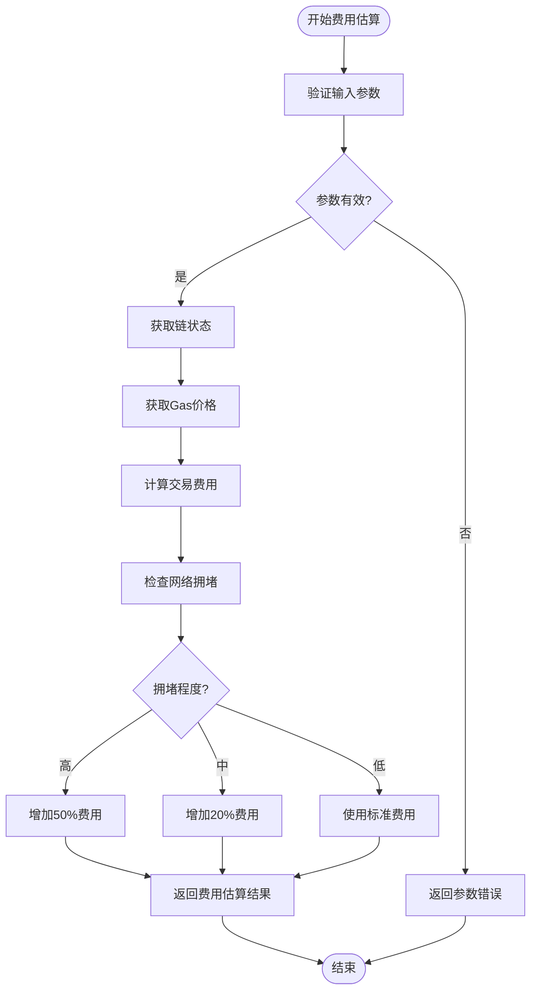
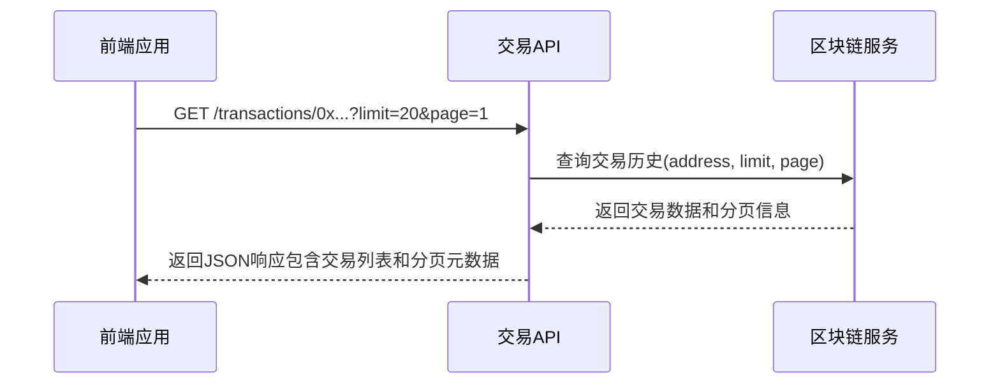
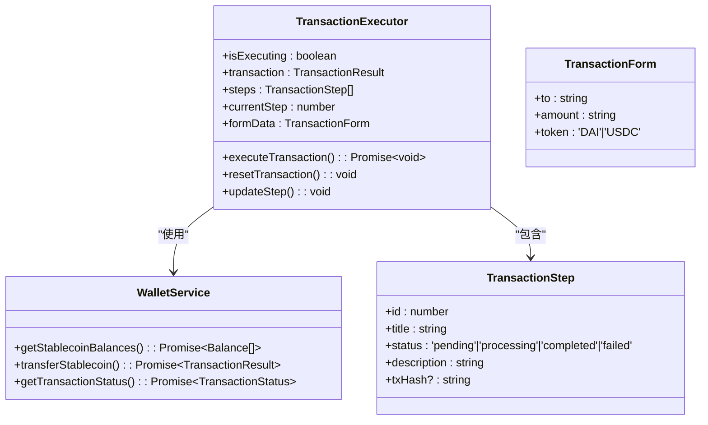

# 交易处理API

<cite>
**本文档引用文件**   
- [blockchain.ts](file://backend/src/routes/blockchain.ts)
- [BlockchainService.ts](file://backend/src/services/BlockchainService.ts)
- [TransactionExecutor.tsx](file://src/components/Blockchain/TransactionExecutor.tsx)
- [transactionService.ts](file://src/services/transactionService.ts)
</cite>

## 目录
1. [简介](#简介)
2. [交易费用估算API](#交易费用估算api)
3. [交易历史查询API](#交易历史查询api)
4. [前端集成与交易流程](#前端集成与交易流程)
5. [错误处理指南](#错误处理指南)

## 简介
本文档详细介绍了交易处理API的核心功能，包括交易费用估算和交易历史查询。文档涵盖了POST /api/blockchain/estimate-fee和GET /api/blockchain/transactions/:address两个关键API端点的使用方法，以及如何通过TransactionExecutor组件在前端集成这些功能。系统支持多链环境下的稳定币转账，提供完整的交易生命周期管理。

## 交易费用估算API

### 请求端点
`POST /api/blockchain/estimate-fee`

### 请求体结构
请求体必须包含以下字段：

**请求参数**
- chain: 区块链名称（如ethereum、bsc、tron）
- token: 代币符号（如USDT、DAI）
- amount: 转账金额
- from: 发送方地址
- to: 接收方地址

### 字段验证规则
系统对请求参数进行严格验证：

**验证规则**
- 所有字段均为必填项
- chain必须是系统支持的区块链（ethereum、tron、bsc）
- token必须是有效的代币符号
- amount必须为正数且格式正确
- from和to地址必须符合相应区块链的格式规范
- 地址格式验证：
  - Ethereum/BSC: 以0x开头，后跟40位十六进制字符
  - Tron: 以T开头，后跟33位字母数字字符

### 费用估算计算逻辑
费用估算服务通过以下步骤计算交易成本：

1. 获取目标区块链的当前网络状态
2. 查询实时Gas价格数据
3. 根据交易类型确定标准Gas限制
4. 计算基础交易费用
5. 考虑网络拥堵情况调整费用建议

系统会根据网络拥堵程度提供不同的费用建议：
- 低拥堵：推荐标准Gas价格
- 中等拥堵：建议增加20%的Gas费用
- 高拥堵：建议增加50%的Gas费用



**Diagram sources**
- [blockchain.ts](file://backend/src/routes/blockchain.ts#L180-L200)
- [BlockchainService.ts](file://backend/src/services/BlockchainService.ts#L150-L200)

### 响应字段说明
费用估算API返回以下关键字段：

**响应字段**
- estimatedFee: 预估交易费用（以ETH/BNB等原生代币计价）
- gasPrice: 当前Gas价格（单位：Gwei）
- gasLimit: 预估Gas限制（标准转账为21000）
- estimatedTime: 预计确认时间（如"2-5分钟"）
- exchangeRate: 当前汇率（如果涉及跨链或代币兑换）

**Section sources**
- [blockchain.ts](file://backend/src/routes/blockchain.ts#L180-L200)

## 交易历史查询API

### 请求端点
`GET /api/blockchain/transactions/:address`

### 分页参数
API支持分页查询，通过查询参数控制返回结果：

**分页参数**
- limit: 每页记录数，默认20，最大100
- page: 页码，从1开始

### 参数使用方法
分页参数通过URL查询字符串传递：

**使用示例**
- 获取第一页20条记录：`?limit=20&page=1`
- 获取第二页30条记录：`?limit=30&page=2`
- 使用默认分页：不提供参数或`?limit=20&page=1`

系统会根据分页参数返回相应的交易记录子集，并在响应中包含分页元数据。

### 交易历史记录字段
每条交易记录包含以下信息：

**交易字段**
- hash: 交易哈希值
- chain: 所属区块链
- from: 发送方地址
- to: 接收方地址
- value: 转账金额
- token: 代币符号
- fee: 交易费用
- status: 交易状态（confirmed、pending、failed）
- blockNumber: 确认区块号
- timestamp: 交易时间戳

响应还包含分页信息：

**分页信息**
- page: 当前页码
- limit: 每页记录数
- total: 总记录数



**Diagram sources**
- [blockchain.ts](file://backend/src/routes/blockchain.ts#L250-L270)

**Section sources**
- [blockchain.ts](file://backend/src/routes/blockchain.ts#L250-L270)

## 前端集成与交易流程

### TransactionExecutor组件
TransactionExecutor是前端交易执行的核心组件，提供用户友好的交易界面和完整的交易流程管理。

### 交易执行步骤
组件将交易过程分解为六个明确的步骤：

**交易步骤**
1. 验证交易参数：检查接收地址和转账金额的有效性
2. 检查余额：确认钱包有足够的代币余额
3. 计算Gas费用：调用费用估算API获取网络费用
4. 发起交易：向区块链网络提交交易
5. 等待确认：监控交易确认状态
6. 交易完成：交易成功确认并记录

### 前端集成实现
前端通过以下方式集成交易API：

1. 用户填写交易表单（接收地址、金额、代币选择）
2. 组件调用费用估算API获取交易成本
3. 显示费用详情供用户确认
4. 用户确认后发起交易
5. 监控交易状态并更新UI进度
6. 交易完成后显示结果并提供区块链浏览器链接



**Diagram sources**
- [TransactionExecutor.tsx](file://src/components/Blockchain/TransactionExecutor.tsx#L22-L388)

**Section sources**
- [TransactionExecutor.tsx](file://src/components/Blockchain/TransactionExecutor.tsx#L22-L388)
- [transactionService.ts](file://src/services/transactionService.ts#L52-L388)

## 错误处理指南

### 参数缺失错误
当请求缺少必要参数时，系统返回400状态码：

**错误响应**
```json
{
  "success": false,
  "error": "缺少必要的参数"
}
```

**处理策略**
- 前端应在提交前验证所有必填字段
- 提供清晰的错误提示，指导用户补全信息
- 高亮显示缺失或无效的表单字段

### 服务器内部错误
当服务器处理请求时发生异常，返回500状态码：

**错误响应**
```json
{
  "success": false,
  "error": "服务器内部错误"
}
```

**处理策略**
- 前端应捕获异常并显示友好错误消息
- 提供重试选项
- 记录错误日志以便后续分析
- 实现退避重试机制

### 其他常见错误
系统还可能返回以下错误：

**错误类型**
- 404 Not Found: 请求的资源不存在
- 422 Unprocessable Entity: 参数格式无效
- 503 Service Unavailable: 服务暂时不可用

**通用错误处理原则**
- 所有错误都应有明确的用户可读消息
- 敏感错误详情不应暴露给客户端
- 实现统一的错误处理中间件
- 记录详细的错误日志用于调试

**Section sources**
- [blockchain.ts](file://backend/src/routes/blockchain.ts#L185-L195)
- [errorHandler.ts](file://backend/src/middleware/errorHandler.ts)