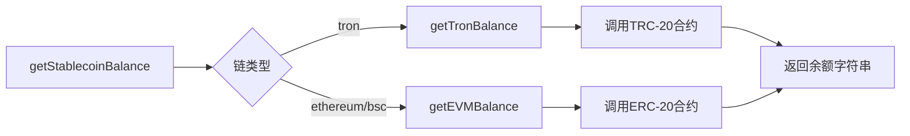
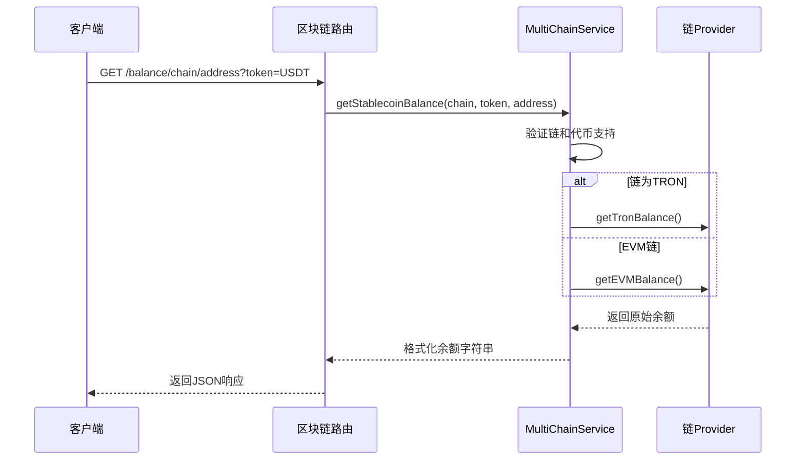

# 余额查询API

<cite>
**本文档引用的文件**  
- [blockchain.ts](file://backend/src/routes/blockchain.ts)
- [multiChainService.ts](file://backend/src/services/multiChainService.ts)
</cite>

## 目录
1. [简介](#简介)
2. [API端点说明](#api端点说明)
3. [路径与查询参数](#路径与查询参数)
4. [多链余额查询实现逻辑](#多链余额查询实现逻辑)
5. [请求示例](#请求示例)
6. [响应数据结构](#响应数据结构)
7. [后端服务调用流程](#后端服务调用流程)
8. [常见错误处理](#常见错误处理)
9. [总结](#总结)

## 简介
本API提供跨链稳定币余额查询功能，支持Ethereum、TRON和BSC三大主流区块链网络。通过统一接口设计，开发者可便捷地获取指定地址在不同链上的代币余额信息，适用于钱包、交易、结算等多场景集成。

**Section sources**
- [blockchain.ts](file://backend/src/routes/blockchain.ts#L1-L293)

## API端点说明
系统提供两个核心端点用于余额查询：

### 单链余额查询
```
GET /api/blockchain/balance/:chainName/:address
```
用于查询指定区块链上某地址的单一稳定币余额。

### 多链批量余额查询
```
POST /api/blockchain/balance/multi
```
支持一次性查询多个地址在不同链上的多种代币余额，提升批量处理效率。

```mermaid
flowchart TD
A[客户端请求] --> B{请求类型}
B --> |GET| C[/api/blockchain/balance/:chainName/:address]
B --> |POST| D[/api/blockchain/balance/multi]
C --> E[验证参数]
D --> F[解析地址列表]
E --> G[调用MultiChainService]
F --> G
G --> H[返回余额结果]
```

**Diagram sources**
- [blockchain.ts](file://backend/src/routes/blockchain.ts#L1-L293)

**Section sources**
- [blockchain.ts](file://backend/src/routes/blockchain.ts#L1-L293)

## 路径与查询参数
### 路径参数
| 参数 | 类型 | 说明 |
|------|------|------|
| `chainName` | string | 区块链名称，支持：<br/>- **ethereum**：以太坊主网<br/>- **tron**：波场主网<br/>- **bsc**：币安智能链 |
| `address` | string | 钱包地址，需符合对应链的格式规范 |

### 查询参数
| 参数 | 是否必需 | 说明 |
|------|----------|------|
| `token` | 是 | 代币符号，如USDT、USDC等，用于指定查询的稳定币类型 |

**Section sources**
- [blockchain.ts](file://backend/src/routes/blockchain.ts#L150-L170)

## 多链余额查询实现逻辑
系统通过`MultiChainService`统一管理多链逻辑，根据链类型差异化处理余额查询请求。

### EVM链处理（Ethereum、BSC）
- 使用`ethers.js`库与智能合约交互
- 调用ERC-20标准的`balanceOf`方法
- 通过`formatUnits`进行精度转换

### TRON链处理
- 使用`TronWeb`库连接波场网络
- 调用TRC-20合约的`balanceOf`方法
- 手动除以10^6进行单位换算（TRON USDT为6位小数）



**Diagram sources**
- [multiChainService.ts](file://backend/src/services/multiChainService.ts#L200-L264)

**Section sources**
- [multiChainService.ts](file://backend/src/services/multiChainService.ts#L200-L264)

## 请求示例
### 单链查询
```http
GET /api/blockchain/balance/ethereum/0x1234...5678?token=USDT
```

### 批量查询
```json
POST /api/blockchain/balance/multi
{
  "addresses": [
    {
      "chain": "ethereum",
      "address": "0x1234...5678",
      "tokens": ["USDT", "USDC"]
    },
    {
      "chain": "tron",
      "address": "T7Nh...rdz8",
      "tokens": ["USDT"]
    }
  ]
}
```

**Section sources**
- [blockchain.ts](file://backend/src/routes/blockchain.ts#L172-L205)

## 响应数据结构
### 单链查询响应
```json
{
  "success": true,
  "data": {
    "chain": "ethereum",
    "address": "0x1234...5678",
    "token": "USDT",
    "balance": "100.50"
  }
}
```

### 批量查询响应
```json
{
  "success": true,
  "data": [
    {
      "chain": "ethereum",
      "address": "0x1234...5678",
      "token": "USDT",
      "balance": "100.50"
    },
    {
      "chain": "ethereum",
      "address": "0x1234...5678",
      "token": "USDC",
      "balance": "200.25"
    },
    {
      "chain": "tron",
      "address": "T7Nh...rdz8",
      "token": "USDT",
      "balance": "50.75"
    }
  ]
}
```
**balance字段说明**：所有余额均以字符串形式返回，保留原始精度，避免浮点数精度丢失。

**Section sources**
- [blockchain.ts](file://backend/src/routes/blockchain.ts#L165-L169)
- [blockchain.ts](file://backend/src/routes/blockchain.ts#L195-L204)

## 后端服务调用流程
核心逻辑由`MultiChainService.getStablecoinBalance`方法实现，调用流程如下：

1. 验证链名和代币符号是否支持
2. 获取对应链的配置和Provider
3. 根据链类型分发至EVM或TRON专用方法
4. 执行智能合约调用并格式化结果
5. 返回标准化余额字符串



**Diagram sources**
- [multiChainService.ts](file://backend/src/services/multiChainService.ts#L200-L227)
- [blockchain.ts](file://backend/src/routes/blockchain.ts#L150-L170)

**Section sources**
- [multiChainService.ts](file://backend/src/services/multiChainService.ts#L200-L227)

## 常见错误处理
系统对以下常见错误场景进行明确处理：

| 错误类型 | HTTP状态码 | 错误信息 | 说明 |
|---------|------------|---------|------|
| 无效地址格式 | 400 | "地址格式无效" | 地址不符合EVM或TRON规范 |
| 不支持的链名称 | 404 | "不支持的区块链" | chainName不在支持列表中 |
| 代币符号缺失 | 400 | "缺少代币符号参数" | 未提供token查询参数 |
| 代币不支持 | 500 | "Token XXX not supported on YYY" | 指定链不支持该代币 |
| 服务器内部错误 | 500 | "服务器内部错误" | 网络异常或服务故障 |

**Section sources**
- [blockchain.ts](file://backend/src/routes/blockchain.ts#L155-L158)
- [multiChainService.ts](file://backend/src/services/multiChainService.ts#L205-L208)

## 总结
本余额查询API通过统一接口封装多链差异，提供稳定可靠的跨链余额查询服务。核心优势包括：
- 支持主流EVM链与TRON链
- 精确的精度处理避免浮点误差
- 批量查询提升性能
- 完善的错误处理机制
- 可扩展的架构设计

**Section sources**
- [blockchain.ts](file://backend/src/routes/blockchain.ts#L1-L293)
- [multiChainService.ts](file://backend/src/services/multiChainService.ts#L1-L508)