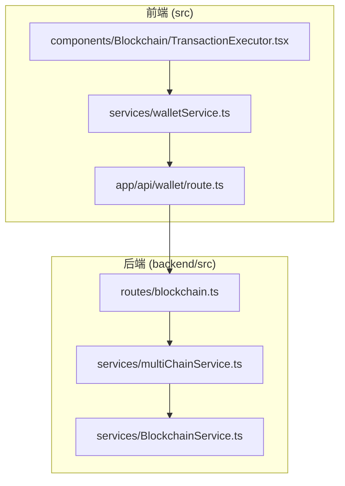
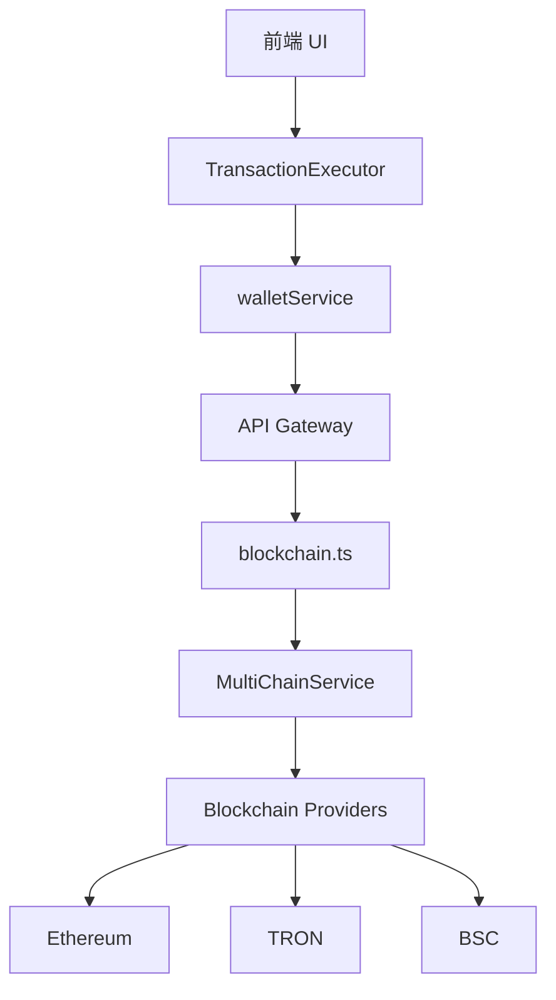
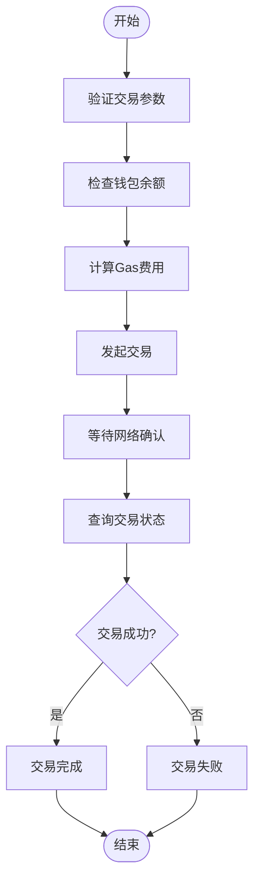
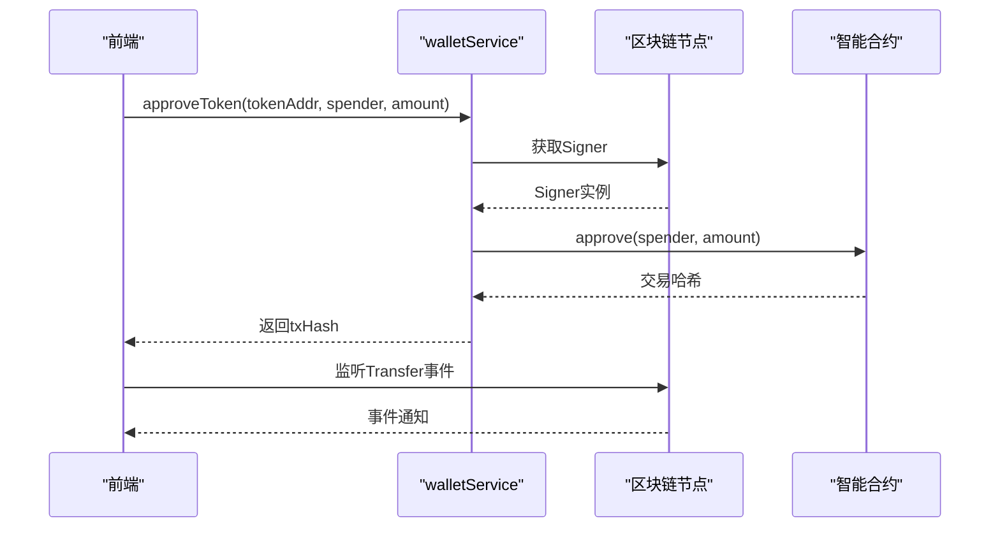
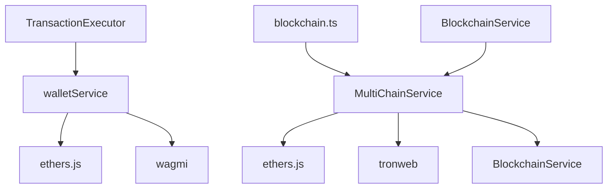

# 区块链服务API

<cite>
**本文档引用的文件**  
- [blockchain.ts](file://backend/src/routes/blockchain.ts)
- [multiChainService.ts](file://backend/src/services/multiChainService.ts)
- [BlockchainService.ts](file://backend/src/services/BlockchainService.ts)
- [TransactionExecutor.tsx](file://src/components/Blockchain/TransactionExecutor.tsx)
- [walletService.ts](file://src/services/walletService.ts)
</cite>

## 目录
1. [简介](#简介)
2. [项目结构](#项目结构)
3. [核心组件](#核心组件)
4. [架构概览](#架构概览)
5. [详细组件分析](#详细组件分析)
6. [依赖分析](#依赖分析)
7. [性能考量](#性能考量)
8. [故障排查指南](#故障排查指南)
9. [结论](#结论)

## 简介
本文档旨在全面说明区块链服务API的功能与实现机制，涵盖多链连接状态管理、账户余额查询、智能合约调用、链上事件监听等核心功能。重点解析`GET /api/blockchain/balance/:address/:chain`接口的路径参数和响应格式，支持ETH、TRON、BSC等主流区块链网络。详细描述合约交互API（如approve、transferFrom）的参数编码规则及Gas费用估算机制。结合前端`TransactionExecutor`组件，阐述交易请求的构造流程。同时提供区块链网络健康检查与节点故障转移策略的实现细节，并针对链ID不匹配、nonce冲突等常见错误提出解决方案。

## 项目结构
本项目采用前后端分离架构，后端基于Node.js + Express实现RESTful API服务，前端使用React + Next.js构建用户界面。整体结构清晰，模块化程度高，便于维护和扩展。



**图示来源**  
- [blockchain.ts](file://backend/src/routes/blockchain.ts#L1-L293)
- [multiChainService.ts](file://backend/src/services/multiChainService.ts#L1-L507)
- [walletService.ts](file://src/services/walletService.ts#L1-L269)
- [TransactionExecutor.tsx](file://src/components/Blockchain/TransactionExecutor.tsx#L1-L388)

**本节来源**  
- [blockchain.ts](file://backend/src/routes/blockchain.ts#L1-L293)
- [multiChainService.ts](file://backend/src/services/multiChainService.ts#L1-L507)
- [walletService.ts](file://src/services/walletService.ts#L1-L269)

## 核心组件
系统核心由`MultiChainService`驱动，负责跨链操作的统一管理，包括余额查询、交易执行、状态监控等。`BlockchainService`继承自`MultiChainService`，扩展了链健康检查、性能监控、Gas价格估算等功能。前端通过`walletService`与钱包交互，`TransactionExecutor`组件提供可视化交易流程。

**本节来源**  
- [multiChainService.ts](file://backend/src/services/multiChainService.ts#L1-L507)
- [BlockchainService.ts](file://backend/src/services/BlockchainService.ts#L1-L306)
- [walletService.ts](file://src/services/walletService.ts#L1-L269)

## 架构概览
系统采用分层架构设计，从前端UI到后端服务再到区块链网络，形成完整的调用链路。



**图示来源**  
- [TransactionExecutor.tsx](file://src/components/Blockchain/TransactionExecutor.tsx#L1-L388)
- [walletService.ts](file://src/services/walletService.ts#L1-L269)
- [blockchain.ts](file://backend/src/routes/blockchain.ts#L1-L293)
- [multiChainService.ts](file://backend/src/services/multiChainService.ts#L1-L507)

## 详细组件分析

### 多链服务组件分析
`MultiChainService`是系统的核心服务类，封装了对Ethereum、TRON、BSC三大链的支持。通过统一接口屏蔽底层差异，实现跨链操作的抽象化。

#### 类图
```mermaid
classDiagram
class MultiChainService {
+chains : Map~string, ChainConfig~
+providers : Map~string, any~
+getSupportedChains() ChainConfig[]
+getChainConfig(chainName : string) ChainConfig | undefined
+getStablecoinBalance(chainName : string, tokenSymbol : string, address : string) Promise~string~
+transferStablecoin(chainName : string, tokenSymbol : string, fromAddress : string, toAddress : string, amount : string, privateKey : string) Promise~TransactionResult~
+getTransactionStatus(chainName : string, txHash : string) Promise~TransactionResult~
+getGasPrices(chainName : string) Promise~{slow : string, standard : string, fast : string}~
+validateAddress(chainName : string, address : string) boolean
}
class BlockchainService {
+stats : BlockchainStats
+chainStatus : Map~string, ChainStatus~
+getBlockchainStats() BlockchainStats
+getChainStatus(chainName? : string) ChainStatus | ChainStatus[] | undefined
+updateChainStatus(chainName : string) Promise~void~
+checkAllChainsHealth() Promise~void~
+getNetworkCongestionAdvice() {level : string, message : string, recommendedGasMultiplier : number}
+estimateOptimalGasPrice(chainName : string) Promise~{slow : string, standard : string, fast : fast : string, instant : string}~
+monitorTransaction(chainName : string, txHash : string) Promise~{status : 'pending'|'confirmed'|'failed', confirmations : number, blockNumber? : number, gasUsed? : string}~
+getPerformanceMetrics() {throughput : { [chain : string] : number }, latency : { [chain : string] : number }, successRate : { [chain : string] : number }}
+startHealthCheck(intervalMs : number) void
}
BlockchainService --|> MultiChainService : 继承
```

**图示来源**  
- [multiChainService.ts](file://backend/src/services/multiChainService.ts#L1-L507)
- [BlockchainService.ts](file://backend/src/services/BlockchainService.ts#L1-L306)

### 交易执行器组件分析
`TransactionExecutor`是前端交易执行的核心组件，提供用户友好的界面引导用户完成交易流程，包含参数验证、余额检查、Gas估算、交易提交、状态监控等步骤。

#### 交易流程图


**图示来源**  
- [TransactionExecutor.tsx](file://src/components/Blockchain/TransactionExecutor.tsx#L1-L388)
- [walletService.ts](file://src/services/walletService.ts#L1-L269)

### 合约交互API分析
系统支持标准ERC20合约操作，包括`approve`和`transferFrom`等方法。参数编码遵循EVM规范，使用ethers.js进行ABI编码。

#### 序列图


**图示来源**  
- [walletService.ts](file://src/services/walletService.ts#L1-L269)
- [multiChainService.ts](file://backend/src/services/multiChainService.ts#L1-L507)

**本节来源**  
- [multiChainService.ts](file://backend/src/services/multiChainService.ts#L1-L507)
- [BlockchainService.ts](file://backend/src/services/BlockchainService.ts#L1-L306)
- [walletService.ts](file://src/services/walletService.ts#L1-L269)
- [TransactionExecutor.tsx](file://src/components/Blockchain/TransactionExecutor.tsx#L1-L388)

## 依赖分析
系统依赖关系清晰，各层职责分明。



**图示来源**  
- [package.json](file://package.json#L1-L20)
- [multiChainService.ts](file://backend/src/services/multiChainService.ts#L1-L507)
- [walletService.ts](file://src/services/walletService.ts#L1-L269)

**本节来源**  
- [multiChainService.ts](file://backend/src/services/multiChainService.ts#L1-L507)
- [walletService.ts](file://src/services/walletService.ts#L1-L269)
- [package.json](file://package.json#L1-L20)

## 性能考量
系统在设计时充分考虑了性能因素，包括：

- **连接池管理**：对每个区块链网络维护独立的Provider实例，避免重复连接开销。
- **异步非阻塞**：所有区块链操作均采用异步方式，防止主线程阻塞。
- **缓存机制**：链配置、合约ABI等静态数据在内存中缓存，减少重复解析。
- **批量查询**：支持批量余额查询接口，减少网络往返次数。
- **健康检查调度**：通过定时任务定期检查链状态，避免实时查询带来的延迟。

**本节来源**  
- [multiChainService.ts](file://backend/src/services/multiChainService.ts#L1-L507)
- [BlockchainService.ts](file://backend/src/services/BlockchainService.ts#L1-L306)

## 故障排查指南
### 常见错误及解决方案

| 错误类型 | 描述 | 解决方案 |
|---------|------|---------|
| 链ID不匹配 | 用户钱包链ID与目标链不一致 | 调用`switchNetwork`方法切换钱包网络 |
| Nonce冲突 | 同一地址短时间内发送多笔交易 | 实现交易队列机制，按顺序提交交易 |
| Gas不足 | Gas费用估算过低导致交易失败 | 使用`estimateOptimalGasPrice`获取动态Gas建议 |
| 地址格式错误 | 输入的地址不符合链的格式规范 | 调用`validateAddress`接口进行格式校验 |
| 网络离线 | 区块链节点不可达 | 启用故障转移机制，切换备用RPC节点 |

### 网络健康检查与故障转移
系统通过`BlockchainService`的`startHealthCheck`方法启动定期健康检查（默认30秒一次），监控各链的在线状态、区块高度、Gas价格等指标。当检测到某条链离线时，系统会自动标记其状态，并在后续交易中避免使用该链的节点，实现故障转移。

**本节来源**  
- [BlockchainService.ts](file://backend/src/services/BlockchainService.ts#L1-L306)
- [multiChainService.ts](file://backend/src/services/multiChainService.ts#L1-L507)

## 结论
本文档详细阐述了区块链服务API的设计与实现，涵盖多链支持、余额查询、交易执行、状态监控等核心功能。系统架构清晰，模块职责分明，具备良好的可扩展性和稳定性。通过`MultiChainService`和`BlockchainService`的分层设计，实现了功能复用与职责分离。前端`TransactionExecutor`组件提供了流畅的用户体验。系统还具备完善的健康检查与故障转移机制，确保服务的高可用性。对于链ID不匹配、nonce冲突等常见问题，提供了明确的解决方案，有助于提升开发效率和系统可靠性。