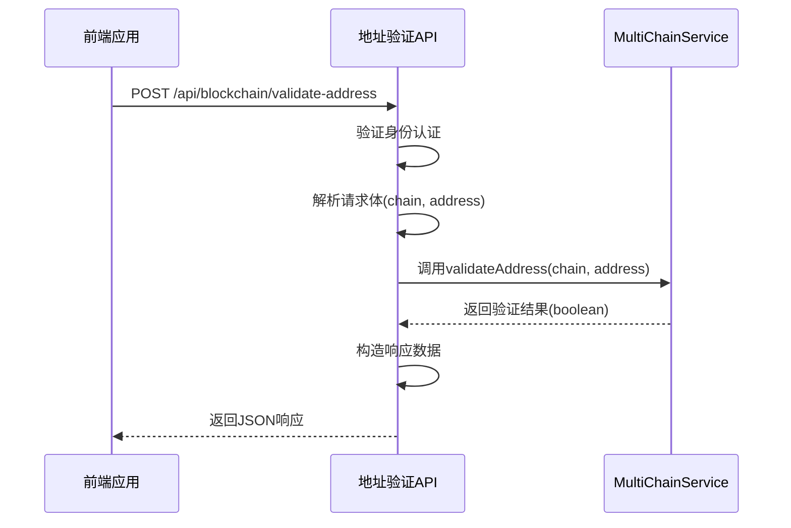
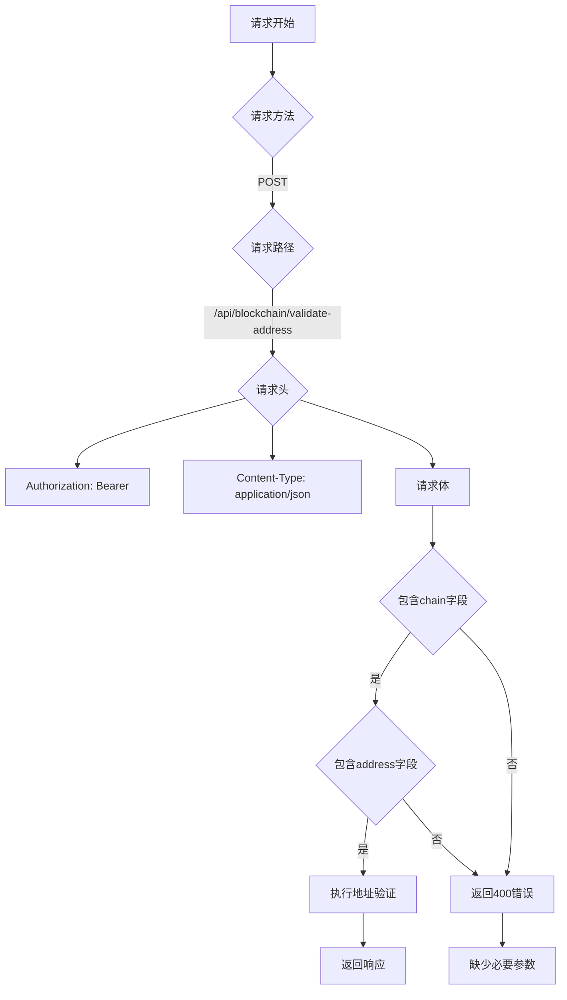
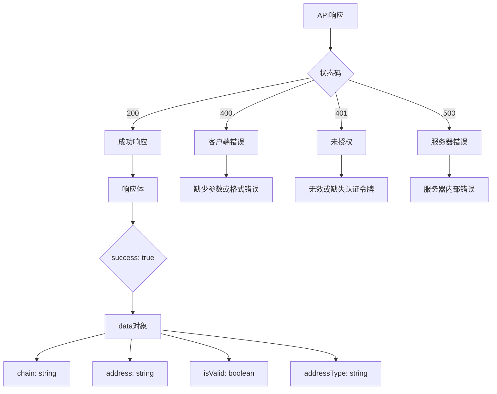
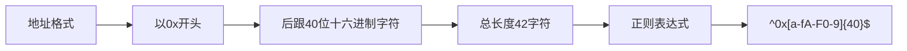
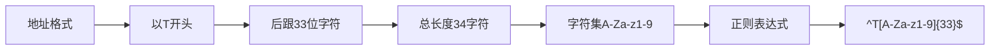
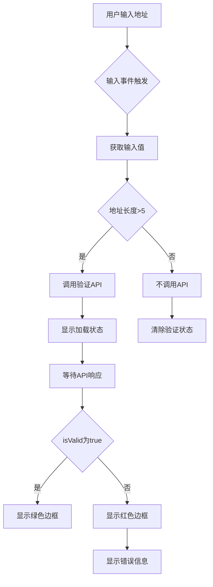
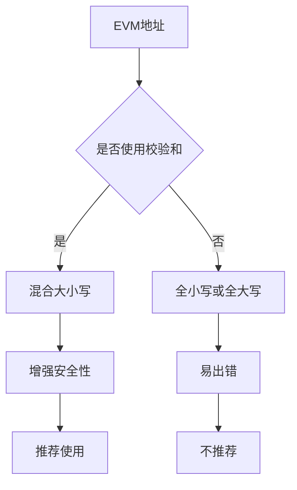
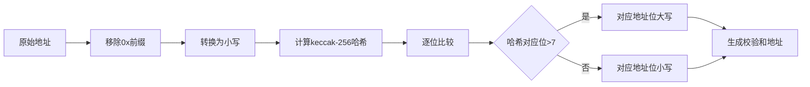
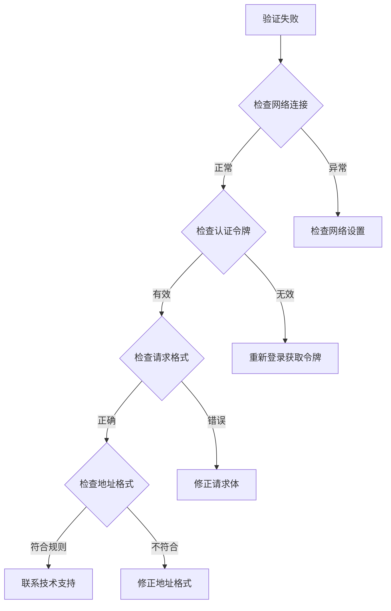

# 地址验证API

<cite>
**本文档引用的文件**
- [blockchain.ts](file://backend/src/routes/blockchain.ts)
- [multiChainService.ts](file://backend/src/services/multiChainService.ts)
- [walletService.ts](file://src/services/walletService.ts)
</cite>

## 目录
1. [简介](#简介)
2. [端点详情](#端点详情)
3. [请求格式](#请求格式)
4. [响应格式](#响应格式)
5. [区块链地址格式](#区块链地址格式)
6. [前端集成示例](#前端集成示例)
7. [常见验证失败场景](#常见验证失败场景)
8. [故障排除](#故障排除)

## 简介
地址验证API为跨链支付平台提供钱包地址格式验证功能。该API允许前端应用在用户输入钱包地址时实时验证其格式正确性，支持EVM链（如以太坊、BSC）和TRON链两种主要区块链网络的地址格式验证。通过正则表达式和内置验证逻辑，确保用户输入的地址符合特定区块链网络的格式要求，从而减少因地址格式错误导致的交易失败。

**Section sources**
- [blockchain.ts](file://backend/src/routes/blockchain.ts#L1-L293)

## 端点详情
`POST /api/blockchain/validate-address`端点用于验证钱包地址的格式正确性。该端点需要身份验证，确保只有授权用户可以访问。验证过程基于区块链类型对地址进行格式检查，返回详细的验证结果，包括地址是否有效以及地址类型。



**Diagram sources**
- [blockchain.ts](file://backend/src/routes/blockchain.ts#L1-L293)
- [multiChainService.ts](file://backend/src/services/multiChainService.ts#L479-L492)

**Section sources**
- [blockchain.ts](file://backend/src/routes/blockchain.ts#L1-L293)

## 请求格式
请求体必须包含`chain`和`address`两个字段，均为必需参数。



**Diagram sources**
- [blockchain.ts](file://backend/src/routes/blockchain.ts#L1-L293)

**Section sources**
- [blockchain.ts](file://backend/src/routes/blockchain.ts#L1-L293)

### 请求参数
| 字段 | 类型 | 必需 | 描述 |
|------|------|------|------|
| chain | string | 是 | 区块链名称，支持"ethereum"、"bsc"、"tron"等 |
| address | string | 是 | 钱包地址，需符合相应区块链的格式要求 |

## 响应格式
验证成功时返回200状态码，包含详细的验证结果；验证失败或服务器错误时返回相应的错误状态码。



**Diagram sources**
- [blockchain.ts](file://backend/src/routes/blockchain.ts#L1-L293)

### 成功响应示例
```json
{
  "success": true,
  "data": {
    "chain": "ethereum",
    "address": "0x742d35Cc6634C0532925a3b8D4C0cB507C97c0cF",
    "isValid": true,
    "addressType": "evm"
  }
}
```

### 错误响应示例
```json
{
  "success": false,
  "error": "缺少链名或地址参数"
}
```

**Section sources**
- [blockchain.ts](file://backend/src/routes/blockchain.ts#L1-L293)

## 区块链地址格式
不同区块链网络有不同的地址格式要求，API使用特定的正则表达式进行验证。

### EVM链地址格式
EVM兼容链（如以太坊、BSC）的地址格式遵循特定模式：



**Diagram sources**
- [blockchain.ts](file://backend/src/routes/blockchain.ts#L1-L293)

EVM链地址验证使用`ethers.isAddress()`方法和正则表达式双重验证，确保地址格式正确。地址由0x前缀和40位十六进制字符组成，总共42个字符。

### TRON链地址格式
TRON链的地址格式有其独特要求：



**Diagram sources**
- [blockchain.ts](file://backend/src/routes/blockchain.ts#L1-L293)

TRON地址以字母"T"开头，后跟33个字符，总共34个字符。字符集包括大写字母A-Z、小写字母a-z和数字1-9（不包括0），这种设计避免了视觉上容易混淆的字符。

### 验证规则对比
| 区块链 | 正则表达式 | 长度 | 前缀 | 字符集 |
|--------|------------|------|------|--------|
| EVM链 | ^0x[a-fA-F0-9]{40}$ | 42 | 0x | 十六进制 |
| TRON链 | ^T[A-Za-z1-9]{33}$ | 34 | T | A-Za-z1-9 |

**Section sources**
- [blockchain.ts](file://backend/src/routes/blockchain.ts#L1-L293)
- [multiChainService.ts](file://backend/src/services/multiChainService.ts#L479-L492)

## 前端集成示例
以下示例展示如何在前端应用中集成地址验证API，实现用户输入时的实时验证。



**Diagram sources**
- [walletService.ts](file://src/services/walletService.ts#L1-L269)

### 实现代码示例
```typescript
// 在React组件中实现地址验证
const validateAddress = async (chain: string, address: string) => {
  if (!address || address.length < 5) {
    return { isValid: false, addressType: 'unknown' }
  }

  try {
    const response = await fetch('/api/blockchain/validate-address', {
      method: 'POST',
      headers: {
        'Content-Type': 'application/json',
        'Authorization': `Bearer ${userToken}`
      },
      body: JSON.stringify({ chain, address })
    })

    const data = await response.json()
    return data.data
  } catch (error) {
    console.error('地址验证失败:', error)
    return { isValid: false, addressType: 'unknown' }
  }
}

// 在输入框中使用
<input 
  type="text"
  onChange={async (e) => {
    const result = await validateAddress('ethereum', e.target.value)
    setAddressValid(result.isValid)
  }}
  className={addressValid ? 'valid' : 'invalid'}
/>
```

**Section sources**
- [walletService.ts](file://src/services/walletService.ts#L1-L269)

## 常见验证失败场景
了解常见的验证失败场景有助于快速诊断和解决问题。

### 大小写敏感性问题
EVM链地址对大小写不敏感，但建议使用校验和格式：



**Diagram sources**
- [multiChainService.ts](file://backend/src/services/multiChainService.ts#L479-L492)

EVM地址虽然不区分大小写，但支持EIP-55校验和格式，通过混合大小写提供错误检测功能。建议前端在显示地址时使用校验和格式，提高安全性。

### 校验和验证
EIP-55校验和验证通过特定算法确保地址正确性：



**Diagram sources**
- [multiChainService.ts](file://backend/src/services/multiChainService.ts#L479-L492)

### 其他常见问题
| 问题 | 原因 | 解决方案 |
|------|------|----------|
| 地址长度错误 | 复制粘贴时包含空格或换行 | 清除前后空白字符 |
| 使用错误前缀 | 将TRON地址用于EVM链 | 确认目标区块链类型 |
| 包含非法字符 | 手动输入时误输入O、l等易混淆字符 | 使用地址扫描功能 |
| 网络不匹配 | 主网地址用于测试网 | 确认目标网络环境 |

**Section sources**
- [multiChainService.ts](file://backend/src/services/multiChainService.ts#L479-L492)

## 故障排除
当地址验证出现问题时，可按照以下步骤进行排查。



**Diagram sources**
- [blockchain.ts](file://backend/src/routes/blockchain.ts#L1-L293)

### 调试步骤
1. 确认API端点URL正确
2. 检查Authorization头是否包含有效的Bearer令牌
3. 验证请求体JSON格式正确
4. 确认chain参数值在支持列表中
5. 检查address参数是否符合相应区块链的格式要求
6. 查看浏览器开发者工具中的网络请求详情

**Section sources**
- [blockchain.ts](file://backend/src/routes/blockchain.ts#L1-L293)