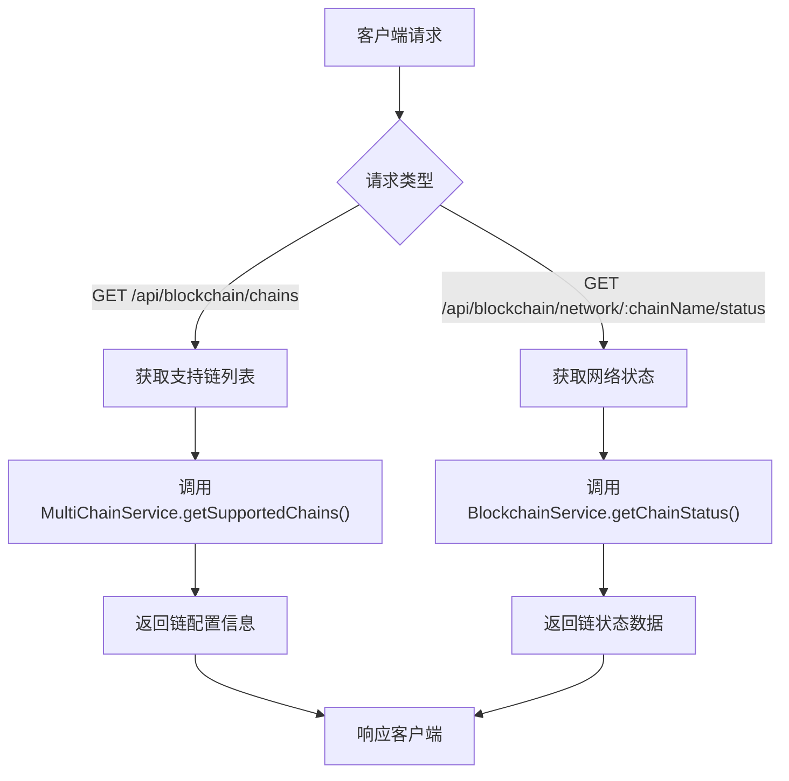
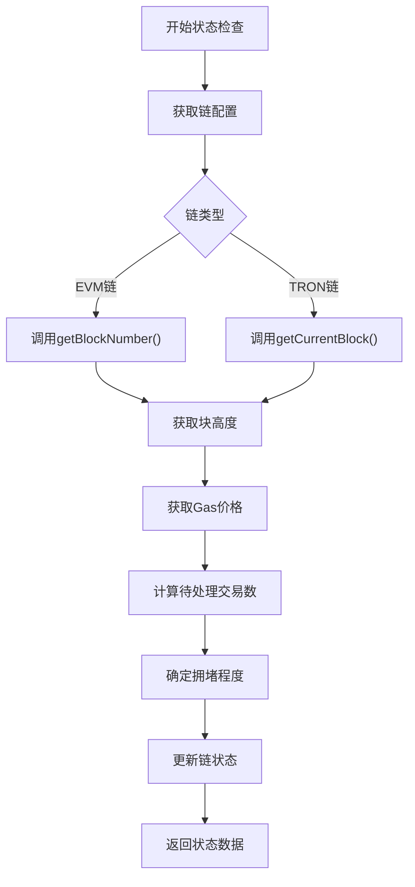
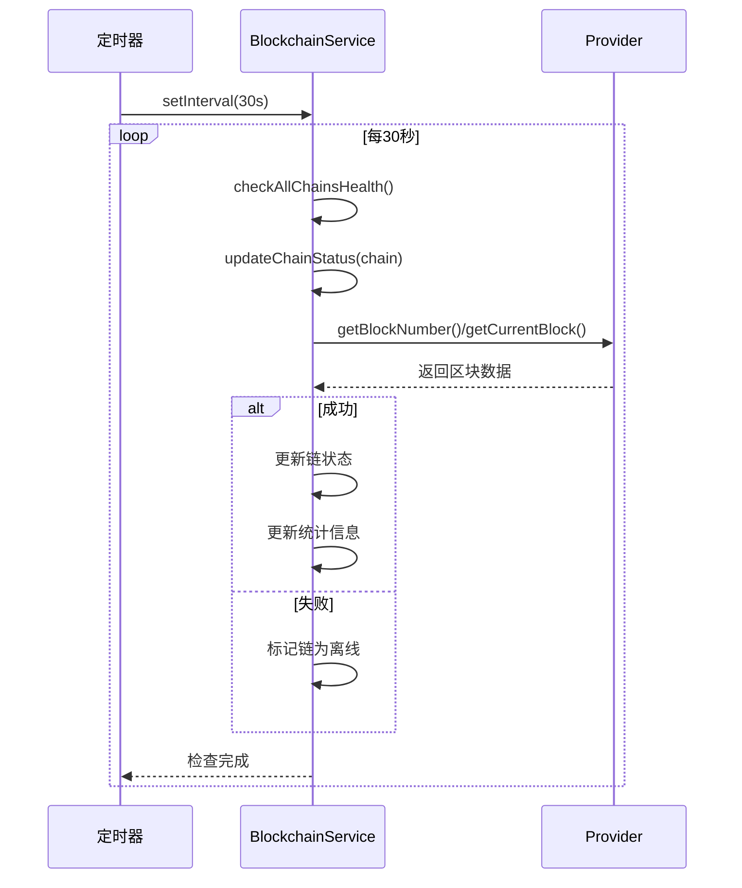
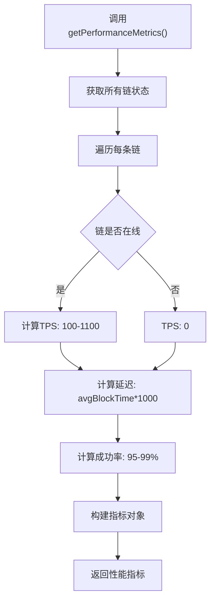
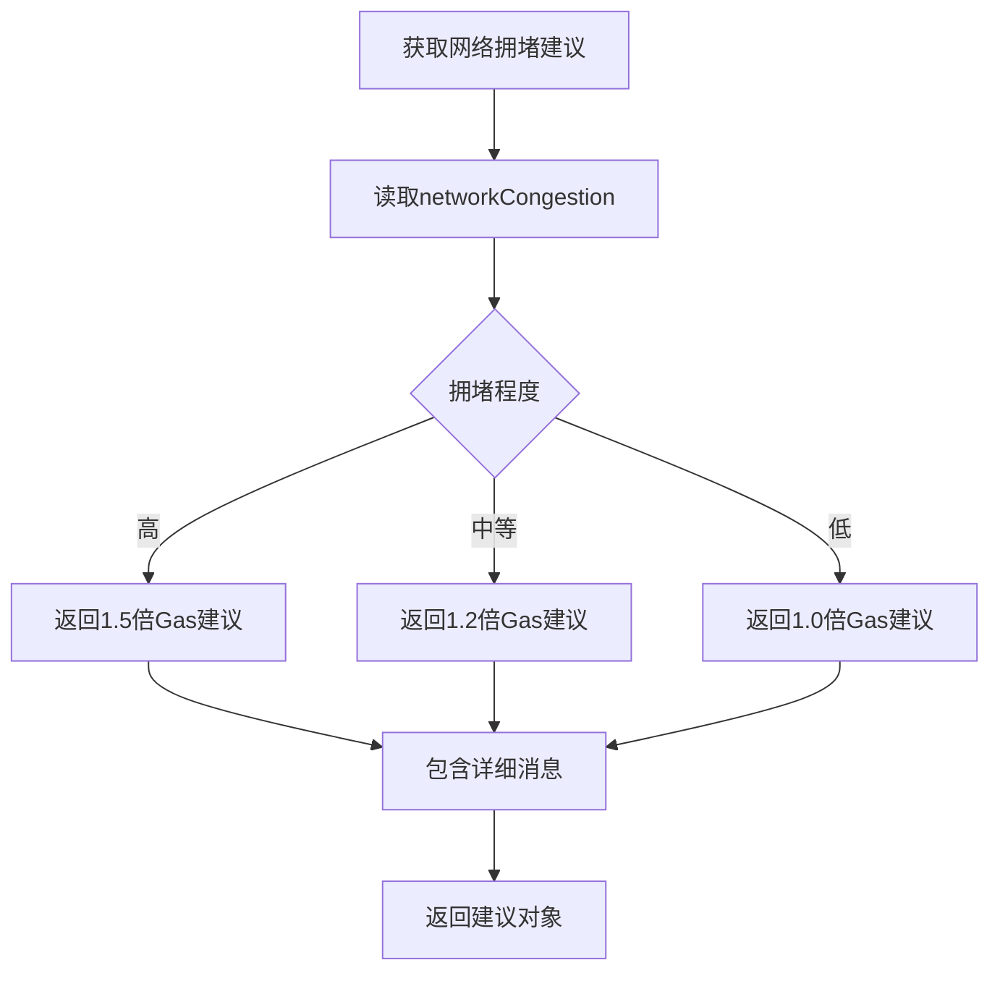
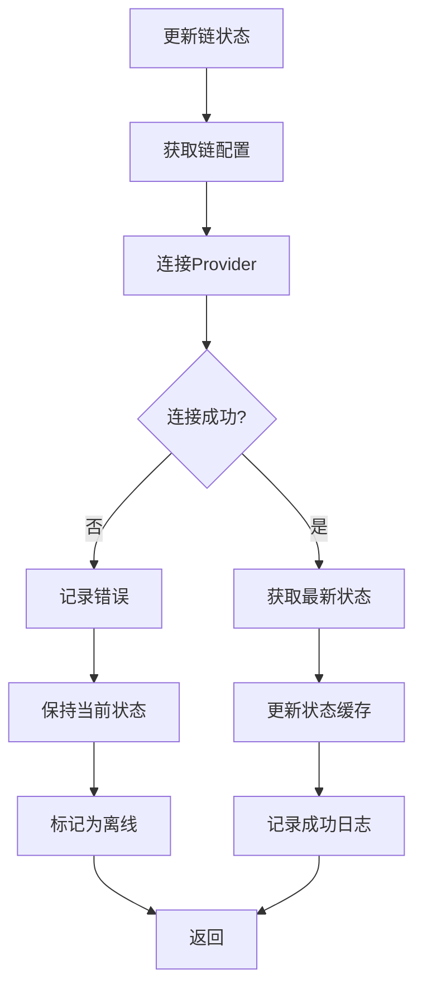

# 网络状态API

<cite>
**Referenced Files in This Document**   
- [blockchain.ts](file://backend/src/routes/blockchain.ts)
- [BlockchainService.ts](file://backend/src/services/BlockchainService.ts)
</cite>

## Table of Contents
1. [简介](#简介)
2. [API端点](#api端点)
3. [支持链列表结构](#支持链列表结构)
4. [网络状态检查机制](#网络状态检查机制)
5. [链健康检查定时任务](#链健康检查定时任务)
6. [性能指标监控](#性能指标监控)
7. [网络状态建议生成](#网络状态建议生成)
8. [节点故障转移与缓存机制](#节点故障转移与缓存机制)

## 简介

本文档详细说明了区块链网络状态API的核心功能和实现机制。该API提供对多链网络状态的实时监控和健康检查，包括支持的区块链列表查询、网络状态获取、性能指标监控等功能。系统通过定时任务持续检查各链的健康状况，并基于实时数据提供网络拥堵建议和Gas价格优化策略。

**Section sources**
- [blockchain.ts](file://backend/src/routes/blockchain.ts#L3-L293)
- [BlockchainService.ts](file://backend/src/services/BlockchainService.ts#L20-L306)

## API端点

网络状态API提供了两个核心端点用于获取区块链网络信息：

1. `GET /api/blockchain/chains` - 获取支持的区块链列表
2. `GET /api/blockchain/network/:chainName/status` - 获取特定链的网络状态

这些端点由`blockchain.ts`路由文件定义，通过`BlockchainService`服务类实现核心功能。

**Diagram sources**
- [blockchain.ts](file://backend/src/routes/blockchain.ts#L3-L293)

**Section sources**
- [blockchain.ts](file://backend/src/routes/blockchain.ts#L3-L293)

## 支持链列表结构

`GET /api/blockchain/chains`端点返回系统支持的所有区块链的配置信息。该信息由`MultiChainService`类管理，包含以下核心字段：

| 字段 | 类型 | 描述 |
|------|------|------|
| chainId | number | 区块链的唯一标识ID |
| name | string | 链的名称（如Ethereum、TRON） |
| symbol | string | 链的代币符号（如ETH、TRX） |
| rpcUrl | string | 链的RPC节点URL |
| explorerUrl | string | 区块链浏览器URL |
| nativeCurrency | object | 原生代币信息 |
| stablecoins | object | 支持的稳定币配置 |

每个链的配置还包含其支持的稳定币信息，包括代币地址、小数位数、符号和名称。当前系统支持Ethereum、TRON和BSC三条主要区块链及其上的主流稳定币。

**Section sources**
- [blockchain.ts](file://backend/src/routes/blockchain.ts#L7-L293)
- [BlockchainService.ts](file://backend/src/services/BlockchainService.ts#L48-L505)

## 网络状态检查机制

网络状态检查通过`BlockchainService`类实现，能够获取各链的实时状态信息，包括块高度、Gas价格和网络拥堵程度。

### 块高度获取

块高度通过不同方式获取，取决于链的类型：
- **EVM链（Ethereum、BSC）**：通过provider的`getBlockNumber()`方法获取
- **TRON链**：通过TRON Web API的`getCurrentBlock()`方法获取区块头中的块号

### Gas价格获取

Gas价格的获取方式也因链而异：
- **EVM链**：使用provider的`getFeeData()`方法获取基础Gas价格，并使用ethers库格式化为Gwei单位
- **TRON链**：使用固定的能量费用（420 TRX）

### 网络拥堵程度计算

网络拥堵程度基于待处理交易数量计算：
- **低拥堵**：平均待处理交易数 ≤ 500
- **中等拥堵**：500 < 平均待处理交易数 ≤ 1000  
- **高拥堵**：平均待处理交易数 > 1000

**Diagram sources**
- [BlockchainService.ts](file://backend/src/services/BlockchainService.ts#L120-L168)

**Section sources**
- [BlockchainService.ts](file://backend/src/services/BlockchainService.ts#L120-L168)

## 链健康检查定时任务

`BlockchainService`实现了自动化的链健康检查机制，通过`startHealthCheck`方法启动定时任务。

### 定时任务配置

- **默认间隔**：30秒（30000毫秒）
- **可配置**：通过参数`intervalMs`自定义检查间隔
- **持续运行**：使用`setInterval`实现周期性执行

### 健康检查流程

1. 遍历所有支持的区块链
2. 对每条链执行`updateChainStatus`方法
3. 更新全局统计信息
4. 记录操作日志

当链状态更新失败时，系统会将该链标记为离线状态，确保状态信息的准确性。

**Diagram sources**
- [BlockchainService.ts](file://backend/src/services/BlockchainService.ts#L270-L291)

**Section sources**
- [BlockchainService.ts](file://backend/src/services/BlockchainService.ts#L270-L291)

## 性能指标监控

`getPerformanceMetrics`方法提供区块链性能的综合指标，用于监控系统整体健康状况。

### 监控指标

| 指标 | 描述 | 计算方式 |
|------|------|----------|
| 吞吐量(throughput) | 每秒交易数(TPS) | 在线链的随机TPS值 |
| 延迟(latency) | 确认延迟（毫秒） | 平均出块时间×1000 |
| 成功率(successRate) | 交易成功率 | 在线链95-99%，离线链0% |

### 指标获取流程

1. 获取所有链的状态
2. 为每条链计算性能指标
3. 返回结构化指标数据

这些指标可用于系统监控面板、性能分析和故障排查。

**Diagram sources**
- [BlockchainService.ts](file://backend/src/services/BlockchainService.ts#L270-L291)

**Section sources**
- [BlockchainService.ts](file://backend/src/services/BlockchainService.ts#L270-L291)

## 网络状态建议生成

系统根据网络拥堵程度生成相应的Gas价格建议，帮助用户优化交易成本和确认速度。

### 建议逻辑

| 拥堵程度 | 建议信息 | Gas价格倍数 |
|----------|----------|------------|
| 低 | 网络运行正常，可正常发送交易 | 1.0倍 |
| 中等 | 网络拥堵中等，建议适当增加Gas费 | 1.2倍 |
| 高 | 网络拥堵严重，建议增加Gas费或稍后重试 | 1.5倍 |

### 估算方法

`estimateOptimalGasPrice`方法提供多级Gas价格估算：
- **慢速**：基础价格的80%
- **标准**：基础价格的100%
- **快速**：基础价格的120%
- **即时**：基础价格的150%

**Diagram sources**
- [BlockchainService.ts](file://backend/src/services/BlockchainService.ts#L187-L214)

**Section sources**
- [BlockchainService.ts](file://backend/src/services/BlockchainService.ts#L187-L214)

## 节点故障转移与缓存机制

系统实现了健壮的故障转移和状态缓存机制，确保服务的高可用性。

### 故障转移策略

当链状态更新失败时，系统执行以下操作：
1. 记录错误日志
2. 保持现有状态数据
3. 将链标记为离线状态
4. 在后续检查中尝试恢复

### 状态缓存机制

- **内存缓存**：使用`Map<string, ChainStatus>`存储链状态
- **自动更新**：通过定时任务定期刷新状态
- **数据一致性**：确保状态更新的原子性
- **初始化**：在服务启动时初始化所有支持链的状态

这些机制共同确保了即使在部分节点故障的情况下，系统仍能提供稳定的服务，并在节点恢复后自动恢复正常状态。

**Diagram sources**
- [BlockchainService.ts](file://backend/src/services/BlockchainService.ts#L120-L168)

**Section sources**
- [BlockchainService.ts](file://backend/src/services/BlockchainService.ts#L120-L168)