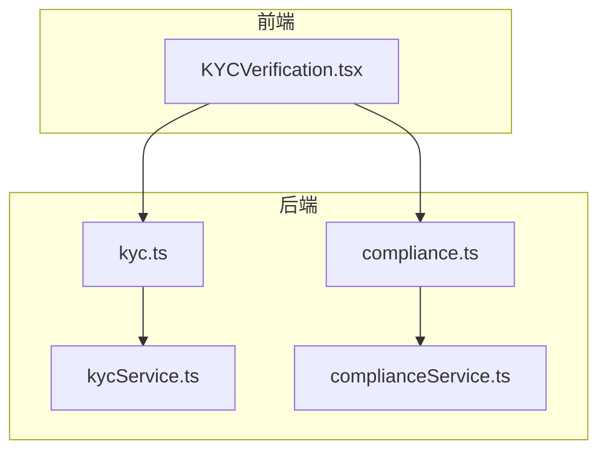
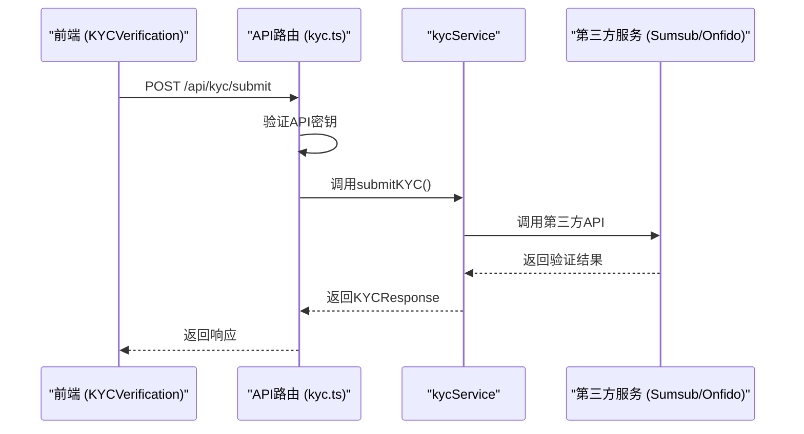
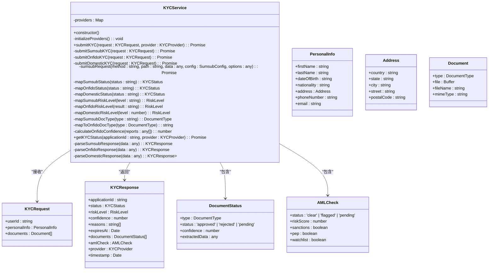
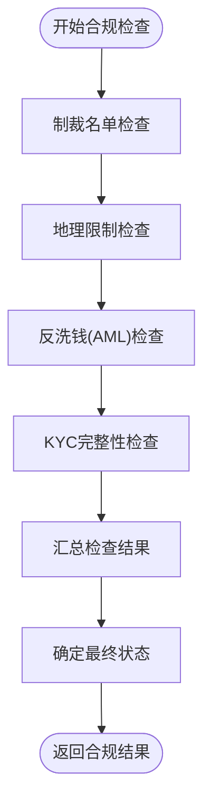
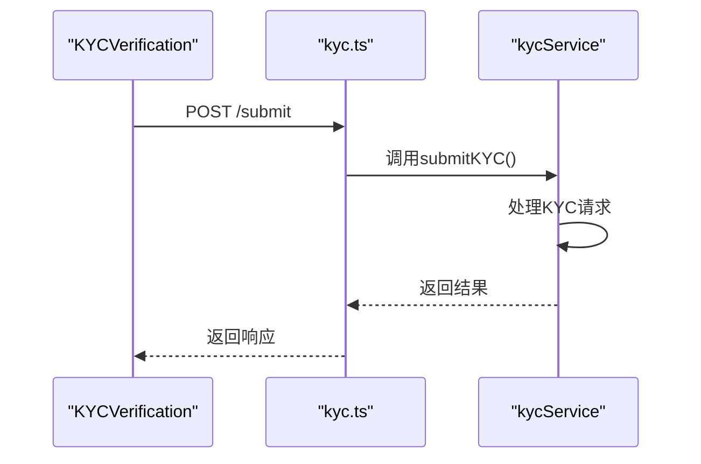
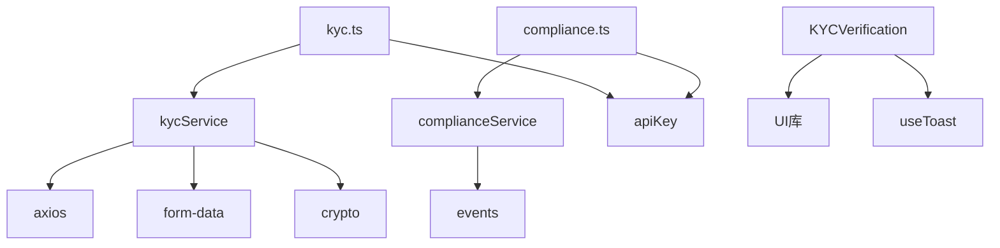

# 合规API

<cite>
**本文档引用文件**  
- [kycService.ts](file://backend/src/services/kycService.ts)
- [kyc.ts](file://backend/src/routes/kyc.ts)
- [complianceService.ts](file://backend/src/services/complianceService.ts)
- [compliance.ts](file://backend/src/routes/compliance.ts)
- [KYCVerification.tsx](file://src/components/Compliance/KYCVerification.tsx)
- [apiKey.ts](file://backend/src/middleware/apiKey.ts)
</cite>

## 目录
1. [简介](#简介)
2. [项目结构](#项目结构)
3. [核心组件](#核心组件)
4. [架构概览](#架构概览)
5. [详细组件分析](#详细组件分析)
6. [依赖分析](#依赖分析)
7. [性能考虑](#性能考虑)
8. [故障排除指南](#故障排除指南)
9. [结论](#结论)

## 简介
本技术文档深入阐述了合规API的实现机制，重点聚焦于KYC验证流程、AML风险评估、身份文档上传等核心功能。文档详细说明了与第三方合规服务（Sumsub、Onfido）的集成方式，包括apiKey的配置和API调用模式。同时，文档解释了KYC状态机（待提交、审核中、已通过、已拒绝）的实现逻辑，描述了合规检查的异步处理流程和结果通知机制。此外，还提供了kycService中身份验证回调的实现细节，以及合规数据的加密存储策略，并包含了前端KYCVerification组件与后端API的集成示例。

## 项目结构
本项目采用分层架构，前端与后端分离。后端位于`backend`目录，采用TypeScript编写，核心业务逻辑封装在`services`文件夹中。`kycService.ts`和`complianceService.ts`是实现合规功能的核心服务。API路由定义在`routes`文件夹中，`kyc.ts`和`compliance.ts`分别处理KYC和合规相关的请求。前端位于`src`目录，`components/Compliance`文件夹下的`KYCVerification.tsx`是KYC验证的前端组件。环境变量通过`.env`文件配置，用于存储第三方服务的API密钥。

**图示来源**
- [kycService.ts](file://backend/src/services/kycService.ts)
- [kyc.ts](file://backend/src/routes/kyc.ts)
- [complianceService.ts](file://backend/src/services/complianceService.ts)
- [compliance.ts](file://backend/src/routes/compliance.ts)
- [KYCVerification.tsx](file://src/components/Compliance/KYCVerification.tsx)

**本节来源**
- [kycService.ts](file://backend/src/services/kycService.ts)
- [kyc.ts](file://backend/src/routes/kyc.ts)
- [complianceService.ts](file://backend/src/services/complianceService.ts)
- [compliance.ts](file://backend/src/routes/compliance.ts)
- [KYCVerification.tsx](file://src/components/Compliance/KYCVerification.tsx)

## 核心组件
本系统的核心组件包括`kycService`和`complianceService`。`kycService`负责与Sumsub、Onfido等第三方KYC提供商集成，处理KYC申请的提交、状态查询和文档上传。它通过策略模式根据配置的提供商选择相应的验证流程。`complianceService`则负责执行多层次的合规检查，包括制裁名单筛查、地理限制检查、反洗钱（AML）检查和KYC完整性检查。这两个服务通过API路由与前端交互，并利用中间件进行API密钥验证和速率限制。

**本节来源**
- [kycService.ts](file://backend/src/services/kycService.ts)
- [complianceService.ts](file://backend/src/services/complianceService.ts)

## 架构概览
系统的整体架构遵循前后端分离模式。前端通过HTTP请求调用后端API。后端API层接收请求，通过`apiKey`中间件进行身份验证和速率限制。经过验证的请求被路由到相应的服务层。`kycService`和`complianceService`作为业务逻辑的核心，处理具体的合规任务，并与第三方服务进行通信。服务层的处理结果最终返回给前端。

**图示来源**
- [kycService.ts](file://backend/src/services/kycService.ts)
- [kyc.ts](file://backend/src/routes/kyc.ts)
- [apiKey.ts](file://backend/src/middleware/apiKey.ts)

## 详细组件分析

### KYC服务分析
`kycService`是KYC功能的核心，实现了与多个第三方服务商的集成。

#### 类结构与关系

**图示来源**
- [kycService.ts](file://backend/src/services/kycService.ts)

**本节来源**
- [kycService.ts](file://backend/src/services/kycService.ts)

### 合规服务分析
`complianceService`负责执行全面的合规性检查。

#### 合规检查流程

**图示来源**
- [complianceService.ts](file://backend/src/services/complianceService.ts)

**本节来源**
- [complianceService.ts](file://backend/src/services/complianceService.ts)

### 前端KYC验证组件分析
`KYCVerification`组件为用户提供了一个多步骤的KYC验证界面。

#### 组件与后端交互流程

**图示来源**
- [kyc.ts](file://backend/src/routes/kyc.ts)
- [kycService.ts](file://backend/src/services/kycService.ts)
- [KYCVerification.tsx](file://src/components/Compliance/KYCVerification.tsx)

**本节来源**
- [KYCVerification.tsx](file://src/components/Compliance/KYCVerification.tsx)

## 依赖分析
系统依赖于多个外部库和第三方服务。后端主要依赖`axios`进行HTTP请求，`form-data`用于构建表单数据，`crypto`用于生成签名。核心业务逻辑依赖于`kycService`和`complianceService`。前端组件依赖于UI库（如shadcn/ui）和`useToast`等自定义Hook。API路由依赖于`kycService`和`complianceService`来处理业务逻辑，并依赖于`apiKey`中间件进行安全验证。

**图示来源**
- [kycService.ts](file://backend/src/services/kycService.ts)
- [complianceService.ts](file://backend/src/services/complianceService.ts)
- [kyc.ts](file://backend/src/routes/kyc.ts)
- [compliance.ts](file://backend/src/routes/compliance.ts)
- [apiKey.ts](file://backend/src/middleware/apiKey.ts)
- [KYCVerification.tsx](file://src/components/Compliance/KYCVerification.tsx)

**本节来源**
- [kycService.ts](file://backend/src/services/kycService.ts)
- [complianceService.ts](file://backend/src/services/complianceService.ts)
- [kyc.ts](file://backend/src/routes/kyc.ts)
- [compliance.ts](file://backend/src/routes/compliance.ts)
- [apiKey.ts](file://backend/src/middleware/apiKey.ts)

## 性能考虑
为了确保系统的高性能和稳定性，实施了多项措施。首先，通过`apiKeyRateLimit`中间件对API请求进行速率限制，防止滥用。其次，与第三方服务的通信采用异步非阻塞模式，避免阻塞主线程。对于合规检查，`complianceService`将多个检查并行执行，以减少总体响应时间。此外，建议对频繁查询的KYC状态和合规结果进行缓存，以减轻数据库压力。

## 故障排除指南
当遇到问题时，请按以下步骤进行排查：
1.  **检查API密钥**：确保请求头中包含了正确的`x-api-key`，并确认该密钥在配置中有效。
2.  **验证请求参数**：检查`/submit`端点的请求体是否包含`personalInfo`和`documents`等必需字段。
3.  **查看日志**：检查后端日志，特别是`提交KYC错误`和`处理KYC webhook错误`等错误信息，以定位问题根源。
4.  **确认第三方服务配置**：确保环境变量（如`SUMSUB_API_KEY`、`ONFIDO_API_KEY`）已正确设置。
5.  **检查网络连接**：确认服务器能够访问第三方KYC服务的API端点。

**本节来源**
- [kyc.ts](file://backend/src/routes/kyc.ts)
- [apiKey.ts](file://backend/src/middleware/apiKey.ts)

## 结论
本合规API设计精良，功能完备。通过`kycService`和`complianceService`的模块化设计，实现了与第三方服务的灵活集成和强大的合规检查能力。前后端分离的架构和清晰的API定义使得系统易于维护和扩展。通过实施API密钥验证和速率限制，保障了系统的安全性。未来可进一步完善`parseSumsubResponse`等响应解析方法，并实现结果缓存以提升性能。