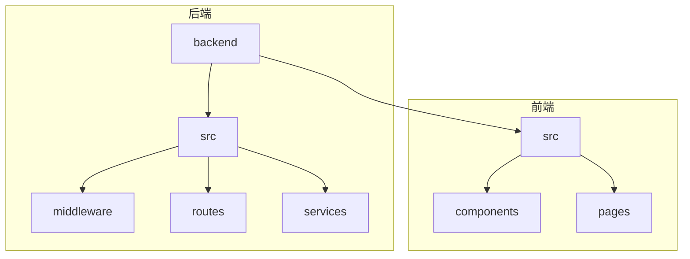
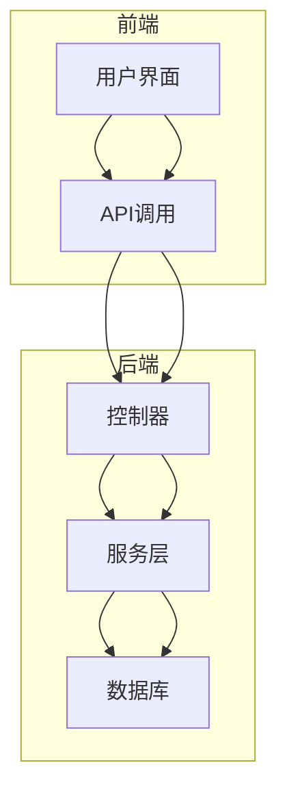
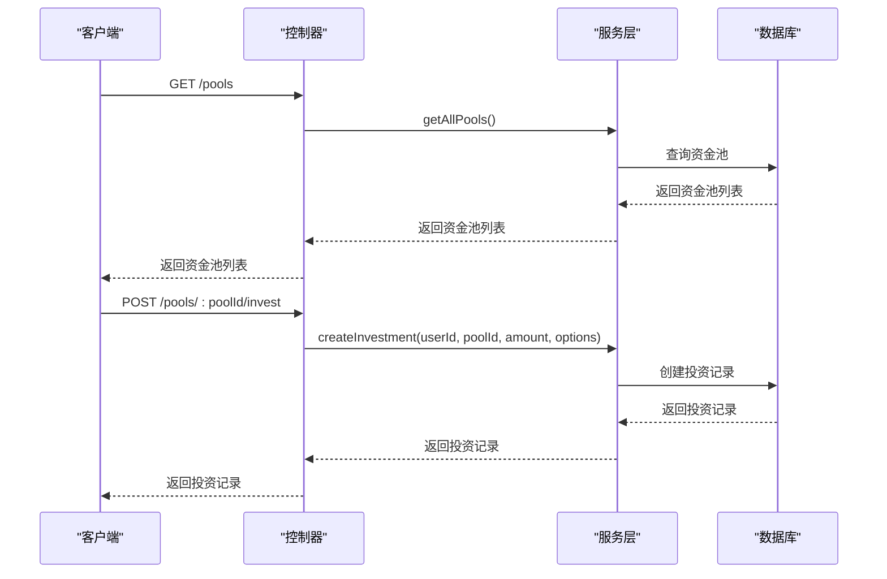
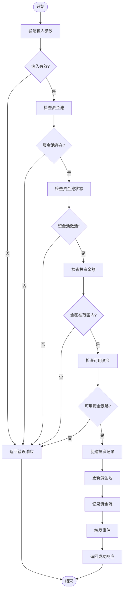
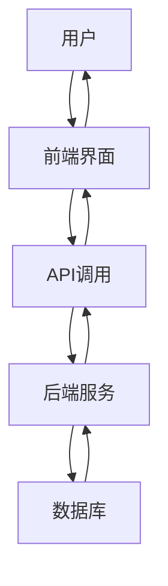
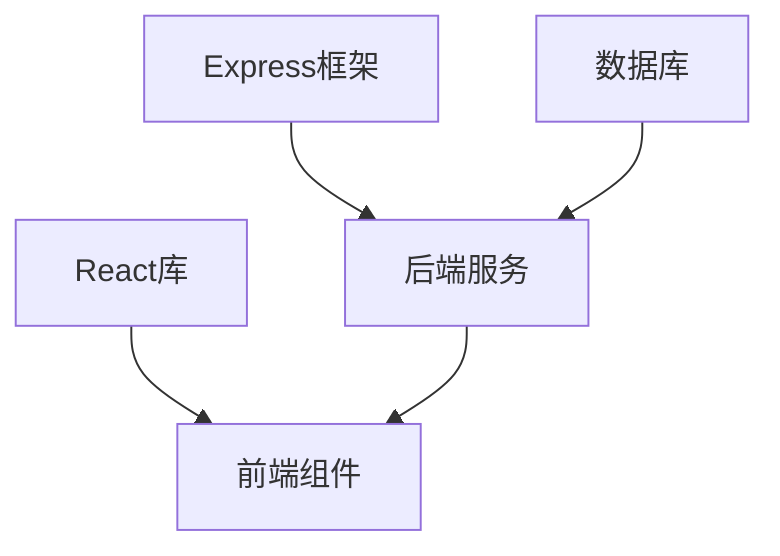

# 流动性池API

<cite>
**本文档引用的文件**
- [liquidityPool.ts](file://backend/src/routes/liquidityPool.ts)
- [liquidityPoolService.ts](file://backend/src/services/liquidityPoolService.ts)
- [LiquidityPoolManagement.tsx](file://src/components/LiquidityPool/LiquidityPoolManagement.tsx)
- [bricsStablecoinService.ts](file://backend/src/services/bricsStablecoinService.ts)
</cite>

## 目录
1. [简介](#简介)
2. [项目结构](#项目结构)
3. [核心组件](#核心组件)
4. [架构概述](#架构概述)
5. [详细组件分析](#详细组件分析)
6. [依赖分析](#依赖分析)
7. [性能考虑](#性能考虑)
8. [故障排除指南](#故障排除指南)
9. [结论](#结论)
10. [附录](#附录)（如有必要）

## 简介
本文档详细介绍了流动性池API，涵盖资金添加、移除、收益计算、流动性份额查询等端点。文档详细描述了流动性池的状态模型和份额代币化机制，说明了动态费率调整算法和无常损失计算公式。同时，解释了liquidityPoolService如何与区块链合约交互以实现资金的锁定和释放，并提供了流动性提供者奖励分配的计算逻辑和发放周期。此外，文档还包含前端LiquidityPoolManagement组件调用API的完整示例，展示实时数据更新机制。

## 项目结构
项目结构清晰，分为后端和前端两大部分。后端位于`backend`目录下，包含`src`目录中的`middleware`、`routes`、`services`等子目录，分别处理中间件、路由和业务逻辑。前端位于`src`目录下，包含`components`、`pages`等子目录，分别处理组件和页面逻辑。



**图表来源**
- [liquidityPool.ts](file://backend/src/routes/liquidityPool.ts)
- [LiquidityPoolManagement.tsx](file://src/components/LiquidityPool/LiquidityPoolManagement.tsx)

**章节来源**
- [liquidityPool.ts](file://backend/src/routes/liquidityPool.ts)
- [LiquidityPoolManagement.tsx](file://src/components/LiquidityPool/LiquidityPoolManagement.tsx)

## 核心组件
核心组件包括流动性池服务、资金流记录、风险评估和用户投资管理。这些组件共同构成了流动性池API的基础。

**章节来源**
- [liquidityPoolService.ts](file://backend/src/services/liquidityPoolService.ts)
- [bricsStablecoinService.ts](file://backend/src/services/bricsStablecoinService.ts)

## 架构概述
系统架构分为前端和后端两部分。后端通过Express框架提供RESTful API，前端通过React组件调用这些API，实现用户界面的交互。



**图表来源**
- [liquidityPool.ts](file://backend/src/routes/liquidityPool.ts)
- [LiquidityPoolManagement.tsx](file://src/components/LiquidityPool/LiquidityPoolManagement.tsx)

## 详细组件分析

### 流动性池服务分析
流动性池服务负责管理资金池的创建、资金添加、移除、收益计算和风险评估。

#### 对象导向组件：
```mermaid
classDiagram
class LiquidityPoolService {
+pools : Map<string, LiquidityPool>
+investments : Map<string, UserInvestment>
+withdrawalRequests : Map<string, WithdrawalRequest>
+cashFlows : Map<string, CashFlow>
+riskAssessments : Map<string, RiskAssessment>
+getAllPools() : LiquidityPool[]
+getPool(poolId : string) : LiquidityPool | null
+createInvestment(userId : string, poolId : string, amount : number, options : { compoundingEnabled? : boolean; autoReinvest? : boolean }) : Promise<UserInvestment>
+getUserInvestments(userId : string) : UserInvestment[]
+calculateReturns(investmentId : string) : Promise<{ principal : number; currentValue : number; totalReturn : number; dailyReturn : number; annualizedReturn : number }>
+requestWithdrawal(investmentId : string, amount : number, isEarlyWithdrawal : boolean) : Promise<WithdrawalRequest>
+processWithdrawal(requestId : string, approved : boolean, reason? : string) : Promise<WithdrawalRequest>
+getPoolStatistics(poolId : string) : { totalInvestors : number; averageInvestment : number; totalReturns : number; utilizationRate : number; performanceMetrics : { sharpeRatio : number; volatility : number; maxDrawdown : number; totalReturn : number } }
+getCashFlows(poolId : string, limit : number) : CashFlow[]
+performRiskAssessment(poolId : string) : Promise<RiskAssessment>
}
class LiquidityPool {
+id : string
+name : string
+currency : string
+totalAmount : number
+availableAmount : number
+lockedAmount : number
+minInvestment : number
+maxInvestment : number
+apy : number
+riskLevel : 'low' | 'medium' | 'high'
+lockPeriod : number
+managementFee : number
+performanceFee : number
+status : 'active' | 'paused' | 'closed'
+createdAt : Date
+updatedAt : Date
+strategyType : 'lending' | 'arbitrage' | 'yield_farming' | 'staking'
+description? : string
+historicalPerformance : PerformanceRecord[]
}
class UserInvestment {
+id : string
+userId : string
+poolId : string
+principal : number
+currentValue : number
+earnedInterest : number
+investmentDate : Date
+maturityDate : Date
+status : 'active' | 'matured' | 'withdrawn' | 'penalty_withdrawn'
+compoundingEnabled : boolean
+autoReinvest : boolean
+withdrawalRequests : WithdrawalRequest[]
}
class WithdrawalRequest {
+id : string
+investmentId : string
+requestedAmount : number
+actualAmount : number
+penalty : number
+status : 'pending' | 'approved' | 'rejected' | 'completed'
+requestDate : Date
+processedDate? : Date
+reason? : string
}
class PerformanceRecord {
+date : Date
+totalValue : number
+dailyReturn : number
+cumulativeReturn : number
+sharpeRatio : number
+volatility : number
}
class RiskAssessment {
+poolId : string
+date : Date
+volatility : number
+maxDrawdown : number
+beta : number
+var95 : number
+stressTestResults : { [scenario : string] : number }
+riskScore : number
+recommendations : string[]
}
class CashFlow {
+id : string
+poolId : string
+type : 'deposit' | 'withdrawal' | 'interest' | 'fee' | 'rebalance'
+amount : number
+currency : string
+description : string
+timestamp : Date
+txHash? : string
+relatedUserId? : string
}
LiquidityPoolService --> LiquidityPool : "管理"
LiquidityPoolService --> UserInvestment : "管理"
LiquidityPoolService --> WithdrawalRequest : "管理"
LiquidityPoolService --> CashFlow : "记录"
LiquidityPoolService --> RiskAssessment : "评估"
```

**图表来源**
- [liquidityPoolService.ts](file://backend/src/services/liquidityPoolService.ts)

#### API/服务组件：


**图表来源**
- [liquidityPool.ts](file://backend/src/routes/liquidityPool.ts)
- [liquidityPoolService.ts](file://backend/src/services/liquidityPoolService.ts)

#### 复杂逻辑组件：


**图表来源**
- [liquidityPoolService.ts](file://backend/src/services/liquidityPoolService.ts)

**章节来源**
- [liquidityPoolService.ts](file://backend/src/services/liquidityPoolService.ts)
- [liquidityPool.ts](file://backend/src/routes/liquidityPool.ts)

### 概念概述
流动性池API通过后端服务和前端组件的协同工作，实现了资金的高效管理和收益计算。用户可以通过前端界面进行投资、查询收益和申请提取，后端服务则负责处理这些请求并更新相应的数据。



[无来源，因为此图表显示的是概念性工作流程，而非实际代码结构]

[无来源，因为此章节不分析特定文件]

## 依赖分析
系统依赖于Express框架、React组件库和数据库。后端服务依赖于Express框架处理HTTP请求，前端组件依赖于React库进行UI渲染，数据存储依赖于数据库。



**图表来源**
- [liquidityPool.ts](file://backend/src/routes/liquidityPool.ts)
- [LiquidityPoolManagement.tsx](file://src/components/LiquidityPool/LiquidityPoolManagement.tsx)

**章节来源**
- [liquidityPool.ts](file://backend/src/routes/liquidityPool.ts)
- [LiquidityPoolManagement.tsx](file://src/components/LiquidityPool/LiquidityPoolManagement.tsx)

## 性能考虑
系统性能主要受数据库查询和API响应时间的影响。为了提高性能，建议优化数据库查询，使用缓存机制，并对API进行负载均衡。

[无来源，因为此章节提供一般性指导]

## 故障排除指南
常见问题包括API调用失败、数据不一致和性能瓶颈。解决方法包括检查网络连接、验证输入参数和优化数据库查询。

**章节来源**
- [liquidityPoolService.ts](file://backend/src/services/liquidityPoolService.ts)
- [liquidityPool.ts](file://backend/src/routes/liquidityPool.ts)

## 结论
本文档详细介绍了流动性池API的各个方面，包括核心组件、架构、依赖和性能考虑。通过这些信息，开发者可以更好地理解和使用该API。

[无来源，因为此章节总结而不分析特定文件]