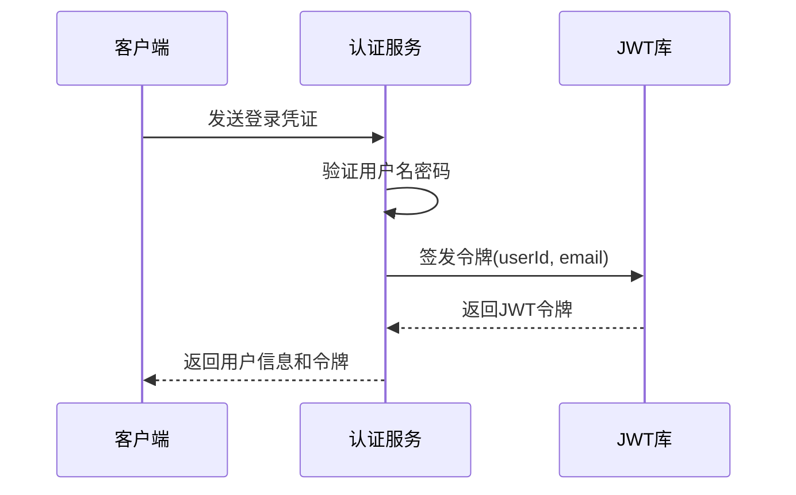
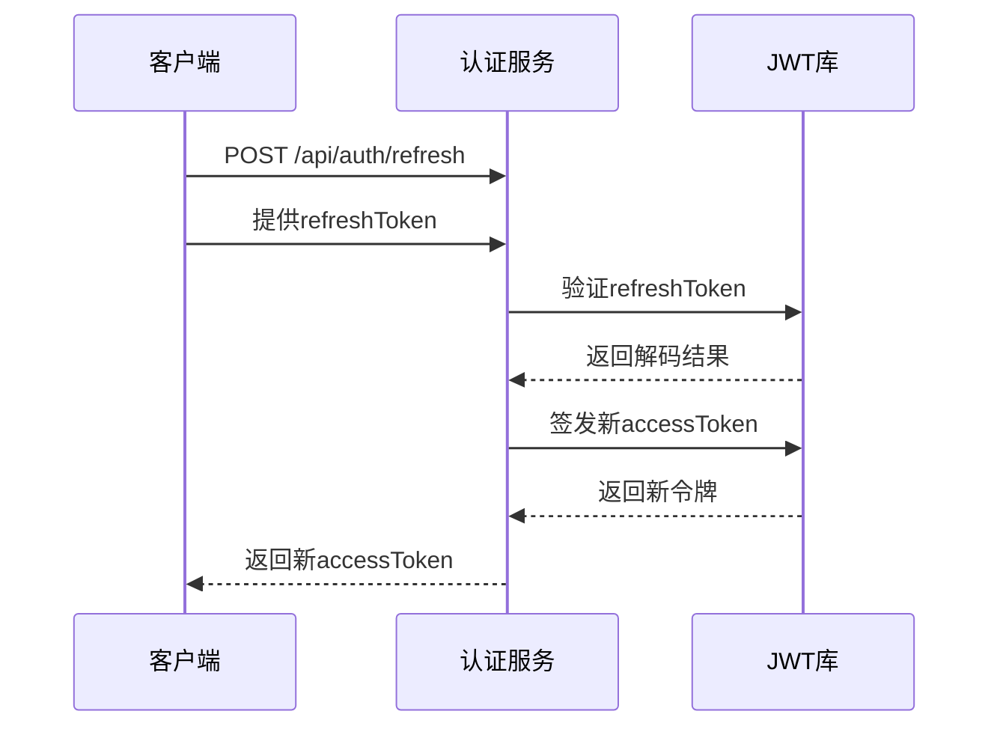
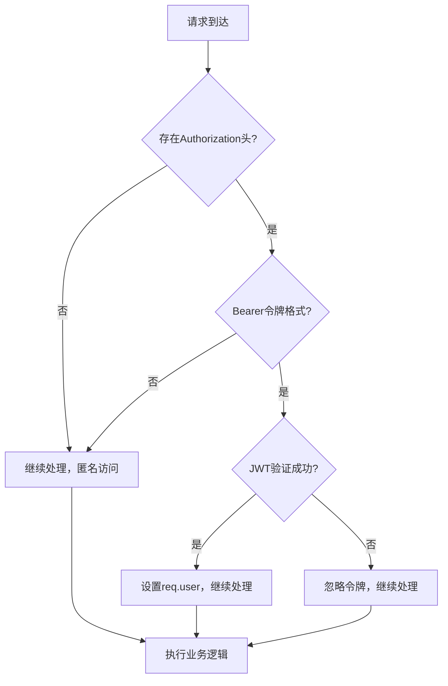
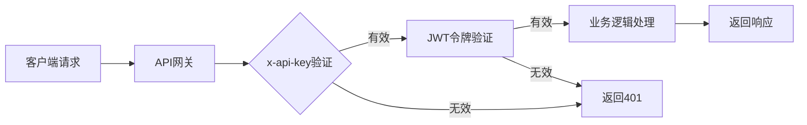

# 用户API

<cite>
**本文档中引用的文件**  
- [auth.ts](file://backend/src/routes/auth.ts)
- [auth.ts](file://backend/src/middleware/auth.ts)
- [apiKey.ts](file://backend/src/middleware/apiKey.ts)
- [user.ts](file://backend/src/routes/user.ts)
- [index.ts](file://backend/src/index.ts)
</cite>

## 目录
1. [简介](#简介)
2. [核心端点说明](#核心端点说明)
3. [JWT令牌与刷新机制](#jwt令牌与刷新机制)
4. [用户资料管理](#用户资料管理)
5. [认证中间件机制](#认证中间件机制)
6. [调用示例](#调用示例)
7. [错误代码参考](#错误代码参考)

## 简介
本API文档详细描述了用户注册、登录、个人资料管理及认证刷新等核心功能。系统采用JWT进行身份验证，并结合API密钥实现双重安全控制。所有用户相关接口均位于`/api/auth`和`/api/user`路径下，支持标准RESTful设计。

**Section sources**
- [index.ts](file://backend/src/index.ts#L39-L252)

## 核心端点说明

### 用户注册 (POST /api/auth/register)
用于创建新用户账户。

**请求体结构**
```json
{
  "email": "string",
  "password": "string",
  "fullName": "string"
}
```

**响应格式**
```json
{
  "success": true,
  "data": {
    "user": {
      "id": "string",
      "email": "string",
      "fullName": "string"
    },
    "token": "string"
  }
}
```

**Section sources**
- [auth.ts](file://backend/src/routes/auth.ts#L5-L39)

### 用户登录 (POST /api/auth/login)
用于已有用户的身份验证。

**请求体结构**
```json
{
  "email": "string",
  "password": "string"
}
```

**响应格式**
```json
{
  "success": true,
  "data": {
    "user": {
      "id": "string",
      "email": "string",
      "fullName": "string"
    },
    "token": "string"
  }
}
```

**Section sources**
- [auth.ts](file://backend/src/routes/auth.ts#L59-L119)

## JWT令牌与刷新机制

### JWT令牌生成
系统使用`jsonwebtoken`库生成访问令牌，有效期为24小时。令牌包含用户ID和邮箱信息。



**Diagram sources**
- [auth.ts](file://backend/src/routes/auth.ts#L95-L105)

### 刷新令牌流程
通过`/api/auth/refresh`端点使用刷新令牌获取新的访问令牌。



**Diagram sources**
- [auth.ts](file://backend/src/routes/auth.ts#L116-L156)

## 用户资料管理

### 获取用户资料 (GET /api/user/profile)
返回当前认证用户的基本信息和偏好设置。

**响应格式**
```json
{
  "success": true,
  "data": {
    "id": "string",
    "email": "string",
    "fullName": "string",
    "phone": "string",
    "kycStatus": "string",
    "createdAt": "string",
    "lastLoginAt": "string",
    "walletAddress": "string",
    "preferences": {
      "language": "string",
      "currency": "string",
      "notifications": {
        "email": "boolean",
        "sms": "boolean",
        "push": "boolean"
      }
    }
  }
}
```

### 更新用户资料 (PUT /api/user/profile)
允许用户更新其个人信息和偏好设置。

**请求体结构**
```json
{
  "fullName": "string",
  "phone": "string",
  "preferences": {
    "language": "string",
    "currency": "string",
    "notifications": {
      "email": "boolean",
      "sms": "boolean",
      "push": "boolean"
    }
  }
}
```

**权限控制**
- 必须提供有效的JWT令牌
- 用户只能更新自己的资料
- 管理员可更新任何用户资料

**数据验证规则**
- 全名：必填，最大长度255字符
- 电话号码：可选，需符合国际格式
- 语言偏好：必须是有效语言代码（如zh-CN, en-US）
- 通知设置：布尔值

**Section sources**
- [user.ts](file://backend/src/routes/user.ts#L0-L52)

## 认证中间件机制

### 可选认证中间件 (optionalAuthMiddleware)
允许接口在有令牌时识别用户，在无令牌时仍可访问。



**使用场景**
- 首页内容展示
- 公共市场数据
- 产品介绍页面
- 部分分析数据

**Section sources**
- [auth.ts](file://backend/src/middleware/auth.ts#L61-L97)

### API密钥协同工作机制
所有API请求需同时通过API密钥和JWT令牌双重验证。



**协同流程**
1. 请求首先进入`validateApiKey`中间件
2. 验证`x-api-key`请求头的有效性
3. 通过后进入`authMiddleware`进行JWT验证
4. 双重验证通过后执行业务逻辑

**Section sources**
- [apiKey.ts](file://backend/src/middleware/apiKey.ts#L3-L39)
- [index.ts](file://backend/src/index.ts#L85-L117)

## 调用示例

### cURL命令示例

**用户注册**
```bash
curl -X POST http://localhost:3001/api/auth/register \
  -H "Content-Type: application/json" \
  -d '{
    "email": "user@example.com",
    "password": "secure123",
    "fullName": "张三"
  }'
```

**用户登录**
```bash
curl -X POST http://localhost:3001/api/auth/login \
  -H "Content-Type: application/json" \
  -d '{
    "email": "user@example.com",
    "password": "secure123"
  }'
```

**获取用户资料**
```bash
curl -X GET http://localhost:3001/api/user/profile \
  -H "Authorization: Bearer <your-jwt-token>" \
  -H "x-api-key: <your-api-key>"
```

### 前端调用示例

```typescript
// 登录函数
async function login(email: string, password: string) {
  try {
    const response = await fetch('/api/auth/login', {
      method: 'POST',
      headers: {
        'Content-Type': 'application/json',
        'x-api-key': import.meta.env.VITE_API_KEY
      },
      body: JSON.stringify({ email, password })
    });

    const data = await response.json();
    
    if (data.success) {
      // 存储令牌
      localStorage.setItem('token', data.data.token);
      // 更新认证状态
      setAuthState({ 
        isAuthenticated: true, 
        user: data.data.user 
      });
    }
    
    return data;
  } catch (error) {
    console.error('登录失败:', error);
  }
}

// 请求拦截器
const apiClient = axios.create({
  baseURL: '/api',
  headers: {
    'x-api-key': import.meta.env.VITE_API_KEY
  }
});

apiClient.interceptors.request.use((config) => {
  const token = localStorage.getItem('token');
  if (token) {
    config.headers.Authorization = `Bearer ${token}`;
  }
  return config;
});
```

## 错误代码参考

| HTTP状态码 | 错误代码 | 描述 | 解决方案 |
|-----------|---------|------|----------|
| 400 | 缺少必要的注册信息 | 注册时缺少必填字段 | 确保提供email、password和fullName |
| 400 | 缺少登录凭据 | 登录时缺少邮箱或密码 | 检查请求体是否包含必要字段 |
| 401 | 缺少访问令牌 | 未提供JWT令牌 | 在Authorization头中添加Bearer令牌 |
| 401 | 令牌已过期或无效 | JWT验证失败 | 重新登录或使用刷新令牌 |
| 401 | 缺少API密钥 | 未提供x-api-key | 在请求头中添加有效的API密钥 |
| 403 | 权限不足 | 角色无权访问资源 | 检查用户角色和权限设置 |
| 429 | 请求频率超限 | 超过速率限制 | 等待retryAfter秒后重试 |

**Section sources**
- [auth.ts](file://backend/src/routes/auth.ts#L5-L156)
- [auth.ts](file://backend/src/middleware/auth.ts#L0-L166)
- [apiKey.ts](file://backend/src/middleware/apiKey.ts#L0-L136)