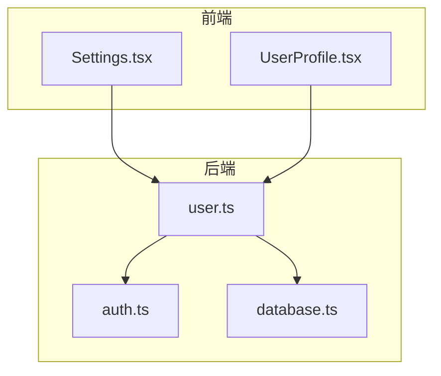
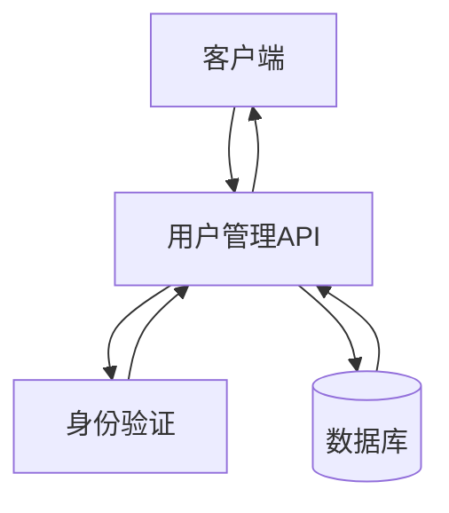
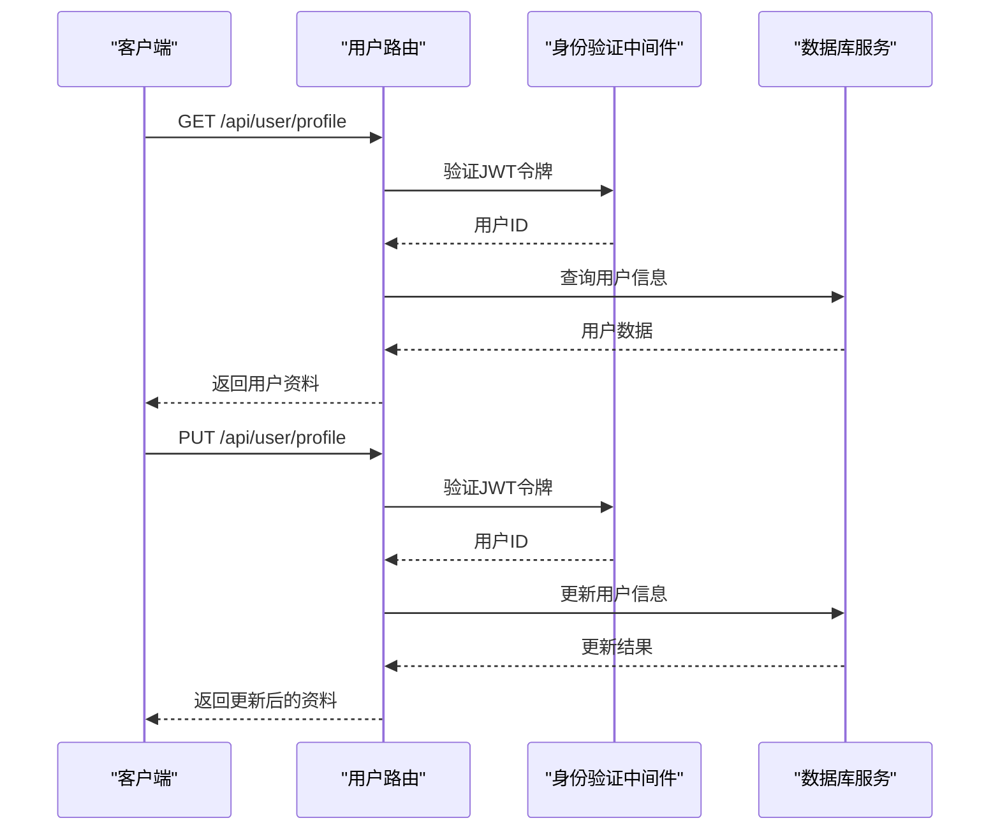
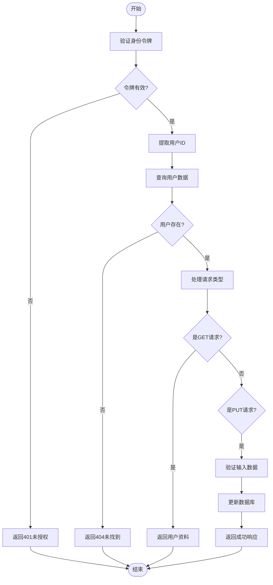
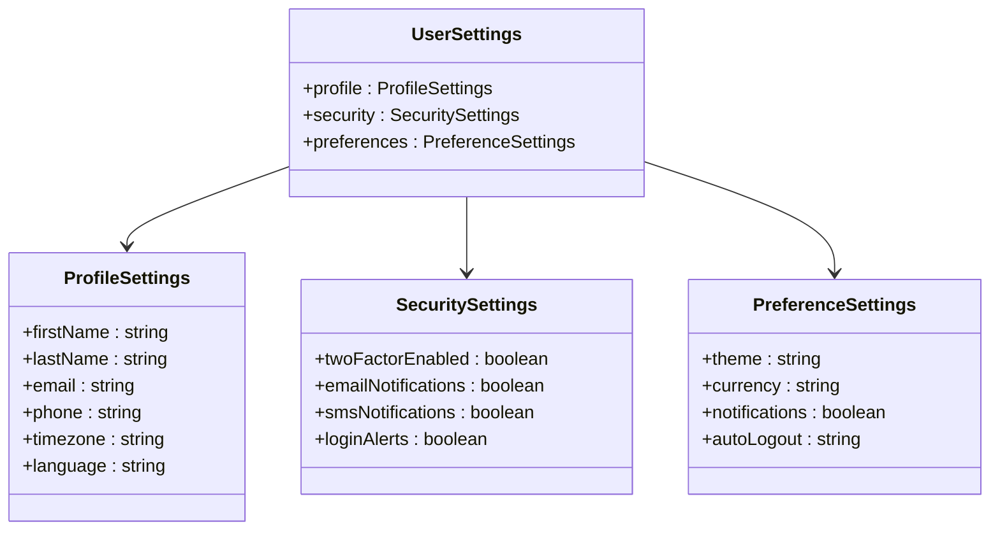
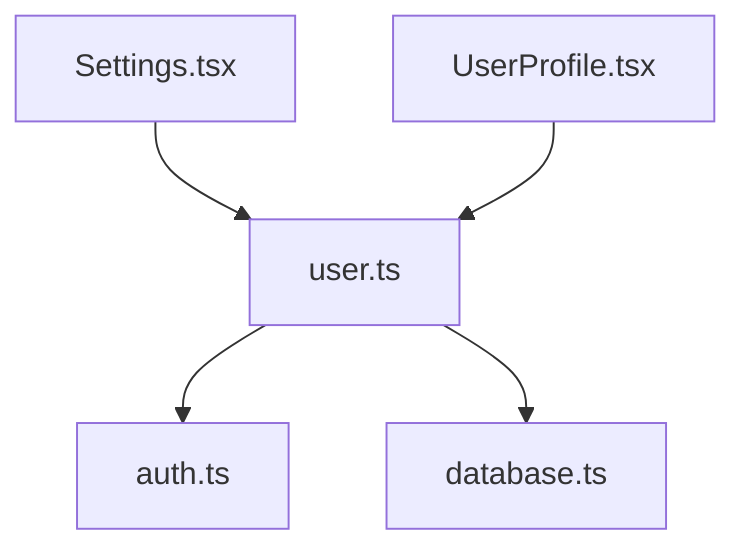

# 用户管理API

<cite>
**本文档引用的文件**
- [user.ts](file://backend/src/routes/user.ts)
- [auth.ts](file://backend/src/middleware/auth.ts)
- [database.ts](file://backend/src/services/database.ts)
- [Settings.tsx](file://src/pages/Settings.tsx)
- [UserProfile.tsx](file://src/components/Profile/UserProfile.tsx)
</cite>

## 目录
1. [简介](#简介)
2. [项目结构](#项目结构)
3. [核心组件](#核心组件)
4. [架构概述](#架构概述)
5. [详细组件分析](#详细组件分析)
6. [依赖分析](#依赖分析)
7. [性能考虑](#性能考虑)
8. [故障排除指南](#故障排除指南)
9. [结论](#结论)

## 简介
用户管理API是TriBridge平台的核心服务之一，负责处理用户资料的获取、更新、删除以及账户设置等关键操作。该API基于Next.js全栈架构构建，通过REST端点提供安全可靠的用户数据管理功能。系统实现了严格的权限控制机制，确保用户只能访问和修改自身数据，同时结合Prisma用户模型进行数据验证和字段约束。API支持多链钱包管理、KYC认证状态跟踪和用户偏好设置，为用户提供完整的账户管理体验。

## 项目结构
用户管理功能分布在前后端多个目录中，形成清晰的分层架构。后端路由处理HTTP请求，中间件负责身份验证，服务层与数据库交互；前端组件提供用户界面，实现设置页面和资料展示。

**图示来源**
- [user.ts](file://backend/src/routes/user.ts)
- [auth.ts](file://backend/src/middleware/auth.ts)
- [database.ts](file://backend/src/services/database.ts)
- [Settings.tsx](file://src/pages/Settings.tsx)
- [UserProfile.tsx](file://src/components/Profile/UserProfile.tsx)

**本节来源**
- [user.ts](file://backend/src/routes/user.ts)
- [auth.ts](file://backend/src/middleware/auth.ts)
- [database.ts](file://backend/src/services/database.ts)
- [Settings.tsx](file://src/pages/Settings.tsx)

## 核心组件
用户管理API的核心组件包括用户资料路由、身份验证中间件和数据库服务。这些组件协同工作，确保用户数据的安全访问和一致性。GET /api/user/profile端点返回用户基本信息、钱包列表和偏好设置，而PUT /api/user/profile端点处理资料更新请求，包含姓名、联系方式和默认结算链等字段的验证与存储。

**本节来源**
- [user.ts](file://backend/src/routes/user.ts#L1-L197)
- [auth.ts](file://backend/src/middleware/auth.ts#L1-L166)
- [database.ts](file://backend/src/services/database.ts#L1-L246)

## 架构概述
用户管理API采用分层架构设计，从前端界面到数据库持久化形成完整的调用链。API路由接收HTTP请求，经过身份验证中间件检查JWT令牌的有效性，然后调用相应的处理函数。数据库服务使用PostgreSQL存储用户数据，包括用户基本信息、钱包地址和交易记录等实体。整个架构通过TypeScript类型系统确保数据的一致性和安全性。

**图示来源**
- [user.ts](file://backend/src/routes/user.ts#L1-L197)
- [auth.ts](file://backend/src/middleware/auth.ts#L1-L166)
- [database.ts](file://backend/src/services/database.ts#L1-L246)

## 详细组件分析

### 用户资料管理分析
用户资料管理功能实现了完整的CRUD操作，重点在于GET和PUT请求的处理。系统通过JWT令牌中的用户ID确保数据隔离，防止用户访问他人资源。

#### 对于API/服务组件：

**图示来源**
- [user.ts](file://backend/src/routes/user.ts#L1-L197)
- [auth.ts](file://backend/src/middleware/auth.ts#L1-L166)
- [database.ts](file://backend/src/services/database.ts#L1-L246)

#### 对于复杂逻辑组件：

**图示来源**
- [user.ts](file://backend/src/routes/user.ts#L1-L197)
- [auth.ts](file://backend/src/middleware/auth.ts#L1-L166)
- [database.ts](file://backend/src/services/database.ts#L1-L246)

**本节来源**
- [user.ts](file://backend/src/routes/user.ts#L1-L197)
- [auth.ts](file://backend/src/middleware/auth.ts#L1-L166)
- [database.ts](file://backend/src/services/database.ts#L1-L246)

### 用户偏好设置分析
用户偏好设置功能允许用户自定义界面主题、语言、默认货币等选项。这些设置存储在用户记录的preferences字段中，支持个性化体验。

#### 对于对象导向组件：

**图示来源**
- [Settings.tsx](file://src/pages/Settings.tsx#L26-L47)

**本节来源**
- [Settings.tsx](file://src/pages/Settings.tsx#L26-L533)

## 依赖分析
用户管理API的组件之间存在明确的依赖关系。路由模块依赖身份验证中间件进行访问控制，同时依赖数据库服务进行数据持久化。前端设置页面依赖API端点获取和更新用户数据，形成完整的前后端协作链。

**图示来源**
- [user.ts](file://backend/src/routes/user.ts)
- [auth.ts](file://backend/src/middleware/auth.ts)
- [database.ts](file://backend/src/services/database.ts)
- [Settings.tsx](file://src/pages/Settings.tsx)

**本节来源**
- [user.ts](file://backend/src/routes/user.ts)
- [auth.ts](file://backend/src/middleware/auth.ts)
- [database.ts](file://backend/src/services/database.ts)
- [Settings.tsx](file://src/pages/Settings.tsx)

## 性能考虑
用户管理API在设计时考虑了性能优化。数据库查询使用连接池管理，减少连接开销；JWT令牌验证在内存中完成，避免数据库查询；响应数据经过精简，只返回必要字段。未来可引入Redis缓存常用用户数据，进一步提升读取性能。

## 故障排除指南
当用户管理API出现问题时，应首先检查身份验证令牌是否有效，然后验证请求参数是否符合预期格式。对于403禁止访问错误，需确认当前用户ID与目标资源所有者是否匹配。数据库连接问题可通过检查环境变量和网络配置来解决。

**本节来源**
- [user.ts](file://backend/src/routes/user.ts#L1-L197)
- [auth.ts](file://backend/src/middleware/auth.ts#L1-L166)
- [database.ts](file://backend/src/services/database.ts#L1-L246)

## 结论
用户管理API为TriBridge平台提供了安全可靠的账户管理功能。通过严格的权限控制和数据验证，确保了用户数据的安全性和一致性。API设计遵循REST原则，提供清晰的端点语义，便于前端集成。结合Next.js全栈架构，实现了简化的部署流程和统一的开发体验。未来可通过添加缓存机制和优化数据库查询进一步提升性能。