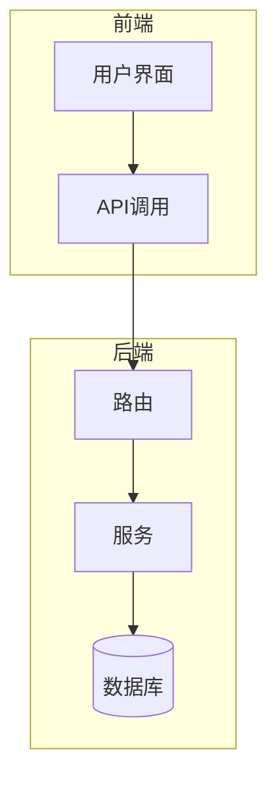
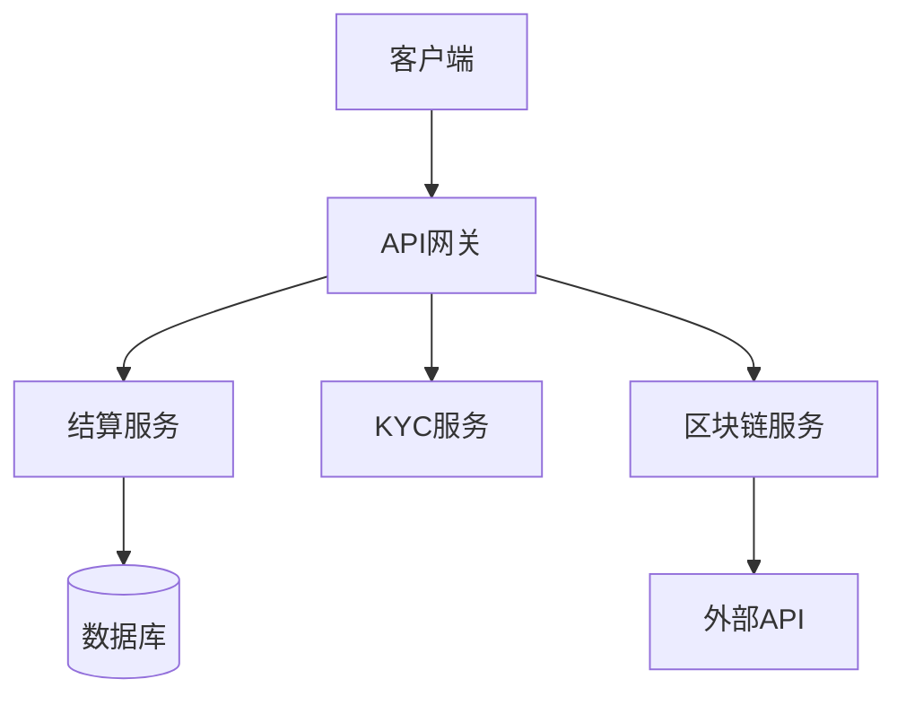
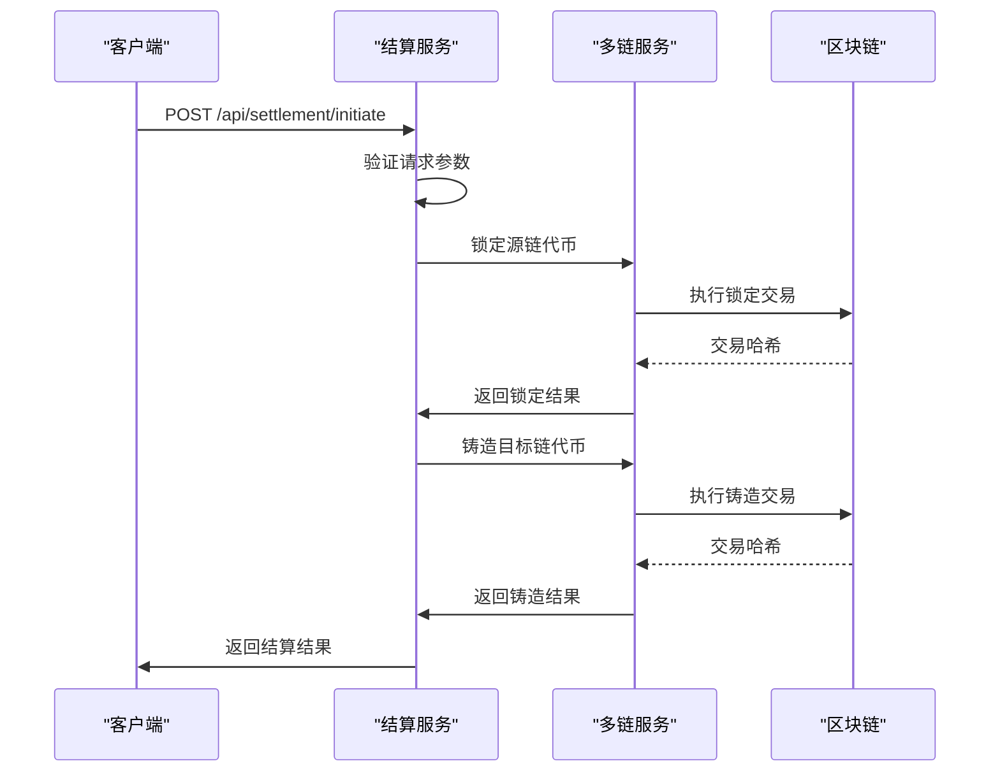
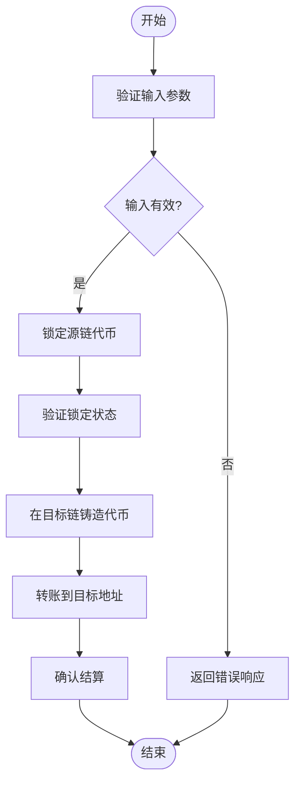
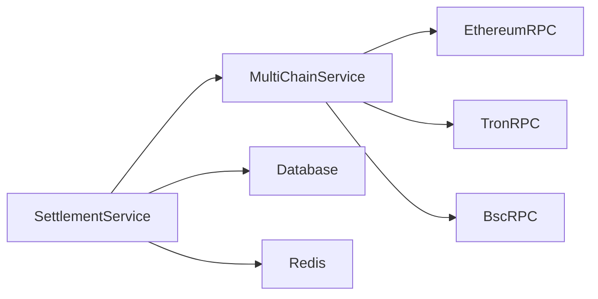

# 结算API

<cite>
**本文档引用的文件**  
- [settlement.ts](file://backend/src/routes/settlement.ts)
- [multiChainService.ts](file://backend/src/services/multiChainService.ts)
- [BlockchainService.ts](file://backend/src/services/BlockchainService.ts)
</cite>

## 目录
1. [简介](#简介)
2. [项目结构](#项目结构)
3. [核心组件](#核心组件)
4. [架构概述](#架构概述)
5. [详细组件分析](#详细组件分析)
6. [依赖分析](#依赖分析)
7. [性能考虑](#性能考虑)
8. [故障排除指南](#故障排除指南)
9. [结论](#结论)

## 简介
本API文档详细说明了跨链稳定币结算系统的核心功能，包括跨链结算、汇率锁定和最终性确认。文档重点描述了POST /api/settlement/initiate的请求结构，涵盖源/目标链、稳定币类型（USDT、USDC）、汇率锚定方式和超时设置。同时解释了multiChainService如何协调多链交易的原子性保证和失败回滚机制，以及结算状态机的转换条件。此外，还提供了结算延迟处理和对账接口的使用指南，并包含与第三方支付网关的集成点说明。

## 项目结构
项目采用分层架构，前端使用Next.js框架，后端使用Express.js提供API服务。主要目录包括backend/src/routes用于API路由，backend/src/services用于业务逻辑服务，以及src/components用于前端组件。

**Diagram sources**
- [settlement.ts](file://backend/src/routes/settlement.ts#L1-L409)

**Section sources**
- [settlement.ts](file://backend/src/routes/settlement.ts#L1-L409)

## 核心组件
核心组件包括settlement.ts中的结算路由和multiChainService.ts中的多链服务。settlement.ts处理结算订单的创建、查询和取消，而multiChainService.ts负责跨链交易的执行和状态管理。

**Section sources**
- [settlement.ts](file://backend/src/routes/settlement.ts#L1-L409)
- [multiChainService.ts](file://backend/src/services/multiChainService.ts#L1-L508)

## 架构概述
系统采用微服务架构，通过API网关统一管理所有请求。结算服务与其他服务（如KYC、区块链）通过REST API和WebSocket进行通信，确保数据的一致性和实时性。

**Diagram sources**
- [settlement.ts](file://backend/src/routes/settlement.ts#L1-L409)
- [multiChainService.ts](file://backend/src/services/multiChainService.ts#L1-L508)

## 详细组件分析

### 结算服务分析
结算服务负责处理跨链稳定币结算的核心逻辑，包括订单创建、状态管理和交易执行。

#### 对于API/服务组件：

**Diagram sources**
- [settlement.ts](file://backend/src/routes/settlement.ts#L1-L409)
- [multiChainService.ts](file://backend/src/services/multiChainService.ts#L1-L508)

### 多链服务分析
多链服务负责协调不同区块链网络之间的交易，确保跨链操作的原子性和一致性。

#### 对于复杂逻辑组件：

**Diagram sources**
- [multiChainService.ts](file://backend/src/services/multiChainService.ts#L1-L508)

**Section sources**
- [multiChainService.ts](file://backend/src/services/multiChainService.ts#L1-L508)

## 依赖分析
系统依赖于多个外部服务和库，包括区块链RPC节点、KYC服务提供商和数据库系统。这些依赖通过环境变量进行配置，确保部署的灵活性和安全性。

**Diagram sources**
- [multiChainService.ts](file://backend/src/services/multiChainService.ts#L1-L508)
- [BlockchainService.ts](file://backend/src/services/BlockchainService.ts#L1-L306)

**Section sources**
- [multiChainService.ts](file://backend/src/services/multiChainService.ts#L1-L508)
- [BlockchainService.ts](file://backend/src/services/BlockchainService.ts#L1-L306)

## 性能考虑
为确保高性能和低延迟，系统采用了多种优化策略，包括Redis缓存、数据库索引和异步处理。同时，通过负载均衡和水平扩展支持高并发访问。

## 故障排除指南
常见问题包括API密钥无效、区块链网络拥堵和数据库连接失败。建议检查环境变量配置、监控系统日志，并使用健康检查端点验证服务状态。

**Section sources**
- [settlement.ts](file://backend/src/routes/settlement.ts#L1-L409)
- [multiChainService.ts](file://backend/src/services/multiChainService.ts#L1-L508)

## 结论
本结算API文档全面介绍了跨链稳定币结算系统的设计和实现。通过详细的API说明、架构图和代码示例，开发者可以快速理解和集成该系统。未来的工作将集中在性能优化、安全增强和新功能扩展上。