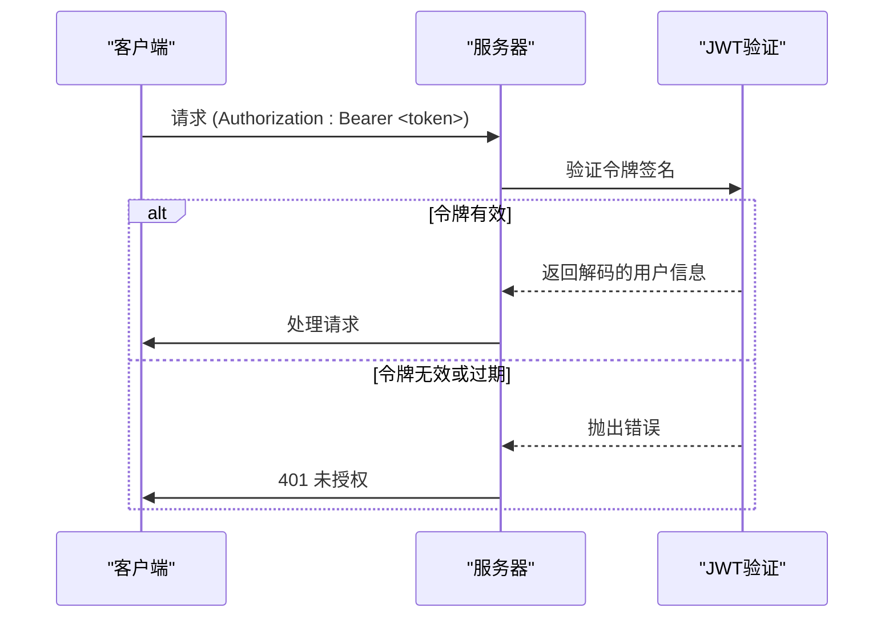
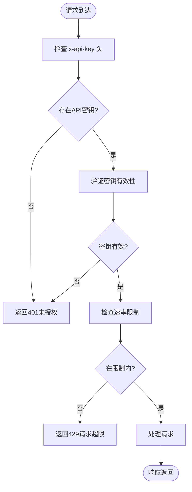
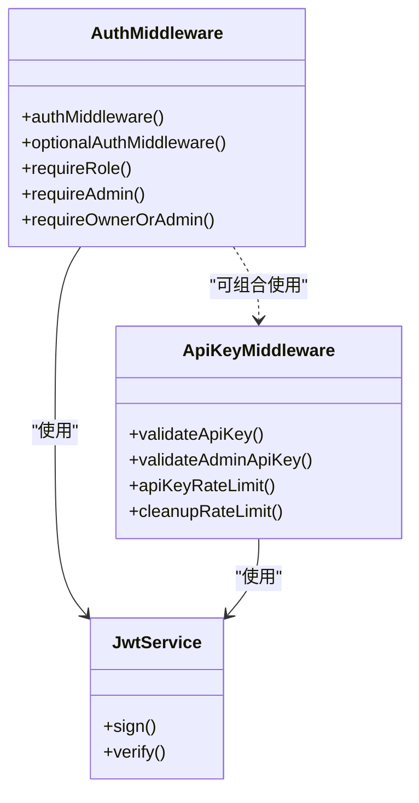

# 认证API

<cite>
**本文档引用的文件**  
- [auth.ts](file://backend/src/routes/auth.ts)
- [auth.ts](file://backend/src/middleware/auth.ts)
- [apiKey.ts](file://backend/src/middleware/apiKey.ts)
- [VERSION.md](file://VERSION.md)
- [MIGRATION_COMPLETE.md](file://MIGRATION_COMPLETE.md)
- [FINAL_MIGRATION_SUMMARY.md](file://FINAL_MIGRATION_SUMMARY.md)
</cite>

## 目录
1. [简介](#简介)
2. [项目结构与架构](#项目结构与架构)
3. [核心认证端点](#核心认证端点)
4. [JWT令牌机制](#jwt令牌机制)
5. [API密钥认证流程](#api密钥认证流程)
6. [OAuth2.0兼容路由处理](#oauth20兼容路由处理)
7. [HTTP状态码与错误处理](#http状态码与错误处理)
8. [调用示例](#调用示例)
9. [安全最佳实践](#安全最佳实践)
10. [依赖与中间件分析](#依赖与中间件分析)

## 简介
TriBridge平台的认证系统为用户提供安全的身份验证机制，支持用户注册、登录、令牌刷新和登出等核心功能。该系统基于JWT（JSON Web Token）实现无状态会话管理，并结合API密钥机制为后端服务提供额外的安全层。本文档详细说明认证API的设计、实现和使用方式，涵盖端点定义、令牌生命周期、安全策略及调用示例。

**Section sources**
- [VERSION.md](file://VERSION.md#L2-L46)
- [MIGRATION_COMPLETE.md](file://MIGRATION_COMPLETE.md#L0-L94)

## 项目结构与架构
TriBridge平台已迁移至全栈Next.js架构（v3.0.0），前端与后端统一部署，简化了运维流程。认证相关逻辑主要分布在`pages/api/auth/[...auth].ts`路由文件中，该文件处理所有认证请求。后端中间件位于`backend/src/middleware/`目录，包括JWT验证和API密钥检查。

```mermaid
graph TB
subgraph "前端"
UI[用户界面]
API[API调用]
end
subgraph "后端"
AuthRoute[...auth].ts]
AuthMiddleware[authMiddleware]
ApiKeyMiddleware[validateApiKey]
JWT[JWT令牌生成/验证]
end
UI --> API
API --> AuthRoute
AuthRoute --> AuthMiddleware
AuthRoute --> ApiKeyMiddleware
AuthMiddleware --> JWT
```

**Diagram sources**
- [VERSION.md](file://VERSION.md#L2-L46)
- [MIGRATION_COMPLETE.md](file://MIGRATION_COMPLETE.md#L0-L94)

**Section sources**
- [VERSION.md](file://VERSION.md#L2-L46)
- [MIGRATION_COMPLETE.md](file://MIGRATION_COMPLETE.md#L0-L94)

## 核心认证端点
认证API提供以下核心端点：

| 端点 | 方法 | 描述 |
|------|------|------|
| `/api/auth/register` | POST | 用户注册 |
| `/api/auth/login` | POST | 用户登录 |
| `/api/auth/refresh` | POST | 刷新访问令牌 |

### /auth/login 请求结构
**请求体（JSON）**:
```json
{
  "email": "string",
  "password": "string"
}
```

**成功响应**:
```json
{
  "success": true,
  "data": {
    "user": {
      "id": "string",
      "email": "string",
      "fullName": "string"
    },
    "token": "string"
  }
}
```

**Section sources**
- [auth.ts](file://backend/src/routes/auth.ts#L70-L108)

## JWT令牌机制
系统使用JWT实现用户会话管理，包含访问令牌和刷新令牌两种机制。

### 令牌生成
- **访问令牌（Access Token）**: 由`jwt.sign()`生成，包含`userId`和`email`声明，有效期24小时。
- **刷新令牌（Refresh Token）**: 用于获取新的访问令牌，使用独立密钥`JWT_REFRESH_SECRET`签名。

### 令牌验证流程


**Diagram sources**
- [auth.ts](file://backend/src/routes/auth.ts#L30-L37)
- [auth.ts](file://backend/src/middleware/auth.ts#L10-L58)

**Section sources**
- [auth.ts](file://backend/src/routes/auth.ts#L30-L37)
- [auth.ts](file://backend/src/middleware/auth.ts#L10-L58)

## API密钥认证流程
对于需要更高安全级别的API调用，系统支持基于API密钥的认证。

### 认证流程
1. 客户端在请求头中添加`x-api-key`字段
2. 服务器通过`validateApiKey`中间件验证密钥有效性
3. 支持速率限制（默认60次/分钟）



**Diagram sources**
- [apiKey.ts](file://backend/src/middleware/apiKey.ts#L3-L39)
- [apiKey.ts](file://backend/src/middleware/apiKey.ts#L72-L136)

**Section sources**
- [apiKey.ts](file://backend/src/middleware/apiKey.ts#L3-L39)
- [apiKey.ts](file://backend/src/middleware/apiKey.ts#L72-L136)

## OAuth2.0兼容路由处理
`[...auth].ts`路由设计兼容OAuth2.0标准，支持第三方登录回调流程。该文件作为API路由的入口，可扩展支持Google、Facebook等第三方认证提供商的回调处理。

**Section sources**
- [VERSION.md](file://VERSION.md#L2-L46)
- [MIGRATION_COMPLETE.md](file://MIGRATION_COMPLETE.md#L0-L94)

## HTTP状态码与错误处理
认证系统返回标准化的HTTP状态码和错误信息。

| 状态码 | 含义 | 修复建议 |
|--------|------|----------|
| 400 | 请求参数缺失或无效 | 检查请求体是否包含必要字段 |
| 401 | 未授权（令牌缺失、无效或过期） | 重新登录获取新令牌 |
| 403 | 权限不足 | 检查用户角色或API密钥权限 |
| 429 | 请求频率超限 | 等待`retryAfter`秒后重试 |
| 500 | 服务器内部错误 | 联系技术支持 |

**Section sources**
- [auth.ts](file://backend/src/routes/auth.ts#L10-L156)
- [auth.ts](file://backend/src/middleware/auth.ts#L10-L166)
- [apiKey.ts](file://backend/src/middleware/apiKey.ts#L3-L136)

## 调用示例
### 使用curl调用登录
```bash
curl -X POST https://api.tribridge.com/api/auth/login \
  -H "Content-Type: application/json" \
  -d '{
    "email": "user@example.com",
    "password": "yourpassword"
  }'
```

### 使用fetch调用（前端）
```javascript
fetch('/api/auth/login', {
  method: 'POST',
  headers: { 'Content-Type': 'application/json' },
  body: JSON.stringify({
    email: 'user@example.com',
    password: 'password'
  })
})
.then(response => response.json())
.then(data => {
  // 存储令牌
  localStorage.setItem('token', data.data.token);
});
```

### 使用axios调用
```javascript
axios.post('/api/auth/login', {
  email: 'user@example.com',
  password: 'password'
})
.then(response => {
  const { token } = response.data.data;
  axios.defaults.headers.common['Authorization'] = `Bearer ${token}`;
});
```

**Section sources**
- [auth.ts](file://backend/src/routes/auth.ts#L70-L108)

## 安全最佳实践
### 密码安全
- 使用`bcryptjs`对密码进行哈希处理（saltRounds=10）
- 永远不在日志或响应中暴露明文密码

### 令牌安全
- 访问令牌存储在内存或`httpOnly` Cookie中
- 刷新令牌应短期有效并可撤销
- 前端避免将令牌存储在`localStorage`中以防XSS攻击

### 防暴力破解
- 登录失败返回通用错误信息（避免泄露账户存在性）
- 实施基于IP或账户的速率限制
- 敏感操作需二次验证

**Section sources**
- [auth.ts](file://backend/src/routes/auth.ts#L5-L156)
- [auth.ts](file://backend/src/middleware/auth.ts#L10-L166)
- [apiKey.ts](file://backend/src/middleware/apiKey.ts#L72-L136)

## 依赖与中间件分析
认证系统依赖以下核心中间件：



**Diagram sources**
- [auth.ts](file://backend/src/middleware/auth.ts#L10-L166)
- [apiKey.ts](file://backend/src/middleware/apiKey.ts#L3-L136)

**Section sources**
- [auth.ts](file://backend/src/middleware/auth.ts#L10-L166)
- [apiKey.ts](file://backend/src/middleware/apiKey.ts#L3-L136)