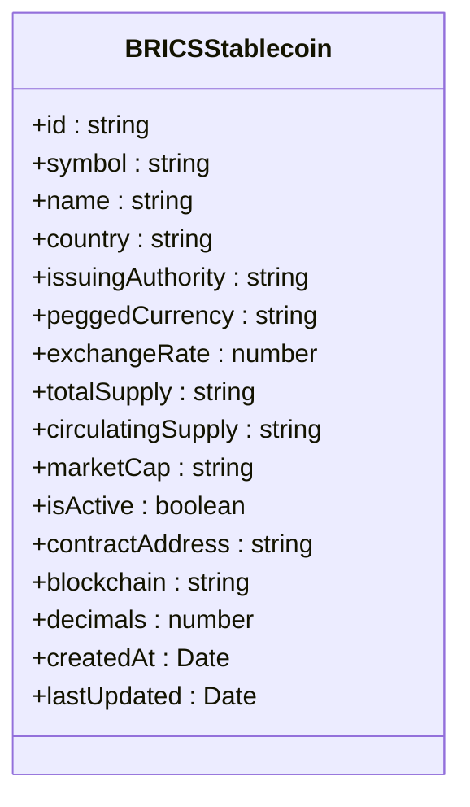
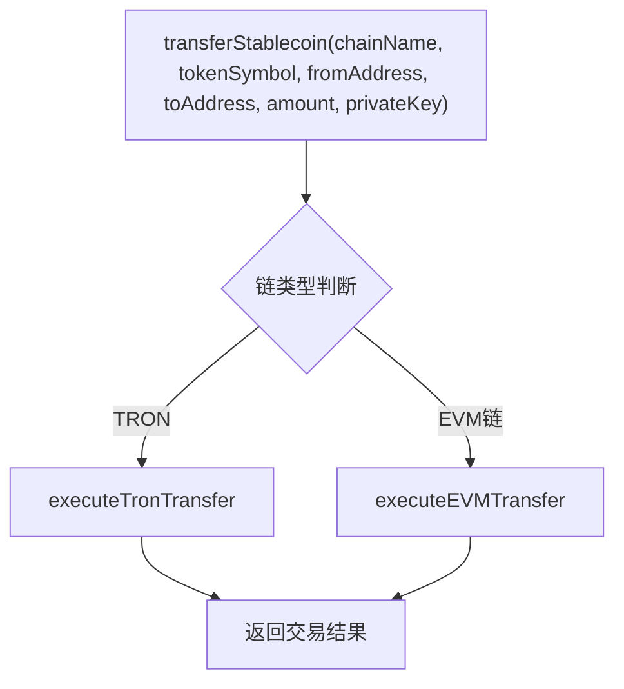
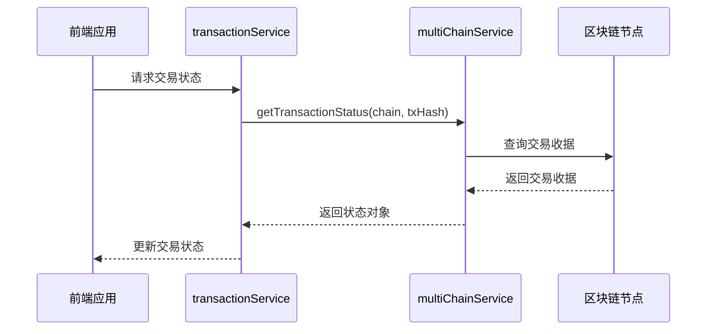

# 金砖稳定币API

<cite>
**本文档引用的文件**   
- [bricsStablecoinService.ts](file://backend/src/services/bricsStablecoinService.ts)
- [multiChainService.ts](file://backend/src/services/multiChainService.ts)
- [brics.ts](file://backend/src/routes/brics.ts)
- [blockchain.ts](file://backend/src/routes/blockchain.ts)
</cite>

## 目录
1. [简介](#简介)
2. [核心API端点](#核心api端点)
3. [发行机构权限控制](#发行机构权限控制)
4. [跨链转移实现](#跨链转移实现)
5. [汇率锚定与价格同步](#汇率锚定与价格同步)
6. [智能合约交互抽象层](#智能合约交互抽象层)
7. [储备金证明与审计跟踪](#储备金证明与审计跟踪)
8. [多链集成](#多链集成)

## 简介
金砖稳定币API为金砖国家（BRICS）联盟提供了一套完整的稳定币发行、管理与交易解决方案。该系统支持中国、俄罗斯、印度、巴西和南非等国的数字法定货币，通过统一的API接口实现稳定币的发行、赎回、余额查询和交易记录等功能。系统采用模块化设计，核心服务包括BRICS稳定币服务和多链服务，确保了跨链操作的一致性和安全性。

## 核心API端点
金砖稳定币API提供了一系列RESTful端点，用于管理稳定币的全生命周期。

### 稳定币发行与查询
- **获取所有稳定币**: `GET /stablecoins`  
  返回所有已发行的BRICS稳定币列表，包括BCNY、BRUB、BINR、BBRL、BZAR和统一的BRICS稳定币。
- **获取特定稳定币**: `GET /stablecoins/:id`  
  根据ID查询特定稳定币的详细信息，如发行量、流通量、汇率等。
- **计算兑换率**: `GET /exchange-rate/:fromCoin/:toCoin`  
  计算两种稳定币之间的实时兑换率，通过美元作为中介进行计算。

### 交易与流动性管理
- **创建兑换订单**: `POST /exchange`  
  创建稳定币兑换订单，支持从一种稳定币兑换为另一种，系统会自动计算手续费和预计处理时间。
- **查询兑换记录**: `GET /exchange/:exchangeId`  
  根据订单ID查询兑换状态，包括处理进度和交易哈希。
- **用户兑换历史**: `GET /user/:userId/exchanges`  
  查询指定用户的全部兑换历史记录。
- **添加流动性**: `POST /liquidity-pools/:poolId/add`  
  向指定的流动性池添加流动性，支持BCNY/BRUB、BINR/BBRL等交易对。

### 跨境支付与网络状态
- **估算跨境支付**: `POST /estimate-payment`  
  估算跨境支付的成本和时间，并与传统SWIFT系统进行对比，展示成本和时间节省。
- **获取网络状态**: `GET /network-status`  
  查询BRICS支付网络的整体健康状况，包括各节点的在线状态、延迟和交易成功率。

**Section sources**
- [brics.ts](file://backend/src/routes/brics.ts#L15-L332)

## 发行机构权限控制
系统通过`issuingAuthority`字段对稳定币的发行机构进行权限控制，确保每个稳定币由其对应的中央银行或金融机构发行和管理。

### 发行机构映射
每个稳定币在系统中都关联了其发行机构，具体映射如下：
- **BCNY (数字人民币)**: 中国人民银行
- **BRUB (数字卢布)**: 俄罗斯中央银行
- **BINR (数字卢比)**: 印度储备银行
- **BBRL (数字雷亚尔)**: 巴西中央银行
- **BZAR (数字兰特)**: 南非储备银行
- **BRICS (统一稳定币)**: 金砖国家开发银行

### 权限控制机制
发行机构的权限控制主要体现在以下几个方面：
1. **发行权限**: 只有指定的发行机构才能创建和管理其对应的稳定币。例如，中国人民银行是唯一可以发行BCNY的机构。
2. **汇率更新**: 发行机构负责维护其稳定币的汇率数据。系统提供`updateExchangeRates`接口，允许发行机构更新其稳定币的USD汇率。
3. **审计跟踪**: 所有与稳定币相关的操作（如发行、赎回）都会记录发行机构的信息，确保操作的可追溯性。



**Diagram sources**
- [bricsStablecoinService.ts](file://backend/src/services/bricsStablecoinService.ts#L2-L20)

**Section sources**
- [bricsStablecoinService.ts](file://backend/src/services/bricsStablecoinService.ts#L86-L161)

## 跨链转移实现
跨链转移是金砖稳定币系统的核心功能，通过多链服务（MultiChainService）实现不同区块链之间的资产转移。

### 跨链转移流程
跨链转移的实现流程如下：
1. **链与代币校验**: 在执行转移前，系统会验证目标链和代币是否受支持。如果链或代币不存在，将抛出错误。
2. **地址格式验证**: 根据目标链的类型（EVM或TRON），验证接收地址的格式是否正确。
3. **执行转移**: 根据目标链的类型，调用相应的转移方法。对于EVM兼容链（如以太坊、BSC），使用`ethers`库执行转移；对于TRON链，使用`tronweb`库执行转移。
4. **交易状态监控**: 转移完成后，系统会返回交易哈希，客户端可以通过`getTransactionStatus`接口查询交易的确认状态。



**Diagram sources**
- [multiChainService.ts](file://backend/src/services/multiChainService.ts#L280-L350)

### 安全性保障
跨链转移的安全性通过以下机制保障：
- **链与代币合法性校验**: 在执行转移前，系统会检查目标链和代币是否在预定义的配置中，防止向不支持的网络或代币发送资金。
- **私钥安全**: 私钥仅在客户端提供，服务器端不存储私钥，确保用户资产安全。
- **交易状态监控**: 系统提供交易状态查询接口，确保用户可以实时监控交易的确认情况。

**Section sources**
- [multiChainService.ts](file://backend/src/services/multiChainService.ts#L267-L297)

## 汇率锚定与价格同步
金砖稳定币系统通过汇率锚定机制确保稳定币的价值稳定，并通过价格同步策略保持汇率的实时性。

### 汇率锚定机制
每个稳定币都锚定到其对应的法定货币，汇率以美元为中介进行计算。例如：
- **BCNY**: 1 CNY = 0.1389 USD
- **BRUB**: 1 RUB = 0.0108 USD
- **BINR**: 1 INR = 0.012 USD
- **BBRL**: 1 BRL = 0.1998 USD
- **BZAR**: 1 ZAR = 0.0532 USD
- **BRICS**: 1 BRICS = 1.0 USD

### 价格同步策略
系统通过`updateExchangeRates`方法更新汇率，通常由外部价格源驱动。汇率更新的频率和策略如下：
- **更新频率**: 汇率数据每30秒缓存一次，确保API调用的高效性。
- **价格源**: 系统支持从CoinGecko、Binance等外部API获取实时汇率，如果外部API失败，则使用模拟数据作为后备。
- **批量更新**: 系统支持批量更新多个稳定币的汇率，确保汇率数据的一致性。



**Diagram sources**
- [multiChainService.ts](file://backend/src/services/multiChainService.ts#L300-L380)

**Section sources**
- [bricsStablecoinService.ts](file://backend/src/services/bricsStablecoinService.ts#L604-L613)

## 智能合约交互抽象层
系统通过多链服务（MultiChainService）提供了一层API抽象，封装了与不同区块链智能合约的交互细节。

### 抽象层设计
多链服务的核心设计包括：
- **统一接口**: 提供`getStablecoinBalance`、`transferStablecoin`、`getTransactionStatus`等统一接口，屏蔽了不同区块链的实现差异。
- **链配置管理**: 通过`ChainConfig`对象管理各链的RPC URL、合约地址和原生货币信息。
- **动态提供者**: 根据链的类型动态加载`ethers`或`tronweb`库，创建相应的RPC提供者。

```mermaid
classDiagram
class MultiChainService {
+chains : Map<string, ChainConfig>
+providers : Map<string, any>
+getSupportedChains() ChainConfig[]
+getStablecoinBalance(chainName, tokenSymbol, address) Promise~string~
+transferStablecoin(chainName, tokenSymbol, fromAddress, toAddress, amount, privateKey) Promise~TransactionResult~
+getTransactionStatus(chainName, txHash) Promise~TransactionResult~
+getGasPrices(chainName) Promise~{slow, standard, fast}~
+validateAddress(chainName, address) boolean
}
class ChainConfig {
+chainId : number
+name : string
+symbol : string
+rpcUrl : string
+explorerUrl : string
+nativeCurrency : {name, symbol, decimals}
+stablecoins : {tokenSymbol : {address, decimals, symbol, name}}
}
class TransactionResult {
+txHash : string
+chainId : number
+status : 'pending' | 'confirmed' | 'failed'
+confirmations : number
+gasUsed? : string
+blockNumber? : number
+timestamp : Date
}
MultiChainService --> ChainConfig
MultiChainService --> TransactionResult
```

**Diagram sources**
- [multiChainService.ts](file://backend/src/services/multiChainService.ts#L48-L505)

**Section sources**
- [multiChainService.ts](file://backend/src/services/multiChainService.ts#L48-L505)

## 储备金证明与审计跟踪
系统通过储备金证明查询接口和审计跟踪功能，确保稳定币的透明性和可信度。

### 储备金证明查询
系统提供`/statistics`端点，返回稳定币的总市值、流通量和市场表现等统计数据。这些数据可以作为储备金证明的依据，确保稳定币的发行量与储备资产相匹配。

### 审计跟踪功能
所有关键操作（如兑换、添加流动性、汇率更新）都会触发事件，记录操作的详细信息，包括：
- **操作类型**: 如兑换、添加流动性等。
- **操作时间**: 操作的创建和完成时间。
- **操作者**: 执行操作的用户ID。
- **交易哈希**: 区块链上的交易哈希，用于验证操作的真实性。

**Section sources**
- [bricsStablecoinService.ts](file://backend/src/services/bricsStablecoinService.ts#L568-L601)

## 多链集成
系统支持以太坊、TRON和BSC三条区块链的集成，确保跨链操作的一致性和互操作性。

### 支持的区块链
- **以太坊 (Ethereum)**: 支持USDT、USDC、DAI等稳定币。
- **TRON**: 支持USDT、USDC等稳定币。
- **BSC (币安智能链)**: 支持USDT、USDC、BUSD等稳定币。

### 集成方式
多链服务通过以下方式实现跨链集成：
- **链配置**: 在`initializeChains`方法中配置各链的RPC URL、区块浏览器和稳定币合约地址。
- **提供者初始化**: 在`initializeProviders`方法中动态加载`ethers`和`tronweb`库，为各链创建RPC提供者。
- **统一接口**: 提供`getStablecoinBalance`、`transferStablecoin`等统一接口，内部根据链类型调用不同的实现。

**Section sources**
- [multiChainService.ts](file://backend/src/services/multiChainService.ts#L48-L505)