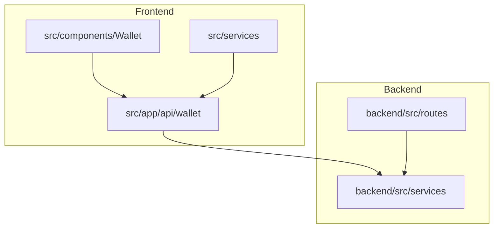
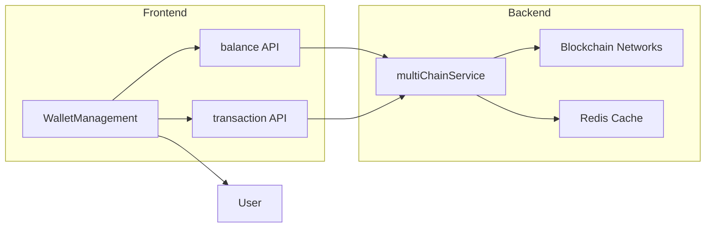
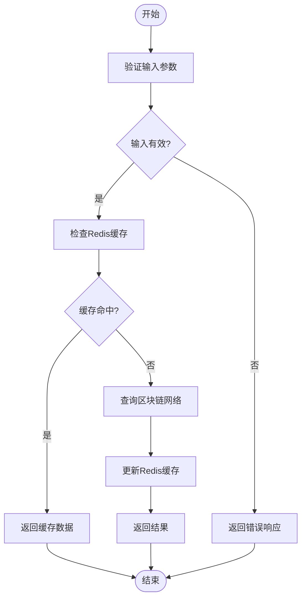
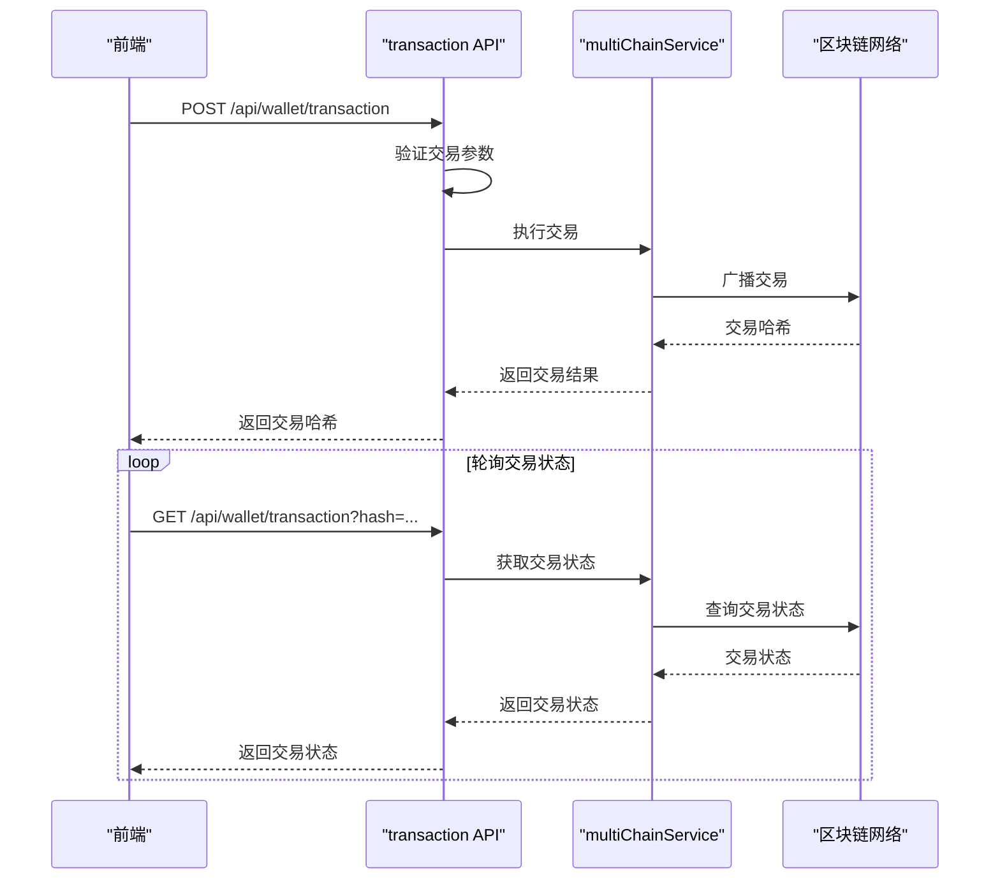
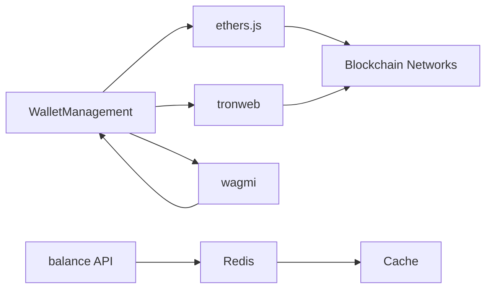

# 钱包API

<cite>
**Referenced Files in This Document**   
- [balances/route.ts](file://src/app/api/wallet/balances/route.ts)
- [transaction/route.ts](file://src/app/api/wallet/transaction/route.ts)
- [WalletManagement.tsx](file://src/components/Wallet/WalletManagement.tsx)
- [walletService.ts](file://src/services/walletService.ts)
- [multiChainService.ts](file://backend/src/services/multiChainService.ts)
- [redis.ts](file://backend/src/services/redis.ts)
- [user.ts](file://backend/src/routes/user.ts)
</cite>

## 目录
1. [简介](#简介)
2. [项目结构](#项目结构)
3. [核心组件](#核心组件)
4. [架构概述](#架构概述)
5. [详细组件分析](#详细组件分析)
6. [依赖分析](#依赖分析)
7. [性能考虑](#性能考虑)
8. [故障排除指南](#故障排除指南)
9. [结论](#结论)

## 简介
本技术文档深入探讨了基于Next.js的应用程序中钱包API的实现。文档重点介绍了`balances`端点如何聚合多链资产余额，包括其缓存策略和实时更新机制。同时，详细解释了`transaction`端点的交易构建、签名和广播流程，以及钱包连接状态管理的API设计。此外，文档还提供了前端`WalletManagement`组件与这些API的集成模式，包括错误处理和加载状态管理，并涵盖了防止重放攻击和交易签名验证等安全最佳实践。

## 项目结构
项目采用分层架构，前端和后端分离。前端使用Next.js框架，API路由位于`src/app/api/wallet`目录下，包含`balances`和`transaction`两个主要端点。前端组件位于`src/components/Wallet`目录，其中`WalletManagement.tsx`负责钱包的连接和管理。后端服务位于`backend/src`目录，`multiChainService.ts`处理多链逻辑，`redis.ts`提供缓存服务，`user.ts`管理用户钱包数据。



**Diagram sources**
- [balances/route.ts](file://src/app/api/wallet/balances/route.ts)
- [transaction/route.ts](file://src/app/api/wallet/transaction/route.ts)
- [WalletManagement.tsx](file://src/components/Wallet/WalletManagement.tsx)
- [multiChainService.ts](file://backend/src/services/multiChainService.ts)
- [user.ts](file://backend/src/routes/user.ts)

**Section sources**
- [balances/route.ts](file://src/app/api/wallet/balances/route.ts)
- [transaction/route.ts](file://src/app/api/wallet/transaction/route.ts)
- [WalletManagement.tsx](file://src/components/Wallet/WalletManagement.tsx)
- [multiChainService.ts](file://backend/src/services/multiChainService.ts)
- [user.ts](file://backend/src/routes/user.ts)

## 核心组件
核心组件包括前端的`WalletManagement`组件和后端的`balances`、`transaction`API端点。`WalletManagement`组件提供用户界面，允许用户连接、断开和管理多个钱包。`balances`端点负责聚合用户在不同区块链上的资产余额，而`transaction`端点处理交易的构建、签名和广播。后端的`multiChainService`是实现多链支持的核心服务。

**Section sources**
- [WalletManagement.tsx](file://src/components/Wallet/WalletManagement.tsx)
- [balances/route.ts](file://src/app/api/wallet/balances/route.ts)
- [transaction/route.ts](file://src/app/api/wallet/transaction/route.ts)
- [multiChainService.ts](file://backend/src/services/multiChainService.ts)

## 架构概述
系统架构采用前后端分离模式，前端通过API路由与后端服务通信。前端组件调用API端点获取数据和执行操作，后端服务处理业务逻辑并与区块链网络交互。缓存机制通过Redis实现，以提高性能和减少对区块链网络的直接请求。



**Diagram sources**
- [WalletManagement.tsx](file://src/components/Wallet/WalletManagement.tsx)
- [balances/route.ts](file://src/app/api/wallet/balances/route.ts)
- [transaction/route.ts](file://src/app/api/wallet/transaction/route.ts)
- [multiChainService.ts](file://backend/src/services/multiChainService.ts)
- [redis.ts](file://backend/src/services/redis.ts)

## 详细组件分析

### balances端点分析
`balances`端点负责聚合用户在不同区块链上的资产余额。它接收用户的钱包地址和网络ID，验证输入，然后调用`multiChainService`获取余额。为了提高性能，系统使用Redis缓存余额数据，减少对区块链网络的直接请求。



**Diagram sources**
- [balances/route.ts](file://src/app/api/wallet/balances/route.ts)
- [multiChainService.ts](file://backend/src/services/multiChainService.ts)
- [redis.ts](file://backend/src/services/redis.ts)

**Section sources**
- [balances/route.ts](file://src/app/api/wallet/balances/route.ts)
- [multiChainService.ts](file://backend/src/services/multiChainService.ts)
- [redis.ts](file://backend/src/services/redis.ts)

### transaction端点分析
`transaction`端点处理交易的构建、签名和广播。它接收交易参数，验证输入，然后调用`multiChainService`执行交易。交易状态通过轮询或事件监听实时更新。



**Diagram sources**
- [transaction/route.ts](file://src/app/api/wallet/transaction/route.ts)
- [multiChainService.ts](file://backend/src/services/multiChainService.ts)

**Section sources**
- [transaction/route.ts](file://src/app/api/wallet/transaction/route.ts)
- [multiChainService.ts](file://backend/src/services/multiChainService.ts)

### WalletManagement组件分析
`WalletManagement`组件提供用户界面，允许用户连接、断开和管理多个钱包。它与`balances`和`transaction`API端点集成，显示钱包余额和交易历史。

```mermaid
classDiagram
class WalletManagement {
+wallets : WalletInfo[]
+isConnecting : boolean
+showAddresses : {[key : string] : boolean}
+connectWallet(type : string) : void
+disconnectWallet(walletId : string) : void
+setDefaultWallet(walletId : string) : void
+refreshBalance(walletId : string) : void
+toggleAddressVisibility(walletId : string) : void
}
class WalletInfo {
+id : string
+name : string
+type : string
+address : string
+balance : {usdt : number, usdc : number, eth : number}
+status : string
+lastUsed : string
+isDefault : boolean
}
WalletManagement --> WalletInfo : "包含"
```

**Diagram sources**
- [WalletManagement.tsx](file://src/components/Wallet/WalletManagement.tsx)

**Section sources**
- [WalletManagement.tsx](file://src/components/Wallet/WalletManagement.tsx)

## 依赖分析
系统依赖于多个外部服务和库，包括ethers.js用于与以太坊网络交互，tronweb用于与TRON网络交互，redis用于缓存，以及wagmi用于前端钱包连接。



**Diagram sources**
- [WalletManagement.tsx](file://src/components/Wallet/WalletManagement.tsx)
- [balances/route.ts](file://src/app/api/wallet/balances/route.ts)
- [redis.ts](file://backend/src/services/redis.ts)

**Section sources**
- [WalletManagement.tsx](file://src/components/Wallet/WalletManagement.tsx)
- [balances/route.ts](file://src/app/api/wallet/balances/route.ts)
- [redis.ts](file://backend/src/services/redis.ts)

## 性能考虑
系统通过Redis缓存余额数据来提高性能，减少对区块链网络的直接请求。此外，交易状态的轮询间隔应合理设置，以平衡实时性和性能。

## 故障排除指南
常见问题包括钱包连接失败、余额更新延迟和交易广播失败。解决方案包括检查网络连接、清除缓存和重新连接钱包。

**Section sources**
- [WalletManagement.tsx](file://src/components/Wallet/WalletManagement.tsx)
- [balances/route.ts](file://src/app/api/wallet/balances/route.ts)
- [transaction/route.ts](file://src/app/api/wallet/transaction/route.ts)

## 结论
本文档详细介绍了钱包API的实现，包括`balances`和`transaction`端点的功能、`WalletManagement`组件的集成以及安全最佳实践。系统通过缓存和多链支持提供高性能和可扩展性。