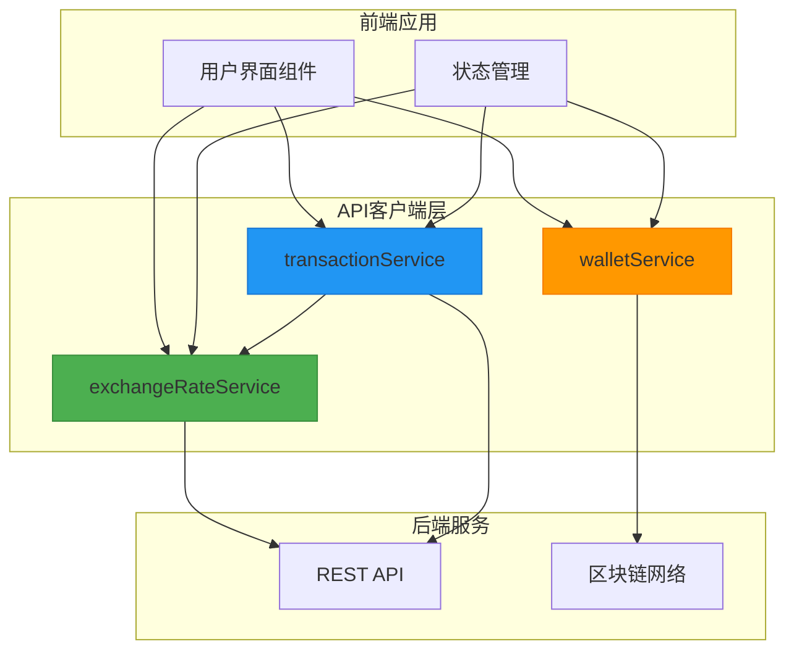
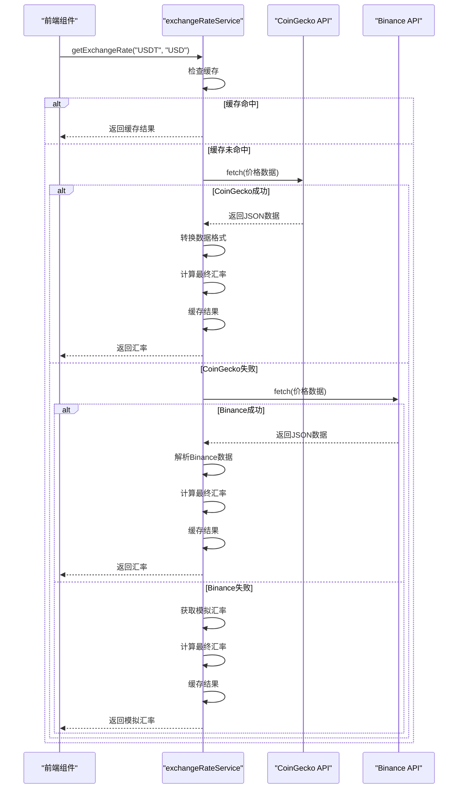
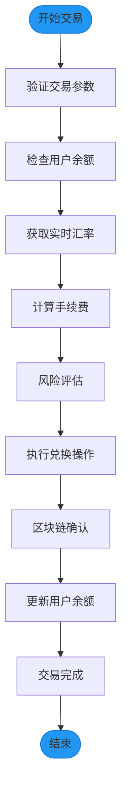
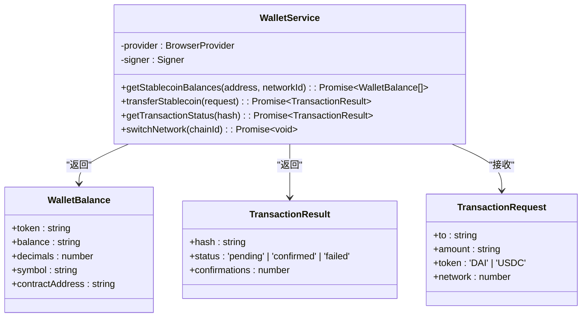
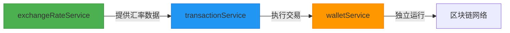

# API客户端

<cite>
**本文档引用的文件**  
- [exchangeRateService.ts](file://src/services/exchangeRateService.ts)
- [transactionService.ts](file://src/services/transactionService.ts)
- [walletService.ts](file://src/services/walletService.ts)
- [exchangeRateService.test.ts](file://src/services/__tests__/exchangeRateService.test.ts)
</cite>

## 目录
1. [简介](#简介)
2. [核心服务模块架构](#核心服务模块架构)
3. [汇率服务实现细节](#汇率服务实现细节)
4. [交易服务实现细节](#交易服务实现细节)
5. [钱包服务实现细节](#钱包服务实现细节)
6. [服务间依赖关系与复用模式](#服务间依赖关系与复用模式)
7. [服务调用典型代码片段](#服务调用典型代码片段)
8. [缓存策略与性能优化](#缓存策略与性能优化)
9. [请求取消与安全性考虑](#请求取消与安全性考虑)
10. [异常处理与调试指南](#异常处理与调试指南)

## 简介

本文档旨在全面解析`exchangeRateService`、`transactionService`和`walletService`三个核心服务模块的实现细节。这些服务构成了应用程序的API客户端层，负责封装对后端REST API的调用，提供统一的接口供前端组件使用。文档将深入探讨每个服务的内部工作机制，包括请求配置、错误处理、缓存策略和安全性考虑，为开发者提供完整的参考指南。

## 核心服务模块架构



**图表来源**  
- [exchangeRateService.ts](file://src/services/exchangeRateService.ts#L1-L285)
- [transactionService.ts](file://src/services/transactionService.ts#L1-L392)
- [walletService.ts](file://src/services/walletService.ts#L1-L270)

**本节来源**  
- [exchangeRateService.ts](file://src/services/exchangeRateService.ts#L1-L285)
- [transactionService.ts](file://src/services/transactionService.ts#L1-L392)
- [walletService.ts](file://src/services/walletService.ts#L1-L270)

## 汇率服务实现细节

`exchangeRateService`是汇率数据获取的核心服务，通过Fetch API实现对多个外部汇率API的调用。服务采用多层容错机制，首先尝试从CoinGecko获取实时汇率，若失败则降级到Binance API，最后使用本地模拟数据作为后备。这种设计确保了在任何网络条件下都能提供可用的汇率数据。

服务实现了30秒的内存缓存机制，通过`Map`对象存储最近的汇率查询结果，有效减少了对外部API的重复调用。缓存键由源货币和目标货币组合而成，如"USD-CNY"。当缓存命中时，直接返回缓存结果；当缓存过期或未命中时，才发起新的API请求。



**图表来源**  
- [exchangeRateService.ts](file://src/services/exchangeRateService.ts#L1-L285)

**本节来源**  
- [exchangeRateService.ts](file://src/services/exchangeRateService.ts#L1-L285)

## 交易服务实现细节

`transactionService`负责处理所有交易相关的业务逻辑，包括交易预览、执行、状态管理和历史查询。服务通过依赖注入的方式使用`exchangeRateService`来获取实时汇率，实现了服务间的解耦。交易执行过程被分解为多个步骤，包括参数验证、余额检查、风险评估和区块链确认，每个步骤都有详细的性能指标记录。

服务采用异步处理模式，`executeTransaction`方法立即返回一个处理中的交易对象，同时在后台通过`processTransactionAsync`方法模拟交易的完整生命周期。这种设计提供了良好的用户体验，用户无需等待交易完全完成即可看到初步结果。



**图表来源**  
- [transactionService.ts](file://src/services/transactionService.ts#L1-L392)

**本节来源**  
- [transactionService.ts](file://src/services/transactionService.ts#L1-L392)

## 钱包服务实现细节

`walletService`是前端与区块链网络交互的桥梁，基于ethers.js库实现。服务通过`BrowserProvider`连接用户的MetaMask钱包，获取`Signer`对象进行交易签名。核心功能包括获取稳定币余额、执行代币转账、监控交易状态和网络切换。

服务支持多网络环境，目前配置了Sepolia测试网和以太坊主网的稳定币合约地址。`switchNetwork`方法允许用户在不同网络间切换，如果目标网络不存在，会自动调用`wallet_addEthereumChain`添加新网络。这种设计提供了灵活的网络管理能力，满足了开发和生产环境的不同需求。



**图表来源**  
- [walletService.ts](file://src/services/walletService.ts#L1-L270)

**本节来源**  
- [walletService.ts](file://src/services/walletService.ts#L1-L270)

## 服务间依赖关系与复用模式

三个核心服务之间存在明确的依赖关系。`transactionService`直接依赖`exchangeRateService`来获取汇率数据，这种依赖关系通过模块导入实现，确保了代码的可维护性和可测试性。`walletService`独立运行，直接与区块链网络交互，不依赖其他服务。

复用模式体现在服务的单例设计上。每个服务都通过`export const`导出一个实例，而不是类本身。这种模式确保了在整个应用生命周期中，每个服务只有一个实例，实现了状态的全局共享。例如，`exchangeRateService`的缓存状态在所有组件间共享，避免了重复的API调用。



**图表来源**  
- [transactionService.ts](file://src/services/transactionService.ts#L1-L392)
- [exchangeRateService.ts](file://src/services/exchangeRateService.ts#L1-L285)

**本节来源**  
- [transactionService.ts](file://src/services/transactionService.ts#L1-L392)
- [exchangeRateService.ts](file://src/services/exchangeRateService.ts#L1-L285)

## 服务调用典型代码片段

### 汇率服务调用

```typescript
// 获取USD到CNY的汇率
const rate = await exchangeRateService.getExchangeRate('USD', 'CNY');
console.log(`汇率: 1 USD = ${rate.rate} CNY`);

// 获取所有支持的货币对汇率
const allRates = await exchangeRateService.getAllRates();
Object.entries(allRates).forEach(([pair, rate]) => {
  console.log(`${pair}: ${rate.rate}`);
});
```

### 交易服务调用

```typescript
// 生成交易预览
const preview = await transactionService.getTransactionPreview({
  fromCurrency: 'USDT',
  toCurrency: 'USD',
  fromAmount: 1000
});

// 执行交易
const transaction = await transactionService.executeTransaction({
  fromCurrency: 'USDT',
  toCurrency: 'USD',
  fromAmount: 1000,
  userId: 'user123'
});
```

### 钱包服务调用

```typescript
// 创建钱包服务实例
const walletService = new WalletService();

// 获取用户稳定币余额
const balances = await walletService.getStablecoinBalances(
  '0x123...abc',
  11155111 // Sepolia网络ID
);

// 执行代币转账
const result = await walletService.transferStablecoin({
  to: '0x456...def',
  amount: '100',
  token: 'DAI',
  network: 11155111
});
```

**本节来源**  
- [exchangeRateService.ts](file://src/services/exchangeRateService.ts#L1-L285)
- [transactionService.ts](file://src/services/transactionService.ts#L1-L392)
- [walletService.ts](file://src/services/walletService.ts#L1-L270)

## 缓存策略与性能优化

`exchangeRateService`实现了基于内存的缓存策略，使用`Map`对象存储最近的汇率查询结果。缓存有效期为30秒，通过`CACHE_DURATION`常量定义。这种策略在保证数据新鲜度的同时，显著减少了对外部API的调用频率，降低了网络延迟和API成本。

性能优化还体现在`getAllRates`方法的实现上。该方法使用`Promise.allSettled`并发获取所有货币对的汇率，而不是顺序调用。这种并行处理方式大大缩短了批量获取汇率的总耗时，提升了用户体验。


**图表来源**  
- [exchangeRateService.ts](file://src/services/exchangeRateService.ts#L1-L285)

**本节来源**  
- [exchangeRateService.ts](file://src/services/exchangeRateService.ts#L1-L285)

## 请求取消与安全性考虑

虽然当前实现中未显式包含请求取消机制，但可以通过Fetch API的`AbortController`进行扩展。在长时间运行的API调用中，可以创建`AbortController`实例，并在需要时调用其`abort`方法来取消请求，避免不必要的资源消耗。

安全性考虑主要体现在`walletService`的实现中。服务通过`Signer`对象进行交易签名，确保了私钥永远不会离开用户的钱包。所有交易都需要用户在MetaMask中手动确认，防止了恶意交易的自动执行。此外，服务对输入参数进行了严格验证，防止了无效或恶意数据的处理。

**本节来源**  
- [walletService.ts](file://src/services/walletService.ts#L1-L270)

## 异常处理与调试指南

### 错误处理机制

每个服务都实现了全面的错误处理机制。`exchangeRateService`在API调用失败时会降级到备用数据源，确保服务的可用性。`transactionService`在交易执行失败时会记录详细的错误信息，并向用户返回友好的错误提示。`walletService`捕获所有区块链交互中的异常，并将其转换为可理解的错误消息。

### 单元测试覆盖

`exchangeRateService.test.ts`文件包含了对汇率服务的单元测试，覆盖了主要功能点：
- `getSupportedCurrencies`：验证支持的货币列表是否正确
- `getExchangeRate`：测试相同货币转换、法币间转换和API失败降级
- `normalizeCurrency`：测试货币代码的规范化功能

### 调试常见问题

**网络中断**
- 检查浏览器网络连接
- 验证API端点是否可达
- 查看浏览器开发者工具的网络面板

**交易失败**
- 确认钱包已连接且有足够的余额
- 检查网络是否正确切换到目标链
- 查看MetaMask中的交易确认状态

**汇率数据不准确**
- 清除`exchangeRateService`的缓存
- 检查外部API是否返回预期数据
- 验证货币代码是否正确规范化

**本节来源**  
- [exchangeRateService.test.ts](file://src/services/__tests__/exchangeRateService.test.ts)