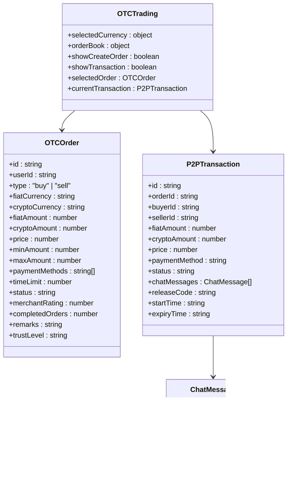

# UI组件体系

<cite>
**本文档引用的文件**
- [components.json](file://components.json)
- [tailwind.config.ts](file://tailwind.config.ts)
- [button.tsx](file://src/components/ui/button.tsx)
- [form.tsx](file://src/components/ui/form.tsx)
- [dialog.tsx](file://src/components/ui/dialog.tsx)
- [sidebar.tsx](file://src/components/ui/sidebar.tsx)
- [navigation-menu.tsx](file://src/components/ui/navigation-menu.tsx)
- [toast.tsx](file://src/components/ui/toast.tsx)
- [sonner.tsx](file://src/components/ui/sonner.tsx)
- [use-toast.ts](file://src/hooks/use-toast.ts)
- [TransactionExecutor.tsx](file://src/components/Blockchain/TransactionExecutor.tsx)
- [KYCVerification.tsx](file://src/components/Compliance/KYCVerification.tsx)
- [OTCTrading.tsx](file://src/components/OTC/OTCTrading.tsx)
</cite>

## 目录
1. [项目结构](#项目结构)
2. [基础UI组件](#基础ui组件)
3. [功能型组件](#功能型组件)
4. [主题与样式配置](#主题与样式配置)
5. [通知系统](#通知系统)
6. [布局组件](#布局组件)
7. [状态管理](#状态管理)
8. [无障碍访问与响应式设计](#无障碍访问与响应式设计)
9. [常见问题与性能优化](#常见问题与性能优化)

## 项目结构

项目采用基于ShadCN/UI的组件库架构，组件分为基础UI组件和功能型组件两大类。基础UI组件位于`src/components/ui`目录，提供按钮、表单、对话框等基础元素。功能型组件按业务领域组织在`src/components`目录下，如区块链、合规、场外交易等模块。

**图示来源**
- [components.json](file://components.json)
- [tailwind.config.ts](file://tailwind.config.ts)

**本节来源**
- [components.json](file://components.json)
- [tailwind.config.ts](file://tailwind.config.ts)

## 基础UI组件

基础UI组件基于ShadCN/UI实现，通过`components.json`配置文件进行定制化配置。组件使用Tailwind CSS进行样式定义，支持主题变量和CSS变量。

### 按钮组件

按钮组件使用`cva`库定义变体，支持多种样式和尺寸。通过`asChild`属性可以将按钮样式应用到其他组件上。

**图示来源**
- [button.tsx](file://src/components/ui/button.tsx)

**本节来源**
- [button.tsx](file://src/components/ui/button.tsx)

### 表单组件

表单组件基于`react-hook-form`实现，提供完整的表单验证和状态管理功能。包含`Form`、`FormField`、`FormItem`、`FormLabel`、`FormControl`、`FormDescription`和`FormMessage`等子组件。

**图示来源**
- [form.tsx](file://src/components/ui/form.tsx)

**本节来源**
- [form.tsx](file://src/components/ui/form.tsx)

### 对话框组件

对话框组件基于`@radix-ui/react-dialog`实现，提供模态对话框功能。包含`Dialog`、`DialogTrigger`、`DialogContent`、`DialogHeader`、`DialogFooter`、`DialogTitle`和`DialogDescription`等子组件。

**图示来源**
- [dialog.tsx](file://src/components/ui/dialog.tsx)

**本节来源**
- [dialog.tsx](file://src/components/ui/dialog.tsx)

## 功能型组件

功能型组件封装了特定业务逻辑，提供完整的用户交互体验。

### TransactionExecutor组件

TransactionExecutor组件用于执行区块链交易，包含交易参数验证、余额检查、Gas费用计算、交易发起和确认等待等步骤。

**图示来源**
- [TransactionExecutor.tsx](file://src/components/Blockchain/TransactionExecutor.tsx)

**本节来源**
- [TransactionExecutor.tsx](file://src/components/Blockchain/TransactionExecutor.tsx)

### KYCVerification组件

KYCVerification组件用于身份验证，包含个人信息、身份文件、商业信息和审核确认四个步骤。

**图示来源**
- [KYCVerification.tsx](file://src/components/Compliance/KYCVerification.tsx)

**本节来源**
- [KYCVerification.tsx](file://src/components/Compliance/KYCVerification.tsx)

### OTCTrading组件

OTCTrading组件用于场外交易，包含订单簿、交易创建和交易聊天等功能。

**图示来源**
- [OTCTrading.tsx](file://src/components/OTC/OTCTrading.tsx)

**本节来源**
- [OTCTrading.tsx](file://src/components/OTC/OTCTrading.tsx)

## 主题与样式配置

项目使用Tailwind CSS进行样式管理，通过`tailwind.config.ts`文件进行配置。

### 主题配置

主题配置定义了颜色、边框半径、背景图像、阴影和过渡效果等样式变量。

**图示来源**
- [tailwind.config.ts](file://tailwind.config.ts)

**本节来源**
- [tailwind.config.ts](file://tailwind.config.ts)

### 组件配置

`components.json`文件定义了组件库的配置，包括样式、RSC支持、TSX支持、Tailwind配置和别名等。

**图示来源**
- [components.json](file://components.json)

**本节来源**
- [components.json](file://components.json)

## 通知系统

通知系统基于`sonner`库实现，提供Toast通知功能。

### Toast组件

Toast组件用于显示临时通知消息，支持不同变体和操作按钮。

**图示来源**
- [toast.tsx](file://src/components/ui/toast.tsx)

**本节来源**
- [toast.tsx](file://src/components/ui/toast.tsx)

### Toaster组件

Toaster组件是通知系统的容器，管理所有Toast通知的显示和隐藏。

**图示来源**
- [sonner.tsx](file://src/components/ui/sonner.tsx)

**本节来源**
- [sonner.tsx](file://src/components/ui/sonner.tsx)

### 使用通知系统

通过`useToast`钩子可以方便地创建和管理通知。

**图示来源**
- [use-toast.ts](file://src/hooks/use-toast.ts)

**本节来源**
- [use-toast.ts](file://src/hooks/use-toast.ts)

## 布局组件

布局组件提供页面结构和导航功能。

### 侧边栏组件

侧边栏组件提供可折叠的导航菜单，支持桌面和移动设备。

**图示来源**
- [sidebar.tsx](file://src/components/ui/sidebar.tsx)

**本节来源**
- [sidebar.tsx](file://src/components/ui/sidebar.tsx)

### 导航菜单组件

导航菜单组件提供下拉式导航菜单，支持多级菜单。

**图示来源**
- [navigation-menu.tsx](file://src/components/ui/navigation-menu.tsx)

**本节来源**
- [navigation-menu.tsx](file://src/components/ui/navigation-menu.tsx)

## 状态管理

项目使用React状态管理，结合自定义钩子实现复杂状态逻辑。

### useToast钩子

`useToast`钩子管理通知系统的状态，包括通知列表和操作函数。

**图示来源**
- [use-toast.ts](file://src/hooks/use-toast.ts)

**本节来源**
- [use-toast.ts](file://src/hooks/use-toast.ts)

## 无障碍访问与响应式设计

组件库遵循无障碍访问和响应式设计原则，确保在不同设备和辅助技术下的可用性。

### 无障碍访问

所有交互式组件都提供了适当的ARIA属性，确保屏幕阅读器能够正确识别和朗读。

### 响应式设计

组件使用Tailwind CSS的响应式类，支持不同屏幕尺寸的布局调整。

**本节来源**
- [tailwind.config.ts](file://tailwind.config.ts)

## 常见问题与性能优化

### 样式冲突

通过使用CSS变量和Tailwind的前缀功能，避免样式冲突。

### SSR兼容性

组件库支持服务器端渲染，确保在SSR环境下的正常工作。

### 性能优化

- 按需加载组件，减少初始包大小
- 使用React.memo优化组件重渲染
- 使用useCallback和useMemo优化函数和值的创建

**本节来源**
- [tailwind.config.ts](file://tailwind.config.ts)
- [components.json](file://components.json)