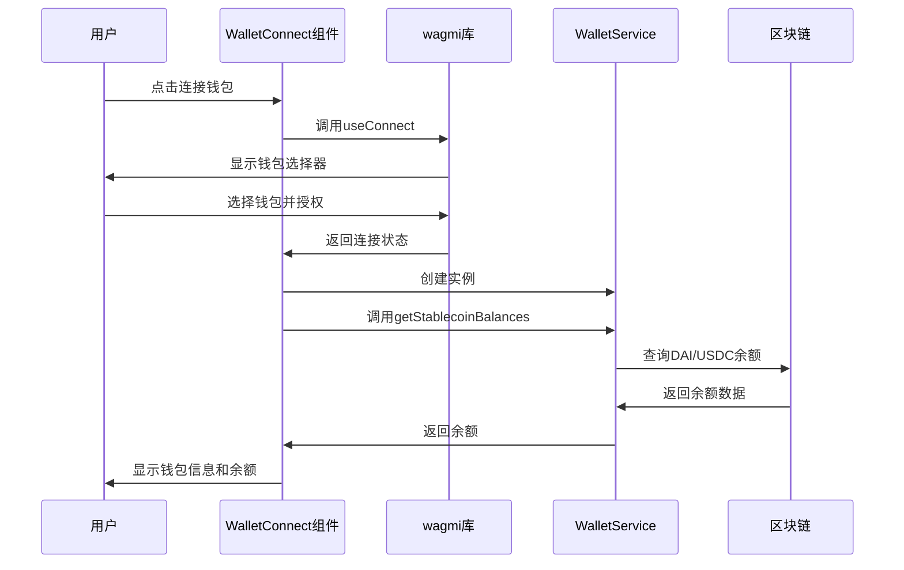
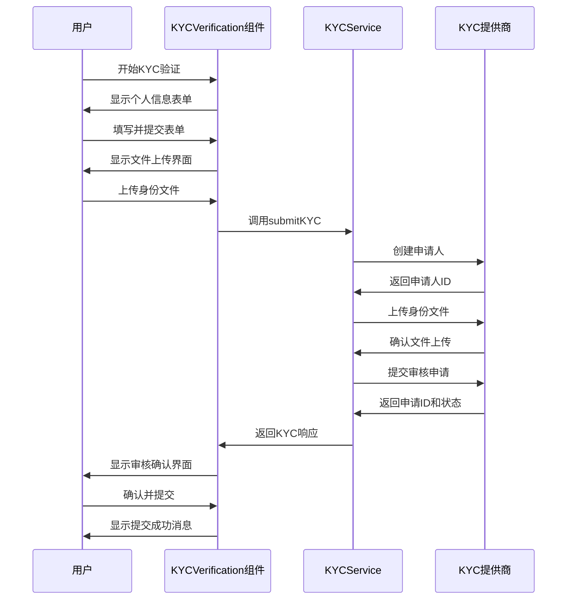
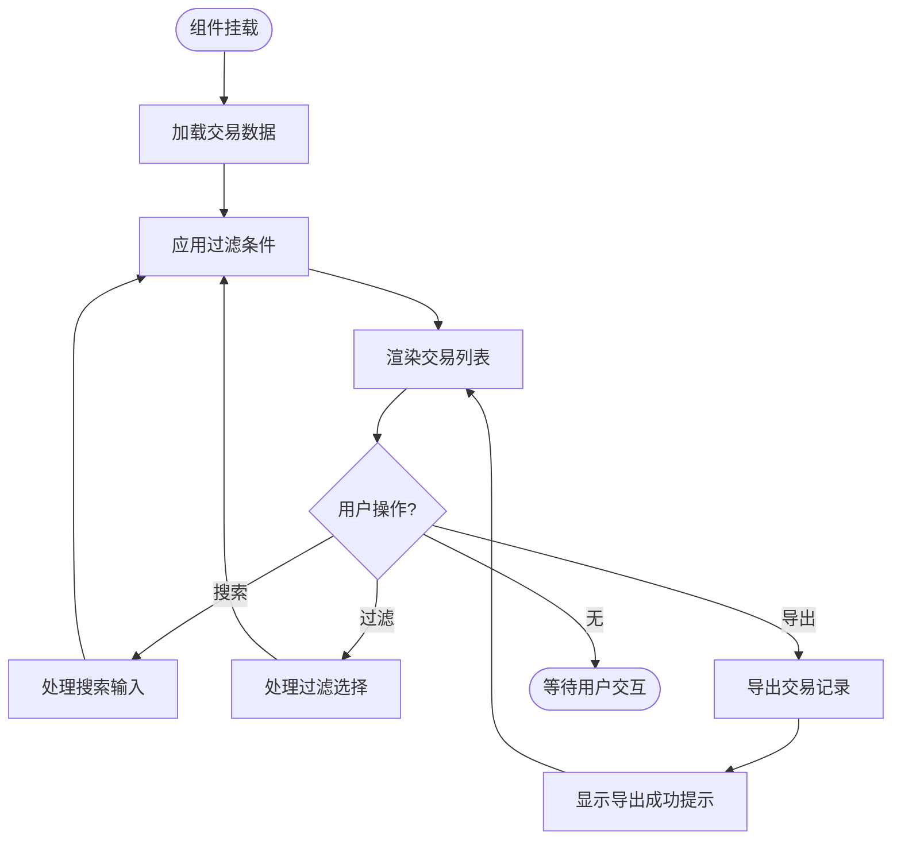
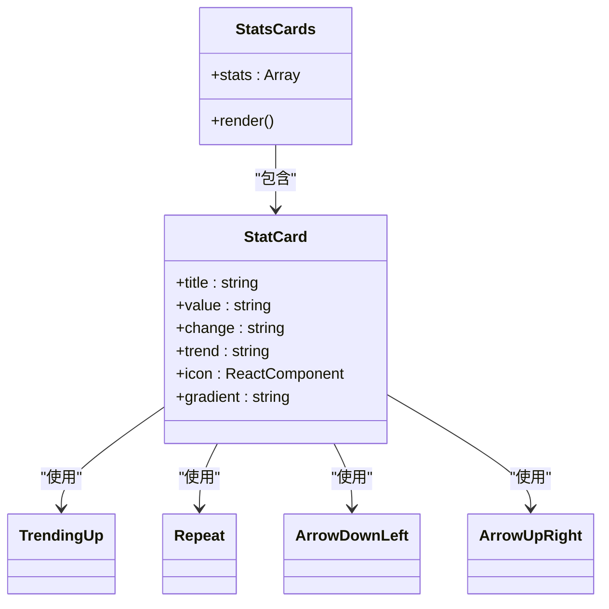

# 业务UI组件

<cite>
**本文档引用的文件**   
- [WalletConnect.tsx](file://src/components/Wallet/WalletConnect.tsx)
- [KYCVerification.tsx](file://src/components/Compliance/KYCVerification.tsx)
- [TransactionHistory.tsx](file://src/components/Transactions/TransactionHistory.tsx)
- [StatsCards.tsx](file://src/components/Dashboard/StatsCards.tsx)
- [walletService.ts](file://src/services/walletService.ts)
- [transactionService.ts](file://src/services/transactionService.ts)
- [wagmi.tsx](file://src/config/wagmi.tsx)
- [kycService.ts](file://backend/src/services/kycService.ts)
</cite>

## 目录
1. [简介](#简介)
2. [钱包连接组件](#钱包连接组件)
3. [合规验证组件](#合规验证组件)
4. [交易历史组件](#交易历史组件)
5. [仪表板统计卡片](#仪表板统计卡片)
6. [组件状态管理与错误处理](#组件状态管理与错误处理)
7. [组件间通信与全局状态集成](#组件间通信与全局状态集成)
8. [典型使用场景](#典型使用场景)

## 简介
本文档详细介绍了TriBridge平台的核心业务UI组件，包括钱包、合规、交易和仪表板模块的复合组件实现。文档重点阐述了WalletConnect如何集成Web3Provider实现钱包连接，KYCVerification组件与后端KYC服务的交互流程，TransactionHistory的数据渲染与分页机制，以及StatsCards的实时数据更新逻辑。同时，文档还解释了这些组件如何组合基础UI元素并接入业务服务（如walletService、transactionService）来完成特定功能。

## 钱包连接组件

WalletConnect组件实现了Web3钱包的连接与管理功能，通过集成wagmi库的Web3Provider实现钱包连接。组件使用useAccount、useConnect和useDisconnect等hooks管理钱包状态，并通过WalletService获取稳定币余额。

组件在用户未连接钱包时显示连接界面，列出可用的钱包连接器（如MetaMask）。连接成功后，显示钱包信息卡片，包括网络信息、钱包地址和稳定币余额。用户可以复制地址、查看区块链浏览器中的交易记录，并刷新余额。

WalletService通过ethers库与区块链交互，使用ERC20 ABI查询DAI和USDC等稳定币的余额。服务支持多个网络（如Sepolia测试网和以太坊主网），并处理网络切换和交易状态监控。

**图示来源**
- [WalletConnect.tsx](file://src/components/Wallet/WalletConnect.tsx#L16-L241)
- [walletService.ts](file://src/services/walletService.ts#L62-L264)
- [wagmi.tsx](file://src/config/wagmi.tsx#L1-L80)

**本节来源**
- [WalletConnect.tsx](file://src/components/Wallet/WalletConnect.tsx#L16-L241)
- [walletService.ts](file://src/services/walletService.ts#L62-L264)

## 合规验证组件

KYCVerification组件实现了用户身份验证流程，包含个人信息、身份文件、商业信息和审核确认四个步骤。组件使用状态管理跟踪当前步骤和KYC状态，并提供进度指示器。

在个人信息步骤中，用户填写姓名、出生日期、国籍、电话号码和居住地址。身份文件步骤允许用户上传身份证、地址证明和自拍照片。商业信息步骤（可选）用于企业用户填写公司信息。最后，审核确认步骤显示所有提交的信息供用户确认。

组件与后端KYC服务（如Sumsub、Onfido或国内合规提供商）交互，提交KYC申请并获取审核结果。KYCService处理与不同提供商的API集成，包括申请人创建、文件上传、检查创建和状态查询。

**图示来源**
- [KYCVerification.tsx](file://src/components/Compliance/KYCVerification.tsx#L21-L517)
- [kycService.ts](file://backend/src/services/kycService.ts#L1-L561)

**本节来源**
- [KYCVerification.tsx](file://src/components/Compliance/KYCVerification.tsx#L21-L517)
- [kycService.ts](file://backend/src/services/kycService.ts#L1-L561)

## 交易历史组件

TransactionHistory组件实现了交易记录的展示、搜索、过滤和统计功能。组件使用useState管理交易数据、搜索条件和过滤状态，并通过useEffect处理数据加载和过滤逻辑。

组件首先模拟加载交易历史数据，包括交易ID、类型、状态、金额、汇率、手续费和时间戳等信息。用户可以通过搜索框按交易ID、货币或交易对手进行搜索，并通过下拉菜单按状态和类型进行过滤。

交易列表采用卡片式布局，每张卡片显示交易的基本信息、状态标签和详细信息。组件还提供交易统计卡片，显示总交易数、成功交易数、处理中交易数和总交易量。

**图示来源**
- [TransactionHistory.tsx](file://src/components/Transactions/TransactionHistory.tsx#L39-L495)
- [transactionService.ts](file://src/services/transactionService.ts#L52-L388)

**本节来源**
- [TransactionHistory.tsx](file://src/components/Transactions/TransactionHistory.tsx#L39-L495)
- [transactionService.ts](file://src/services/transactionService.ts#L52-L388)

## 仪表板统计卡片

StatsCards组件实现了仪表板上的统计卡片展示，包括总交易量、活跃交易数、平均处理时间和成功率等关键指标。组件使用静态数据展示统计信息，并通过图标和颜色区分不同指标。

每张统计卡片包含标题、数值、变化率和趋势图标。卡片使用渐变背景和阴影效果增强视觉效果。组件采用网格布局，支持在不同屏幕尺寸下自适应显示。

**图示来源**
- [StatsCards.tsx](file://src/components/Dashboard/StatsCards.tsx#L3-L69)

**本节来源**
- [StatsCards.tsx](file://src/components/Dashboard/StatsCards.tsx#L3-L69)

## 组件状态管理与错误处理

各业务组件采用React的useState和useEffect hooks进行状态管理。WalletConnect组件管理钱包连接状态、余额数据和加载状态。KYCVerification组件管理KYC步骤、表单数据和审核状态。TransactionHistory组件管理交易数据、过滤条件和加载状态。

错误处理方面，组件使用toast通知显示操作结果。WalletConnect在余额加载失败时显示错误提示。KYCVerification在文件上传成功时显示成功提示。TransactionHistory在导出完成时显示成功提示。

异步数据加载通过useEffect实现，组件在挂载时加载初始数据，并在相关状态变化时重新计算过滤结果。加载过程中显示骨架屏（skeleton）效果，提升用户体验。

**本节来源**
- [WalletConnect.tsx](file://src/components/Wallet/WalletConnect.tsx#L16-L241)
- [KYCVerification.tsx](file://src/components/Compliance/KYCVerification.tsx#L21-L517)
- [TransactionHistory.tsx](file://src/components/Transactions/TransactionHistory.tsx#L39-L495)

## 组件间通信与全局状态集成

组件间通信主要通过props传递回调函数实现。例如，TransactionHistory组件中的导出按钮通过onClick回调触发导出功能。全局状态管理通过context API实现，如TranslationContext提供多语言支持。

事件广播方面，组件使用自定义事件或状态管理库（如Redux）进行跨组件通信。例如，钱包连接状态变化可能触发多个组件的更新。全局状态集成通过Provider模式实现，将共享状态注入组件树。

**本节来源**
- [WalletConnect.tsx](file://src/components/Wallet/WalletConnect.tsx#L16-L241)
- [KYCVerification.tsx](file://src/components/Compliance/KYCVerification.tsx#L21-L517)
- [contexts/TranslationContext.tsx](file://src/contexts/TranslationContext.tsx)

## 典型使用场景

### 钱包连接场景
用户访问平台后，点击"连接钱包"按钮，选择钱包提供商（如MetaMask），授权连接后查看钱包余额和交易记录。

### KYC验证场景
新用户注册后，进入KYC验证流程，依次填写个人信息、上传身份文件、填写商业信息（如适用），最后确认提交，等待审核结果。

### 交易查询场景
用户进入交易历史页面，通过搜索框查找特定交易，使用过滤器筛选已完成的兑换交易，查看交易详情并导出记录。

### 仪表板监控场景
管理员登录后查看仪表板，监控总交易量、活跃交易数、平均处理时间和成功率等关键指标，及时发现异常情况。

**本节来源**
- [WalletConnect.tsx](file://src/components/Wallet/WalletConnect.tsx#L16-L241)
- [KYCVerification.tsx](file://src/components/Compliance/KYCVerification.tsx#L21-L517)
- [TransactionHistory.tsx](file://src/components/Transactions/TransactionHistory.tsx#L39-L495)
- [StatsCards.tsx](file://src/components/Dashboard/StatsCards.tsx#L3-L69)