# 交易UI组件

<cite>
**Referenced Files in This Document**   
- [TransactionHistory.tsx](file://src/components/Transactions/TransactionHistory.tsx)
- [transactionService.ts](file://src/services/transactionService.ts)
</cite>

## 目录
1. [简介](#简介)
2. [核心组件](#核心组件)
3. [数据渲染机制](#数据渲染机制)
4. [分页与过滤功能](#分页与过滤功能)
5. [数据获取与状态管理](#数据获取与状态管理)
6. [卡片式布局实现](#卡片式布局实现)
7. [性能优化建议](#性能优化建议)
8. [使用示例](#使用示例)

## 简介

交易UI组件是系统中用于展示用户交易历史的核心界面组件。该组件提供了完整的交易数据可视化功能，包括交易列表展示、多维度过滤、状态标识、区块链交易ID查看以及数据导出等特性。组件采用现代化的卡片式布局，为用户提供清晰直观的交易信息展示。

**Section sources**
- [TransactionHistory.tsx](file://src/components/Transactions/TransactionHistory.tsx#L39-L495)

## 核心组件

交易UI组件的核心是`TransactionHistory`组件，它负责管理交易数据的获取、过滤、渲染和用户交互。该组件与`transactionService`服务紧密协作，实现完整的交易历史管理功能。

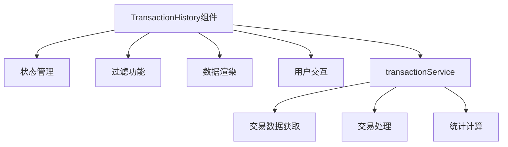

**Diagram sources**
- [TransactionHistory.tsx](file://src/components/Transactions/TransactionHistory.tsx#L39-L495)
- [transactionService.ts](file://src/services/transactionService.ts#L52-L388)

**Section sources**
- [TransactionHistory.tsx](file://src/components/Transactions/TransactionHistory.tsx#L39-L495)
- [transactionService.ts](file://src/services/transactionService.ts#L52-L388)

## 数据渲染机制

### 交易数据结构

组件使用`Transaction`接口定义交易数据结构，包含交易ID、类型、状态、货币信息、金额、汇率、手续费、时间戳等关键字段。

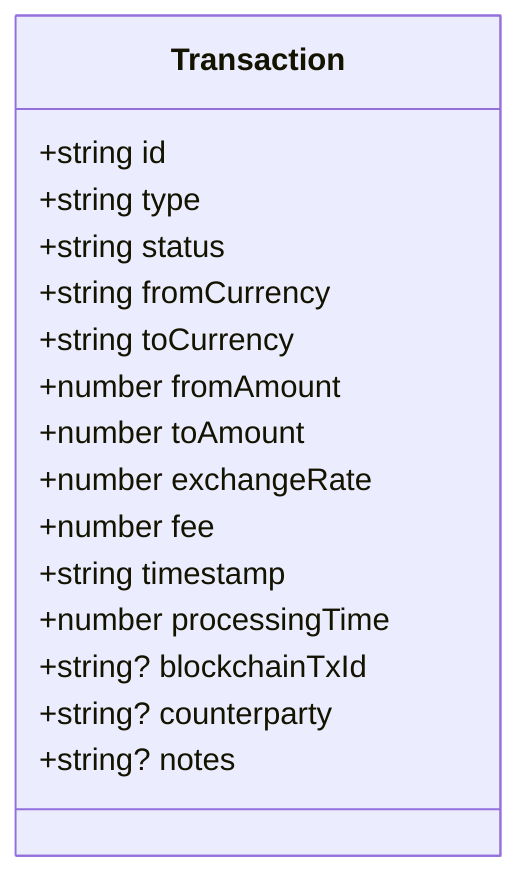

**Diagram sources**
- [TransactionHistory.tsx](file://src/components/Transactions/TransactionHistory.tsx#L22-L37)

### 状态标签渲染

组件通过`getStatusBadge`方法实现状态标签的动态渲染，根据交易状态显示不同的视觉样式和图标。

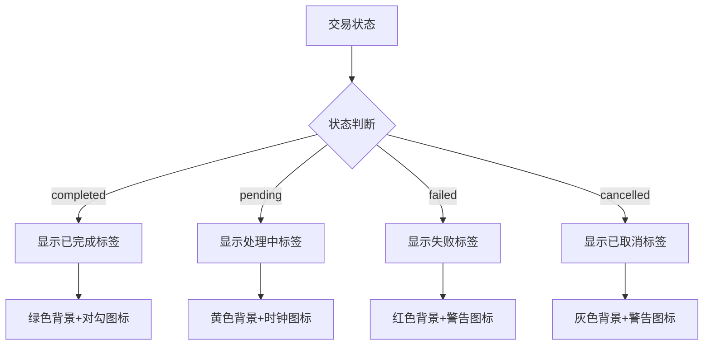

**Diagram sources**
- [TransactionHistory.tsx](file://src/components/Transactions/TransactionHistory.tsx#L180-L208)

**Section sources**
- [TransactionHistory.tsx](file://src/components/Transactions/TransactionHistory.tsx#L180-L208)

## 分页与过滤功能

### 过滤机制

组件实现了多维度的过滤功能，支持按状态、类型和搜索关键字进行筛选。

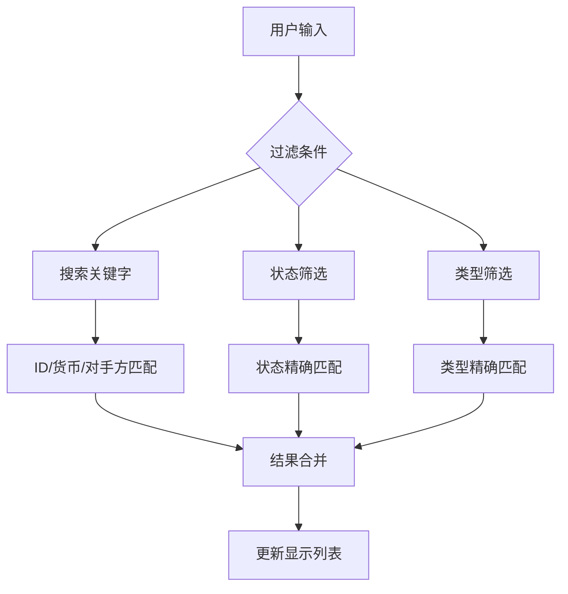

**Diagram sources**
- [TransactionHistory.tsx](file://src/components/Transactions/TransactionHistory.tsx#L130-L178)

### 过滤器实现

组件使用React状态管理过滤条件，并通过useEffect监听条件变化，实时更新过滤结果。

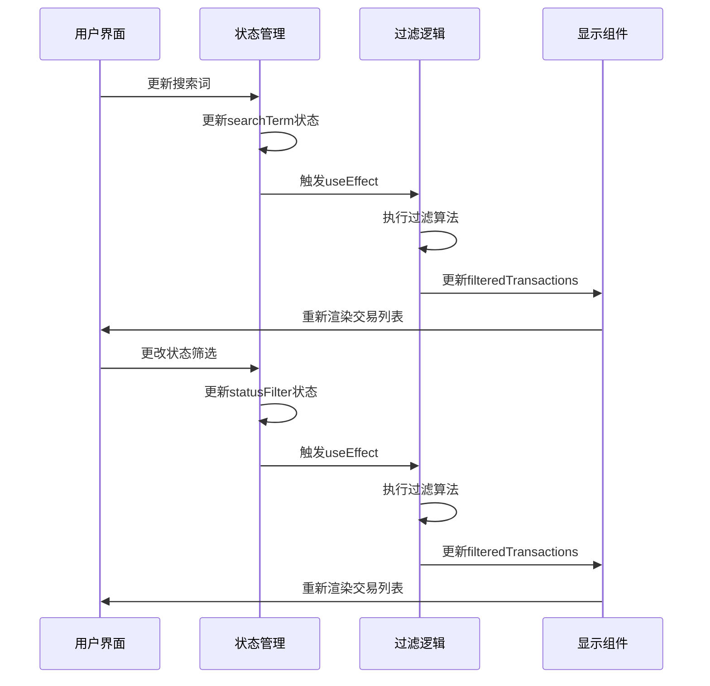

**Diagram sources**
- [TransactionHistory.tsx](file://src/components/Transactions/TransactionHistory.tsx#L130-L178)

**Section sources**
- [TransactionHistory.tsx](file://src/components/Transactions/TransactionHistory.tsx#L130-L178)

## 数据获取与状态管理

### 数据获取流程

组件通过`transactionService`服务获取交易数据，实现数据的加载和错误处理。

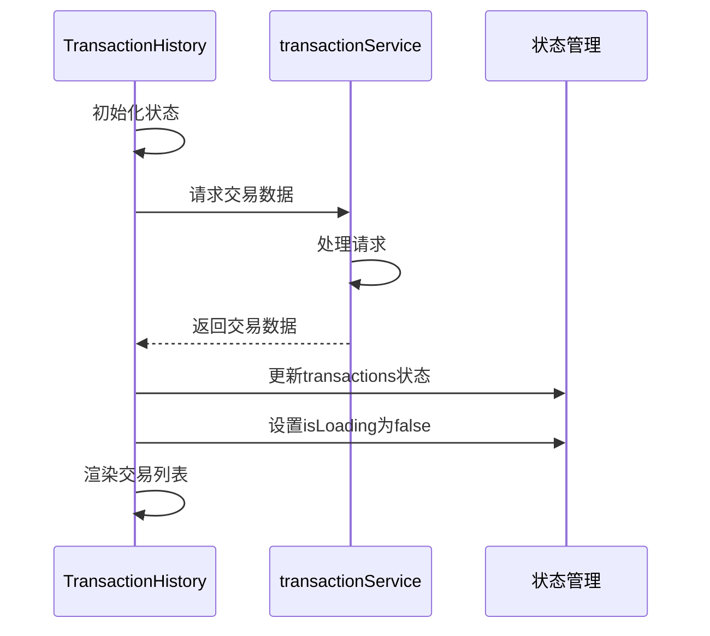

**Diagram sources**
- [transactionService.ts](file://src/services/transactionService.ts#L300-L320)

### 加载状态处理

组件实现了完善的加载状态管理，提供用户友好的加载体验。

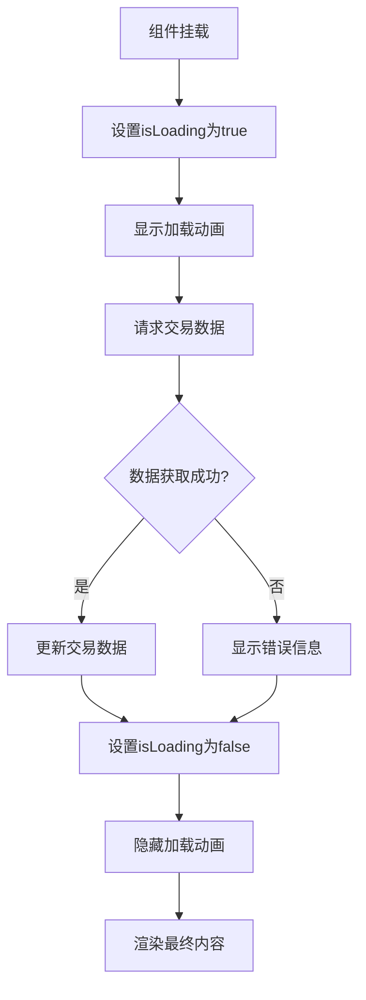

**Diagram sources**
- [TransactionHistory.tsx](file://src/components/Transactions/TransactionHistory.tsx#L65-L128)

**Section sources**
- [TransactionHistory.tsx](file://src/components/Transactions/TransactionHistory.tsx#L65-L128)

## 卡片式布局实现

### 布局结构

组件采用卡片式布局展示每笔交易，提供清晰的信息层次结构。

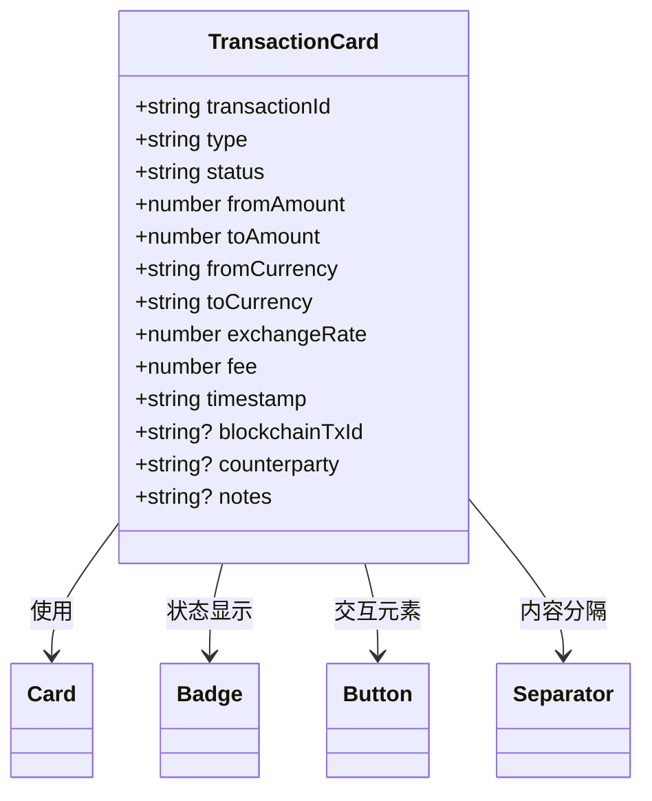

**Diagram sources**
- [TransactionHistory.tsx](file://src/components/Transactions/TransactionHistory.tsx#L350-L490)

### 区块链交易ID查看

组件提供了区块链交易ID的查看和复制功能，增强用户操作体验。

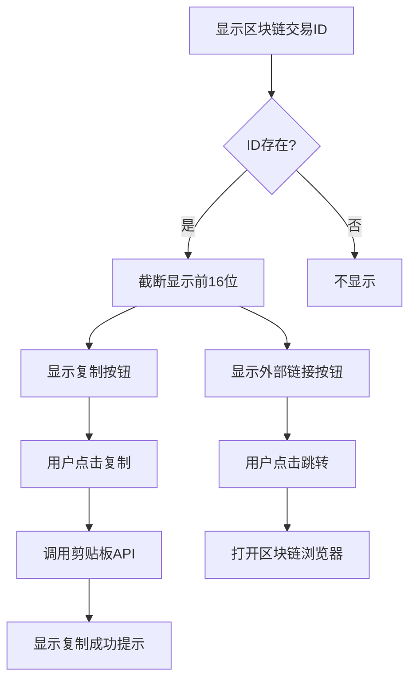

**Diagram sources**
- [TransactionHistory.tsx](file://src/components/Transactions/TransactionHistory.tsx#L420-L450)

**Section sources**
- [TransactionHistory.tsx](file://src/components/Transactions/TransactionHistory.tsx#L420-L450)

## 性能优化建议

### 数据处理优化

针对大量交易数据的场景，建议实施以下优化措施：

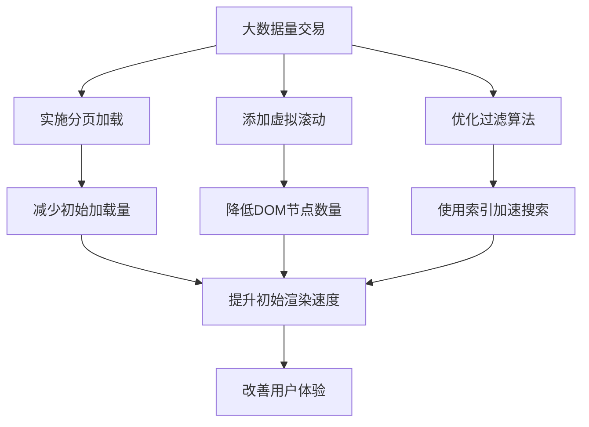

### 状态管理优化

优化组件的状态更新机制，避免不必要的重新渲染。

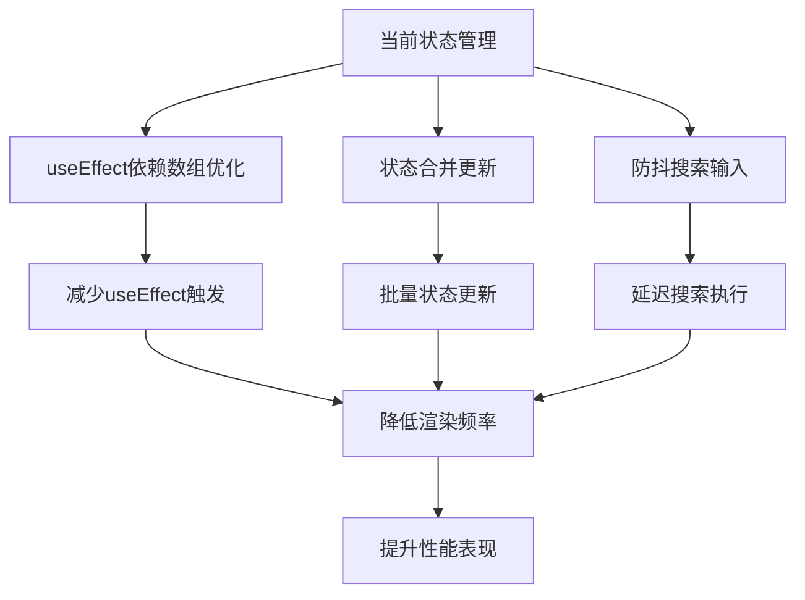

**Section sources**
- [TransactionHistory.tsx](file://src/components/Transactions/TransactionHistory.tsx#L130-L178)

## 使用示例

### 基本使用

组件的使用方式简单直观，只需导入并渲染即可。

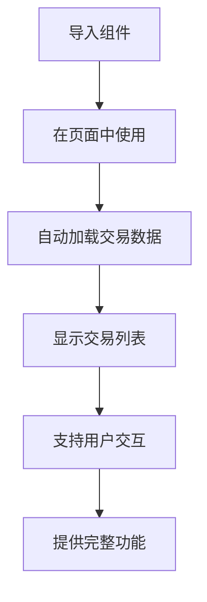

### 功能演示

组件提供了完整的交易管理功能演示。

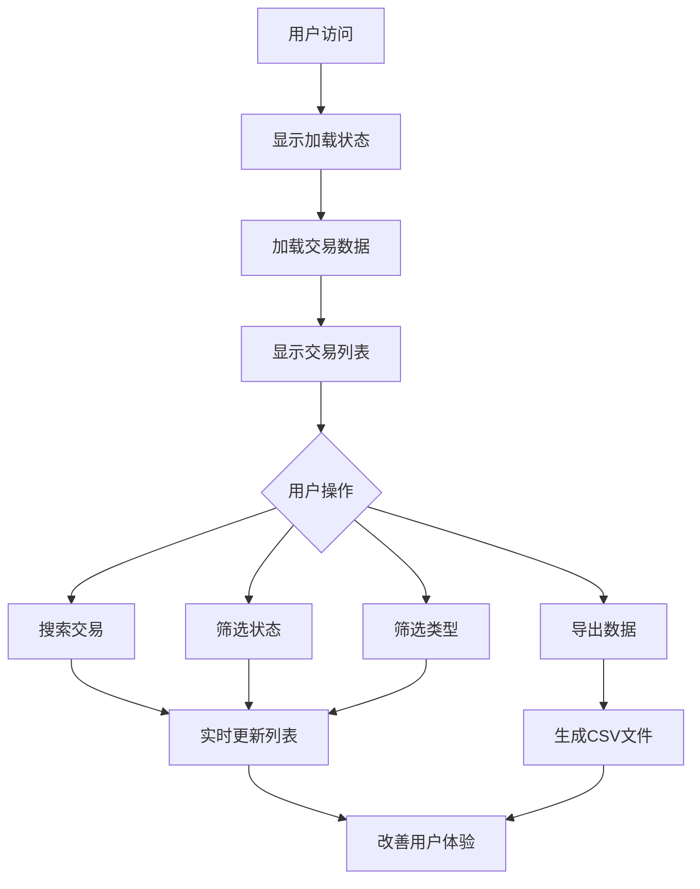

**Section sources**
- [TransactionHistory.tsx](file://src/components/Transactions/TransactionHistory.tsx#L39-L495)