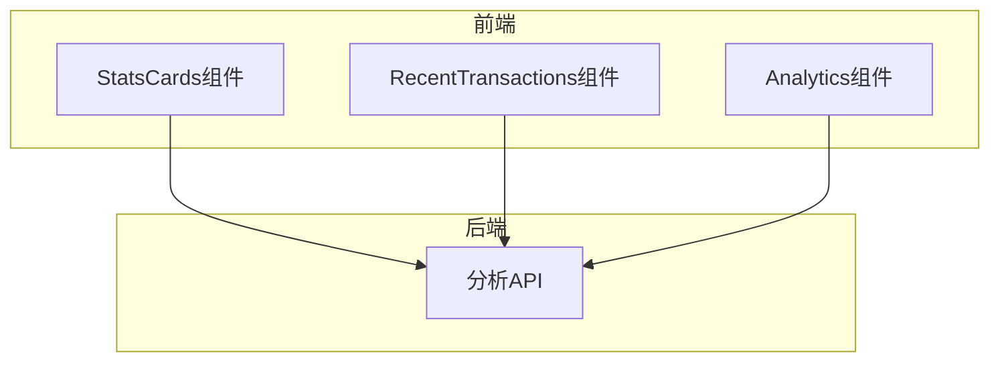
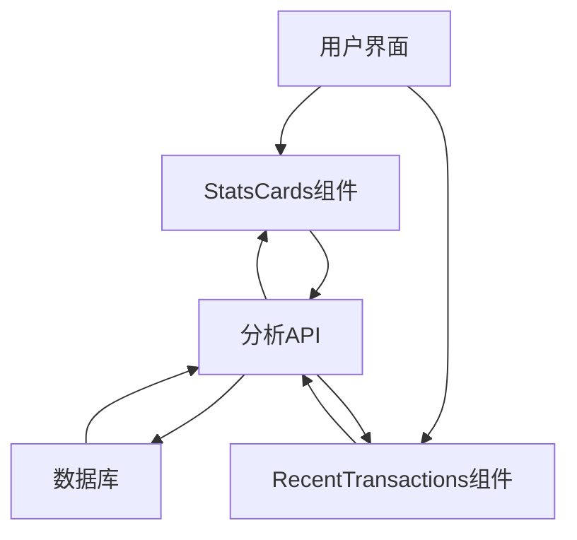
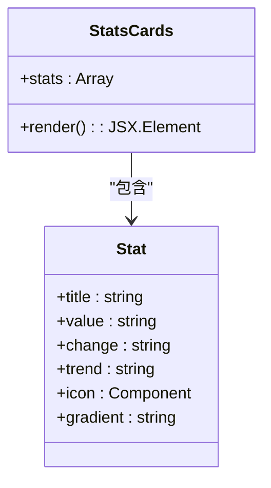
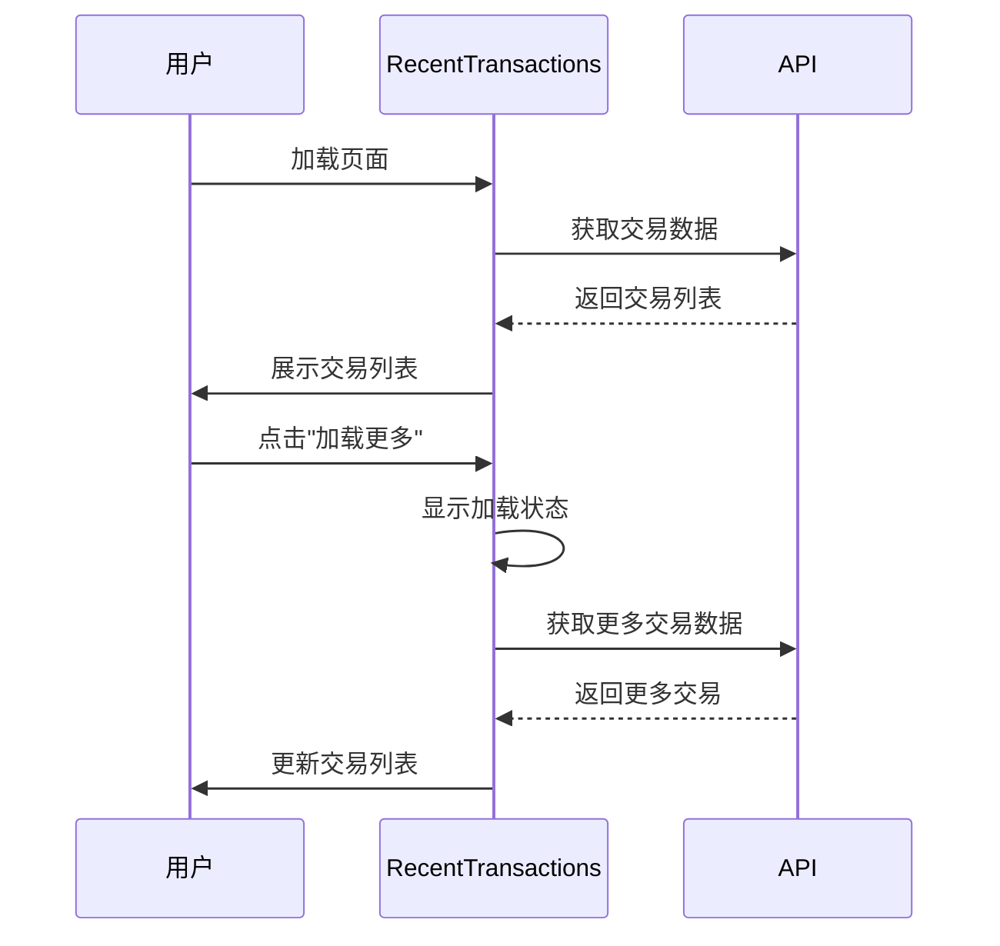
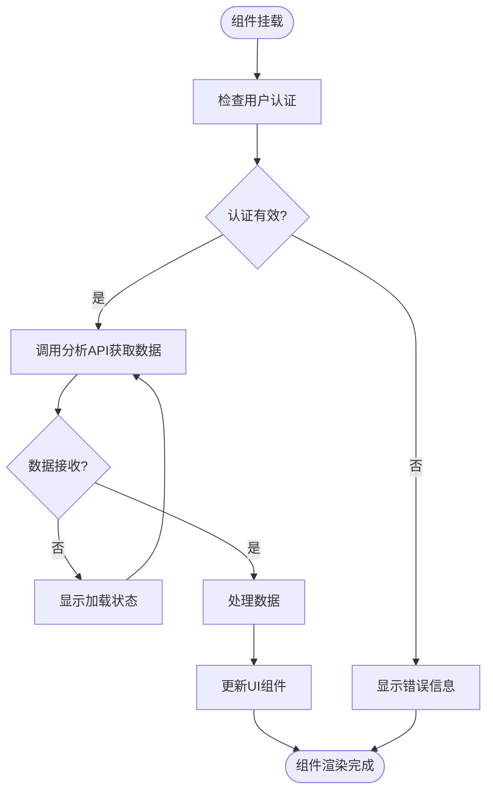
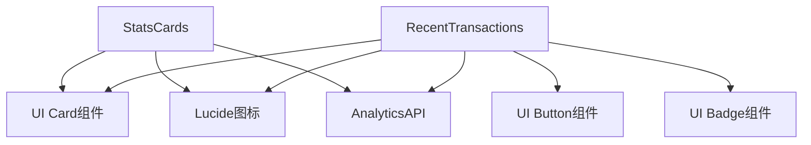

# 仪表板UI组件

<cite>
**本文档引用的文件**
- [StatsCards.tsx](file://src/components/Dashboard/StatsCards.tsx)
- [RecentTransactions.tsx](file://src/components/Dashboard/RecentTransactions.tsx)
- [analytics.ts](file://backend/src/routes/analytics.ts)
- [Analytics.tsx](file://src/components/Analytics/Analytics.tsx)
</cite>

## 目录
1. [简介](#简介)
2. [项目结构](#项目结构)
3. [核心组件](#核心组件)
4. [架构概述](#架构概述)
5. [详细组件分析](#详细组件分析)
6. [依赖分析](#依赖分析)
7. [性能考虑](#性能考虑)
8. [故障排除指南](#故障排除指南)
9. [结论](#结论)

## 简介
本文档详细介绍了仪表板UI组件的设计与实现，重点分析了StatsCards组件的关键指标展示功能和RecentTransactions组件的最新交易流展示功能。文档涵盖了组件的实时数据集成、加载状态处理、错误处理机制、响应式布局设计以及与后端分析API的交互模式，并提供了性能监控和优化建议。

## 项目结构
仪表板UI组件位于`src/components/Dashboard`目录下，主要包括StatsCards和RecentTransactions两个核心组件。这些组件通过调用后端分析API获取实时数据，并在前端进行动态展示。

**图表来源**
- [StatsCards.tsx](file://src/components/Dashboard/StatsCards.tsx#L3-L69)
- [RecentTransactions.tsx](file://src/components/Dashboard/RecentTransactions.tsx#L6-L199)
- [analytics.ts](file://backend/src/routes/analytics.ts#L0-L73)

**章节来源**
- [StatsCards.tsx](file://src/components/Dashboard/StatsCards.tsx#L1-L71)
- [RecentTransactions.tsx](file://src/components/Dashboard/RecentTransactions.tsx#L1-L201)

## 核心组件
本节分析仪表板UI的核心组件，包括StatsCards和RecentTransactions组件，重点介绍其功能实现和交互设计。

**章节来源**
- [StatsCards.tsx](file://src/components/Dashboard/StatsCards.tsx#L3-L69)
- [RecentTransactions.tsx](file://src/components/Dashboard/RecentTransactions.tsx#L6-L199)

## 架构概述
仪表板UI组件采用现代化的React架构，通过组件化设计实现功能分离和代码复用。组件通过HTTP请求与后端分析API进行数据交互，实现动态数据更新。

**图表来源**
- [analytics.ts](file://backend/src/routes/analytics.ts#L0-L73)
- [StatsCards.tsx](file://src/components/Dashboard/StatsCards.tsx#L3-L69)

## 详细组件分析
本节对仪表板UI的各个关键组件进行深入分析，包括其功能实现、数据处理和用户交互。

### StatsCards组件分析
StatsCards组件用于展示关键业务指标，包括交易量、成功率、处理时间等。组件采用网格布局，支持响应式设计，在不同屏幕尺寸下自动调整布局。

**图表来源**
- [StatsCards.tsx](file://src/components/Dashboard/StatsCards.tsx#L3-L69)

**章节来源**
- [StatsCards.tsx](file://src/components/Dashboard/StatsCards.tsx#L1-L71)

### RecentTransactions组件分析
RecentTransactions组件用于展示最新的交易流信息，支持分页加载和状态可视化。组件通过模拟数据展示交易详情，包括交易ID、类型、金额、状态和时间戳。

**图表来源**
- [RecentTransactions.tsx](file://src/components/Dashboard/RecentTransactions.tsx#L6-L199)

**章节来源**
- [RecentTransactions.tsx](file://src/components/Dashboard/RecentTransactions.tsx#L1-L201)

### 数据集成与交互模式
仪表板组件通过RESTful API与后端服务进行数据交互，实现动态数据更新和实时监控功能。

**图表来源**
- [analytics.ts](file://backend/src/routes/analytics.ts#L0-L73)
- [Analytics.tsx](file://src/components/Analytics/Analytics.tsx#L52-L88)

**章节来源**
- [analytics.ts](file://backend/src/routes/analytics.ts#L0-L422)
- [Analytics.tsx](file://src/components/Analytics/Analytics.tsx#L1-L404)

## 依赖分析
仪表板UI组件依赖于多个前端和后端模块，这些依赖关系确保了组件的功能完整性和数据一致性。

**图表来源**
- [StatsCards.tsx](file://src/components/Dashboard/StatsCards.tsx#L1-L71)
- [RecentTransactions.tsx](file://src/components/Dashboard/RecentTransactions.tsx#L1-L201)

**章节来源**
- [StatsCards.tsx](file://src/components/Dashboard/StatsCards.tsx#L1-L71)
- [RecentTransactions.tsx](file://src/components/Dashboard/RecentTransactions.tsx#L1-L201)

## 性能考虑
仪表板UI组件在设计时充分考虑了性能优化，通过多种技术手段确保流畅的用户体验。

**章节来源**
- [StatsCards.tsx](file://src/components/Dashboard/StatsCards.tsx#L3-L69)
- [RecentTransactions.tsx](file://src/components/Dashboard/RecentTransactions.tsx#L6-L199)

## 故障排除指南
本节分析组件的错误处理机制和调试工具，帮助开发者快速定位和解决问题。

**章节来源**
- [analytics.ts](file://backend/src/routes/analytics.ts#L70-L127)
- [Analytics.tsx](file://src/components/Analytics/Analytics.tsx#L90-L118)

## 结论
仪表板UI组件通过精心设计的架构和实现，提供了强大的数据展示和交互功能。组件采用现代化的前端技术栈，具有良好的可维护性和扩展性，为用户提供直观、实时的业务洞察。