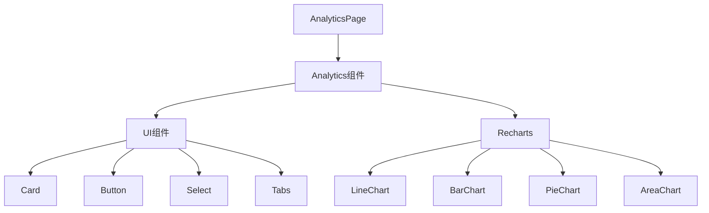
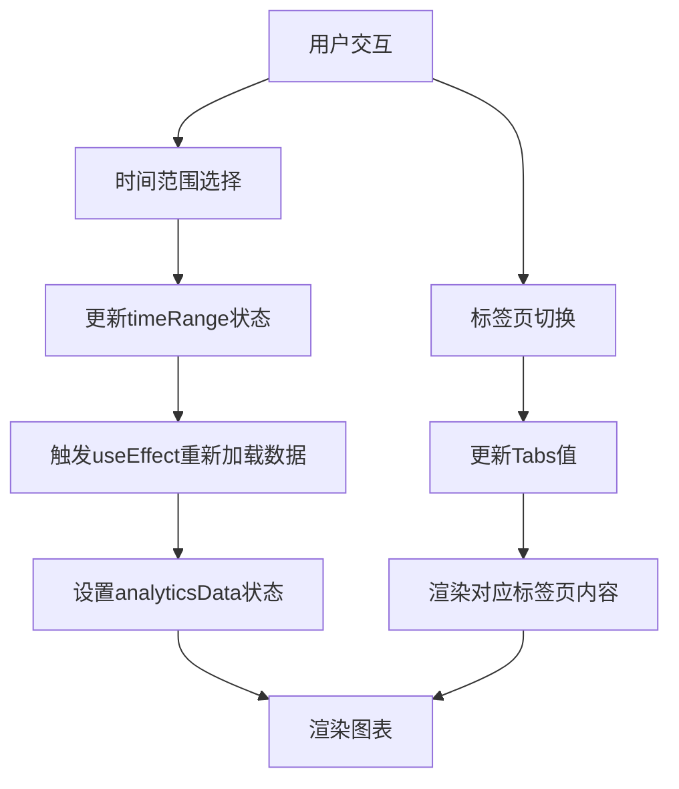
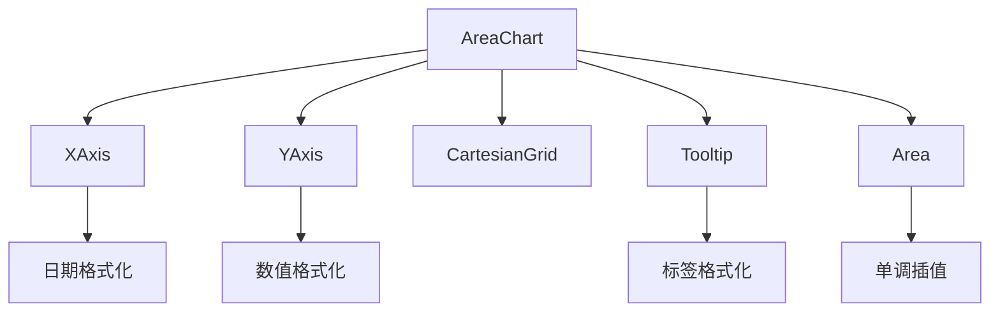
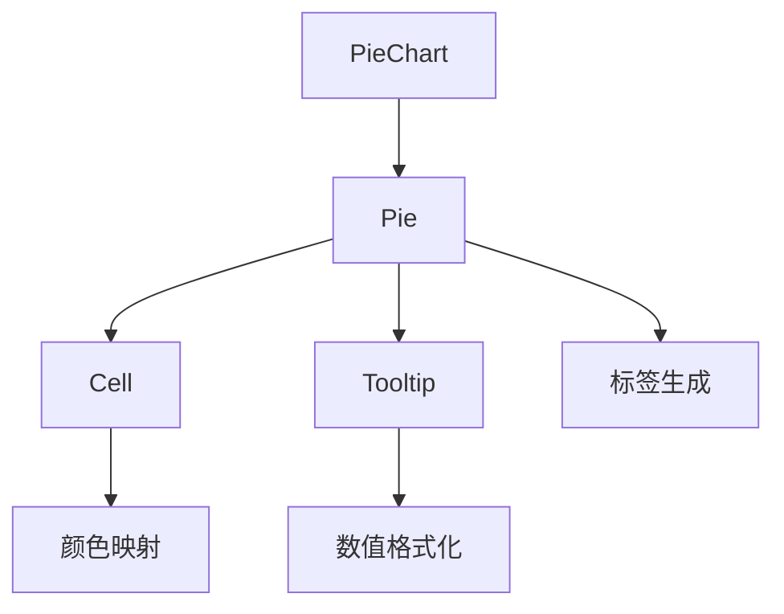
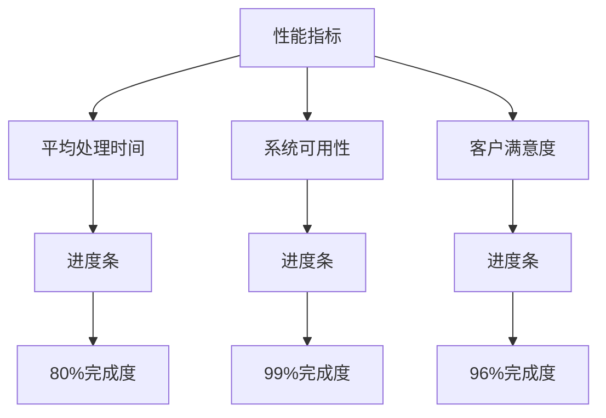
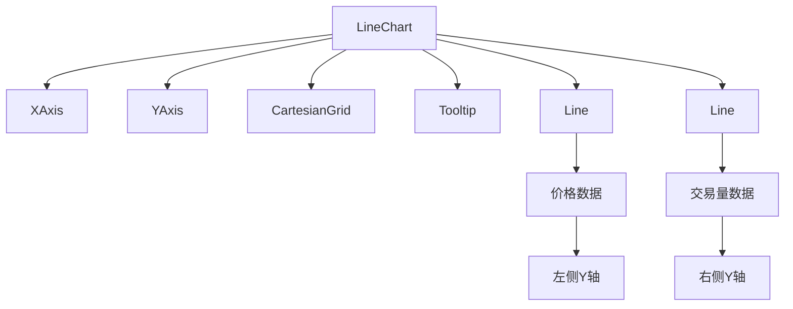
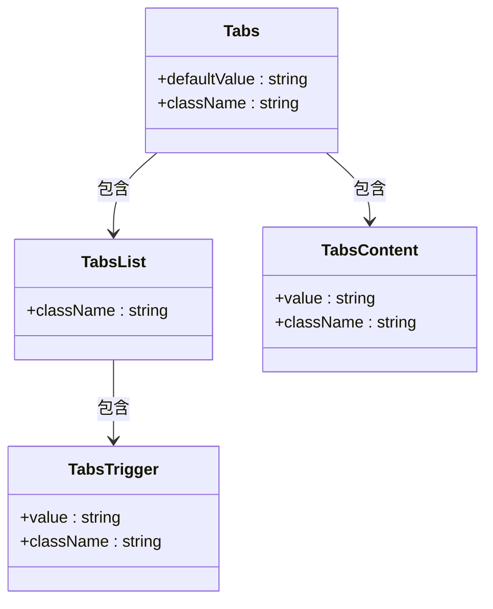
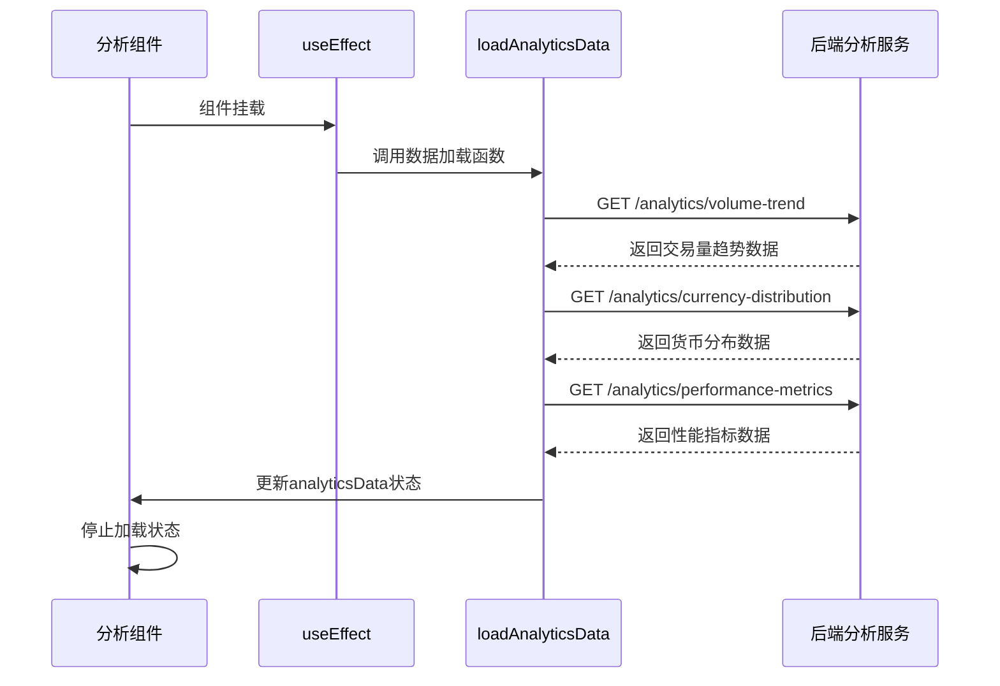
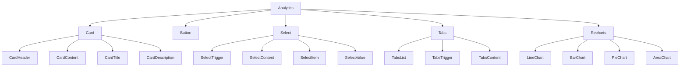

# 分析UI组件

<cite>
**本文档中引用的文件**  
- [Analytics.tsx](file://src/components/Analytics/Analytics.tsx)
- [tabs.tsx](file://src/components/ui/tabs.tsx)
- [analytics.ts](file://backend/src/routes/analytics.ts)
- [transactionService.ts](file://src/services/transactionService.ts)
</cite>

## 目录
1. [介绍](#介绍)
2. [项目结构](#项目结构)
3. [核心组件](#核心组件)
4. [架构概览](#架构概览)
5. [详细组件分析](#详细组件分析)
6. [依赖分析](#依赖分析)
7. [性能考虑](#性能考虑)
8. [故障排除指南](#故障排除指南)
9. [结论](#结论)

## 介绍
分析UI组件为用户提供全面的数据可视化功能，涵盖交易量趋势、货币分布、性能指标和实时监控。该组件通过标签页实现多视图切换，支持时间范围选择，并展示加载状态。它集成了Recharts图表库，采用响应式设计，并与后端分析服务进行数据交互。

## 项目结构
分析组件位于`src/components/Analytics`目录下，作为独立的UI模块被`src/pages/Analytics.tsx`页面调用。该组件依赖于UI库中的卡片、按钮、选择器和标签页等基础组件，并通过Recharts实现各种图表渲染。

**Diagram sources**
- [Analytics.tsx](file://src/components/Analytics/Analytics.tsx#L1-L404)

**Section sources**
- [Analytics.tsx](file://src/components/Analytics/Analytics.tsx#L1-L404)
- [Analytics.tsx](file://src/pages/Analytics.tsx#L1-L15)

## 核心组件
分析组件实现了完整的数据可视化解决方案，包含四个主要视图：交易量趋势、货币分布、性能分析和实时数据监控。组件通过状态管理处理数据加载和时间范围选择，使用骨架屏展示加载状态，并通过标签页实现视图切换。

**Section sources**
- [Analytics.tsx](file://src/components/Analytics/Analytics.tsx#L47-L402)

## 架构概览
分析组件采用React函数式组件架构，使用useState和useEffect进行状态管理和副作用处理。数据流从组件内部模拟数据源流向各个图表，通过Tabs组件实现视图切换，Select组件处理时间范围选择。

**Diagram sources**
- [Analytics.tsx](file://src/components/Analytics/Analytics.tsx#L47-L402)

## 详细组件分析
分析组件通过模块化设计实现了复杂的数据可视化功能，每个功能模块都有清晰的职责划分。

### 数据可视化功能分析
分析组件提供了多种图表类型来展示不同维度的数据，包括面积图、柱状图、饼图和折线图。

#### 交易量趋势图

**Diagram sources**
- [Analytics.tsx](file://src/components/Analytics/Analytics.tsx#L228-L256)

#### 货币分布饼图

**Diagram sources**
- [Analytics.tsx](file://src/components/Analytics/Analytics.tsx#L287-L316)

#### 性能指标仪表盘

**Diagram sources**
- [Analytics.tsx](file://src/components/Analytics/Analytics.tsx#L342-L377)

#### 实时数据监控

**Diagram sources**
- [Analytics.tsx](file://src/components/Analytics/Analytics.tsx#L379-L402)

### 多视图切换机制
分析组件使用标签页实现多视图切换功能，每个标签页对应不同的数据可视化内容。

**Diagram sources**
- [tabs.tsx](file://src/components/ui/tabs.tsx#L5-L49)
- [Analytics.tsx](file://src/components/Analytics/Analytics.tsx#L218-L226)

### 数据交互模式
分析组件通过模拟数据加载机制展示与后端服务的交互模式，实际应用中将替换为真实的API调用。

**Diagram sources**
- [Analytics.tsx](file://src/components/Analytics/Analytics.tsx#L52-L88)
- [analytics.ts](file://backend/src/routes/analytics.ts#L1-L422)

## 依赖分析
分析组件依赖于多个UI组件和图表库，形成了清晰的依赖关系。

**Diagram sources**
- [Analytics.tsx](file://src/components/Analytics/Analytics.tsx#L1-L404)

## 性能考虑
分析组件在性能方面进行了多项优化，包括数据加载状态管理、响应式图表渲染和组件更新控制。

**Section sources**
- [Analytics.tsx](file://src/components/Analytics/Analytics.tsx#L90-L118)

## 故障排除指南
当分析组件出现问题时，可以检查以下常见问题：

1. **数据未加载**：检查useEffect依赖数组是否正确包含timeRange
2. **图表不显示**：确保ResponsiveContainer正确包裹图表组件
3. **标签页切换失效**：验证Tabs的defaultValue与TabsTrigger的value匹配
4. **样式问题**：确认Tailwind CSS类名正确应用

**Section sources**
- [Analytics.tsx](file://src/components/Analytics/Analytics.tsx#L47-L402)

## 结论
分析UI组件提供了一套完整的数据可视化解决方案，通过合理的架构设计和组件化实现，有效地展示了复杂的交易数据分析。组件具有良好的可扩展性，便于集成真实的数据源和添加新的可视化功能。