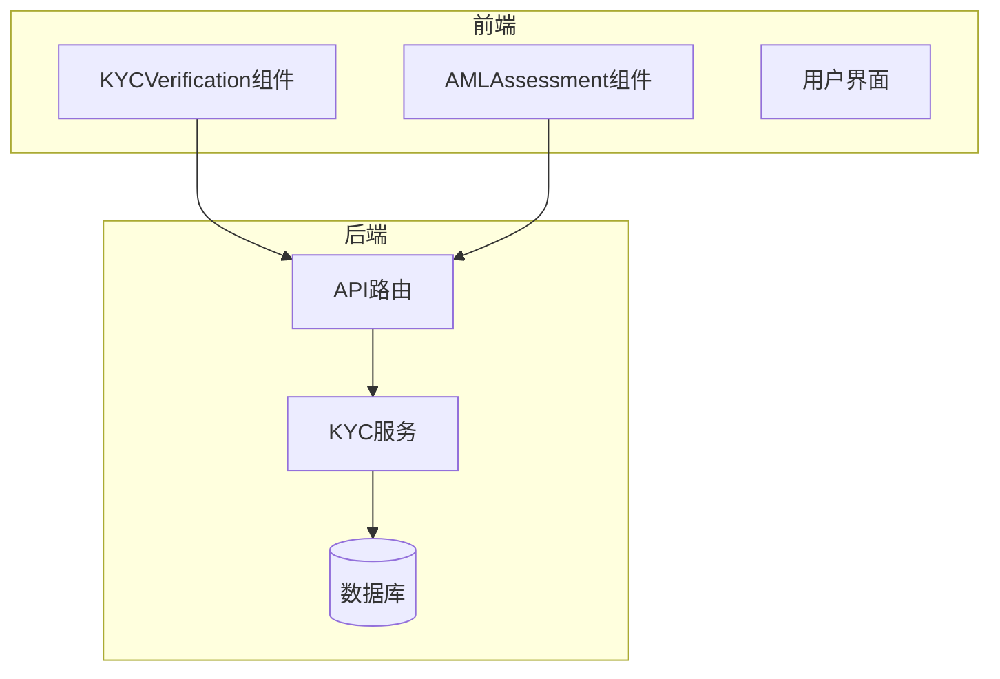
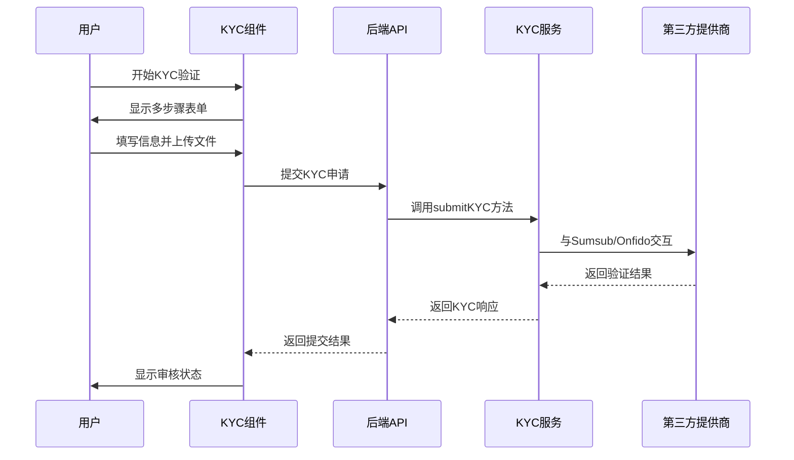
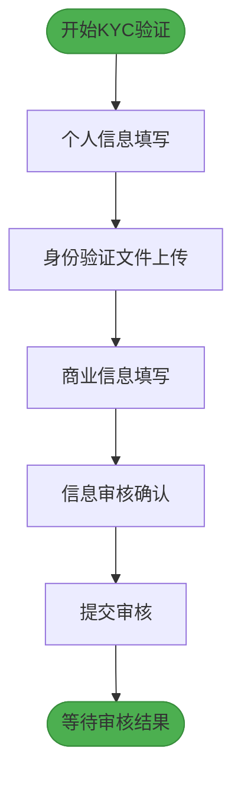
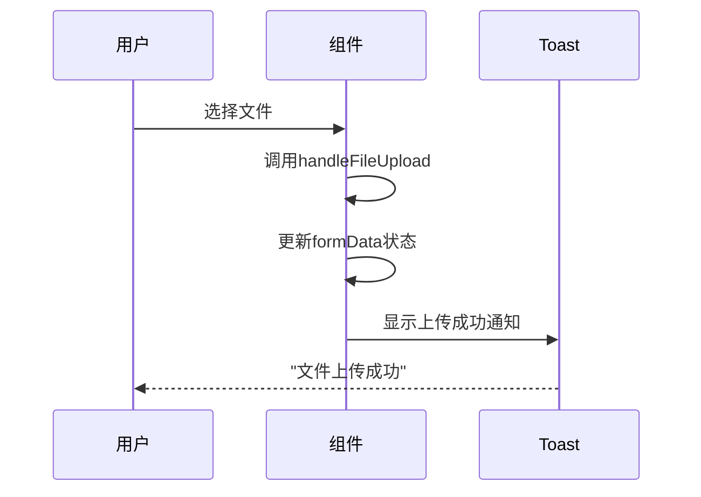
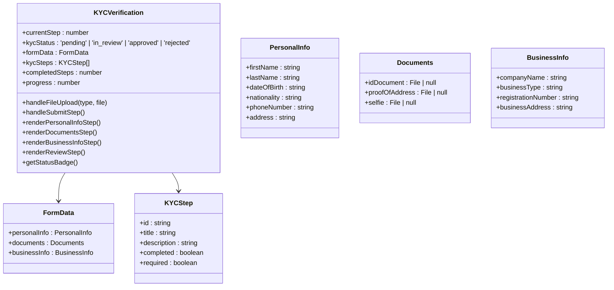
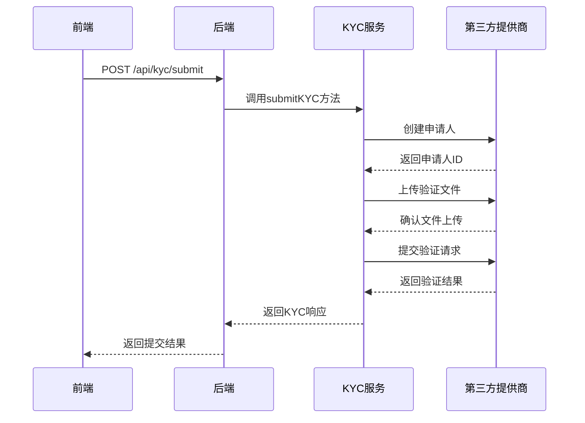
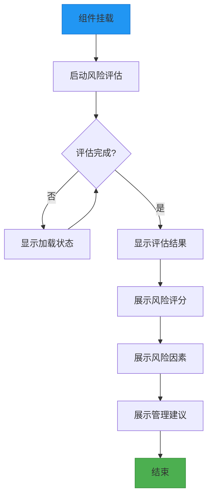
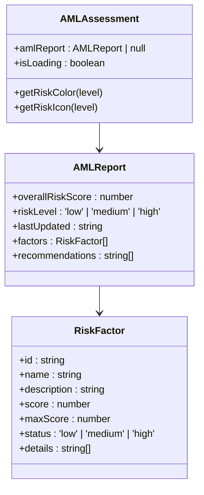
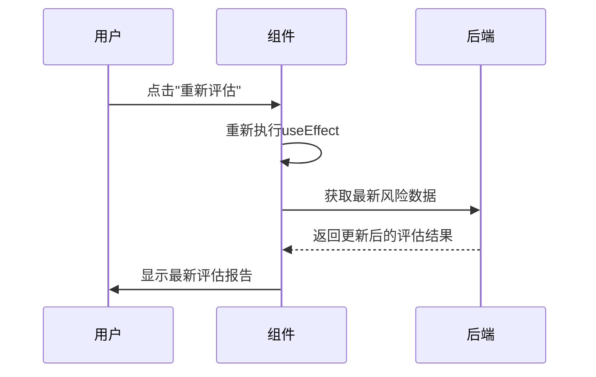
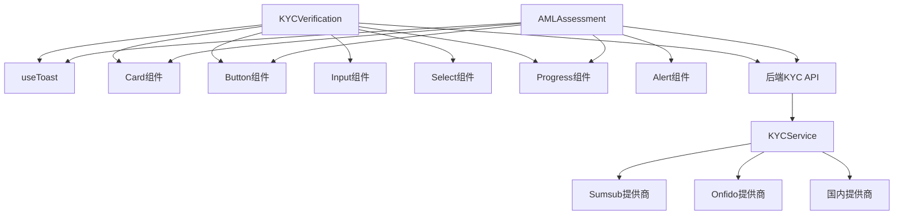

# 合规UI组件

<cite>
**本文档中引用的文件**   
- [KYCVerification.tsx](file://src/components/Compliance/KYCVerification.tsx)
- [AMLAssessment.tsx](file://src/components/Compliance/AMLAssessment.tsx)
- [kycService.ts](file://backend/src/services/kycService.ts)
- [kyc.ts](file://backend/src/routes/kyc.ts)
- [compliance.tsx](file://pages/compliance.tsx)
</cite>

## 目录
1. [引言](#引言)
2. [项目结构](#项目结构)
3. [核心组件](#核心组件)
4. [架构概述](#架构概述)
5. [详细组件分析](#详细组件分析)
6. [依赖分析](#依赖分析)
7. [性能考虑](#性能考虑)
8. [故障排除指南](#故障排除指南)
9. [结论](#结论)

## 引言
本文档深入探讨了合规UI组件的实现，重点分析KYCVerification和AMLAssessment两个核心组件。KYCVerification组件实现了多步骤表单流程，涵盖个人信息、文件上传、商业信息和审核确认四个阶段，确保用户能够顺利完成身份验证。AMLAssessment组件则专注于反洗钱风险评估，通过规则引擎集成和实时监控功能，提供全面的风险管理能力。文档详细阐述了组件如何处理合规状态变更、展示审核进度、提供用户反馈机制，以及在数据验证、错误处理和安全性方面的设计考量。

## 项目结构
项目采用分层架构，前端组件位于`src/components/Compliance`目录下，后端服务逻辑位于`backend/src/services`和`backend/src/routes`目录中。合规相关的UI组件与后端KYC服务通过API进行交互，形成完整的合规验证流程。

**图源**
- [KYCVerification.tsx](file://src/components/Compliance/KYCVerification.tsx)
- [AMLAssessment.tsx](file://src/components/Compliance/AMLAssessment.tsx)
- [kyc.ts](file://backend/src/routes/kyc.ts)
- [kycService.ts](file://backend/src/services/kycService.ts)

**节源**
- [KYCVerification.tsx](file://src/components/Compliance/KYCVerification.tsx)
- [AMLAssessment.tsx](file://src/components/Compliance/AMLAssessment.tsx)
- [kyc.ts](file://backend/src/routes/kyc.ts)
- [kycService.ts](file://backend/src/services/kycService.ts)

## 核心组件
本节深入分析KYCVerification和AMLAssessment两个核心合规组件的实现细节。

**节源**
- [KYCVerification.tsx](file://src/components/Compliance/KYCVerification.tsx)
- [AMLAssessment.tsx](file://src/components/Compliance/AMLAssessment.tsx)

## 架构概述
系统采用前后端分离架构，前端通过React组件实现用户交互，后端通过Node.js服务处理业务逻辑。KYC验证流程从用户填写表单开始，经过多步骤验证后提交至后端服务，后端服务与第三方KYC提供商（如Sumsub、Onfido）集成完成身份验证。

**图源**
- [KYCVerification.tsx](file://src/components/Compliance/KYCVerification.tsx)
- [kyc.ts](file://backend/src/routes/kyc.ts)
- [kycService.ts](file://backend/src/services/kycService.ts)

## 详细组件分析
本节对KYCVerification和AMLAssessment组件进行深入分析，包括其功能实现、状态管理和交互流程。

### KYCVerification组件分析
KYCVerification组件实现了完整的多步骤KYC验证流程，包含四个主要步骤：个人信息、文件上传、商业信息和审核确认。

#### 多步骤表单实现
组件使用状态管理来跟踪当前步骤和整体进度，通过`currentStep`状态变量控制显示哪个步骤的内容。每个步骤都有独立的渲染函数，如`renderPersonalInfoStep`、`renderDocumentsStep`等。

**图源**
- [KYCVerification.tsx](file://src/components/Compliance/KYCVerification.tsx#L21-L517)

#### 文件上传处理
文件上传功能通过`handleFileUpload`方法实现，该方法接收文件类型和文件对象作为参数，更新`formData`状态中的相应字段。组件支持上传身份证明、地址证明和自拍照片三种文件类型。

**图源**
- [KYCVerification.tsx](file://src/components/Compliance/KYCVerification.tsx#L21-L517)

#### 表单状态管理
组件使用React的`useState`钩子管理表单数据，包括个人信息、文件上传和商业信息三个部分。`formData`状态对象采用嵌套结构，便于组织和更新不同类别的数据。

**图源**
- [KYCVerification.tsx](file://src/components/Compliance/KYCVerification.tsx#L21-L517)

#### 与后端KYC服务的交互流程
当用户完成所有步骤并提交审核时，组件会触发`handleSubmitStep`方法，该方法更新KYC状态为"审核中"，并通过API与后端服务交互。

**图源**
- [KYCVerification.tsx](file://src/components/Compliance/KYCVerification.tsx#L21-L517)
- [kyc.ts](file://backend/src/routes/kyc.ts)
- [kycService.ts](file://backend/src/services/kycService.ts)

**节源**
- [KYCVerification.tsx](file://src/components/Compliance/KYCVerification.tsx#L21-L517)
- [kyc.ts](file://backend/src/routes/kyc.ts)
- [kycService.ts](file://backend/src/services/kycService.ts)

### AMLAssessment组件分析
AMLAssessment组件实现了反洗钱风险评估功能，通过规则引擎集成和实时监控，提供全面的风险管理能力。

#### 风险评估逻辑
组件通过`useEffect`钩子在挂载时模拟AML风险评估过程，2秒后返回模拟的评估报告。评估报告包含综合风险评分、风险等级、风险因素和管理建议等信息。

**图源**
- [AMLAssessment.tsx](file://src/components/Compliance/AMLAssessment.tsx#L36-L344)

#### 规则引擎集成
虽然当前实现为模拟数据，但组件设计支持与实际规则引擎集成。风险因素包括地理风险、交易模式、交易对手风险和行为分析四个维度，每个维度都有相应的评分和状态。

**图源**
- [AMLAssessment.tsx](file://src/components/Compliance/AMLAssessment.tsx#L36-L344)

#### 实时监控功能
组件提供了重新评估、下载报告和设置警报等功能按钮，支持实时监控和风险管理。当用户点击"重新评估"按钮时，组件会重新加载并执行风险评估过程。

**图源**
- [AMLAssessment.tsx](file://src/components/Compliance/AMLAssessment.tsx#L36-L344)

**节源**
- [AMLAssessment.tsx](file://src/components/Compliance/AMLAssessment.tsx#L36-L344)

## 依赖分析
本节分析合规组件与其他系统组件的依赖关系。

**图源**
- [KYCVerification.tsx](file://src/components/Compliance/KYCVerification.tsx)
- [AMLAssessment.tsx](file://src/components/Compliance/AMLAssessment.tsx)
- [kyc.ts](file://backend/src/routes/kyc.ts)
- [kycService.ts](file://backend/src/services/kycService.ts)

**节源**
- [KYCVerification.tsx](file://src/components/Compliance/KYCVerification.tsx)
- [AMLAssessment.tsx](file://src/components/Compliance/AMLAssessment.tsx)
- [kyc.ts](file://backend/src/routes/kyc.ts)
- [kycService.ts](file://backend/src/services/kycService.ts)

## 性能考虑
组件在性能方面进行了优化，确保用户交互流畅。KYCVerification组件采用分步加载方式，只渲染当前步骤的内容，减少不必要的渲染开销。AMLAssessment组件在加载时显示进度指示器，提升用户体验。后端服务通过异步处理和缓存机制，确保API响应快速。

## 故障排除指南
当合规组件出现问题时，可参考以下排查步骤：
1. 检查网络连接是否正常
2. 确认后端API服务是否运行
3. 验证环境变量配置是否正确
4. 检查文件上传大小是否超过限制（5MB）
5. 确认用户身份验证令牌是否有效

**节源**
- [KYCVerification.tsx](file://src/components/Compliance/KYCVerification.tsx)
- [kyc.ts](file://backend/src/routes/kyc.ts)

## 结论
本文档详细分析了合规UI组件的实现，包括KYCVerification和AMLAssessment两个核心组件。KYCVerification组件通过多步骤表单实现了完整的身份验证流程，支持个人信息收集、文件上传和商业信息填写。AMLAssessment组件提供了全面的反洗钱风险评估功能，通过规则引擎集成和实时监控，帮助系统识别和管理潜在风险。两个组件都注重用户体验，提供了清晰的状态反馈和错误处理机制，确保合规流程的顺利进行。