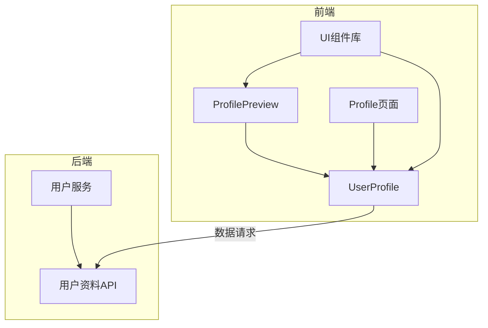
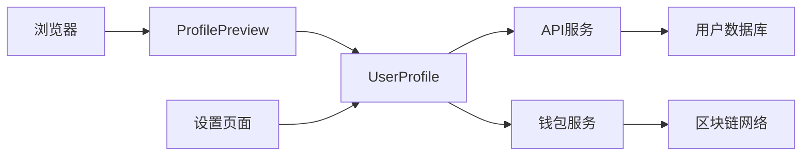
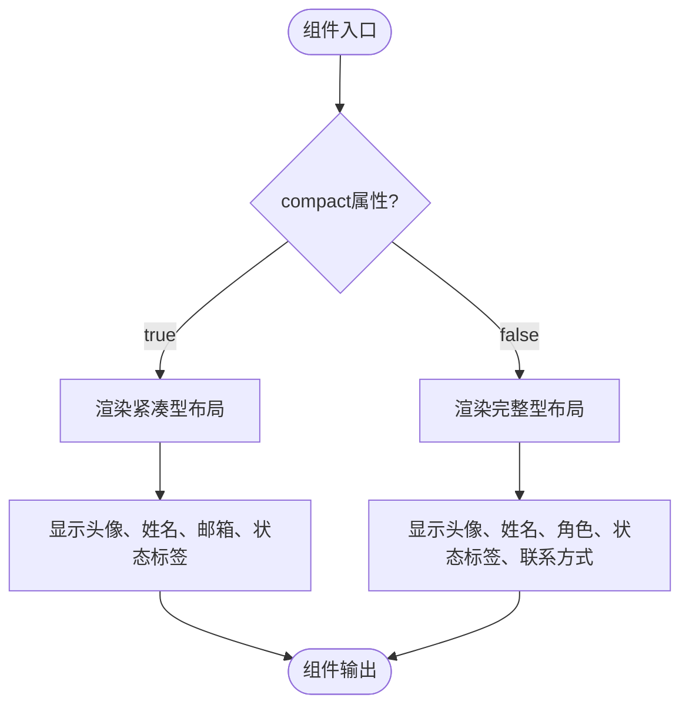
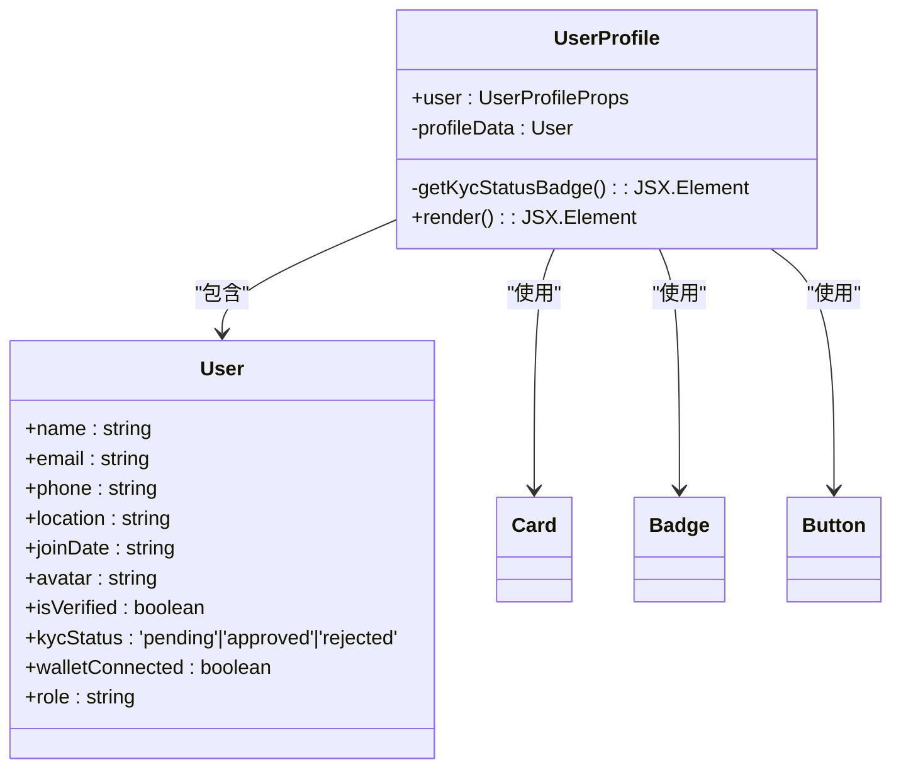
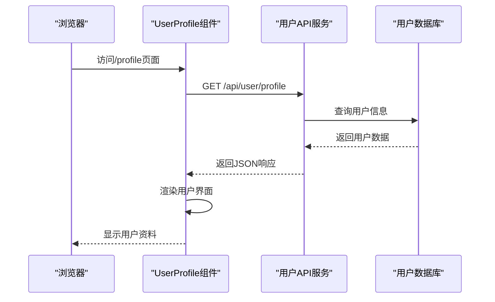
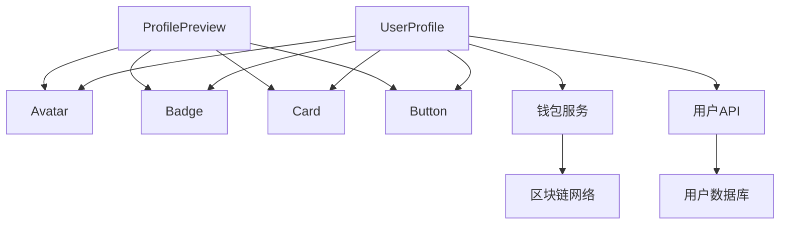

# 用户档案UI组件

<cite>
**本文档引用的文件**   
- [ProfilePreview.tsx](file://src/components/Profile/ProfilePreview.tsx)
- [UserProfile.tsx](file://src/components/Profile/UserProfile.tsx)
- [Profile.tsx](file://src/pages/Profile.tsx)
- [user.ts](file://backend/src/routes/user.ts)
- [walletService.ts](file://src/services/walletService.ts)
</cite>

## 目录
1. [简介](#简介)
2. [项目结构](#项目结构)
3. [核心组件](#核心组件)
4. [架构概述](#架构概述)
5. [详细组件分析](#详细组件分析)
6. [依赖分析](#依赖分析)
7. [性能考虑](#性能考虑)
8. [故障排除指南](#故障排除指南)
9. [结论](#结论)

## 简介
本文档详细说明了用户档案UI组件的设计与实现，重点介绍ProfilePreview组件的简洁信息展示模式（紧凑型/完整型）和UserProfile组件的详细信息管理功能。文档涵盖组件如何展示用户身份验证状态、KYC进度、钱包连接情况等关键信息，以及编辑功能的实现方式。同时解释响应式设计考虑、状态同步机制和与用户服务的数据交互模式。

## 项目结构
用户档案相关组件位于`src/components/Profile/`目录下，包含ProfilePreview和UserProfile两个核心组件。页面级组件位于`src/pages/Profile.tsx`，后端API路由定义在`backend/src/routes/user.ts`中。整体结构遵循功能模块化设计，前端组件与后端服务分离。

**图示来源**
- [ProfilePreview.tsx](file://src/components/Profile/ProfilePreview.tsx#L1-L126)
- [UserProfile.tsx](file://src/components/Profile/UserProfile.tsx#L1-L247)
- [Profile.tsx](file://src/pages/Profile.tsx#L1-L26)
- [user.ts](file://backend/src/routes/user.ts#L1-L52)

**本节来源**
- [ProfilePreview.tsx](file://src/components/Profile/ProfilePreview.tsx#L1-L126)
- [UserProfile.tsx](file://src/components/Profile/UserProfile.tsx#L1-L247)

## 核心组件
本系统包含两个核心用户档案组件：ProfilePreview用于简洁信息展示，支持紧凑型和完整型两种模式；UserProfile用于详细信息管理和状态展示。两个组件均通过标准化接口与用户服务进行数据交互，实现用户身份验证状态、KYC进度和钱包连接情况的可视化展示。

**本节来源**
- [ProfilePreview.tsx](file://src/components/Profile/ProfilePreview.tsx#L1-L126)
- [UserProfile.tsx](file://src/components/Profile/UserProfile.tsx#L1-L247)

## 架构概述
系统采用前后端分离架构，前端通过React组件树组织用户界面，后端提供RESTful API服务。用户档案组件通过HTTP请求获取用户数据，利用状态管理机制保持界面同步。钱包服务集成Web3技术栈，实现与区块链钱包的交互。

**图示来源**
- [ProfilePreview.tsx](file://src/components/Profile/ProfilePreview.tsx#L1-L126)
- [UserProfile.tsx](file://src/components/Profile/UserProfile.tsx#L1-L247)
- [user.ts](file://backend/src/routes/user.ts#L1-L52)
- [walletService.ts](file://src/services/walletService.ts#L1-L269)

## 详细组件分析

### ProfilePreview组件分析
ProfilePreview组件提供两种展示模式：紧凑型和完整型。紧凑模式适用于空间受限的场景，仅显示头像、姓名、邮箱和关键状态标签；完整模式提供更丰富的信息展示，包括角色、加入时间等。通过`compact`布尔参数控制显示模式，实现灵活的UI适配。

**图示来源**
- [ProfilePreview.tsx](file://src/components/Profile/ProfilePreview.tsx#L12-L14)
- [ProfilePreview.tsx](file://src/components/Profile/ProfilePreview.tsx#L16-L126)

**本节来源**
- [ProfilePreview.tsx](file://src/components/Profile/ProfilePreview.tsx#L1-L126)

### UserProfile组件分析
UserProfile组件提供全面的用户信息管理和状态展示功能。组件结构分为用户基本信息卡片和账户状态快捷操作区域。基本信息卡片展示用户头像、姓名、联系方式等详细信息；账户状态区域分为安全状态、钱包状态和会员权益三个模块，提供状态可视化和快捷操作入口。

**图示来源**
- [UserProfile.tsx](file://src/components/Profile/UserProfile.tsx#L0-L65)
- [UserProfile.tsx](file://src/components/Profile/UserProfile.tsx#L38-L247)

**本节来源**
- [UserProfile.tsx](file://src/components/Profile/UserProfile.tsx#L1-L247)

### 数据交互流程
用户档案组件与后端服务通过标准化API进行数据交互，确保信息的实时性和一致性。当用户访问个人资料页面时，系统发起API请求获取最新用户数据，并在前端进行渲染展示。

**图示来源**
- [UserProfile.tsx](file://src/components/Profile/UserProfile.tsx#L38-L247)
- [user.ts](file://backend/src/routes/user.ts#L1-L52)
- [Profile.tsx](file://src/pages/Profile.tsx#L9-L24)

## 依赖分析
用户档案组件依赖多个UI基础组件和外部服务。前端依赖Avatar、Badge、Card等UI组件库组件；功能上依赖用户服务API获取数据，钱包服务实现区块链交互。后端服务依赖数据库存储用户信息，形成完整的依赖链条。

**图示来源**
- [ProfilePreview.tsx](file://src/components/Profile/ProfilePreview.tsx#L1-L126)
- [UserProfile.tsx](file://src/components/Profile/UserProfile.tsx#L1-L247)
- [walletService.ts](file://src/services/walletService.ts#L1-L269)
- [user.ts](file://backend/src/routes/user.ts#L1-L52)

**本节来源**
- [ProfilePreview.tsx](file://src/components/Profile/ProfilePreview.tsx#L1-L126)
- [UserProfile.tsx](file://src/components/Profile/UserProfile.tsx#L1-L247)
- [walletService.ts](file://src/services/walletService.ts#L1-L269)

## 性能考虑
组件设计充分考虑性能优化，采用虚拟化渲染技术避免不必要的重绘。数据获取采用缓存策略，减少重复API调用。响应式设计确保在不同设备上均有良好表现，通过条件渲染优化紧凑模式下的性能表现。

## 故障排除指南
常见问题包括用户信息不更新、钱包连接失败等。检查API端点是否正常响应，验证用户认证令牌有效性，确认钱包服务配置正确。对于显示问题，检查组件属性传递是否正确，确保UI库版本兼容。

**本节来源**
- [ProfilePreview.tsx](file://src/components/Profile/ProfilePreview.tsx#L1-L126)
- [UserProfile.tsx](file://src/components/Profile/UserProfile.tsx#L1-L247)
- [user.ts](file://backend/src/routes/user.ts#L1-L52)

## 结论
用户档案UI组件通过ProfilePreview和UserProfile两个组件实现了从简洁展示到详细管理的完整功能覆盖。组件设计注重用户体验和性能表现，通过清晰的状态展示和便捷的操作入口，为用户提供全面的账户信息管理能力。