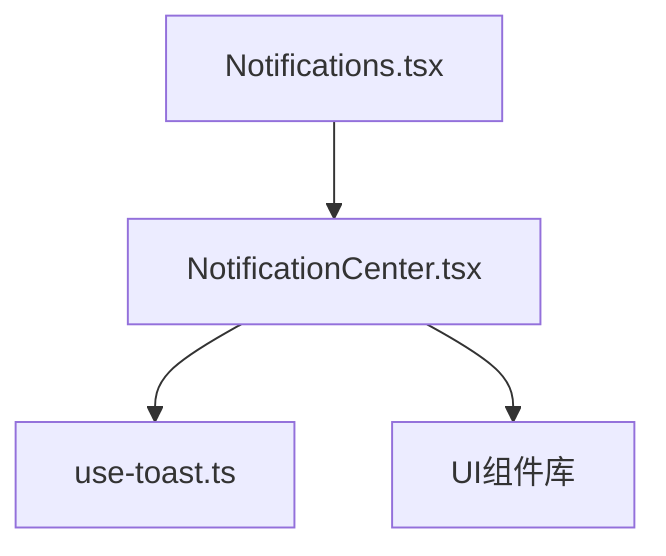
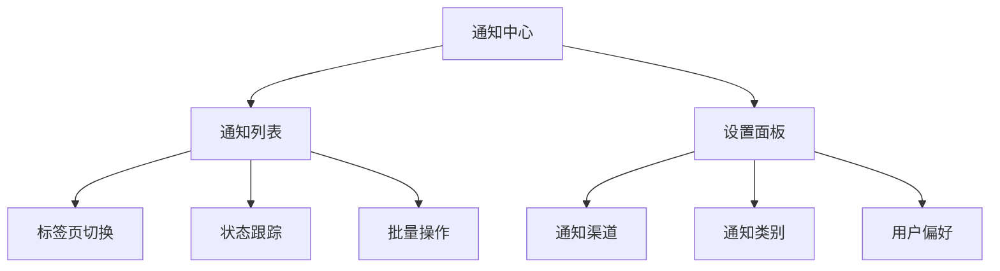
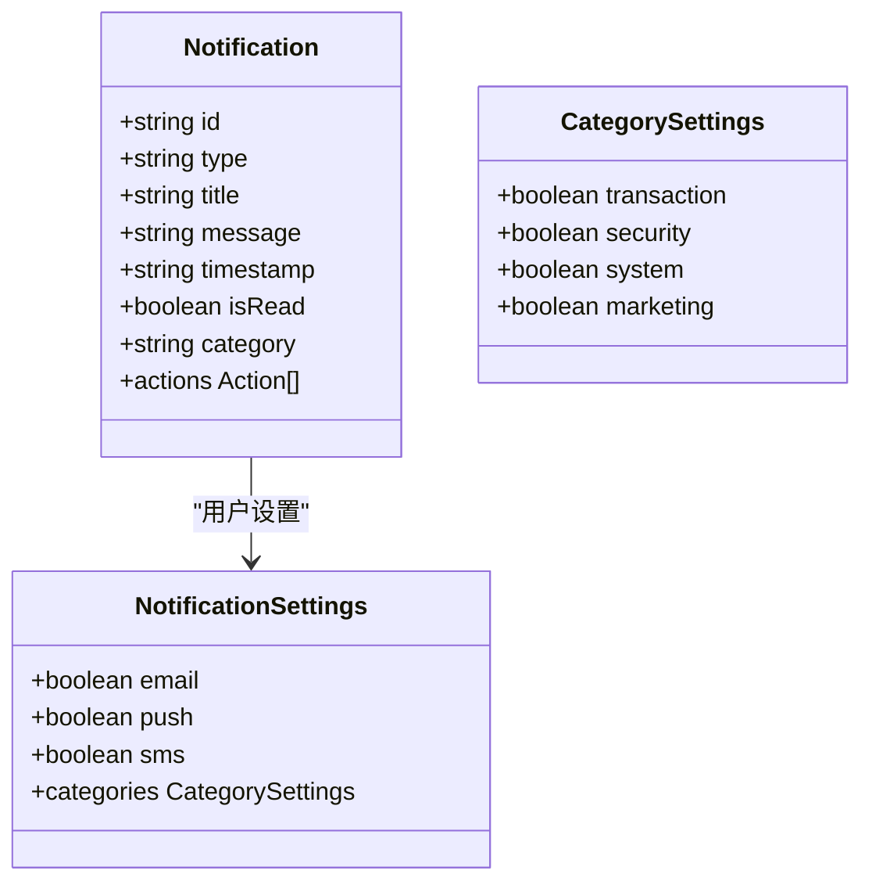
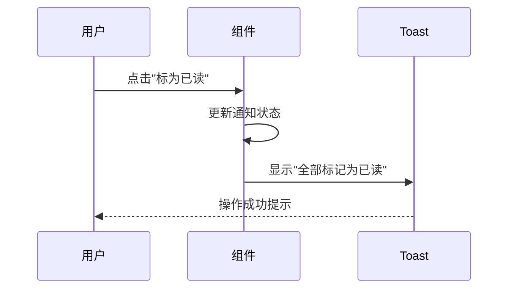
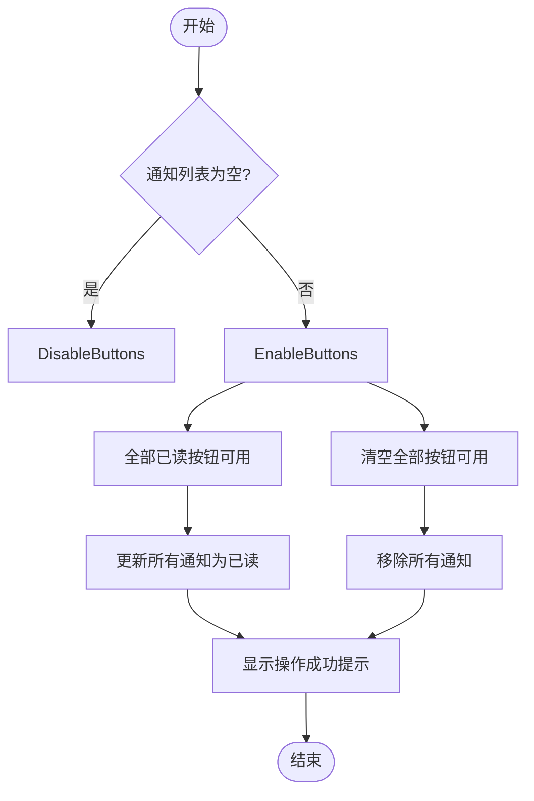
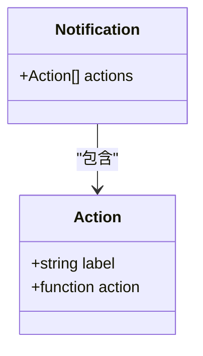
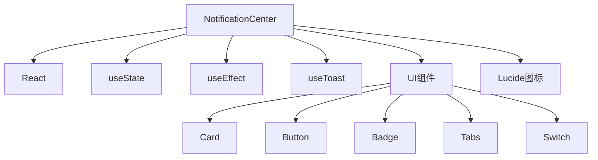

# 通知UI组件

<cite>
**本文档引用的文件**
- [NotificationCenter.tsx](file://src/components/Notifications/NotificationCenter.tsx)
- [use-toast.ts](file://src/hooks/use-toast.ts)
- [Notifications.tsx](file://src/pages/Notifications.tsx)
</cite>

## 目录
1. [简介](#简介)
2. [项目结构](#项目结构)
3. [核心组件](#核心组件)
4. [架构概述](#架构概述)
5. [详细组件分析](#详细组件分析)
6. [依赖分析](#依赖分析)
7. [性能考虑](#性能考虑)
8. [故障排除指南](#故障排除指南)
9. [结论](#结论)
10. [附录](#附录)（如有必要）

## 简介
通知UI组件是用户与系统交互的重要界面，提供交易、安全、系统和营销等多类通知的集中管理。该组件支持读取状态跟踪、批量操作、标签页切换和通知过滤功能，允许用户通过邮件、推送和短信等渠道自定义通知偏好。组件与后端通知服务集成，实现数据的实时更新，并通过用户偏好存储方案提供个性化体验。

## 项目结构
通知UI组件位于`src/components/Notifications/NotificationCenter.tsx`，是独立的React函数组件。该组件通过`src/pages/Notifications.tsx`页面引入并渲染，形成完整的通知中心界面。组件依赖于`src/hooks/use-toast.ts`提供的全局通知系统，实现用户操作的即时反馈。

**Diagram sources**
- [Notifications.tsx](file://src/pages/Notifications.tsx#L0-L15)
- [NotificationCenter.tsx](file://src/components/Notifications/NotificationCenter.tsx#L53-L537)
- [use-toast.ts](file://src/hooks/use-toast.ts#L165-L183)

**Section sources**
- [Notifications.tsx](file://src/pages/Notifications.tsx#L0-L15)
- [NotificationCenter.tsx](file://src/components/Notifications/NotificationCenter.tsx#L53-L537)

## 核心组件
通知中心组件（NotificationCenter）是通知管理的核心，提供通知分类、状态跟踪和批量操作功能。组件使用React Hooks管理状态，包括通知列表、用户设置和当前活动标签页。通过`useToast` Hook，组件与全局通知系统集成，为用户提供操作反馈。

**Section sources**
- [NotificationCenter.tsx](file://src/components/Notifications/NotificationCenter.tsx#L53-L537)

## 架构概述
通知UI组件采用模块化设计，将界面分为通知列表和设置面板两大部分。通知列表支持按全部、未读、交易、安全、系统和营销等标签页进行过滤。设置面板允许用户自定义邮件、推送和短信等通知渠道，以及各类通知的接收偏好。

**Diagram sources**
- [NotificationCenter.tsx](file://src/components/Notifications/NotificationCenter.tsx#L53-L537)

## 详细组件分析
### 通知中心分析
通知中心组件实现了完整的通知管理功能，包括分类管理、状态跟踪和批量操作。

#### 通知分类管理
组件支持交易、安全、系统和营销四类通知的分类管理。每类通知都有对应的图标和颜色标识，便于用户快速识别。

**Diagram sources**
- [NotificationCenter.tsx](file://src/components/Notifications/NotificationCenter.tsx#L53-L537)

#### 读取状态跟踪
组件通过`isRead`属性跟踪每条通知的读取状态，并提供标记为已读/未读的功能。未读通知数量在界面顶部实时显示，帮助用户快速了解未处理的通知。

**Diagram sources**
- [NotificationCenter.tsx](file://src/components/Notifications/NotificationCenter.tsx#L165-L207)
- [use-toast.ts](file://src/hooks/use-toast.ts#L136-L163)

#### 批量操作功能
组件提供"全部已读"和"清空全部"两个批量操作按钮，允许用户一次性处理所有通知。这些操作通过遍历通知列表并更新状态来实现。

**Diagram sources**
- [NotificationCenter.tsx](file://src/components/Notifications/NotificationCenter.tsx#L165-L207)

### 交互式操作按钮
通知列表中的每条通知都包含交互式操作按钮，允许用户直接处理通知。例如，交易完成通知提供"查看详情"按钮，安全提醒提供"确认是我"和"不是我"按钮。

**Diagram sources**
- [NotificationCenter.tsx](file://src/components/Notifications/NotificationCenter.tsx#L69-L133)

## 依赖分析
通知UI组件依赖于多个外部模块和内部组件，形成完整的功能体系。

**Diagram sources**
- [NotificationCenter.tsx](file://src/components/Notifications/NotificationCenter.tsx#L1-L52)
- [use-toast.ts](file://src/hooks/use-toast.ts#L165-L183)

**Section sources**
- [NotificationCenter.tsx](file://src/components/Notifications/NotificationCenter.tsx#L53-L537)
- [use-toast.ts](file://src/hooks/use-toast.ts#L165-L183)

## 性能考虑
通知UI组件在设计时考虑了性能优化，确保在大量通知情况下仍能流畅运行。组件使用React的虚拟DOM和高效的更新机制，避免不必要的重渲染。通知列表的过滤和搜索操作通过JavaScript数组方法实现，具有良好的时间复杂度。

## 故障排除指南
当通知UI组件出现问题时，可参考以下常见问题及解决方案：

**Section sources**
- [NotificationCenter.tsx](file://src/components/Notifications/NotificationCenter.tsx#L53-L537)
- [use-toast.ts](file://src/hooks/use-toast.ts#L127-L132)

## 结论
通知UI组件提供了全面的通知管理功能，通过直观的界面设计和高效的性能表现，为用户提供了优质的使用体验。组件的模块化设计和清晰的依赖关系使其易于维护和扩展，为系统的通知管理功能奠定了坚实基础。

## 附录
### 通知类型说明
| 类型 | 描述 | 图标 |
|------|------|------|
| success | 成功通知 | CheckCircle |
| warning | 警告通知 | AlertTriangle |
| error | 错误通知 | X |
| security | 安全通知 | Shield |
| info | 信息通知 | Info |

### 通知类别说明
| 类别 | 描述 | 图标 |
|------|------|------|
| transaction | 交易通知 | DollarSign |
| security | 安全通知 | Shield |
| system | 系统通知 | Activity |
| marketing | 营销通知 | Mail |