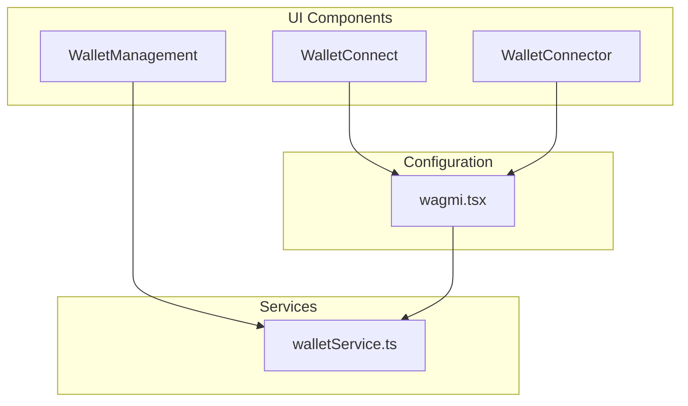
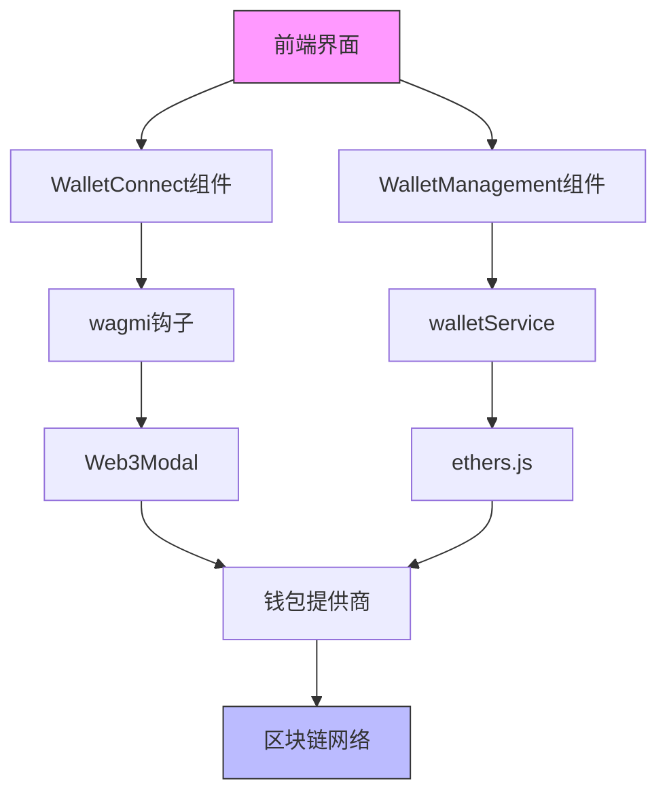
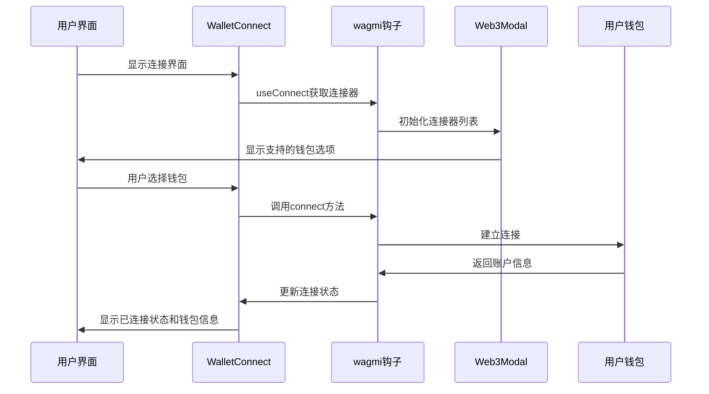
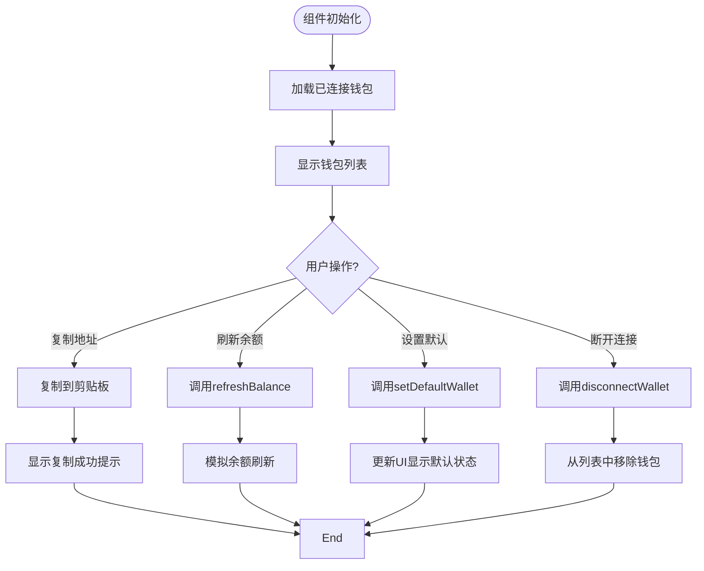
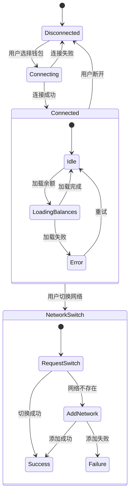
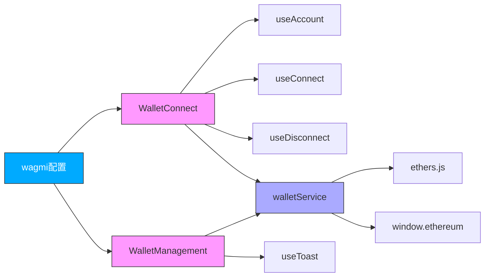

# 钱包UI组件

<cite>
**本文档中引用的文件**  
- [WalletConnect.tsx](file://src/components/Wallet/WalletConnect.tsx)
- [WalletConnector.tsx](file://src/components/Wallet/WalletConnector.tsx)
- [WalletManagement.tsx](file://src/components/Wallet/WalletManagement.tsx)
- [wagmi.tsx](file://src/config/wagmi.tsx)
- [walletService.ts](file://src/services/walletService.ts)
</cite>

## 目录
1. [简介](#简介)
2. [项目结构](#项目结构)
3. [核心组件](#核心组件)
4. [架构概述](#架构概述)
5. [详细组件分析](#详细组件分析)
6. [依赖分析](#依赖分析)
7. [性能考虑](#性能考虑)
8. [故障排除指南](#故障排除指南)
9. [结论](#结论)

## 简介
本项目实现了一个完整的钱包管理界面，支持多钱包连接、资产查看和操作功能。系统基于wagmi库和Web3Modal构建，提供现代化的Web3用户体验。

## 项目结构

**图示来源**  
- [WalletConnect.tsx](file://src/components/Wallet/WalletConnect.tsx)
- [WalletConnector.tsx](file://src/components/Wallet/WalletConnector.tsx)
- [WalletManagement.tsx](file://src/components/Wallet/WalletManagement.tsx)
- [wagmi.tsx](file://src/config/wagmi.tsx)
- [walletService.ts](file://src/services/walletService.ts)

**本节来源**  
- [src/components/Wallet](file://src/components/Wallet)
- [src/config](file://src/config)
- [src/services](file://src/services)

## 核心组件

钱包UI组件包含三个主要部分：WalletConnect、WalletConnector和WalletManagement，分别处理钱包连接、状态管理和资产操作功能。

**本节来源**  
- [WalletConnect.tsx](file://src/components/Wallet/WalletConnect.tsx#L16-L241)
- [WalletConnector.tsx](file://src/components/Wallet/WalletConnector.tsx#L16-L241)
- [WalletManagement.tsx](file://src/components/Wallet/WalletManagement.tsx#L36-L351)

## 架构概述

**图示来源**  
- [WalletConnect.tsx](file://src/components/Wallet/WalletConnect.tsx)
- [WalletManagement.tsx](file://src/components/Wallet/WalletManagement.tsx)
- [wagmi.tsx](file://src/config/wagmi.tsx)
- [walletService.ts](file://src/services/walletService.ts)

## 详细组件分析

### WalletConnect组件分析

WalletConnect组件通过wagmi库集成Web3Provider，实现多钱包连接功能。

**图示来源**  
- [WalletConnect.tsx](file://src/components/Wallet/WalletConnect.tsx#L16-L241)
- [wagmi.tsx](file://src/config/wagmi.tsx#L67-L79)

**本节来源**  
- [WalletConnect.tsx](file://src/components/Wallet/WalletConnect.tsx#L16-L241)

### WalletManagement组件分析

WalletManagement组件提供钱包资产管理功能，包括余额查看、地址复制和网络切换等操作。

**图示来源**  
- [WalletManagement.tsx](file://src/components/Wallet/WalletManagement.tsx#L36-L351)

**本节来源**  
- [WalletManagement.tsx](file://src/components/Wallet/WalletManagement.tsx#L36-L351)

### 连接状态管理分析

WalletConnector组件实现了完整的连接状态管理和用户界面同步。

**图示来源**  
- [WalletConnector.tsx](file://src/components/Wallet/WalletConnector.tsx#L16-L241)
- [walletService.ts](file://src/services/walletService.ts)

**本节来源**  
- [WalletConnector.tsx](file://src/components/Wallet/WalletConnector.tsx#L16-L241)

## 依赖分析

**图示来源**  
- [WalletConnect.tsx](file://src/components/Wallet/WalletConnect.tsx)
- [WalletManagement.tsx](file://src/components/Wallet/WalletManagement.tsx)
- [wagmi.tsx](file://src/config/wagmi.tsx)
- [walletService.ts](file://src/services/walletService.ts)

**本节来源**  
- [WalletConnect.tsx](file://src/components/Wallet/WalletConnect.tsx)
- [WalletManagement.tsx](file://src/components/Wallet/WalletManagement.tsx)
- [wagmi.tsx](file://src/config/wagmi.tsx)
- [walletService.ts](file://src/services/walletService.ts)

## 性能考虑

钱包组件在设计时考虑了多项性能优化措施，包括状态管理、异步操作处理和用户界面响应性。

- 使用React的useState和useEffect进行高效的状态管理
- 通过wagmi的内置缓存机制减少重复的区块链查询
- 实现加载状态和骨架屏以提升用户体验
- 采用防抖和节流技术处理频繁的操作请求

## 故障排除指南

当遇到钱包连接或功能异常时，可参考以下常见问题的解决方案：

**本节来源**  
- [WalletConnect.tsx](file://src/components/Wallet/WalletConnect.tsx#L16-L241)
- [walletService.ts](file://src/services/walletService.ts)

## 结论

钱包UI组件成功实现了现代化的Web3用户体验，通过wagmi库和Web3Modal的集成，提供了稳定的钱包连接功能。组件设计考虑了可扩展性、安全性和用户体验，为去中心化应用提供了可靠的钱包管理解决方案。