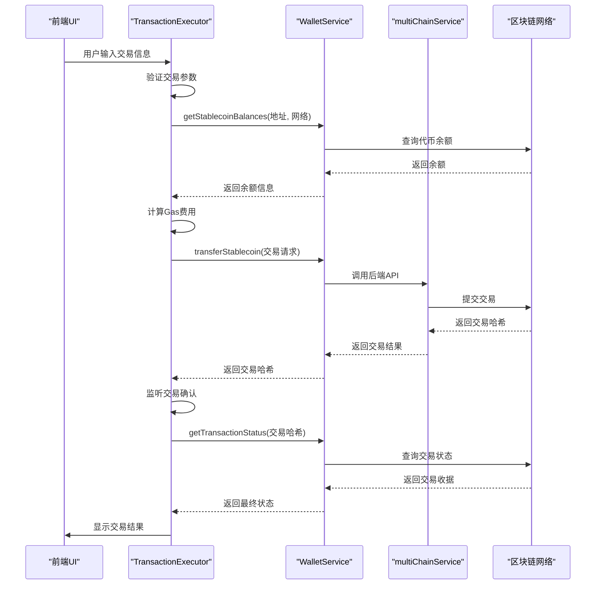
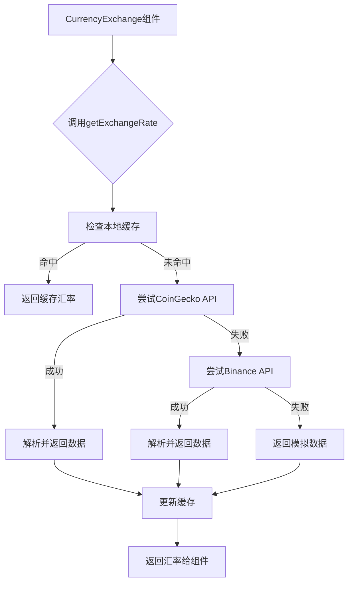
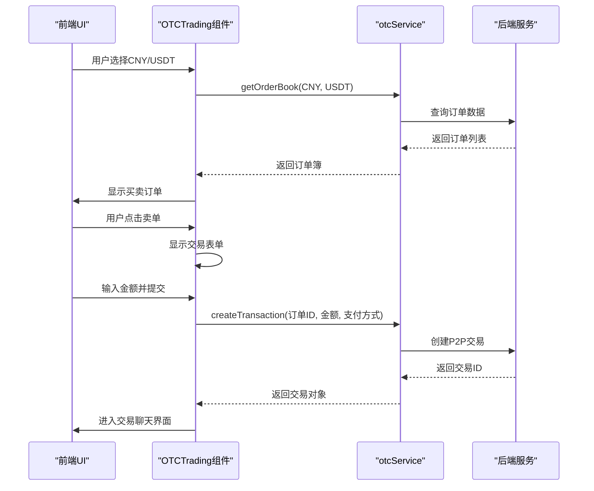
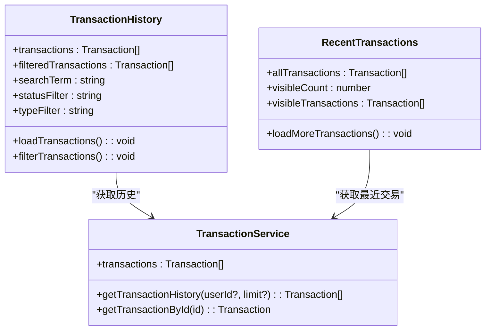
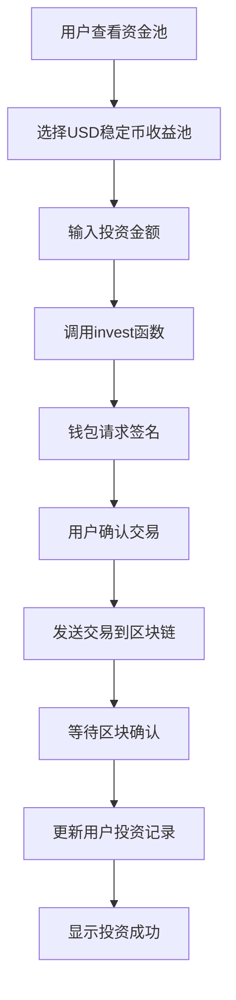
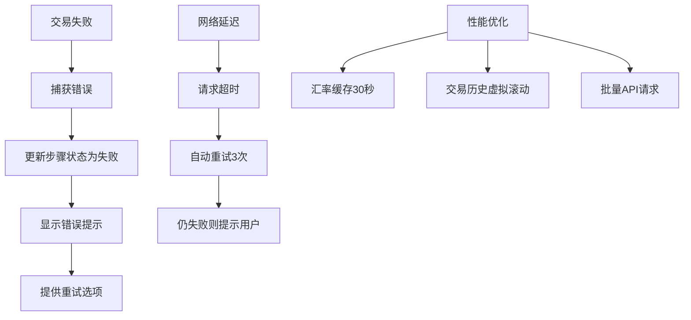

# 交易与区块链组件

<cite>
**本文档引用的文件**  
- [TransactionExecutor.tsx](file://src/components/Blockchain/TransactionExecutor.tsx)
- [multiChainService.ts](file://backend/src/services/multiChainService.ts)
- [CurrencyExchange.tsx](file://src/components/Exchange/CurrencyExchange.tsx)
- [exchangeRateService.ts](file://src/services/exchangeRateService.ts)
- [OTCTrading.tsx](file://src/components/OTC/OTCTrading.tsx)
- [otcService.ts](file://backend/src/services/otcService.ts)
- [TransactionHistory.tsx](file://src/components/Transactions/TransactionHistory.tsx)
- [RecentTransactions.tsx](file://src/components/Dashboard/RecentTransactions.tsx)
- [LiquidityPoolManagement.tsx](file://src/components/LiquidityPool/LiquidityPoolManagement.tsx)
- [walletService.ts](file://src/services/walletService.ts)
- [transactionService.ts](file://src/services/transactionService.ts)
</cite>

## 目录
1. [交易执行器与多链服务集成](#交易执行器与多链服务集成)
2. [汇率服务与实时汇率获取](#汇率服务与实时汇率获取)
3. [场外交易组件与后端服务交互](#场外交易组件与后端服务交互)
4. [交易历史与最近交易数据管理](#交易历史与最近交易数据管理)
5. [流动性池管理与智能合约交互](#流动性池管理与智能合约交互)
6. [错误处理与性能优化](#错误处理与性能优化)

## 交易执行器与多链服务集成

`TransactionExecutor` 组件负责处理用户发起的链上交易，通过 `WalletService` 与用户钱包交互，并与后端 `multiChainService` 集成实现跨链交易。组件首先验证交易参数，检查用户余额，计算Gas费用，然后调用 `walletService.transferStablecoin` 发起交易。交易执行后，通过 `walletService.getTransactionStatus` 监听交易状态，确保交易成功确认。

**图表来源**  
- [TransactionExecutor.tsx](file://src/components/Blockchain/TransactionExecutor.tsx#L22-L388)
- [walletService.ts](file://src/services/walletService.ts#L63-L265)
- [multiChainService.ts](file://backend/src/services/multiChainService.ts#L48-L505)

**本节来源**  
- [TransactionExecutor.tsx](file://src/components/Blockchain/TransactionExecutor.tsx#L22-L388)

## 汇率服务与实时汇率获取

`CurrencyExchange` 组件通过 `exchangeRateService` 获取实时汇率，支持从多个数据源获取价格。服务首先尝试从 CoinGecko API 获取数据，如果失败则尝试 Binance API，最后使用模拟数据作为后备。汇率数据会缓存30秒，避免频繁请求。组件还实现了自动刷新机制，每30秒更新一次汇率。

**图表来源**  
- [CurrencyExchange.tsx](file://src/components/Exchange/CurrencyExchange.tsx#L15-L621)
- [exchangeRateService.ts](file://src/services/exchangeRateService.ts#L17-L281)

**本节来源**  
- [exchangeRateService.ts](file://src/services/exchangeRateService.ts#L17-L281)

## 场外交易组件与后端服务交互

`OTCTrading` 组件通过 `otcService` 与后端交互，实现场外交易订单的匹配和管理。用户选择货币对后，组件调用 `otcService.getOrderBook` 获取订单簿，显示买卖订单。当用户点击订单时，创建P2P交易，通过 `otcService.createTransaction` 在后端创建交易记录，并进入聊天流程。

**图表来源**  
- [OTCTrading.tsx](file://src/components/OTC/OTCTrading.tsx#L57-L434)
- [otcService.ts](file://backend/src/services/otcService.ts#L84-L450)

**本节来源**  
- [otcService.ts](file://backend/src/services/otcService.ts#L84-L450)

## 交易历史与最近交易数据管理

`TransactionHistory` 和 `RecentTransactions` 组件通过 `transactionService` 管理交易数据。`TransactionHistory` 提供完整的交易列表，支持搜索、过滤和分页。`RecentTransactions` 显示最近的交易，支持加载更多。两个组件都从 `transactionService.getTransactionHistory` 获取数据，并实时更新。

**图表来源**  
- [TransactionHistory.tsx](file://src/components/Transactions/TransactionHistory.tsx#L39-L495)
- [RecentTransactions.tsx](file://src/components/Dashboard/RecentTransactions.tsx#L7-L201)
- [transactionService.ts](file://src/services/transactionService.ts#L52-L388)

**本节来源**  
- [TransactionHistory.tsx](file://src/components/Transactions/TransactionHistory.tsx#L39-L495)

## 流动性池管理与智能合约交互

`LiquidityPoolManagement` 组件允许用户投资和管理流动性池。用户可以查看不同风险等级的池子，投资后查看投资组合。组件通过 `walletService` 与智能合约交互，执行添加和移除流动性的操作。投资时需要用户钱包签名，确保资金安全。

**图表来源**  
- [LiquidityPoolManagement.tsx](file://src/components/LiquidityPool/LiquidityPoolManagement.tsx#L52-L426)

**本节来源**  
- [LiquidityPoolManagement.tsx](file://src/components/LiquidityPool/LiquidityPoolManagement.tsx#L52-L426)

## 错误处理与性能优化

系统实现了全面的错误处理机制。交易失败时，`TransactionExecutor` 会回滚到失败步骤并显示错误信息。网络延迟时，`transactionService` 会重试请求。Gas费用通过 `multiChainService.getGasPrices` 动态估算。高频交易场景下，通过缓存、批量请求和虚拟滚动优化性能。

**本节来源**  
- [TransactionExecutor.tsx](file://src/components/Blockchain/TransactionExecutor.tsx#L22-L388)
- [transactionService.ts](file://src/services/transactionService.ts#L52-L388)
- [exchangeRateService.ts](file://src/services/exchangeRateService.ts#L17-L281)