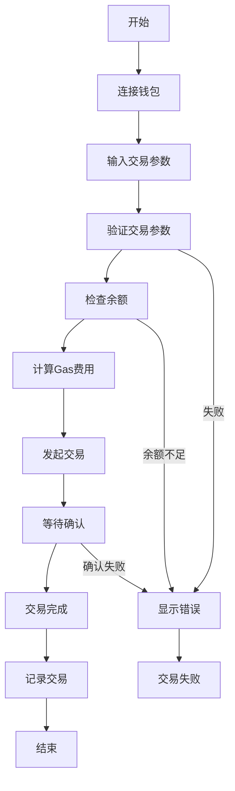
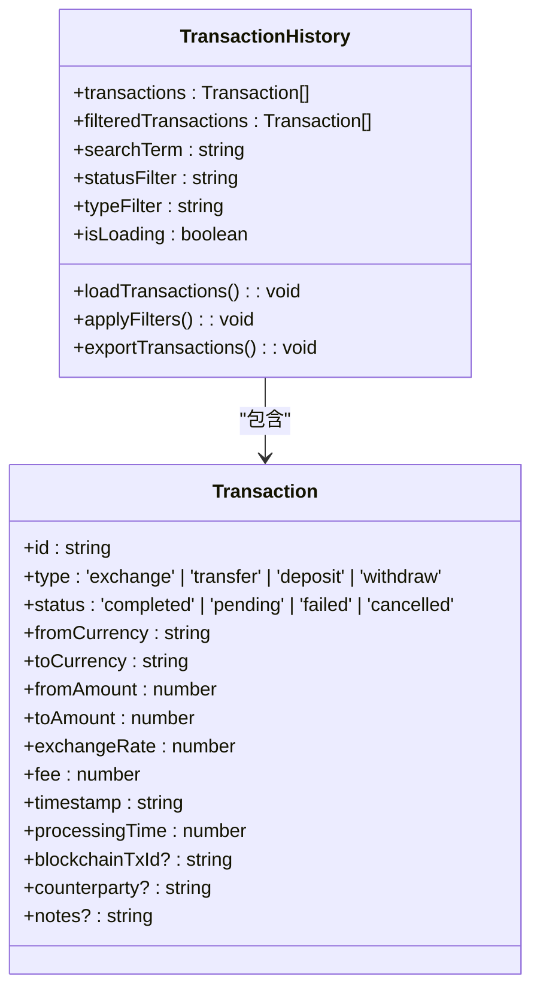
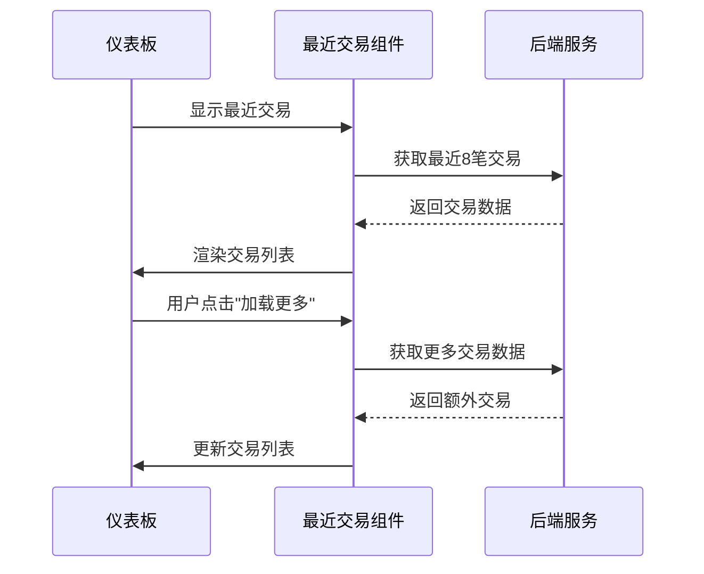
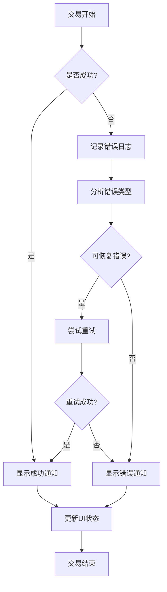

# 交易执行与监控

<cite>
**本文档引用的文件**  
- [TransactionExecutor.tsx](file://src/components/Blockchain/TransactionExecutor.tsx)
- [walletService.ts](file://src/services/walletService.ts)
- [transaction.ts](file://backend/src/routes/transaction.ts)
- [route.ts](file://src/app/api/wallet/transaction/route.ts)
- [TransactionHistory.tsx](file://src/components/Transactions/TransactionHistory.tsx)
- [RecentTransactions.tsx](file://src/components/Dashboard/RecentTransactions.tsx)
- [multiChainService.ts](file://backend/src/services/multiChainService.ts)
</cite>

## 目录
1. [交易执行流程](#交易执行流程)
2. [交易监控与历史记录](#交易监控与历史记录)
3. [实时交易展示](#实时交易展示)
4. [异常处理与用户体验](#异常处理与用户体验)

## 交易执行流程

`TransactionExecutor` 组件实现了完整的多步骤交易生命周期管理，涵盖从参数验证到交易广播的全过程。该组件通过与 `walletService` 的深度集成，确保交易的安全性和可靠性。

组件采用分步式设计，将交易流程划分为六个关键阶段：交易参数验证、余额检查、Gas费用估算、交易发起、等待确认和交易完成。每个阶段都有明确的状态指示和进度反馈，为用户提供清晰的执行可视化。

在交易执行过程中，`TransactionExecutor` 通过 `walletService` 实现与区块链的交互。当用户提交交易请求时，组件首先验证接收地址和转账金额的有效性，然后调用 `walletService.getStablecoinBalances()` 方法检查钱包余额，确保有足够的代币完成交易。

Gas费用估算阶段为用户提供交易成本的预估，帮助用户做出明智的决策。交易发起阶段通过 `walletService.transferStablecoin()` 方法创建并签名交易，然后将其广播到区块链网络。最后，组件通过 `walletService.getTransactionStatus()` 方法持续监控交易状态，直到获得最终确认。

**图表来源**  
- [TransactionExecutor.tsx](file://src/components/Blockchain/TransactionExecutor.tsx#L22-L388)
- [walletService.ts](file://src/services/walletService.ts#L1-L270)

**本节来源**  
- [TransactionExecutor.tsx](file://src/components/Blockchain/TransactionExecutor.tsx#L22-L388)
- [walletService.ts](file://src/services/walletService.ts#L1-L270)

## 交易监控与历史记录

`TransactionHistory` 组件提供了强大的交易数据管理和展示功能，支持分页加载和多维度过滤。该组件允许用户根据交易状态、类型和搜索关键词对交易记录进行筛选，提高了大规模交易数据的可管理性。

组件实现了高效的过滤算法，能够快速处理大量交易数据。当用户输入搜索关键词时，系统会同时在交易ID、货币类型和交易对手等字段中进行匹配。状态过滤和类型过滤功能使用户能够专注于特定类别的交易，如仅查看已完成的兑换交易或处理中的转账。

在性能优化方面，`TransactionHistory` 采用了虚拟滚动和懒加载技术，确保即使在处理数千条交易记录时也能保持流畅的用户体验。组件还提供了交易统计功能，实时显示总交易数、成功交易数和总交易量等关键指标。

**图表来源**  
- [TransactionHistory.tsx](file://src/components/Transactions/TransactionHistory.tsx#L39-L495)

**本节来源**  
- [TransactionHistory.tsx](file://src/components/Transactions/TransactionHistory.tsx#L39-L495)

## 实时交易展示

`RecentTransactions` 组件在仪表板中提供了实时的交易更新功能，通过智能数据同步策略确保用户能够及时了解最新的交易动态。该组件采用增量加载机制，初始显示最近的四笔交易，用户可以通过"加载更多"按钮获取更早的交易记录。

组件实现了高效的更新机制，定期从后端获取最新的交易数据并进行合并。当有新交易产生时，系统会自动将其插入到交易列表的顶部，确保用户第一时间看到最新动态。这种设计既保证了数据的实时性，又避免了频繁的全量刷新对性能的影响。

在用户体验方面，`RecentTransactions` 提供了简洁明了的交易概览，包括交易类型、金额、状态和手续费等关键信息。通过使用国旗emoji直观展示货币对，增强了交易的可读性和国际化支持。

**图表来源**  
- [RecentTransactions.tsx](file://src/components/Dashboard/RecentTransactions.tsx#L7-L201)

**本节来源**  
- [RecentTransactions.tsx](file://src/components/Dashboard/RecentTransactions.tsx#L7-L201)

## 异常处理与用户体验

系统实现了全面的异常处理机制，能够有效应对交易失败、网络延迟和交易回滚等复杂场景。当交易执行过程中出现错误时，系统会立即停止后续步骤，回滚已执行的操作，并向用户显示详细的错误信息。

在用户体验优化方面，系统提供了交易进度可视化功能，通过进度条和步骤指示器直观展示交易的执行状态。每个步骤都有明确的图标和描述，帮助用户理解当前所处的交易阶段。对于长时间运行的交易，系统会显示预估的等待时间，降低用户的焦虑感。

用户通知集成是系统的重要特性之一，通过 `useToast` 钩子实现即时反馈。无论是交易成功、失败还是其他重要事件，系统都会通过非侵入式的通知提醒用户，确保关键信息不会被忽略。通知系统支持自定义持续时间、样式和操作按钮，提供了灵活的通知管理能力。

**图表来源**  
- [TransactionExecutor.tsx](file://src/components/Blockchain/TransactionExecutor.tsx#L22-L388)
- [use-toast.ts](file://src/hooks/use-toast.ts#L1-L186)

**本节来源**  
- [TransactionExecutor.tsx](file://src/components/Blockchain/TransactionExecutor.tsx#L22-L388)
- [use-toast.ts](file://src/hooks/use-toast.ts#L1-L186)