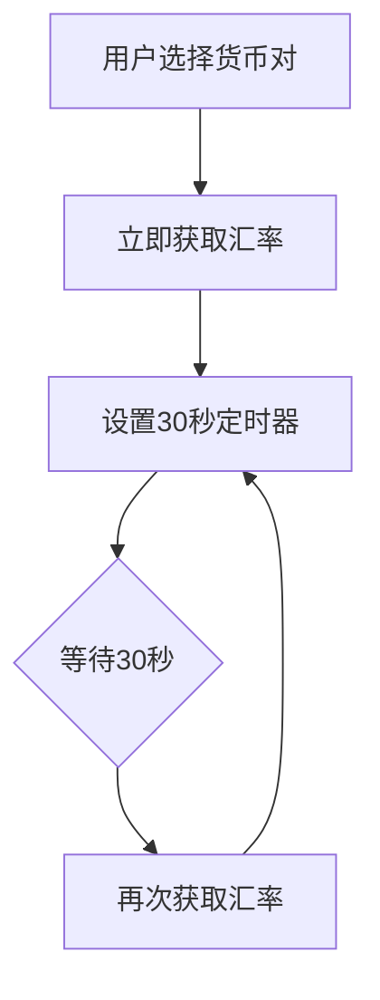
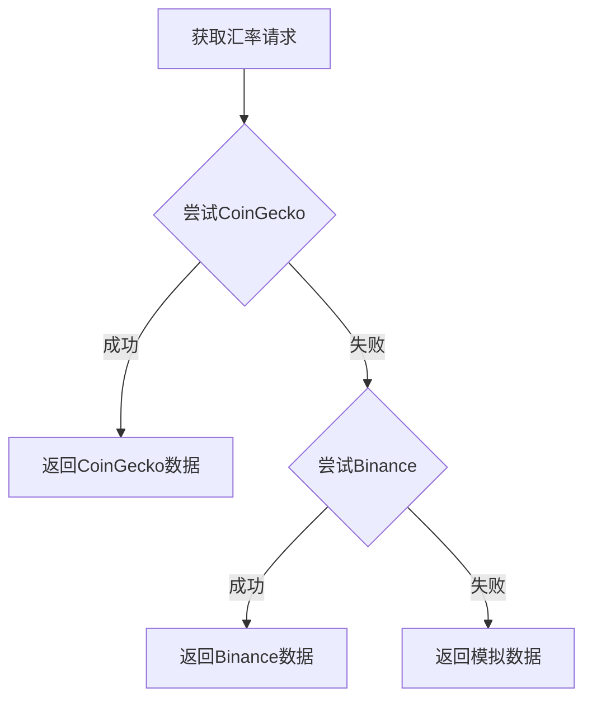
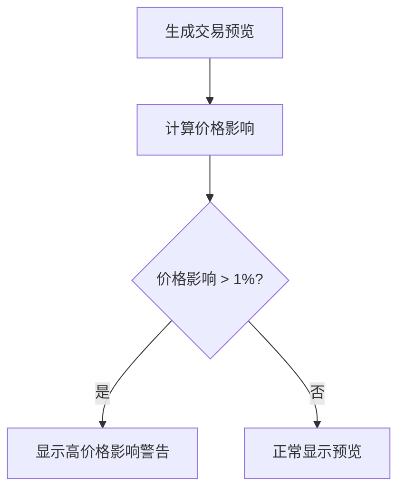
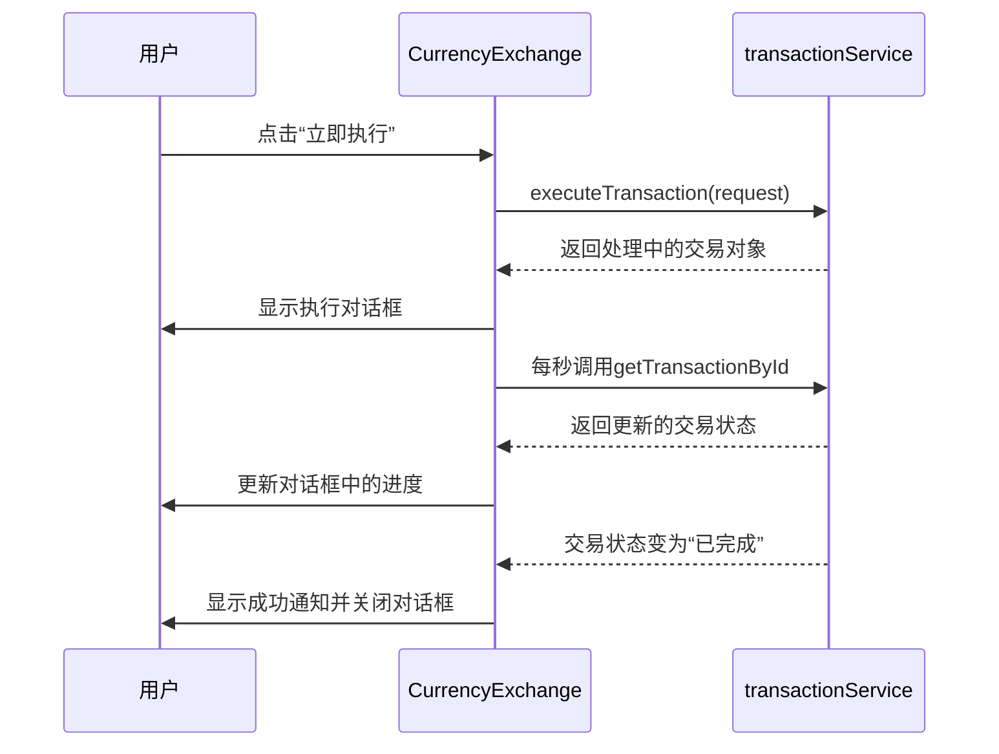

# 汇率与兑换服务

<cite>
**Referenced Files in This Document**  
- [CurrencyExchange.tsx](file://src/components/Exchange/CurrencyExchange.tsx)
- [exchangeRateService.ts](file://src/services/exchangeRateService.ts)
- [transactionService.ts](file://src/services/transactionService.ts)
</cite>

## 目录
1. [简介](#简介)
2. [核心组件](#核心组件)
3. [实时汇率获取机制](#实时汇率获取机制)
4. [汇率预览功能实现](#汇率预览功能实现)
5. [API交互模式](#api交互模式)
6. [交易执行流程](#交易执行流程)
7. [性能优化与最佳实践](#性能优化与最佳实践)

## 简介
本文档详细阐述了汇率与兑换服务的核心功能与技术实现。系统以`CurrencyExchange`组件为核心，提供用户友好的货币兑换界面，支持多种法定货币与加密货币之间的实时兑换。服务集成了自动刷新、多数据源支持、性能监控等关键特性，确保用户能够获得准确、及时的汇率信息和流畅的交易体验。通过与`exchangeRateService`和`transactionService`的深度集成，系统实现了从汇率获取、交易预览到最终执行的完整闭环。

## 核心组件

`CurrencyExchange`组件是整个兑换服务的用户交互中心，负责管理汇率显示、交易预览和执行流程。该组件通过状态管理维护用户输入的交易金额、选择的货币对以及实时的汇率和预览信息。组件集成了性能监控功能，能够测量汇率更新、预览生成和交易处理的耗时，并向用户展示这些性能指标。

**Section sources**
- [CurrencyExchange.tsx](file://src/components/Exchange/CurrencyExchange.tsx#L15-L621)

## 实时汇率获取机制

### 自动刷新策略
系统采用30秒轮询的自动刷新策略来确保汇率的实时性。当用户选择或更改货币对时，系统会立即触发一次汇率获取。随后，通过`setInterval`设置一个30秒（30000毫秒）的定时器，周期性地调用`loadExchangeRate`方法，从后端服务获取最新的汇率数据。这种策略在保证数据新鲜度的同时，也避免了过于频繁的API调用，平衡了用户体验和系统资源消耗。

**Diagram sources**
- [CurrencyExchange.tsx](file://src/components/Exchange/CurrencyExchange.tsx#L15-L621)

### 多数据源支持
`exchangeRateService`服务实现了多数据源支持，以提高系统的可靠性和数据的准确性。服务优先从CoinGecko API获取实时加密货币汇率，当CoinGecko API请求失败时，会自动降级到Binance API作为备用。如果所有外部API都不可用，服务会返回经过轻微随机波动处理的模拟数据，确保前端功能不受影响。

**Diagram sources**
- [exchangeRateService.ts](file://src/services/exchangeRateService.ts#L17-L281)

### 汇率缓存策略
为了优化性能并减少对外部API的依赖，`exchangeRateService`实现了30秒的内存缓存策略。服务使用一个`Map`来存储最近获取的汇率结果，键为`from-to`的货币对组合。每次获取汇率时，服务会首先检查缓存中是否存在未过期的有效数据，如果存在则直接返回缓存结果，避免了不必要的网络请求。

**Section sources**
- [exchangeRateService.ts](file://src/services/exchangeRateService.ts#L17-L281)

## 汇率预览功能实现

### 价格滑点计算
系统通过`calculatePriceImpact`方法模拟大额交易的价格滑点。该方法基于交易金额和预设的基础流动性来计算价格影响百分比。交易金额越大，对市场的影响也越大，因此价格滑点也随之增加。计算结果会直接影响最终的兑换金额，确保预览结果的准确性。

### 手续费估算
交易预览功能会根据预设的费率（0.2%）自动计算手续费。系统设置了最低（1单位）和最高（100单位）手续费限制，确保在各种交易规模下都能收取合理的费用。手续费的计算是预览功能的核心部分，直接影响用户最终收到的金额。

### 风险提示
当系统检测到交易存在较高的价格影响（超过1%）时，会通过一个醒目的警告提示框向用户发出风险提示。该提示明确告知用户“此大额交易可能产生X%的价格影响”，帮助用户做出更明智的决策。

**Diagram sources**
- [transactionService.ts](file://src/services/transactionService.ts#L52-L388)

**Section sources**
- [transactionService.ts](file://src/services/transactionService.ts#L52-L388)

## API交互模式

### 请求/响应格式
`exchangeRateService`和`transactionService`通过明确定义的接口与`CurrencyExchange`组件进行交互。`getExchangeRate`方法接收`from`和`to`两个字符串参数，返回一个包含汇率、时间戳和数据源的`ExchangeRate`对象。`getTransactionPreview`方法接收一个包含交易详情的`TransactionRequest`对象，返回一个包含预计金额、手续费、处理时间和价格影响的`TransactionPreview`对象。

### 错误处理
系统实现了全面的错误处理机制。所有API调用都包裹在`try-catch`块中，捕获到的错误会被转换为用户友好的消息，并通过`toast`通知组件展示给用户。例如，当汇率加载失败时，用户会收到“无法获取最新汇率，请稍后重试”的提示。这种设计确保了即使在后端服务出现问题时，前端界面依然保持可用和友好。

**Section sources**
- [CurrencyExchange.tsx](file://src/components/Exchange/CurrencyExchange.tsx#L15-L621)
- [exchangeRateService.ts](file://src/services/exchangeRateService.ts#L17-L281)
- [transactionService.ts](file://src/services/transactionService.ts#L52-L388)

## 交易执行流程

### 状态机管理
交易执行流程由一个复杂的状态机管理。交易状态包括`processing`（处理中）、`completed`（已完成）和`failed`（失败）。`processTransactionAsync`方法通过一个步骤列表（如“验证交易参数”、“检查余额”、“执行兑换”等）来模拟交易的异步处理过程。每个步骤都有自己的开始和结束时间，系统会实时更新交易状态和性能指标。

### 进度监控
`monitorTransactionProgress`函数通过`setInterval`每秒检查一次交易状态。当交易状态变为`completed`或`failed`时，定时器会被清除，并向用户展示最终结果。在处理过程中，用户界面会显示一个包含各个处理步骤的进度条，让用户清晰地了解交易的当前进展。

### 用户通知机制
系统通过`toast`通知和对话框两种方式与用户进行交互。在交易提交、完成或失败时，会弹出相应的通知。交易执行过程在一个模态对话框中展示，包含详细的处理步骤和耗时。用户还可以复制交易ID，方便后续查询。

**Diagram sources**
- [CurrencyExchange.tsx](file://src/components/Exchange/CurrencyExchange.tsx#L15-L621)
- [transactionService.ts](file://src/services/transactionService.ts#L52-L388)

## 性能优化与最佳实践

### 汇率缓存策略
如前所述，30秒的内存缓存策略是性能优化的关键。它显著减少了对外部API的调用次数，降低了网络延迟和服务器负载。

### 网络优化
系统通过多数据源支持和优雅降级机制实现了网络优化。当主数据源不可用时，系统能无缝切换到备用源或模拟数据，保证了服务的高可用性。

### 安全合规集成
组件在UI层面集成了安全合规提示，明确告知用户该服务符合KYC/AML规定，并使用多重签名钱包和受监管的桥梁。这增强了用户对平台的信任。

### 高并发场景下的性能调优
虽然当前实现为单例模式，但在高并发场景下，可以考虑将`exchangeRateService`的缓存机制升级为Redis等分布式缓存，以支持多实例部署。同时，`transactionService`的交易列表也应迁移到数据库中，以保证数据的持久性和一致性。