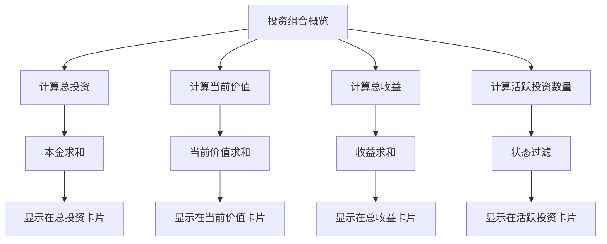
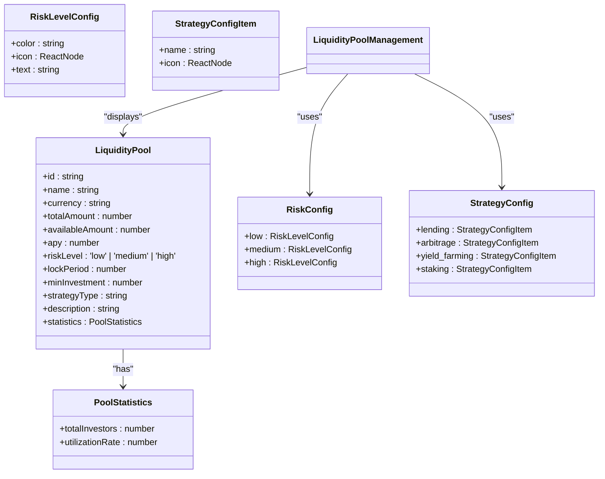
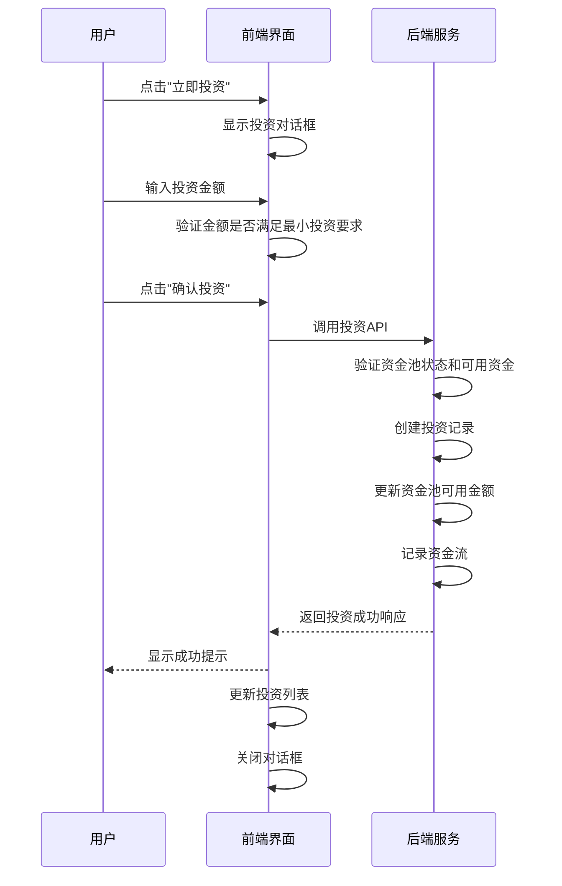
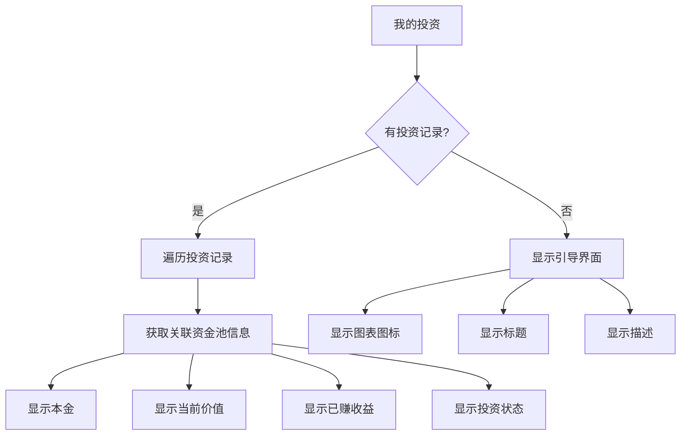
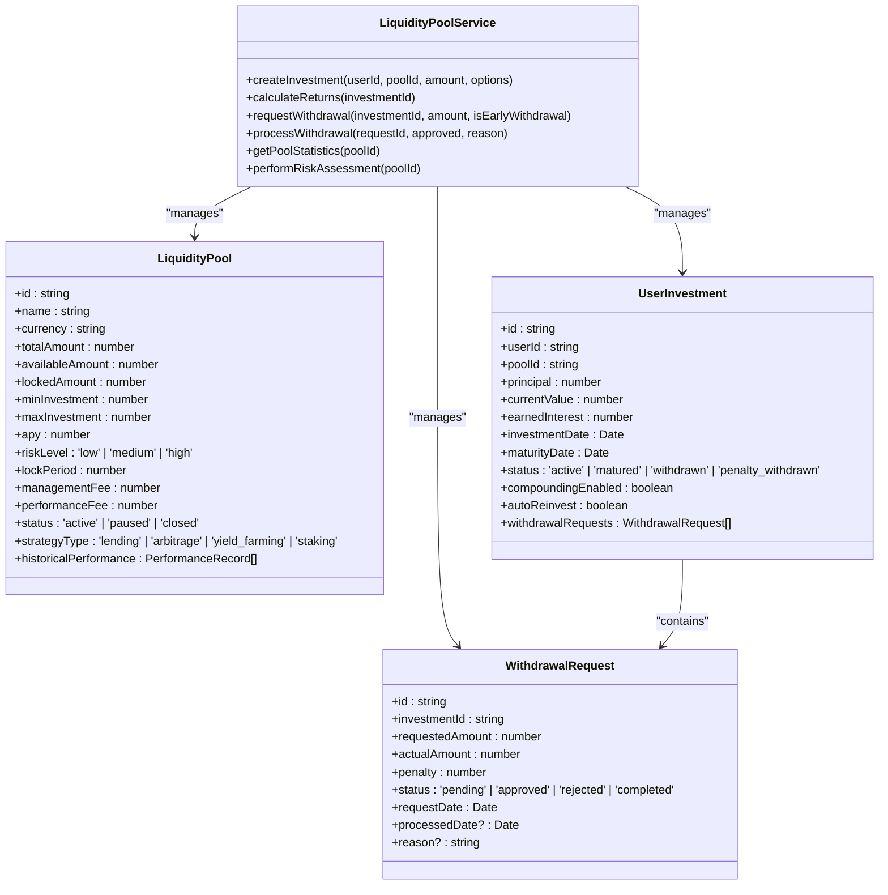
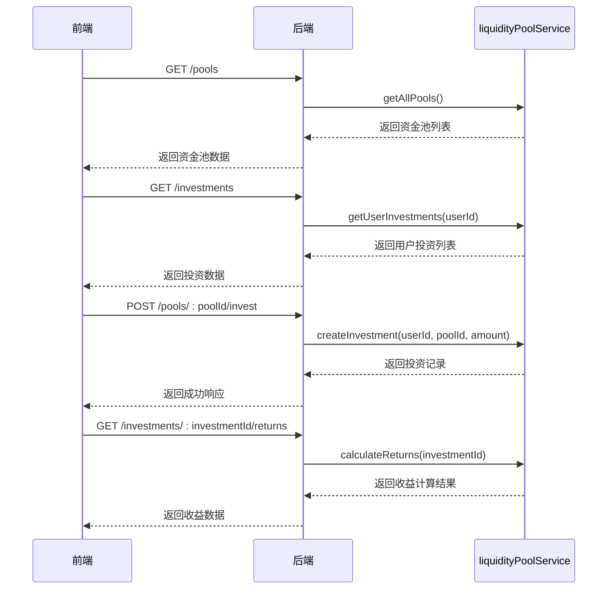

# 流动性池管理

<cite>
**Referenced Files in This Document**   
- [LiquidityPoolManagement.tsx](file://src/components/LiquidityPool/LiquidityPoolManagement.tsx)
- [liquidityPoolService.ts](file://backend/src/services/liquidityPoolService.ts)
- [liquidityPool.ts](file://backend/src/routes/liquidityPool.ts)
- [LiquidityPool.tsx](file://src/pages/LiquidityPool.tsx)
</cite>

## 目录
1. [投资组合概览](#投资组合概览)
2. [资金池列表展示](#资金池列表展示)
3. [用户投资流程](#用户投资流程)
4. [我的投资记录](#我的投资记录)
5. [业务规则与风险提示](#业务规则与风险提示)
6. [API集成与数据同步](#api集成与数据同步)

## 投资组合概览

`LiquidityPoolManagement`组件实现了投资组合概览功能，通过聚合指标展示用户的整体投资状况。该功能在前端组件中通过计算用户所有投资记录的汇总数据来实现。

投资组合概览包含四个核心指标：
- **总投资**：用户所有投资的本金总和
- **当前价值**：用户所有投资的当前总价值
- **总收益**：用户已赚取的总收益金额
- **活跃投资**：用户当前处于活跃状态的投资数量

这些指标通过`portfolioOverview`对象进行计算，利用`reduce`方法对`userInvestments`数组进行聚合运算。前端通过网格布局将这些指标以卡片形式展示，每个卡片包含相应的图标和格式化后的数值。

**Diagram sources**
- [LiquidityPoolManagement.tsx](file://src/components/LiquidityPool/LiquidityPoolManagement.tsx#L230-L270)

**Section sources**
- [LiquidityPoolManagement.tsx](file://src/components/LiquidityPool/LiquidityPoolManagement.tsx#L200-L270)

## 资金池列表展示

资金池列表展示了所有可用的资金池信息，包括风险等级标识、策略类型、年化收益率和资金利用率等关键指标。每个资金池卡片都包含了丰富的可视化信息。

风险等级通过不同颜色和图标的徽章进行标识：
- **低风险**：绿色背景，使用盾牌图标
- **中风险**：黄色背景，使用警告三角图标
- **高风险**：红色背景，使用上升趋势图标

策略类型同样通过徽章展示，支持四种主要策略：
- **借贷收益**：美元符号图标
- **套利交易**：柱状图图标
- **流动性挖矿**：奖杯图标
- **质押收益**：目标图标

资金利用率通过进度条可视化展示，直观反映资金池的使用情况。年化收益率以绿色加粗字体显示，突出其重要性。此外，卡片还显示了最小投资金额、投资者数量和锁定期等关键信息。

**Diagram sources**
- [LiquidityPoolManagement.tsx](file://src/components/LiquidityPool/LiquidityPoolManagement.tsx#L100-L150)

**Section sources**
- [LiquidityPoolManagement.tsx](file://src/components/LiquidityPool/LiquidityPoolManagement.tsx#L270-L380)

## 用户投资流程

用户投资流程包含投资金额输入验证、最小投资限制检查和投资确认对话框三个主要环节。流程从用户点击资金池卡片上的"立即投资"按钮开始。

投资金额输入框实现了以下验证功能：
- 类型为数字输入
- 设置了占位符提示最小投资金额
- 通过`min`属性设置了最小值限制
- 实时更新`investmentAmount`状态

投资确认对话框包含投资金额输入字段和确认按钮。当用户输入金额并点击确认时，系统会执行投资操作。在`handleInvest`函数中，系统创建新的投资记录并更新状态。

**Diagram sources**
- [LiquidityPoolManagement.tsx](file://src/components/LiquidityPool/LiquidityPoolManagement.tsx#L150-L190)
- [liquidityPoolService.ts](file://backend/src/services/liquidityPoolService.ts#L300-L350)

**Section sources**
- [LiquidityPoolManagement.tsx](file://src/components/LiquidityPool/LiquidityPoolManagement.tsx#L150-L200)

## 我的投资记录

"我的投资"选项卡展示了用户的所有投资记录，包括本金、当前价值和已赚收益等信息。当用户没有投资记录时，系统会显示友好的引导界面，鼓励用户开始第一笔投资。

每条投资记录显示以下信息：
- **本金**：用户最初投资的金额
- **当前价值**：投资的当前总价值
- **已赚收益**：用户已获得的收益金额
- **投资状态**：显示为"进行中"的徽章

系统通过`userInvestments`状态数组管理投资记录，当用户成功投资时，新的投资记录会被添加到数组中。投资记录的显示依赖于`pools`数组，通过`poolId`关联找到对应的资金池信息，从而显示资金池名称和货币类型。

**Diagram sources**
- [LiquidityPoolManagement.tsx](file://src/components/LiquidityPool/LiquidityPoolManagement.tsx#L380-L420)

**Section sources**
- [LiquidityPoolManagement.tsx](file://src/components/LiquidityPool/LiquidityPoolManagement.tsx#L380-L420)

## 业务规则与风险提示

流动性池管理功能包含多项业务规则和风险提示，确保投资的安全性和透明度。

### 收益计算模型
收益计算采用复利模型，考虑了管理费的影响：
1. 计算每日收益率：`Math.pow(1 + pool.apy, 1/365) - 1`
2. 按天数复利计算：`currentValue *= (1 + dailyRate)`
3. 扣除管理费：`currentValue -= currentValue * pool.managementFee * (days/365)`

### 风险等级说明
- **低风险**：主要投资于稳定币借贷，波动性小
- **中风险**：涉及汇率套利，有一定市场风险
- **高风险**：多策略组合投资，收益波动较大

### 锁定期规则
不同资金池有不同的锁定期：
- USD稳定币池：90天
- 人民币套利池：180天
- 卢布高收益池：365天

提前提取将产生罚金，计算公式为：`amount * 0.01 * (remainingDays / 365)`，即按剩余时间比例收取1%的罚金。

**Diagram sources**
- [liquidityPoolService.ts](file://backend/src/services/liquidityPoolService.ts#L10-L80)

**Section sources**
- [liquidityPoolService.ts](file://backend/src/services/liquidityPoolService.ts#L300-L500)

## API集成与数据同步

前端`LiquidityPoolManagement`组件与后端`liquidityPoolService`通过REST API进行集成，实现了数据的同步和交互。

### 主要API端点
- `GET /pools`：获取所有资金池列表
- `GET /pools/:poolId`：获取特定资金池详情
- `POST /pools/:poolId/invest`：创建投资
- `GET /investments`：获取用户投资列表
- `GET /investments/:investmentId/returns`：计算投资收益
- `POST /investments/:investmentId/withdraw`：申请提取
- `GET /pools/:poolId/statistics`：获取资金池统计信息
- `GET /portfolio/overview`：获取投资组合概览

### 数据同步机制
前端通过`useEffect`钩子在组件挂载时调用`loadData`函数，从后端获取资金池和用户投资数据。系统还实现了定时更新机制，每天自动更新资金池绩效和投资价值。

**Diagram sources**
- [liquidityPool.ts](file://backend/src/routes/liquidityPool.ts#L20-L430)
- [LiquidityPoolManagement.tsx](file://src/components/LiquidityPool/LiquidityPoolManagement.tsx#L50-L200)

**Section sources**
- [liquidityPool.ts](file://backend/src/routes/liquidityPool.ts#L20-L430)
- [liquidityPoolService.ts](file://backend/src/services/liquidityPoolService.ts#L200-L600)