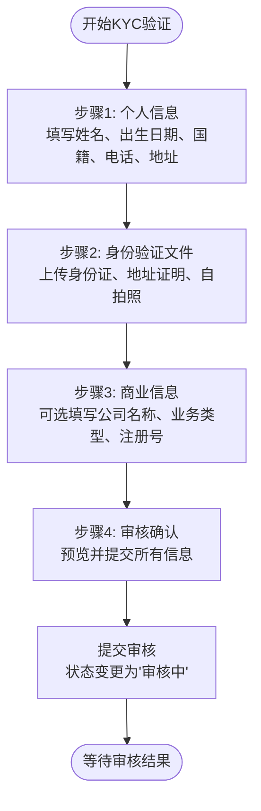
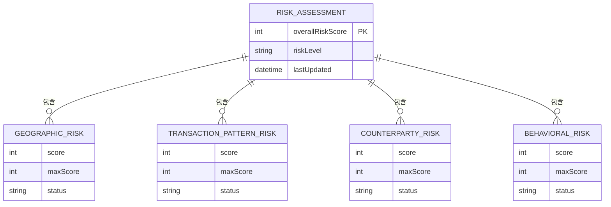
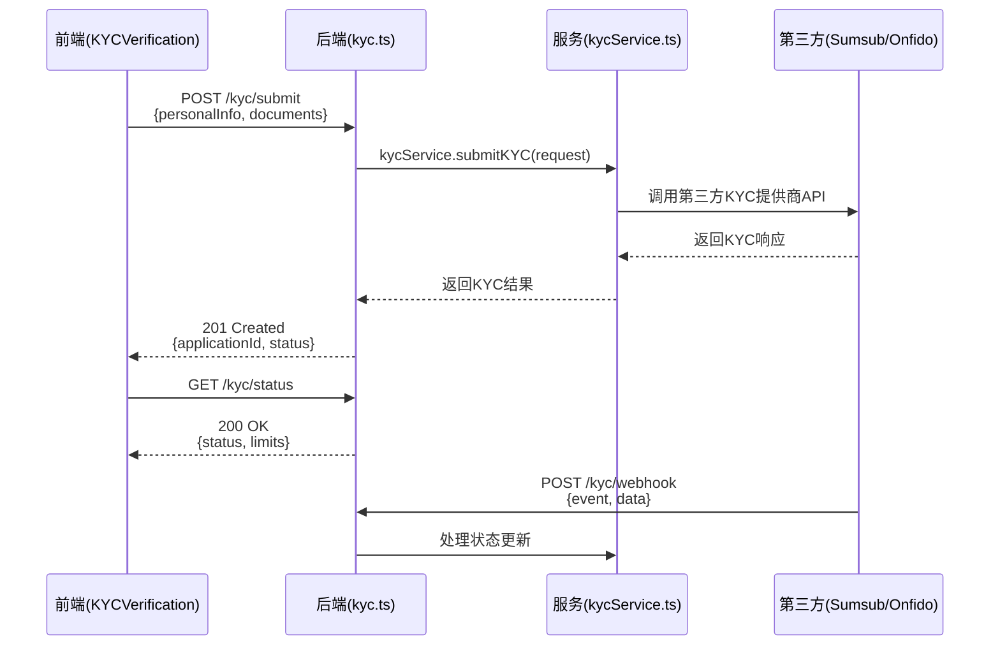

# KYC/AML合规验证

<cite>
**本文档引用文件**  
- [KYCVerification.tsx](file://src/components/Compliance/KYCVerification.tsx)
- [AMLAssessment.tsx](file://src/components/Compliance/AMLAssessment.tsx)
- [kycService.ts](file://backend/src/services/kycService.ts)
- [kyc.ts](file://backend/src/routes/kyc.ts)
</cite>

## 目录
1. [引言](#引言)
2. [KYC验证流程](#kyc验证流程)
3. [AML风险评估模型](#aml风险评估模型)
4. [前后端API交互机制](#前后端api交互机制)
5. [审核拒绝与风险升级的用户引导](#审核拒绝与风险升级的用户引导)
6. [数据隐私保护最佳实践](#数据隐私保护最佳实践)
7. [结论](#结论)

## 引言
本文件系统化构建KYC（了解你的客户）与AML（反洗钱）合规验证机制，全面解析前端组件`KYCVerification`与`AMLAssessment`的实现逻辑，阐明后端`kycService`的服务集成与风险评估流程。文档详细说明四步KYC验证流程、AML风险评分模型、前后端API交互模式，并提供用户引导与数据隐私保护的最佳实践，确保平台符合国际合规要求。

## KYC验证流程
`KYCVerification`组件实现了一个四步验证流程，引导用户逐步完成身份验证。该流程通过状态管理（`currentStep`、`kycStatus`）和表单数据收集（`formData`）实现，确保信息完整性和用户体验流畅性。

**图表来源**  
- [KYCVerification.tsx](file://src/components/Compliance/KYCVerification.tsx#L48-L110)

**本节来源**  
- [KYCVerification.tsx](file://src/components/Compliance/KYCVerification.tsx#L21-L517)

### 个人信息步骤
此步骤收集用户的基本身份信息，所有字段均为必填项。
- **表单字段**：名字、姓氏、出生日期、国籍（下拉选择）、电话号码、居住地址。
- **数据结构**：`formData.personalInfo` 对象存储所有输入。
- **交互逻辑**：使用`onChange`事件实时更新状态，并通过`Select`组件提供国籍选择。

### 身份文件步骤
此步骤处理关键文件的上传，确保身份真实性。
- **文件类型**：身份证明文件（身份证/护照/驾照）、地址证明文件（账单）、自拍照片。
- **上传机制**：`handleFileUpload`函数处理文件选择，将`File`对象存入`formData.documents`。上传成功后显示“已上传”徽章。
- **文件限制**：JPG、PNG或PDF格式，最大5MB。
- **用户体验**：每个文件上传区域配有图标和说明，上传后提供视觉反馈。

### 商业信息步骤
此步骤为可选，用于收集企业用户信息。
- **表单字段**：公司名称、业务类型（下拉选择）、工商注册号、公司地址。
- **数据结构**：`formData.businessInfo` 对象存储所有输入。
- **条件渲染**：仅当用户填写了公司名称时，审核确认步骤才会显示此信息。

### 审核确认步骤
此步骤允许用户在提交前预览所有信息。
- **信息汇总**：以只读方式展示个人信息、文件上传状态和商业信息。
- **提交逻辑**：点击“提交审核”按钮后，`kycStatus`状态变更为`in_review`，并触发Toast通知。
- **状态管理**：`handleSubmitStep`函数负责推进步骤或提交申请。

## AML风险评估模型
`AMLAssessment`组件通过多维度分析生成用户的风险评分报告，评估逻辑基于四个核心维度，每个维度有独立的评分和权重。

**图表来源**  
- [AMLAssessment.tsx](file://src/components/Compliance/AMLAssessment.tsx#L40-L79)

**本节来源**  
- [AMLAssessment.tsx](file://src/components/Compliance/AMLAssessment.tsx#L36-L344)

### 评估逻辑与权重计算
风险评估模型对四个维度进行独立评分，最终的综合风险评分是各维度得分的加权总和。

| 评估维度 | 最大分值 | 权重 | 评估逻辑 |
| :--- | :--- | :--- | :--- |
| **地理风险** | 20 | 20% | 基于用户交易对手所在地区的国家风险等级数据库进行评估。主要交易区域为中国大陆（低风险），俄罗斯（中等风险）。 |
| **交易模式** | 25 | 25% | 分析交易频率、金额和时间规律性。正常模式为每周3-5笔，单笔金额低于5万美元。 |
| **交易对手风险** | 20 | 20% | 检查交易对手的KYC验证状态、是否在黑名单中以及信用记录。95%的交易对手已完成KYC验证。 |
| **行为分析** | 15 | 15% | 监测用户登录行为、交易时间偏好和异常活动。近期有1次异常大额交易预警导致风险等级为中等。 |

- **综合风险评分**：各维度得分相加，总分100分。示例中得分为35分（8+12+5+10）。
- **风险等级**：根据综合评分划分：
  - **低风险** (0-30): 绿色标识
  - **中等风险** (31-70): 黄色标识
  - **高风险** (71-100): 红色标识
- **建议措施**：系统根据风险因素自动生成风险管理建议，如“建议启用交易双重验证”。

## 前后端API交互机制
前端组件通过RESTful API与后端`kycService`进行交互，实现数据提交、状态查询和报告生成。

**图表来源**  
- [kyc.ts](file://backend/src/routes/kyc.ts#L0-L63)
- [kycService.ts](file://backend/src/services/kycService.ts#L113-L156)

**本节来源**  
- [kyc.ts](file://backend/src/routes/kyc.ts#L0-L209)
- [kycService.ts](file://backend/src/services/kycService.ts#L0-L561)

### KYC数据提交
- **API端点**: `POST /kyc/submit`
- **请求体**: 包含`personalInfo`和`documents`（文件以Base64编码或`FormData`形式上传）。
- **后端处理**: `kycService.submitKYC()`方法根据配置的提供商（Sumsub, Onfido, domestic）调用相应的第三方API。
- **安全机制**: 使用HMAC签名（Sumsub）或API密钥（Onfido）进行身份验证。

### 审核状态轮询
- **API端点**: `GET /kyc/status`
- **用途**: 前端定期轮询以获取最新的KYC状态（`pending`, `in_review`, `approved`, `rejected`）。
- **返回数据**: 包含审核状态、验证等级和交易限额。

### AML报告生成
- **触发机制**: `AMLAssessment`组件在加载时通过`useEffect`钩子触发评估。
- **数据来源**: 后端`kycService`聚合来自第三方提供商的AML检查结果（制裁名单、政治人物PEP、监控名单）。
- **前端展示**: 生成包含综合评分、各维度详情和管理建议的可视化报告。

## 审核拒绝与风险升级的用户引导
当用户KYC审核被拒或AML风险等级提升时，系统提供清晰的引导方案，帮助用户解决问题。

### KYC审核被拒
- **前端反馈**：`KYCVerification`组件的状态徽章会显示“已拒绝”，并可能通过Toast通知告知原因。
- **用户引导**：
  1.  显示拒绝原因（如“文件模糊”、“信息不一致”）。
  2.  允许用户重新编辑并提交信息。
  3.  提供联系客服的入口。

### AML风险等级提升
- **前端反馈**：`AMLAssessment`组件的风险等级徽章会变为黄色或红色，并显示“注意”或“高风险”。
- **用户引导**：
  1.  在“风险管理建议”部分突出显示相关措施。
  2.  弹出模态框提示用户风险升级，并建议采取行动（如启用双重验证）。
  3.  限制部分高风险功能，直至用户完成指定操作。

## 数据隐私保护最佳实践
为符合GDPR等数据隐私法规，前端实现以下最佳实践。

### 数据最小化
- 仅收集KYC流程必需的字段，避免收集敏感信息（如身份证号码）除非绝对必要。
- 商业信息步骤为可选，尊重用户隐私。

### 数据安全传输
- 所有与后端的通信均通过HTTPS加密。
- 文件上传使用`FormData`，并在后端进行安全存储。

### 用户同意与透明度
- 在提交前明确告知用户其数据将用于合规验证。
- 提供清晰的隐私政策链接。

### 数据访问与删除
- 提供“获取KYC验证历史”API，允许用户查看自己的数据。
- 遵循“被遗忘权”，在用户请求时提供数据删除机制（需后端配合实现）。

## 结论
本系统通过`KYCVerification`和`AMLAssessment`组件，构建了一个完整、用户友好的合规验证流程。四步KYC流程确保了信息的完整收集，而多维度的AML风险模型则提供了精准的风险评估。前后端通过清晰的API契约进行交互，保证了系统的可维护性。通过实施上述用户引导和隐私保护措施，平台能够在满足严格合规要求的同时，为用户提供安全、透明的服务体验。