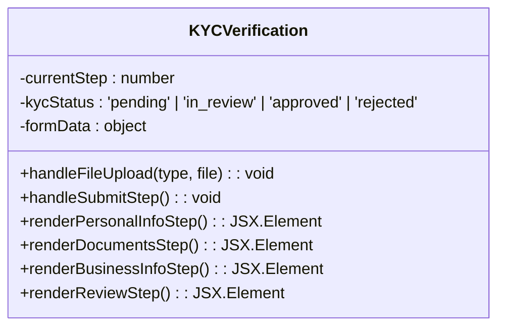
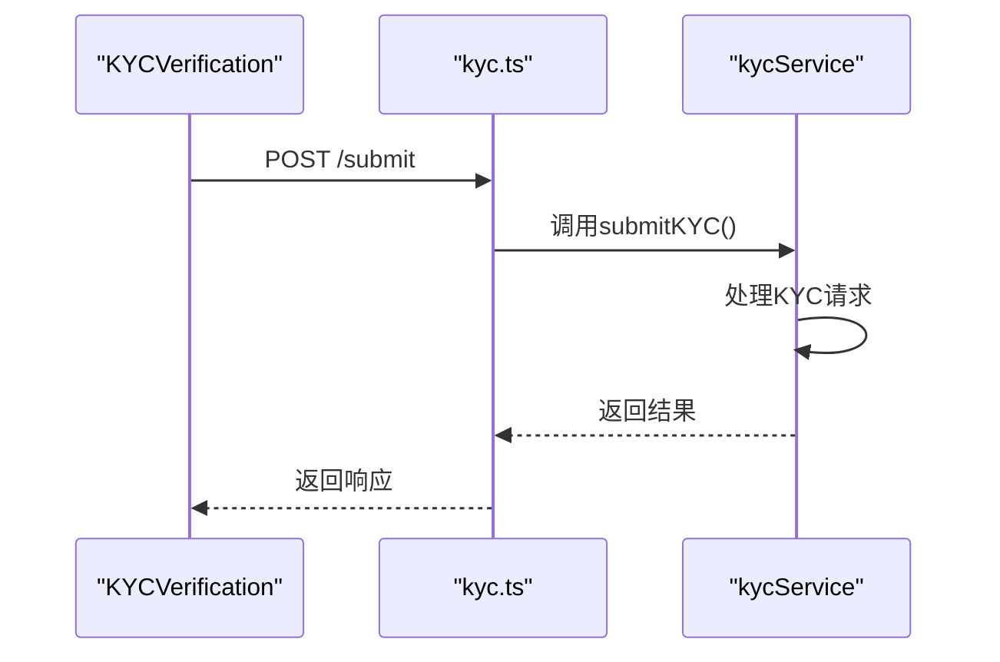
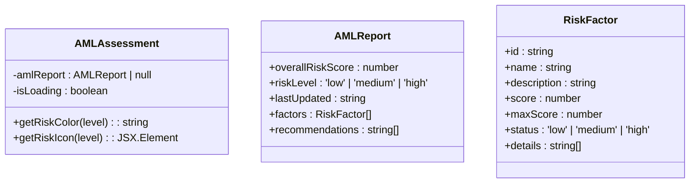
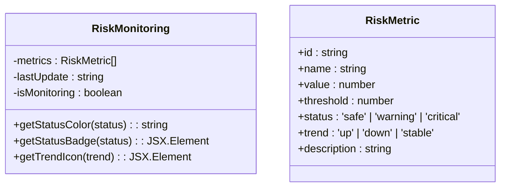
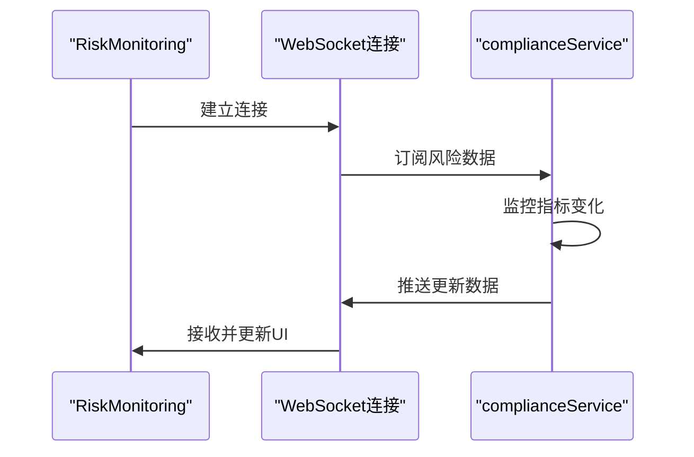
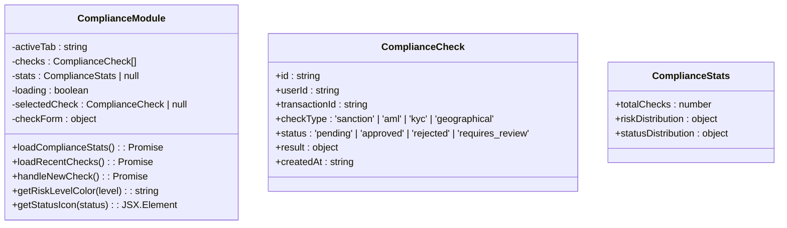

# 合规与风控组件

<cite>
**本文档引用文件**   
- [KYCVerification.tsx](file://src/components/Compliance/KYCVerification.tsx)
- [AMLAssessment.tsx](file://src/components/Compliance/AMLAssessment.tsx)
- [RiskMonitoring.tsx](file://src/components/Risk/RiskMonitoring.tsx)
- [ComplianceModule.tsx](file://src/components/ComplianceModule.tsx)
- [kycService.ts](file://backend/src/services/kycService.ts)
- [complianceService.ts](file://backend/src/services/complianceService.ts)
- [kyc.ts](file://backend/src/routes/kyc.ts)
- [compliance.ts](file://backend/src/routes/compliance.ts)
</cite>

## 目录
1. [引言](#引言)
2. [KYC验证组件](#kyc验证组件)
3. [AML风险评估组件](#aml风险评估组件)
4. [风险监控组件](#风险监控组件)
5. [合规功能聚合组件](#合规功能聚合组件)
6. [异常场景用户引导](#异常场景用户引导)
7. [数据隐私保护实践](#数据隐私保护实践)
8. [结论](#结论)

## 引言
本系统化文档全面解析了平台的合规与风控组件，涵盖KYC身份验证、AML反洗钱评估、实时风险监控及合规功能聚合等核心模块。文档详细阐述了各组件的多步骤验证流程、异步审核机制、风险评分模型、监管规则联动逻辑、实时数据订阅模式及权限控制设计。同时，针对KYC审核被拒、风险等级突变等异常场景提供了用户引导方案，并提出了符合GDPR等法规的前端数据隐私保护最佳实践。

## KYC验证组件

`KYCVerification`组件实现了多步骤的用户身份验证流程，支持个人与企业信息采集、证件上传及生物识别集成。该组件通过与后端`kycService`的异步通信，实现审核状态的同步。

### 多步骤验证流程
组件采用分步式表单设计，引导用户完成四个关键步骤：
1. **个人信息**：采集用户姓名、出生日期、国籍、电话号码及居住地址。
2. **身份验证文件**：上传身份证/护照、地址证明及手持证件的自拍照片。
3. **商业信息**（可选）：采集公司名称、业务类型、工商注册号及公司地址。
4. **审核确认**：汇总并预览所有信息，供用户最终确认。

**图示来源**
- [KYCVerification.tsx](file://src/components/Compliance/KYCVerification.tsx)

**本节来源**
- [KYCVerification.tsx](file://src/components/Compliance/KYCVerification.tsx)

### 与后端kycService的异步审核状态同步
前端`KYCVerification`组件通过API路由与后端`kycService`进行交互。当用户提交申请后，前端调用`/api/kyc/submit`接口，后端`kycService`负责与Sumsub、Onfido等第三方KYC提供商集成，处理验证请求。审核状态通过`/api/kyc/status`接口异步查询，实现状态同步。

**图示来源**
- [kyc.ts](file://backend/src/routes/kyc.ts#L4-L63)
- [kycService.ts](file://backend/src/services/kycService.ts#L113-L156)

**本节来源**
- [kyc.ts](file://backend/src/routes/kyc.ts)
- [kycService.ts](file://backend/src/services/kycService.ts)

## AML风险评估组件

`AMLAssessment`组件负责执行反洗钱（AML）风险评估，其风险评分模型与监管规则引擎紧密联动。

### 风险评分模型与监管规则引擎联动
组件通过模拟或调用后端服务，计算综合风险评分。评分模型基于多个风险因素，每个因素的权重和阈值由监管规则引擎定义：
- **地理风险**：基于用户及交易对手所在地区的风险等级。
- **交易模式**：分析交易频率、金额和时间模式。
- **交易对手风险**：评估交易对手的KYC验证状态和历史记录。
- **行为分析**：检测用户登录和交易行为中的异常活动。

**图示来源**
- [AMLAssessment.tsx](file://src/components/Compliance/AMLAssessment.tsx)

**本节来源**
- [AMLAssessment.tsx](file://src/components/Compliance/AMLAssessment.tsx)

## 风险监控组件

`RiskMonitoring`组件提供实时风险指标计算、阈值预警触发及可视化展示，并通过WebSocket与后端合规服务建立数据订阅模式。

### 实时风险指标与阈值预警
组件通过定时轮询或WebSocket连接，从后端获取实时风险数据。关键风险指标包括流动性风险、波动率风险、交易对手风险、操作风险、合规风险和集中度风险。当任一指标值超过预设阈值时，会触发视觉和通知预警。

**图示来源**
- [RiskMonitoring.tsx](file://src/components/Risk/RiskMonitoring.tsx)

**本节来源**
- [RiskMonitoring.tsx](file://src/components/Risk/RiskMonitoring.tsx)

### WebSocket数据订阅模式
前端通过WebSocket连接到后端合规服务，建立持久化连接。后端服务在风险指标更新时，主动推送最新数据到前端，确保监控界面的实时性，避免了传统轮询带来的延迟和资源浪费。

**图示来源**
- [compliance.ts](file://backend/src/routes/compliance.ts)
- [complianceService.ts](file://backend/src/services/complianceService.ts)

**本节来源**
- [compliance.ts](file://backend/src/routes/compliance.ts)
- [complianceService.ts](file://backend/src/services/complianceService.ts)

## 合规功能聚合组件

`ComplianceModule`作为合规功能的聚合组件，采用模块化设计模式，并集成了权限控制。

### 设计模式与权限控制
该组件使用React的`Tabs`组件将不同功能模块（仪表板、新建检查、检查记录、制裁名单）组织在一个统一的界面中。通过状态管理（`useState`）控制当前激活的标签页。权限控制通过用户角色和后端API的访问控制实现，确保只有授权用户才能执行敏感操作。

**图示来源**
- [ComplianceModule.tsx](file://src/components/ComplianceModule.tsx)

**本节来源**
- [ComplianceModule.tsx](file://src/components/ComplianceModule.tsx)

## 异常场景用户引导

### KYC审核被拒
当`kycStatus`为`'rejected'`时，组件会显示红色状态徽章和“已拒绝”提示。应引导用户查看拒绝原因（如文件模糊、信息不一致），并提供重新提交的指引。

### 风险等级突变
当`RiskMonitoring`组件检测到风险等级从“安全”突变为“危险”时，应立即在界面顶部显示醒目的红色警报，详细说明触发原因（如集中度风险超过阈值），并提供“查看详情”和“立即处理”的操作按钮。

## 数据隐私保护实践

### 前端GDPR合规最佳实践
1. **最小化数据采集**：仅收集KYC流程必需的个人信息。
2. **明确用户同意**：在上传敏感文件（如身份证、自拍）前，必须获得用户的明确同意。
3. **数据加密传输**：确保所有与后端的通信都通过HTTPS进行。
4. **安全的文件处理**：在前端处理文件时，避免将文件内容存储在本地存储中，上传后立即清除临时引用。
5. **用户权利支持**：提供用户访问、更正或删除其个人数据的入口。

## 结论
本文档系统化地解析了平台的合规与风控体系。`KYCVerification`、`AMLAssessment`和`RiskMonitoring`组件共同构成了一个多层次、实时的风控网络，而`ComplianceModule`则提供了统一的管理入口。通过清晰的异常引导和严格的隐私保护措施，系统在满足监管要求的同时，保障了用户体验和数据安全。