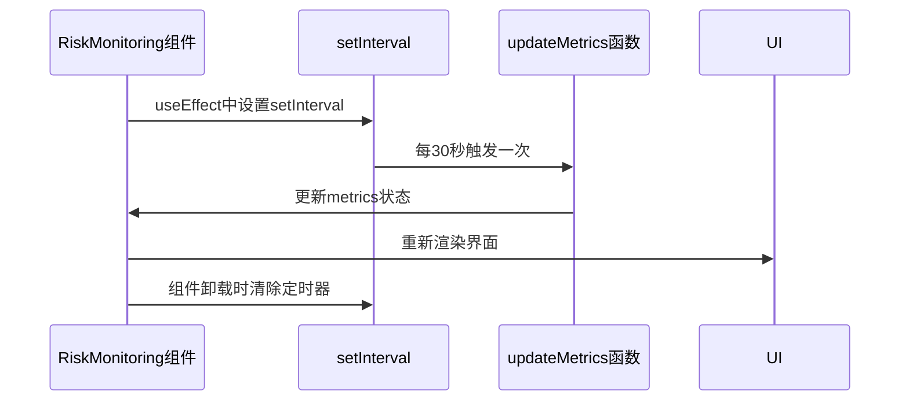
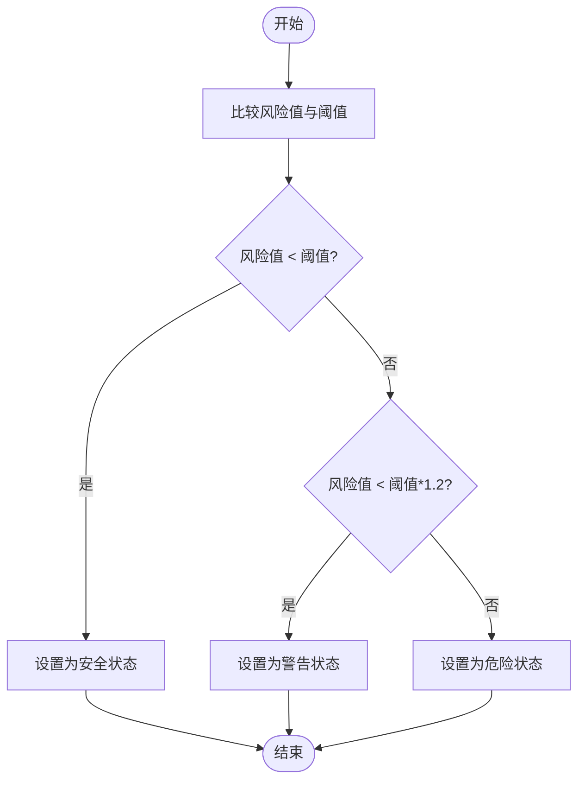
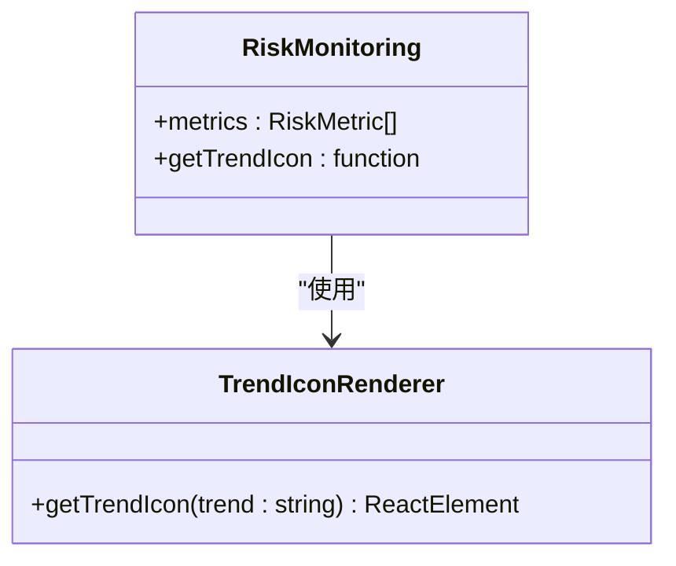
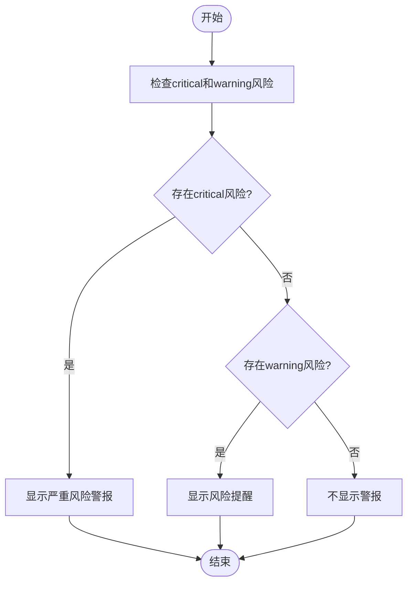
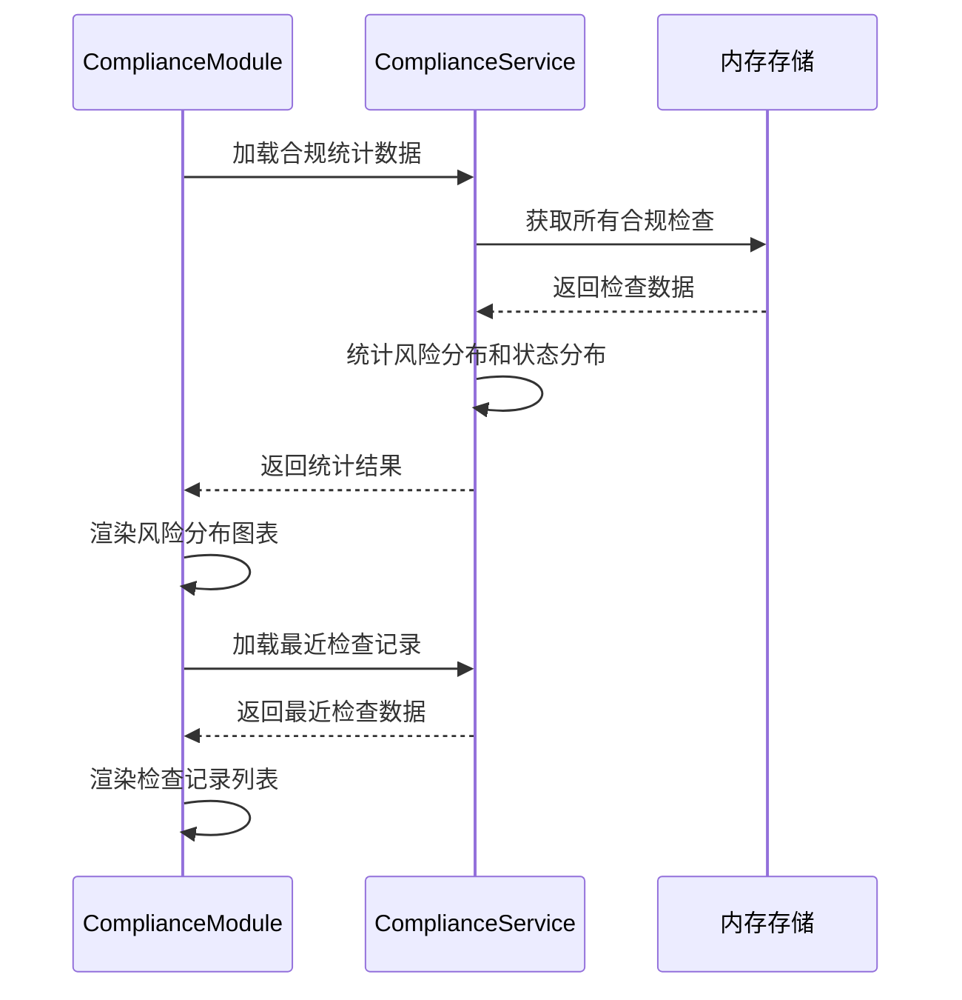
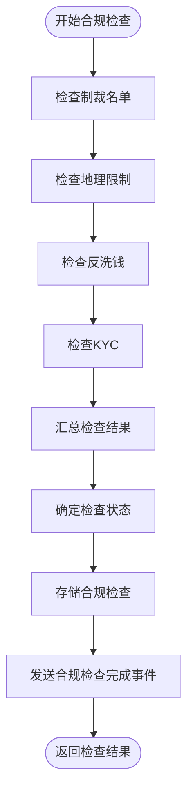

# 实时风险监控

<cite>
**Referenced Files in This Document**   
- [RiskMonitoring.tsx](file://src/components/Risk/RiskMonitoring.tsx)
- [ComplianceModule.tsx](file://src/components/ComplianceModule.tsx)
- [complianceService.ts](file://backend/src/services/complianceService.ts)
</cite>

## 目录
1. [实时风险监控机制](#实时风险监控机制)
2. [六大风险指标详解](#六大风险指标详解)
3. [数据更新与轮询机制](#数据更新与轮询机制)
4. [风险状态判定逻辑](#风险状态判定逻辑)
5. [趋势图标渲染策略](#趋势图标渲染策略)
6. [关键警报触发条件](#关键警报触发条件)
7. [合规检查仪表板集成](#合规检查仪表板集成)
8. [高风险场景应对策略](#高风险场景应对策略)

## 实时风险监控机制

`RiskMonitoring`组件实现了全面的实时风险监控系统，通过前端组件与后端服务的协同工作，对流动性风险、波动率风险、交易对手风险、操作风险、合规风险和集中度风险六大核心指标进行持续监控。系统采用分层架构设计，前端`RiskMonitoring`组件负责数据展示和用户交互，后端`ComplianceService`服务负责执行复杂的合规检查和风险评估。

该机制的核心在于将实时数据监控与深度合规检查相结合。前端组件通过模拟或从后端API获取风险指标数据，而后端服务则执行多层次的合规检查，包括制裁名单核查、地理位置限制、反洗钱(AML)分析和KYC验证。这种架构确保了风险监控不仅关注市场和技术层面，还涵盖了监管和合规要求。

**Section sources**
- [RiskMonitoring.tsx](file://src/components/Risk/RiskMonitoring.tsx#L28-L331)
- [complianceService.ts](file://backend/src/services/complianceService.ts#L44-L458)

## 六大风险指标详解

### 流动性风险
流动性风险指标监控各货币对的储备充足性，阈值设定为30%。当储备低于阈值时，系统将发出警告。当前实现中，该指标值为15%，处于安全状态，表明各货币对都有足够的储备。

### 波动率风险
波动率风险指标监控市场波动情况，阈值设定为50%。当市场波动率超过阈值时，系统将发出警告。当前实现中，该指标值为45%，接近警戒线，建议谨慎进行大额交易。

### 交易对手风险
交易对手风险指标评估交易对手的信用状况，阈值设定为25%。当违约风险超过阈值时，系统将发出警告。当前实现中，该指标值为8%，处于安全状态，表明交易对手信用状况良好。

### 操作风险
操作风险指标监控系统运行稳定性，阈值设定为40%。当系统故障或操作失误风险超过阈值时，系统将发出警告。当前实现中，该指标值为12%，处于安全状态，表明操作风险可控。

### 合规风险
合规风险指标监控监管合规状况，阈值设定为20%。当合规检查发现问题时，系统将发出警告。当前实现中，该指标值为5%，处于安全状态，表明监管风险较低。

### 集中度风险
集中度风险指标监控投资组合的分散程度，阈值设定为60%。当单一货币对集中度过高时，系统将发出危险警报。当前实现中，该指标值为62%，已超过临界值，建议分散投资组合。

**Section sources**
- [RiskMonitoring.tsx](file://src/components/Risk/RiskMonitoring.tsx#L45-L106)

## 数据更新与轮询机制

### setInterval轮询机制
`RiskMonitoring`组件通过`useEffect`钩子函数中的`setInterval`实现每30秒更新一次数据的轮询机制。该机制在组件挂载时启动，创建一个定时器，每30秒调用一次`updateMetrics`函数来刷新风险指标数据。当组件卸载时，通过返回的清理函数清除定时器，防止内存泄漏。

**Diagram sources **
- [RiskMonitoring.tsx](file://src/components/Risk/RiskMonitoring.tsx#L116-L120)

### WebSocket替代方案
虽然当前实现使用轮询机制，但WebSocket提供了更高效的实时数据更新方案。WebSocket替代方案的实现路径包括：在后端创建WebSocket服务器，前端建立WebSocket连接，后端在风险指标发生变化时主动推送更新，前端接收并处理推送的数据。这种方案减少了不必要的HTTP请求，降低了网络延迟，提高了实时性。

**Section sources**
- [RiskMonitoring.tsx](file://src/components/Risk/RiskMonitoring.tsx#L116-L120)

## 风险状态判定逻辑

风险状态的判定基于风险指标值与预设阈值的比较，分为三个等级：安全(safe)、警告(warning)和危险(critical)。判定逻辑如下：

- **安全状态**：当风险指标值小于阈值的50%时，状态为安全，表示风险在可控范围内。
- **警告状态**：当风险指标值达到或超过阈值的50%但未超过阈值时，状态为警告，表示风险接近警戒线，需要关注。
- **危险状态**：当风险指标值超过阈值时，状态为危险，表示风险已超过临界值，需要立即采取措施。

后端`ComplianceService`服务中的`determineCheckStatus`方法实现了类似的判定逻辑，根据风险评分确定合规检查的最终状态：风险等级为"critical"时状态为"rejected"，为"high"时状态为"requires_review"，其他情况为"approved"。

**Diagram sources **
- [RiskMonitoring.tsx](file://src/components/Risk/RiskMonitoring.tsx#L130-L142)
- [complianceService.ts](file://backend/src/services/complianceService.ts#L389-L397)

## 趋势图标渲染策略

趋势图标的渲染策略基于风险指标的趋势属性，通过不同的图标和颜色来直观展示风险变化方向。系统定义了三种趋势状态：上升(up)、下降(down)和稳定(stable)。

- **上升趋势**：使用红色的`TrendingUp`图标，表示风险正在增加，需要警惕。
- **下降趋势**：使用绿色的`TrendingUp`图标并旋转180度，形成下降箭头，表示风险正在降低，情况改善。
- **稳定趋势**：使用灰色的`Activity`图标，表示风险保持稳定，无明显变化。

前端通过`getTrendIcon`函数实现这一渲染策略，根据趋势属性返回相应的图标组件。这种视觉化的设计帮助用户快速理解风险变化趋势，提高了监控效率。

**Diagram sources **
- [RiskMonitoring.tsx](file://src/components/Risk/RiskMonitoring.tsx#L158-L170)

## 关键警报触发条件

关键警报的触发基于风险状态的判定结果，系统会根据不同的风险等级显示相应的警报信息。

### 严重风险警报
当存在状态为"critical"的风险指标时，系统会显示严重风险警报。警报内容包括风险名称、当前值和阈值，提醒用户该风险已超过临界值。例如，当集中度风险达到62%而阈值为60%时，系统会显示"严重风险警报: 集中度风险超过临界值 (62% > 60%)"。

### 风险提醒
当存在状态为"warning"的风险指标时，系统会显示风险提醒。提醒内容包括风险名称、当前值和阈值，提示用户该风险接近警戒线。例如，当波动率风险达到45%而阈值为50%时，系统会显示"风险提醒: 波动率风险接近警戒线 (45% 接近 50%)"。

这些警报通过条件渲染实现，只有当存在相应状态的风险指标时才会显示，避免了不必要的信息干扰。

**Diagram sources **
- [RiskMonitoring.tsx](file://src/components/Risk/RiskMonitoring.tsx#L203-L229)

## 合规检查仪表板集成

`ComplianceModule`中的合规检查仪表板与风险监控系统深度集成，提供了全面的合规风险管理功能。

### 风险分布图表
合规检查仪表板通过风险等级分布图表展示所有合规检查的风险等级分布情况。图表将风险分为低(low)、中(medium)、高(high)和严重(critical)四个等级，以数字和百分比的形式显示每个等级的检查数量。前端通过`getRiskLevelColor`函数为不同风险等级分配相应的颜色，使用户能够直观地了解整体风险状况。

### 最近检查记录
仪表板还展示了最近的合规检查记录，包括交易ID、用户ID、风险评分和风险等级。这些记录按时间倒序排列，最新的检查显示在最前面。用户可以点击"查看"按钮查看检查详情，包括风险标记、建议措施和制裁名单匹配等详细信息。

后端`ComplianceService`服务通过`getRiskStatistics`方法提供风险统计信息，包括总检查数、风险分布和状态分布，为前端展示提供了数据支持。

**Diagram sources **
- [ComplianceModule.tsx](file://src/components/ComplianceModule.tsx#L150-L212)
- [complianceService.ts](file://backend/src/services/complianceService.ts#L426-L457)

## 高风险场景应对策略

### 用户操作建议
系统根据当前风险状况提供具体的用户操作建议：

- **集中度风险过高**：立即降低集中度风险，建议分散投资组合，减少单一货币对的暴露度。
- **市场波动率较高**：关注市场波动，建议暂时降低交易规模，等待市场稳定。
- **常规建议**：继续保持现有的风险控制措施，定期审查风险参数设置。

这些建议通过条件渲染显示在"风险管理建议"卡片中，只有当存在相应风险时才会显示，确保建议的相关性和实用性。

### 系统自动响应机制
后端`ComplianceService`服务实现了多层次的自动响应机制：

- **制裁名单匹配**：当用户信息与制裁名单匹配时，系统自动将风险评分设为0，风险等级设为"critical"，并拒绝交易。
- **高风险国家**：当用户或交易目标国家为高风险国家时，系统根据限制类型自动设置风险等级和状态。
- **大额交易**：当交易金额超过10,000时，系统自动标记为可疑模式，并根据金额大小调整风险评分。
- **KYC不完整**：当用户KYC信息不完整时，系统自动标记为KYC不完整，并降低风险评分。

这些自动响应机制通过`checkSanctions`、`checkGeographicalRestrictions`、`checkAML`和`checkKYC`等方法实现，确保了风险评估的全面性和一致性。

**Diagram sources **
- [complianceService.ts](file://backend/src/services/complianceService.ts#L102-L149)